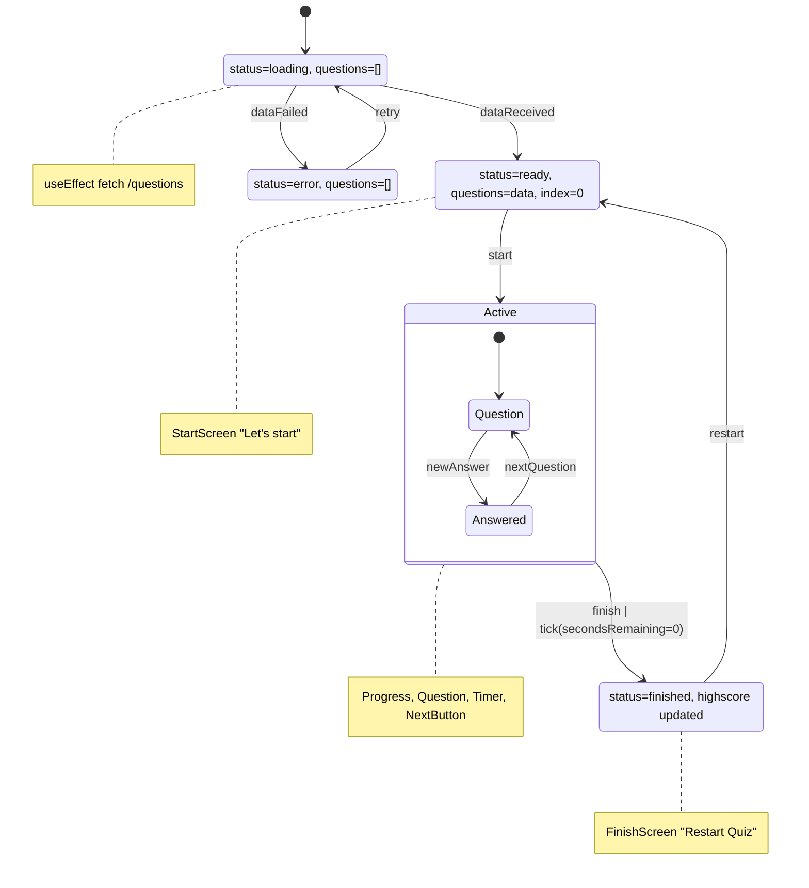
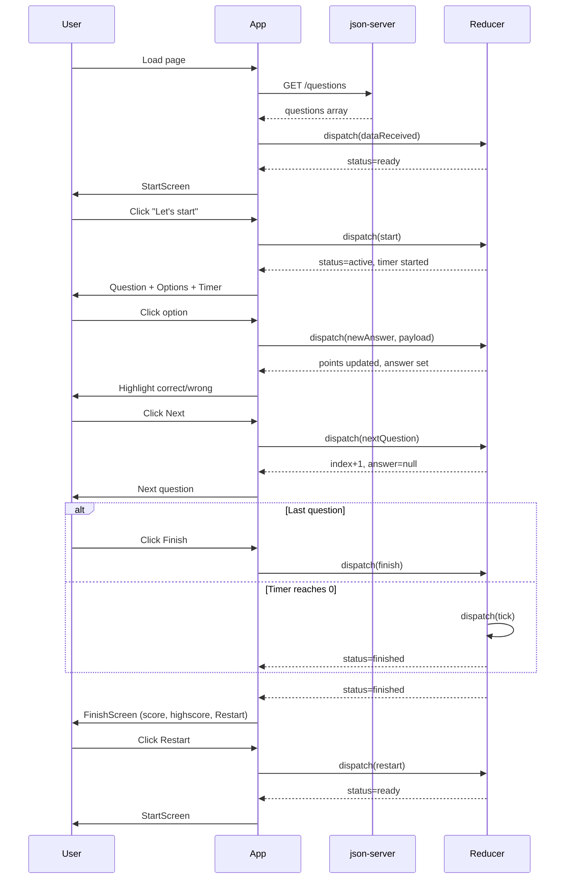
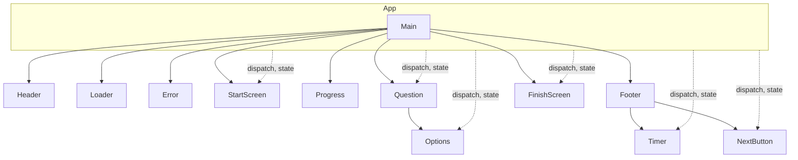

# React Quiz

Interactive quiz application built with React that tests knowledge of React and JavaScript. Users answer multiple-choice questions loaded from a fake REST API. The project demonstrates advanced React patterns including `useReducer` for complex state, `useEffect` for data fetching and timer management, and the reducer/dispatch architecture.

## Features

- **Quiz Flow**: Start screen → Answer questions → Finish with score and highscore
- **Multiple-choice questions**: Loaded from `json-server` (fake REST API)
- **Loading states**: Loader, error, and ready states with proper UI feedback
- **Progress tracking**: Current question index, points, and max possible points
- **Countdown timer**: 30 seconds per question; auto-finish when time runs out
- **Highscore persistence**: Kept in session state per quiz run
- **DateCounter demo**: Standalone component demonstrating `useReducer` vs `useState` (from lessons 187–189)

## Key Concepts

- **useReducer**: Centralized state management with a reducer function and typed actions (`dataReceived`, `start`, `newAnswer`, `nextQuestion`, `finish`, `restart`, `tick`, etc.)
- **Single source of truth**: One `status` field (`loading`, `error`, `ready`, `active`, `finished`) avoids impossible state combinations
- **Action-based updates**: Components dispatch actions; reducer computes next state
- **useEffect**: Data fetch on mount; `setInterval`/`clearInterval` for timer cleanup
- **Children composition**: `Main` and `Footer` wrap children for layout reuse

## Tech Stack

| Category | Technology |
|----------|------------|
| Framework | React 19 |
| Build Tool | Vite 7 |
| Fake API | json-server |
| Dev Tools | ESLint, concurrently |
| Language | JavaScript (JSX) |

## Installation

### Prerequisites

- Node.js 18+ (or compatible version)
- npm or pnpm

### Steps

1. Clone the repository:
   ```bash
   git clone <repository-url>
   cd 16-react-quiz
   ```

2. Install dependencies:
   ```bash
   npm install
   ```

3. Start the app (runs Vite and json-server together):
   ```bash
   npm run dev
   ```

4. Open [http://localhost:5173](http://localhost:5173) in your browser.

## Usage

- **Ready**: Click "Let's start" to begin the quiz.
- **Active**: Answer each question by clicking an option. Use "Next" to proceed, or "Finish" on the last question.
- **Timer**: Answer within the countdown (30 seconds per question); the quiz ends when time runs out.
- **Finished**: View score and highscore. Click "Restart Quiz" to play again.

### Example: Data Fetch Flow

```js
// App.jsx - useEffect fetches questions on mount
useEffect(() => {
  fetch("http://localhost:8000/questions")
    .then((resp) => resp.json())
    .then((data) => dispatch({ type: "dataReceived", payload: data }))
    .catch(() => dispatch({ type: "dataFailed" }));
}, []);
```

### Example: Dispatching Actions

```js
// Start quiz
dispatch({ type: "start" });

// Submit answer
dispatch({ type: "newAnswer", payload: selectedOptionIndex });

// Next question or finish
dispatch({ type: "nextQuestion" });
dispatch({ type: "finish" });
```

## Project Structure

```
16-react-quiz/
├── public/
│   ├── logo192.png
│   └── logo512.png
├── src/
│   ├── components/
│   │   ├── DateCounter.jsx    # useReducer demo (lessons 187-189)
│   │   ├── Error.jsx          # Error state UI
│   │   ├── FinishScreen.jsx   # Quiz completion, score, restart
│   │   ├── Footer.jsx         # Layout wrapper
│   │   ├── Header.jsx         # Logo and title
│   │   ├── Loader.jsx         # Loading spinner
│   │   ├── Main.jsx          # Main content wrapper
│   │   ├── NextButton.jsx    # Next / Finish button
│   │   ├── Options.jsx       # Answer options list
│   │   ├── Progress.jsx      # Progress bar and score
│   │   ├── Question.jsx      # Question display
│   │   ├── StartScreen.jsx   # Welcome and start button
│   │   └── Timer.jsx         # Countdown timer
│   ├── App.jsx               # Main app, useReducer, useEffect
│   ├── main.jsx              # Entry point
│   └── index.css             # Global styles
├── data/
│   └── questions.json        # Quiz data (json-server source)
├── docs/
│   └── LECTURE_STEPS.md      # Detailed lesson documentation
├── index.html
├── package.json
├── vite.config.js
└── eslint.config.js
```

## Configuration

| Item | Default | Description |
|------|---------|-------------|
| Vite dev server | `http://localhost:5173` | Frontend |
| json-server | `http://localhost:8000` | REST API for questions |
| `SECS_PER_QUESTIONS` | 30 | Seconds per question in `App.jsx` |
| `data/questions.json` | — | Quiz questions source for json-server |

## Scripts

| Command | Description |
|---------|-------------|
| `npm run dev` | Start Vite + json-server concurrently |
| `npm run dev:vite` | Start Vite only |
| `npm run server` | Start json-server only (port 8000) |
| `npm run build` | Production build |
| `npm run preview` | Preview production build |
| `npm run lint` | Run ESLint |

## Testing & Quality

- **ESLint**: Flat config with `js` and `react-hooks` plugins.
- **Lint command**: `npm run lint`
- No automated unit or E2E tests are included; the project is an educational demo.

## Architecture Diagrams

### Quiz State Machine

The app uses a finite state machine. Only one status is active at a time.



### User Flow Sequence



### Component Hierarchy



## Reducer Actions Reference

| Action | Payload | Effect |
|--------|---------|--------|
| `dataReceived` | questions array | Set questions, status → ready |
| `dataFailed` | — | status → error |
| `start` | — | status → active, start timer |
| `newAnswer` | option index | Set answer, add points if correct |
| `nextQuestion` | — | index+1, answer → null |
| `finish` | — | status → finished, update highscore |
| `restart` | — | Reset to ready, keep questions & highscore |
| `tick` | — | secondsRemaining-1, finish if 0 |

## Contribution Guidelines

1. Fork the repository.
2. Create a feature branch (`git checkout -b feature/your-feature`).
3. Make changes and run `npm run lint`.
4. Commit with clear messages.
5. Open a Pull Request.

## Roadmap

- [ ] Add retry button for error state
- [ ] Validate `response.ok` in fetch for HTTP errors
- [ ] Fix typo "fecthing" → "fetching" in Error component

## License

MIT or as specified in the repository.

## Acknowledgments

- Based on [Jonas Schmedtmann's React course](https://www.udemy.com/course/the-ultimate-react-course/) Section 16 — The Advanced useReducer Hook.
- Detailed lesson notes in `docs/LECTURE_STEPS.md`.
