<br>

## 🧳 Section 16: *The Advanced useReducer Hook*

--- 

## 🔧 187. Lesson 187 — *Yet Another Hook: useReducer*

- [187. Lesson 187 — *Yet Another Hook: useReducer*](#-187-lesson-187---yet-another-hook-usereducer)
- [187.1 Context](#1871-context)
- [187.2 Updating code according the context](#1872-updating-code-according-the-context)
  - [187.2.1 Start from scratch the `App.jsx` component then import `DateCounter` component](#18721-start-from-scratch-the-appjsx-component-then-import-datecounter-component)
  - [187.2.2 Initial `DateCounter` component](#18722-initial-datecounter-component)
  - [187.2.3 Adding `useReducer` hook in `DateCounter` component](#18723-adding-usereducer-hook-in-datecounter-component)
  - [187.2.4 Adding `dispatch(1)` in `inc` & `dispatch(-1)` in `dec` functions](#18724-adding-dispatch1-in-inc--dispatch-1-in-dec-functions)
  - [187.2.5 Working with setting a value or `defineCount` function](#18725-working-with-setting-a-value-or-definecount-function)
  - [187.2.6 Thinking about passing an object in each dispatch and named actions](#18726-thinking-about-passing-an-object-in-each-dispatch-and-named-actions)
  - [187.2.7 Simplifying `useReducer` in `reducer` function](#18727-simplifying-usereducer-in-reducer-function)
- [187.3 Issues](#1873-issues)
- [187.4 Pending Fixes (TODO)](#1874-pending-fixes-todo)

### 🧠 187.1 Context:

The `useReducer` hook is a more powerful alternative to `useState` for state management in React. It is particularly useful when:

1.  **State logic is complex**: When multiple pieces of state rely on each other or when the next state depends on the previous one in complex ways.
2.  **Multiple sub-values**: When you have an object with many properties that update independently or together.
3.  **Externalizing logic**: It allows you to move state update logic outside of the component (into a reducer function), making the component cleaner and the logic easier to test.

**How it works:**
It follows the "Redux" pattern (though simpler).
- **Reducer**: A pure function `(state, action) => newState`. It takes the current state and an "action" (instruction) and returns the new state.
- **Dispatch**: A function called to trigger an update. You `dispatch(action)`.
- **Action**: An object (conventionally `{ type: 'ACTION_NAME', payload: data }`) describing *what* happened.

**Analogy:**
- `useState`: You (the component) directly change the data. "Set count to 5".
- `useReducer`: You (the component) request a change. "Dispatch: INCREMENT". The reducer (a manager) receives the request and decides how to update the state based on current rules.

In this lesson, we refactor a simple `DateCounter` component from using multiple `useState` calls to a single `useReducer` to manage `count` and `step` (eventually) and handle complex updates more predictably.

### ⚙️ 187.2 Updating code/theory according the context:

#### **Summary**
- **Purpose**: To demonstrate the transition from `useState` to `useReducer` for managing numeric state.
- **Problem**: The initial code uses `useState` which works but can become unwieldy with complex state logic. We want to centralize the update logic.
- **Connection**: The subsections progressively evolve the component:
    1.  Setup.
    2.  Analysis of `useState` approach.
    3.  Introduction of `useReducer` syntax.
    4.  Refining usage with simple actions.
    5.  Encountering pitfalls (logic errors).
    6.  Standardizing actions with objects.
    7.  Finalizing the reducer logic.

#### 187.2.1 Start from scratch the `App.jsx` component then import `DateCounter` component:
**Subsection Summary**
- **Purpose**: Sets up the main `App` component to render the `DateCounter`.
- **Content**: A simple functional component rendering `<DateCounter />`.

```jsx
/* src/App.jsx */
import DateCounter from './DateCounter'

function App() {
  return (
    <>
      <DateCounter />
    </>
  )
}
export default App
```

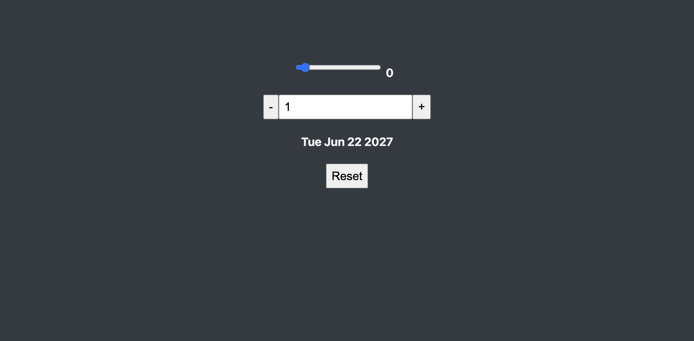

#### 187.2.2 Initial `DateCounter` component:
**Subsection Summary**
- **Purpose**: Shows the starting point using `useState`.
- **Review**: The component manages `count` and `step`. It manually mutates a `Date` object (which is a side effect often better handled differently, but here serves the example).
- **Key Concept**: Standard `useState` usage where updates are scattered across event handlers (`inc`, `dec`, `defineCount`).

```jsx
/* src/DateCounter.jsx */
import { useState } from "react";

const DateCounter = () => {
  const [count, setCount] = useState(0);
  const [step, setStep] = useState(1);

  // This mutates the date object.
  const date = new Date("june 21 2027");
  date.setDate(date.getDate() + count);

  const dec = function () {
    // setCount((count) => count - 1);
    setCount((count) => count - step);
  };

  const inc = function () {
    // setCount((count) => count + 1);
    setCount((count) => count + step);
  };

  const defineCount = function (e) {
    setCount(Number(e.target.value));
  };

  const defineStep = function (e) {
    setStep(Number(e.target.value));
  };

  const reset = function () {
    setCount(0);
    setStep(1);
  };

  return (
    <div className="counter">
      <div>
        <input
          type="range"
          min="0"
          max="10"
          value={step}
          onChange={defineStep}
        />
        <span>{step}</span>
      </div>

      <div>
        <button onClick={dec}>-</button>
        <input value={count} onChange={defineCount} />
        <button onClick={inc}>+</button>
      </div>

      <p>{date.toDateString()}</p>

      <div>
        <button onClick={reset}>Reset</button>
      </div>
    </div>
  );
}
export default DateCounter;
```

#### 187.2.3 Adding `useReducer` hook in `DateCounter` component:
**Subsection Summary**
- **Purpose**: Introduces the `useReducer` hook syntax.
- **Change**: Replaces `const [count, setCount] = useState(0);` with `const [count, dispatch] = useReducer(reducer, 0);`.
- **Concept**: A dummy `reducer` function is defined that currently just logs args. `dispatch` is now available to trigger updates.

```jsx
/* src/DateCounter.jsx */
import { useReducer, useState } from "react";       // 👈🏽 ✅ (2)

const reducer = (state, action) => {        // 👈🏽 ✅ (3)
  console.log(state, action);
};

const DateCounter = () => {
  //const [count, setCount] = useState(0);      // 👈🏽 ✅ (1)
  const [count, dispatch] = useReducer(reducer, 0);     // 👈🏽 ✅ (2)
  const [step, setStep] = useState(1);

  // This mutates the date object.
  const date = new Date("june 21 2027");
  date.setDate(date.getDate() + count);

  const dec = function () {
    // setCount((count) => count - 1);      // 👈🏽 ✅ (1)
    //setCount((count) => count - step);
  };

  const inc = function () {
    dispatch(1);        // 👈🏽 ✅ (4) applying the dispatch
    // setCount((count) => count + 1);      // 👈🏽 ✅ (1)
    //setCount((count) => count + step);
  };

  const defineCount = function (e) {
    //setCount(Number(e.target.value));      // 👈🏽 ✅ (1)
  };

  const defineStep = function (e) {
    setStep(Number(e.target.value));
  };

  const reset = function () {
    //setCount(0);      // 👈🏽 ✅ (1)
    setStep(1);
  };

  return (
    <div className="counter">
      <div>
        <input
          type="range"
          min="0"
          max="10"
          value={step}
          onChange={defineStep}
        />
        <span>{step}</span>
      </div>

      <div>
        <button onClick={dec}>-</button>
        <input value={count} onChange={defineCount} />
        <button onClick={inc}>+</button>
      </div>

      <p>{date.toDateString()}</p>

      <div>
        <button onClick={reset}>Reset</button>
      </div>
    </div>
  );
}
export default DateCounter;
```

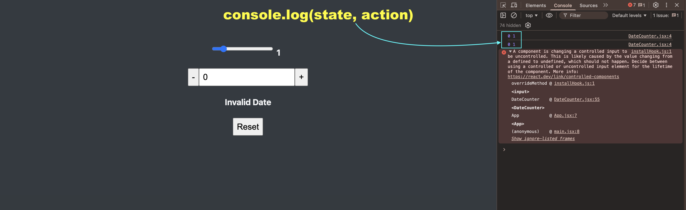

#### 187.2.4 Adding `dispatch(1)` in `inc` & `dispatch(-1)` in `dec` functions:
**Subsection Summary**
- **Purpose**: Implements basic increment/decrement logic in the reducer.
- **Logic**: The reducer receives `state` (current count) and `action` (1 or -1). It returns `state + action`.
- **Result**: `inc` dispatches `1`, `dec` dispatches `-1`.

```jsx
/* src/DateCounter.jsx */
import { useReducer, useState } from "react";

const reducer = (state, action) => {
  console.log(state, action);
  return state + action;    // 👈🏽 ✅ (1)
};

const DateCounter = () => {
  //const [count, setCount] = useState(0);
  const [count, dispatch] = useReducer(reducer, 0);
  const [step, setStep] = useState(1);

  // This mutates the date object.
  const date = new Date("june 21 2027");
  date.setDate(date.getDate() + count);

  const dec = function () {
    dispatch(-1);// 👈🏽 ✅ (2)
    // setCount((count) => count - 1);
    //setCount((count) => count - step);
  };

  const inc = function () {
    dispatch(1);// 👈🏽 ✅ (2)
    // setCount((count) => count + 1);
    //setCount((count) => count + step);
  };

  const defineCount = function (e) {
    //setCount(Number(e.target.value));
  };

  const defineStep = function (e) {
    setStep(Number(e.target.value));
  };

  const reset = function () {
    //setCount(0);
    setStep(1);
  };

  return (
    <div className="counter">
      <div>
        <input
          type="range"
          min="0"
          max="10"
          value={step}
          onChange={defineStep}
        />
        <span>{step}</span>
      </div>

      <div>
        <button onClick={dec}>-</button>
        <input value={count} onChange={defineCount} />
        <button onClick={inc}>+</button>
      </div>

      <p>{date.toDateString()}</p>

      <div>
        <button onClick={reset}>Reset</button>
      </div>
    </div>
  );
}
export default DateCounter;
```

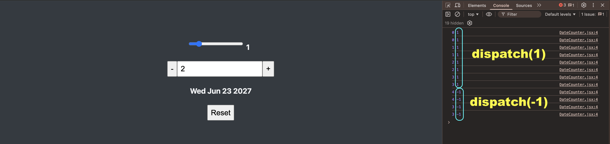


#### 187.2.5 Working with setting a value or `defineCount` function: 
**Subsection Summary**
- **Purpose**: Attempts to handle the input field change (`defineCount`) using the same reducer logic.
- **Bug/Issue**: The current reducer (`state + action`) adds the input value to the current state, treating it as a delta rather than a set value.
- **Observation**: This highlights why simple generic reducers don't work for different types of actions (increment vs set).

```jsx
/* src/DateCounter.jsx */
import { useReducer, useState } from "react";

const reducer = (state, action) => {
  console.log(state, action);
  return state + action;
};

const DateCounter = () => {
  //const [count, setCount] = useState(0);
  const [count, dispatch] = useReducer(reducer, 0);
  const [step, setStep] = useState(1);

  // This mutates the date object.
  const date = new Date("june 21 2027");
  date.setDate(date.getDate() + count);

  const dec = function () {
    dispatch(-1);
    // setCount((count) => count - 1);
    //setCount((count) => count - step);
  };

  const inc = function () {
    dispatch(1);
    // setCount((count) => count + 1);
    //setCount((count) => count + step);
  };

  const defineCount = function (e) {
    dispatch(Number(e.target.value));       // 👈🏽 ✅ 
    //setCount(Number(e.target.value));
  };

  const defineStep = function (e) {
    setStep(Number(e.target.value));
  };

  const reset = function () {
    //setCount(0);
    setStep(1);
  };

  return (
    <div className="counter">
      <div>
        <input
          type="range"
          min="0"
          max="10"
          value={step}
          onChange={defineStep}
        />
        <span>{step}</span>
      </div>

      <div>
        <button onClick={dec}>-</button>
        <input value={count} onChange={defineCount} />
        <button onClick={inc}>+</button>
      </div>

      <p>{date.toDateString()}</p>

      <div>
        <button onClick={reset}>Reset</button>
      </div>
    </div>
  );
}
export default DateCounter;
```

* It's not going to work properly
---
Steps:
- click on `input`
- add `0`  next to the number `1` in order to get `10`.

Expected Result:
- input displays `11` due to `state + action`: `10 + 1``

---
Steps:
- click on `input` again
- add `2` next the existant number in order to get `112`
Expected Result:
- input displays 123 due to `112 + 11`


#### 187.2.6 Thinking about passing an object in each dispatch and named actions:
**Subsection Summary**
- **Purpose**: Solves the previous issue by distinguishing between action types using an object `{ type, payload }`.
- **Implementation**:
    - `dec`: `{ type: 'dec', payload: -1 }`
    - `inc`: `{ type: 'inc', payload: 1 }`
    - `setCount`: `{ type: 'setCount', payload: value }`
- **Reducer Update**: Checks `action.type` to decide whether to add `payload` (inc/dec) or return `payload` directly (setCount).

```jsx
/* src/DateCounter.jsx */
import { useReducer, useState } from "react";

const reducer = (state, action) => {
  console.log(state, action);
  if(action.type === 'dec') return state + action.payload;       // 👈🏽 ✅ (2)
  if(action.type === 'inc') return state + action.payload;       // 👈🏽 ✅ (2)
  if(action.type === 'setCount') return action.payload;       // 👈🏽 ✅ (2)
};

const DateCounter = () => {
  //const [count, setCount] = useState(0);
  const [count, dispatch] = useReducer(reducer, 0);
  const [step, setStep] = useState(1);

  // This mutates the date object.
  const date = new Date("june 21 2027");
  date.setDate(date.getDate() + count);

  const dec = function () {
    dispatch({type: 'dec', payload: -1});       // 👈🏽 ✅ (1) obj: {type: 'dec', payload: -1}
    //dispatch(-1);
    // setCount((count) => count - 1);
    //setCount((count) => count - step);
  };

  const inc = function () {
    dispatch({type: 'inc', payload: 1});       // 👈🏽 ✅ (1) obj: {type: 'inc', payload: 1}
    //dispatch(1);
    // setCount((count) => count + 1);
    //setCount((count) => count + step);
  };

  const defineCount = function (e) {
    dispatch({type: 'setCount', payload: Number(e.target.value)});       // 👈🏽 ✅ (1) obj: {type: 'setCount', payload: Number(e.target.value)}
    //dispatch(Number(e.target.value));
    //setCount(Number(e.target.value));
  };

  const defineStep = function (e) {
    setStep(Number(e.target.value));
  };

  const reset = function () {
    //setCount(0);
    setStep(1);
  };

  return (
    <div className="counter">
      <div>
        <input
          type="range"
          min="0"
          max="10"
          value={step}
          onChange={defineStep}
        />
        <span>{step}</span>
      </div>

      <div>
        <button onClick={dec}>-</button>
        <input value={count} onChange={defineCount} />
        <button onClick={inc}>+</button>
      </div>

      <p>{date.toDateString()}</p>

      <div>
        <button onClick={reset}>Reset</button>
      </div>
    </div>
  );
}
export default DateCounter;
```

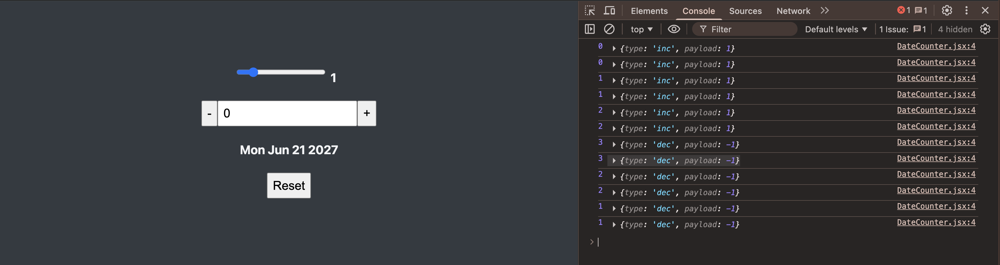

#### 187.2.7 Simplifying `useReducer` in `reducer` function:
**Subsection Summary**
- **Purpose**: Cleans up the calling code (components) by moving more logic into the reducer.
- **Refactor**: Instead of passing `payload: 1` or `-1` for increment/decrement, the reducer knows that `dec` means `-1` and `inc` means `+1`. The components just send `{ type: 'dec' }` or `{ type: 'inc' }`.
- **Result**: Separation of concerns. The component says "what happened" (`inc`), the reducer decides "how logic changes" (`state + 1`).

```jsx
/* src/DateCounter.jsx */
import { useReducer, useState } from "react";

const reducer = (state, action) => {
  console.log(state, action);
  if(action.type === 'dec') return state - 1;       // 👈🏽 ✅ (1)
  if(action.type === 'inc') return state + 1;       // 👈🏽 ✅ (1)
  if(action.type === 'setCount') return action.payload;
};

const DateCounter = () => {
  //const [count, setCount] = useState(0);
  const [count, dispatch] = useReducer(reducer, 0);
  const [step, setStep] = useState(1);

  // This mutates the date object.
  const date = new Date("june 21 2027");
  date.setDate(date.getDate() + count);

  const dec = function () {
    dispatch({type: 'dec'});       // 👈🏽 ✅ (2)
    // setCount((count) => count - 1);
    //setCount((count) => count - step);
  };

  const inc = function () {
    dispatch({type: 'inc'});       // 👈🏽 ✅ (2)
    // setCount((count) => count + 1);
    //setCount((count) => count + step);
  };

  const defineCount = function (e) {
    dispatch({type: 'setCount', payload: Number(e.target.value)});
    //setCount(Number(e.target.value));
  };

  const defineStep = function (e) {
    setStep(Number(e.target.value));
  };

  const reset = function () {
    //setCount(0);
    setStep(1);
  };

  return (
    <div className="counter">
      <div>
        <input
          type="range"
          min="0"
          max="10"
          value={step}
          onChange={defineStep}
        />
        <span>{step}</span>
      </div>

      <div>
        <button onClick={dec}>-</button>
        <input value={count} onChange={defineCount} />
        <button onClick={inc}>+</button>
      </div>

      <p>{date.toDateString()}</p>

      <div>
        <button onClick={reset}>Reset</button>
      </div>
    </div>
  );
}
export default DateCounter;
```

### 🐞 187.3 Issues:

- In **187.2.5**, using a simple `state + action` reducer caused incorrect behavior for setting values (`setCount`), as it added the input value to the current state instead of replacing it. This demonstrated the need for action types.
- The `step` state is still managed by `useState`. The next logical step (likely next lesson) would be to include `step` in the reducer state as well to handle everything together.

| Issue | Status | Log/Error |
|---|---|---|
| Input value adding instead of setting | ✅ Fixed (in 187.2.6) | `defineCount` resulted in additive behavior (e.g., 10 -> 11) instead of setting 10. |

### 🧱 187.4 Pending Fixes (TODO)

- [ ] Remove commented out `useState` code (lines 11, 22-23, 29-30, 36) to clean up `DateCounter.jsx`.
- [ ] Move `step` state into the `useReducer` to fully centralize state management.
- [ ] Implement `reset` functionality using the reducer.

[↑ top - 187. Lesson 187 — *Yet Another Hook: useReducer*](#-187-lesson-187---yet-another-hook-usereducer)


<br>

## 🔧 188. Lesson 188 — *Managing Related Pieces of State*

[🧳 Section 16: *The Advanced useReducer Hook*](#-section-16-the-advanced-usereducer-hook)

### 📑 Table of Contents:
- [188. Lesson 188 — *Managing Related Pieces of State*](#-188-lesson-188---managing-related-pieces-of-state)
- [188.1 Context](#1881-context)
- [188.2 Updating code according the context](#1882-updating-code-according-the-context)
  - [188.2.1 Incorporate the `step` into the built `Reducer` function](#18821-incorporate-the-step-into-the-built-reducer-function)
  - [188.2.2 Working on `Reducer` function return value](#18822-working-on-reducer-function-return-value)
  - [188.2.3 Complete the `Reducer` function](#18823-complete-the-reducer-function)
- [188.3 Issues](#1883-issues)
- [188.4 Pending Fixes (TODO)](#1884-pending-fixes-todo)

### 🧠 188.1 Context:

In Lesson 187 we introduced `useReducer` to manage a single numeric `count` state, while `step` remained in its own `useState`. This lesson takes the next logical step: **combining related pieces of state into a single reducer-managed object**. When two or more state values are closely related — they update together, depend on each other, or share a reset action — they belong inside the same state object managed by one reducer.

**Key Concepts:**

1. **Object state**: Instead of `useReducer(reducer, 0)` (single value), the initial state becomes an object: `{ count: 0, step: 1 }`. The reducer must now return a new object for every action.
2. **Spread operator for immutability**: When updating one property, we spread the rest of the state (`...state`) and override only the changed key: `{ ...state, count: state.count + state.step }`.
3. **Switch statement**: Replaces chained `if` statements for better readability and a clear `default` error case.
4. **Extracting `initialState`**: Moving the initial state object outside the component allows it to be referenced by the `reset` action, avoiding duplication.
5. **Centralized reset**: Because all related state lives in one object, a single `reset` action can restore everything at once — impossible when state is split across multiple `useState` calls.

**Advantages:**
- All related state transitions are visible in one place (the reducer).
- Adding a new action (e.g., `reset`) that touches multiple state values is trivial.
- State can never go out of sync — `count` and `step` are always updated atomically.
- Easier to test: the reducer is a pure function outside the component.

**Disadvantages / Gotchas:**
- Every action must return a **complete new state object**; forgetting to spread will wipe out other properties.
- Slightly more boilerplate compared to individual `useState` calls for truly independent state values.
- The `default` case should throw an error to catch misspelled action types during development.

**When to Consider Alternatives:**
- If state values are completely independent and never interact, separate `useState` hooks are simpler.
- For very large or deeply nested state, consider libraries like Zustand or Immer alongside `useReducer`.
- If the component only reads external state (e.g., from Context or a server), a reducer may be unnecessary.

This lesson applies all of the above to the `DateCounter` component from Lesson 187, progressively migrating `step` into the reducer state and completing all action handlers.

### ⚙️ 188.2 Updating code/theory according the context:

#### **Summary**
- **Purpose**: Migrate the remaining `useState`-managed `step` value into the `useReducer` state object and complete all reducer action handlers.
- **Problem**: In Lesson 187 the `step` was still managed by `useState`, meaning state was split across two mechanisms. The `reset` and `defineStep` handlers could not go through the reducer.
- **Connection**: The subsections progressively evolve the reducer:
    1. Convert state from a single number to an object `{ count, step }` and stub out the reducer (188.2.1).
    2. Implement proper `switch`/`case` logic with the spread operator for immutable updates (188.2.2).
    3. Add the missing `setStep` and `reset` cases, use `state.step` in `inc`/`dec`, and extract `initialState` outside the component (188.2.3).

#### 188.2.1 Incorporate the `step` into the built `Reducer` function:

**Subsection Summary**
- **Purpose**: Transforms the reducer state from a single number (`0`) into an object (`{ count: 0, step: 1 }`), combining both pieces of state.
- **Key Changes**: (1) Define `initialState` as an object with `count` and `step`. (2) Pass it to `useReducer`. (3) Destructure `state` into `{ count, step }`. (4) Comment out old `useState` and `if`-based reducer logic. (5) Temporarily return a hardcoded object so the app renders without errors.
- **Observation**: At this stage the reducer always returns the same hardcoded object, so `inc`/`dec`/`setCount` do nothing meaningful yet. `defineStep` and `reset` are also disabled.
- **Screenshot**: Shows the app rendering correctly with initial values (count: 0, step: 1, date: Mon Jun 21 2027) even though state transitions are not wired up yet.

- use `Reducer` when have some more complex state to manage.
- when state is an object and not a single value.

```jsx
/* src/components/DateCounter.jsx */
import { useReducer, useState } from "react";

const reducer = (state, action) => {
  console.log(state, action);
  //if(action.type === 'dec') return state - 1;    // 👈🏽 ✅ (4)
  //if(action.type === 'inc') return state + 1;    // 👈🏽 ✅ (4)
  //if(action.type === 'setCount') return action.payload;    // 👈🏽 ✅ (4)
  return { count: 0, step: 1}    // 👈🏽 ✅ (5)
};

const DateCounter = () => {
  //const [count, setCount] = useState(0);
  //const [step, setStep] = useState(1);

  const initialState = { count: 0, step: 1 };   // 👈🏽 ✅ (1) two previous states in this initialState.
  const [state, dispatch] = useReducer(reducer, initialState);  // 👈🏽 ✅ (2)

  // destructuring "state":
  const { count, step } = state;  // 👈🏽 ✅ (3)

  // This mutates the date object.
  const date = new Date("june 21 2027");
  date.setDate(date.getDate() + count);

  const dec = function () {
    dispatch({type: 'dec'});
  };

  const inc = function () {
    dispatch({type: 'inc'});
  };

  const defineCount = function (e) {
    dispatch({type: 'setCount', payload: Number(e.target.value)});
  };

  const defineStep = function (e) {
    //setStep(Number(e.target.value));    // 👈🏽 ✅ (4)
  };

  const reset = function () {
    //setStep(1);    // 👈🏽 ✅ (4)
  };

  return (
    <div className="counter">
      <div>
        <input
          type="range"
          min="0"
          max="10"
          value={step}
          onChange={defineStep}
        />
        <span>{step}</span>
      </div>

      <div>
        <button onClick={dec}>-</button>
        <input value={count} onChange={defineCount} />
        <button onClick={inc}>+</button>
      </div>

      <p>{date.toDateString()}</p>

      <div>
        <button onClick={reset}>Reset</button>
      </div>
    </div>
  );
}
export default DateCounter;
```

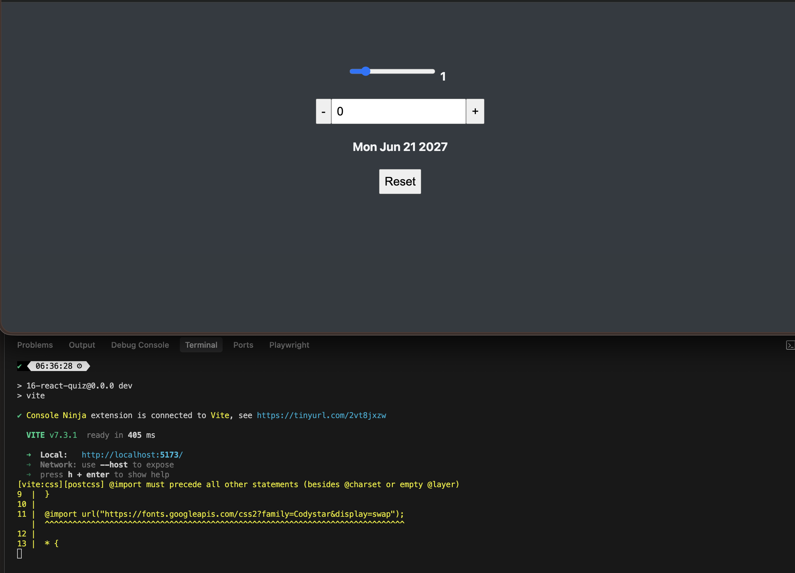

#### 188.2.2 Working on `Reducer` function return value:

**Subsection Summary**
- **Purpose**: Implements the actual state transition logic inside the reducer using a `switch` statement, replacing the hardcoded return.
- **Key Changes**: Each `case` returns a new object via the spread operator (`...state`) and only overrides the relevant property. A `default` case throws an error for unknown action types.
- **Pattern**: `return { ...state, count: state.count - 1 }` — spread preserves `step` while only `count` changes. This is the standard immutable update pattern for object-based reducer state.
- **Limitation**: `inc`/`dec` still use hardcoded `- 1` / `+ 1` instead of `state.step`, and `setStep`/`reset` are not handled yet.
- **Screenshot**: Console logs show the state object `{count: X, step: 1}` alongside dispatched actions (`{type: 'inc'}`, `{type: 'setCount', payload: 20}`), confirming the `switch` logic works for `inc`, `dec`, and `setCount`.

```jsx
/* src/components/DateCounter.jsx */
import { useReducer } from "react";

const reducer = (state, action) => {
  console.log(state, action);
  switch(action.type){    // 👈🏽 ✅
    case 'dec':
      //return {count: state.count - 1, step: state.step};    // "step" does not changethat's why ...state
      return {...state, count: state.count - 1};
    case 'inc':
      return {...state, count: state.count + 1};
    case 'setCount':
      return {...state, count: action.payload};
    default:
      throw new Error("Unknow action type: " + action.type);
  }
  // if(action.type === 'dec') return state - 1;
  // if(action.type === 'inc') return state + 1;
  // if(action.type === 'setCount') return action.payload;
  //return { count: 0, step: 1} 
};

const DateCounter = () => {
  const initialState = { count: 0, step: 1 };
  const [state, dispatch] = useReducer(reducer, initialState);

  const { count, step } = state;

  // This mutates the date object.
  const date = new Date("june 21 2027");
  date.setDate(date.getDate() + count);

  const dec = function () {
    dispatch({type: 'dec'});
  };

  const inc = function () {
    dispatch({type: 'inc'});
  };

  const defineCount = function (e) {
    dispatch({type: 'setCount', payload: Number(e.target.value)});
  };

  const defineStep = function (e) {
    //setStep(Number(e.target.value));
  };

  const reset = function () {
    //setStep(1);
  };

  return (
    <div className="counter">
      <div>
        <input
          type="range"
          min="0"
          max="10"
          value={step}
          onChange={defineStep}
        />
        <span>{step}</span>
      </div>

      <div>
        <button onClick={dec}>-</button>
        <input value={count} onChange={defineCount} />
        <button onClick={inc}>+</button>
      </div>

      <p>{date.toDateString()}</p>

      <div>
        <button onClick={reset}>Reset</button>
      </div>
    </div>
  );
}
export default DateCounter;
```

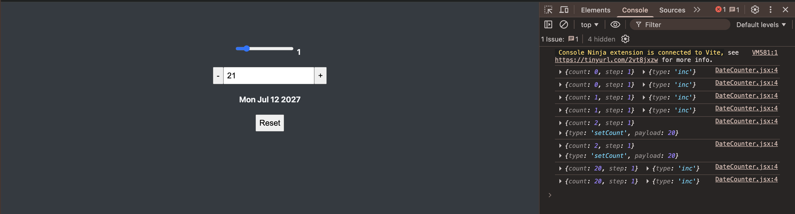

#### 188.2.3 Complete the `Reducer` function:

**Subsection Summary**
- **Purpose**: Finalizes the reducer by adding the remaining action types (`setStep`, `reset`) and making `inc`/`dec` respect the dynamic `step` value.
- **Key Changes**: (1) Add `setStep` case to update `step` via `action.payload`. (2) Update `dec`/`inc` to use `state.step` instead of hardcoded `1`. (3) Add `reset` case. (4) Extract `initialState` outside the component so both `useReducer` and the `reset` case can reference it without duplication.
- **Result**: All state — `count` and `step` — is now fully managed by a single `useReducer`. All event handlers (`dec`, `inc`, `defineCount`, `defineStep`, `reset`) dispatch actions. No `useState` remains.
- **Screenshot**: Console shows the complete flow — `setStep` changes step to 2, `inc` increments by 2, and `reset` restores `{count: 0, step: 1}`. Full functionality confirmed.

```jsx
/* src/components/DateCounter.jsx */
import { useReducer } from "react";

const initialState = { count: 0, step: 1 };   // 👈🏽 ✅ (4)

const reducer = (state, action) => {
  console.log(state, action);

  switch(action.type){
    case 'dec':
      return {...state, count: state.count - state.step};    // 👈🏽 ✅ (2)
    case 'inc':
      return {...state, count: state.count + state.step};    // 👈🏽 ✅ (2)
    case 'setCount':
      return {...state, count: action.payload};
    case 'setStep':
      return {...state, step: action.payload};   // 👈🏽 ✅ (1)
    case 'reset':
      //return { count: 0, step: 1}    // 👈🏽 ✅ (3)
      return initialState;   // 👈🏽 ✅ (4)
    default:
      throw new Error("Unknow action type: " + action.type);
  }
};

const DateCounter = () => {
  //const initialState = { count: 0, step: 1 };   // 👈🏽 ✅ (4)
  const [state, dispatch] = useReducer(reducer, initialState);

  // destructuring "state":
  const { count, step } = state;

  // This mutates the date object.
  const date = new Date("june 21 2027");
  date.setDate(date.getDate() + count);

  const dec = function () {
    dispatch({type: 'dec'});
  };

  const inc = function () {
    dispatch({type: 'inc'});
  };

  const defineCount = function (e) {
    dispatch({type: 'setCount', payload: Number(e.target.value)});
  };

  const defineStep = function (e) {
    dispatch({type: 'setStep', payload: Number(e.target.value)});   // 👈🏽 ✅ (1)
  };

  const reset = function () {
    dispatch({ type: 'reset' })   // 👈🏽 ✅ (3)
  };

  return (
    <div className="counter">
      <div>
        <input
          type="range"
          min="0"
          max="10"
          value={step}
          onChange={defineStep}
        />
        <span>{step}</span>
      </div>

      <div>
        <button onClick={dec}>-</button>
        <input value={count} onChange={defineCount} />
        <button onClick={inc}>+</button>
      </div>

      <p>{date.toDateString()}</p>

      <div>
        <button onClick={reset}>Reset</button>
      </div>
    </div>
  );
}
export default DateCounter;
```

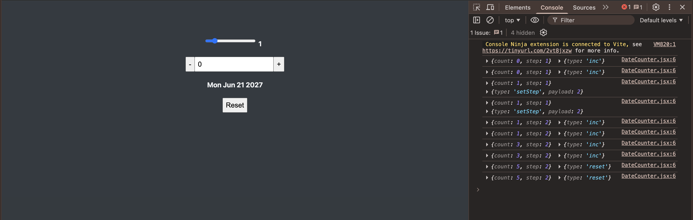

### 🐞 188.3 Issues:

- In **188.2.1**, the reducer temporarily returns a hardcoded `{ count: 0, step: 1 }` for every action, meaning `inc`, `dec`, and `setCount` do nothing. This is intentional scaffolding but could confuse someone reading the code in isolation.
- In **188.2.2**, the `inc`/`dec` cases use hardcoded `+ 1` / `- 1` instead of `state.step`, so changing the step slider has no effect on increment/decrement until 188.2.3.
- In **188.2.2**, `defineStep` and `reset` handlers are still commented out / no-ops, meaning the range slider and reset button are non-functional.
- The `useState` import is still present in 188.2.1 despite not being used (removed in 188.2.2).
- There is a typo in the `default` case: `"Unknow"` should be `"Unknown"` (`src/components/DateCounter.jsx:21`).
- The `console.log(state, action)` call inside the reducer is useful for development but should be removed in production.

| Issue | Status | Log/Error |
|---|---|---|
| Hardcoded return in reducer (188.2.1) | ✅ Fixed (in 188.2.2) | Reducer returned `{ count: 0, step: 1 }` for every action — all dispatches were no-ops. |
| `inc`/`dec` ignore `step` value (188.2.2) | ✅ Fixed (in 188.2.3) | Used `state.count + 1` instead of `state.count + state.step`. Step slider had no effect on increment. |
| `defineStep` and `reset` not wired up (188.2.2) | ✅ Fixed (in 188.2.3) | Both handlers were commented out / empty; range slider and reset button did nothing. |
| Unused `useState` import in 188.2.1 | ✅ Fixed (in 188.2.2) | `import { useReducer, useState }` — `useState` no longer used after migration. |
| Typo `"Unknow"` in default case | ⚠️ Identified | `src/components/DateCounter.jsx:21` — `"Unknow action type"` should be `"Unknown action type"`. |
| `console.log` left in reducer | ℹ️ Low Priority | `src/components/DateCounter.jsx:6` — Debug logging should be removed before production. |

### 🧱 188.4 Pending Fixes (TODO)

- [ ] Fix typo `"Unknow"` → `"Unknown"` in the reducer `default` case (`src/components/DateCounter.jsx:21`).
- [ ] Remove `console.log(state, action)` from the reducer function (`src/components/DateCounter.jsx:6`).
- [ ] Remove all commented-out code (old `useState` lines, old `if`-based reducer logic) to clean up the final file.
- [ ] Add accessibility attributes to the `<button>` elements: `aria-label` for `dec` (`"Decrease count"`), `inc` (`"Increase count"`), and `reset` (`"Reset counter"`).
- [ ] Consider adding an `aria-label` and `aria-valuemin`/`aria-valuemax`/`aria-valuenow` to the count `<input>` for improved accessibility.
- [ ] Rename event handler functions to follow the `handle` prefix convention: `dec` → `handleDecrement`, `inc` → `handleIncrement`, `defineCount` → `handleCountChange`, `defineStep` → `handleStepChange`, `reset` → `handleReset`.

[↑ top - 188. Lesson 188 — *Managing Related Pieces of State*](#-188-lesson-188---managing-related-pieces-of-state)

<br>

## 🔧 189. Lesson 189 — *Managing State With useReducer*

[🧳 Section 16: *The Advanced useReducer Hook*](#-section-16-the-advanced-usereducer-hook)

### 📑 Table of Contents:
- [189. Lesson 189 — *Managing State With useReducer*](#-189-lesson-189---managing-state-with-usereducer)
- [189.1 Context](#1891-context)
- [189.2 Updating code according the context](#1892-updating-code-according-the-context)
  - [189.2.1 **Why** useReducer?](#18921-why-usereducer)
  - [189.2.2 **Managing state** with `useReducer`](#18922-managing-state-with-usereducer)
  - [189.2.3 **How** reducers update state](#18923-how-reducers-update-state)
  - [189.2.4 A **mental model** for Reducers](#18924-a-mental-model-for-reducers)
- [189.3 Issues](#1893-issues)
- [189.4 Pending Fixes (TODO)](#1894-pending-fixes-todo)

### 🧠 189.1 Context:

This lesson is a **theoretical deep-dive** into the `useReducer` hook. After the hands-on practice in Lessons 187 and 188 (refactoring `DateCounter` from `useState` to `useReducer`), this lesson steps back to formalize the concepts through visual diagrams and analogies. No code is written — instead, the focus is on building a solid mental model.

**Key Concepts:**

1. **When `useState` falls short**: `useState` becomes insufficient when (a) a component has many state variables and updates scattered across handlers, (b) multiple state updates need to happen simultaneously in response to one event, or (c) one state update depends on the value of another piece of state.
2. **The `useReducer` API**: `const [state, dispatch] = useReducer(reducer, initialState)` — it returns the current `state` and a `dispatch` function (analogous to `setState` but with "superpowers").
3. **Reducer function**: A **pure function** `(state, action) => newState`. It receives the current state and an action object, and must return the next state. It must have **no side effects**.
4. **Action object**: Describes **how** to update state. Conventionally: `{ type: 'actionName', payload: data }`. The `type` tells the reducer *what happened*, and the optional `payload` carries extra data.
5. **Dispatch function**: Triggers state updates by "sending" actions from event handlers to the reducer. It replaces direct `setState()` calls.
6. **Flow**: `dispatch(action)` → reducer receives `(currentState, action)` → reducer returns `nextState` → React re-renders with `nextState`.
7. **Name origin**: Just like `Array.prototype.reduce()`, reducers accumulate ("reduce") actions over time into a single state value.

**Advantages:**
- Centralizes all state transition logic in one pure function — easier to read, debug, and test.
- Handles complex state (objects with multiple properties) more predictably than multiple `useState` calls.
- Makes atomic multi-property updates straightforward (e.g., a single `reset` action restoring all properties).
- Decouples *what happened* (the action dispatched in the component) from *how state changes* (the logic in the reducer).
- The reducer is defined outside the component, so it can be shared, tested, and reasoned about independently.

**Disadvantages / Gotchas:**
- More boilerplate than `useState` for simple, independent state values.
- Requires understanding the action / dispatch / reducer pattern, which has a learning curve.
- Every case in the reducer must return a **complete new state object** — forgetting to spread existing properties wipes them out.
- Misspelled action types fail silently unless the `default` case throws an error.

**When to Consider Alternatives:**
- If state values are independent and simple (e.g., a single boolean toggle), `useState` is simpler and more appropriate.
- For truly global / app-wide state, consider Context API + `useReducer` together, or external libraries (Zustand, Redux Toolkit, Jotai).
- For server-derived state, dedicated data-fetching libraries (React Query, SWR) may be more suitable than local reducers.

**Mental Model — The Bank Analogy:**
- **You** (the component) are the **dispatcher**. You *request* a change: "I want to withdraw $5,000 from account 923577."
- The **bank teller** is the **reducer**. They receive your request (the *action*) and process it against the current account balance (the *state*).
- The **vault** is the **state store**. You never access it directly — the teller does. The teller returns the updated balance (next state).
- With `useState`, it's like walking into the vault yourself and grabbing the money — simple and direct, but chaotic when multiple people do it at once.

This analogy maps exactly to the `useReducer` flow:
- `dispatch({ type: 'withdraw', payload: { amount: 5000, account: 923577 } })` → the reducer processes the action → returns new state.

### ⚙️ 189.2 Updating code/theory according the context:

#### **Summary**
- **Purpose**: This section is entirely theoretical — it presents four visual diagrams that formalize the `useReducer` concepts practiced in Lessons 187–188.
- **Problem it solves**: After learning `useReducer` through code, students need a conceptual framework to understand *when*, *why*, and *how* the hook works at a higher level.
- **Connection between subsections**:
    1. **189.2.1** establishes *when* `useReducer` is needed (the limitations of `useState`).
    2. **189.2.2** explains *what* the hook provides (state, dispatch, reducer, action).
    3. **189.2.3** shows *how* the data flows (dispatch → reducer → next state → re-render), contrasting it with `useState`.
    4. **189.2.4** provides a real-world analogy (bank withdrawal) to solidify the mental model.

#### 189.2.1 **Why** useReducer?

**Subsection Summary**
- **What it shows**: A slide listing three situations where `useState` is not enough.
- **Key points**:
    1. When a component has **a lot of state variables and updates** spread across many event handlers all over the component.
    2. When **multiple state updates** need to happen **at the same time** (as a reaction to the same event, like "starting a game").
    3. When updating one piece of state **depends on one or multiple other pieces of state**.
- **Conclusion**: In all these situations, `useReducer` can be of great help.
- **Image**: Presents the three numbered reasons in a clean visual layout with a highlighted takeaway at the bottom.

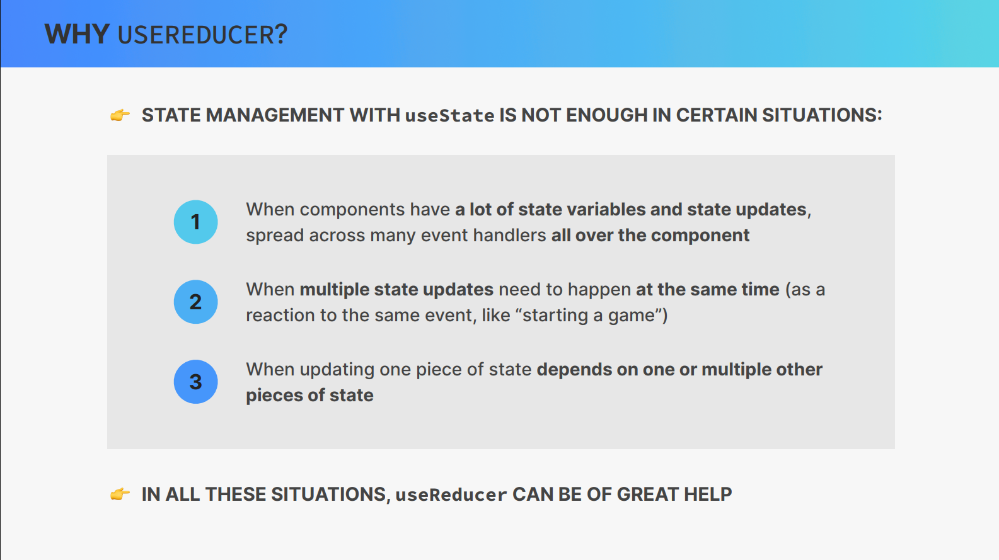 

#### 189.2.2 **Managing state** with `useReducer`

**Subsection Summary**
- **What it shows**: A two-panel slide — left side explains the concepts in bullet points, right side shows the corresponding code.
- **Key points**:
    - `useReducer` is an alternative way of setting state, ideal for **complex state** and **related pieces of state**.
    - It stores related pieces of state in a **`state` object** (described as "like `setState()` with superpowers").
    - It needs a **`reducer`** function containing **all logic** to update state, which **decouples state logic from the component**.
    - The **reducer** is a **pure function** (*no side effects!*) that takes the current `state` and `action`, and **returns the next state**.
    - The **`action`** is an object that describes **how to update state**.
    - The **`dispatch`** function triggers state updates by "sending" actions from **event handlers** to the **reducer** (instead of `setState()`).
- **Code shown**: `const [state, dispatch] = useReducer(reducer, initialState);` and a `function reducer(state, action)` with a `switch` on `action.type` handling `dec`, `inc`, `setCount`, and a `default` error throw.
- **Image**: Left panel has annotated bullet points; right panel shows the `useReducer` call and reducer function with color-coded highlights for `state`, `dispatch`, `reducer`, `action`, `action.type`, `return`, and `action.payload`.

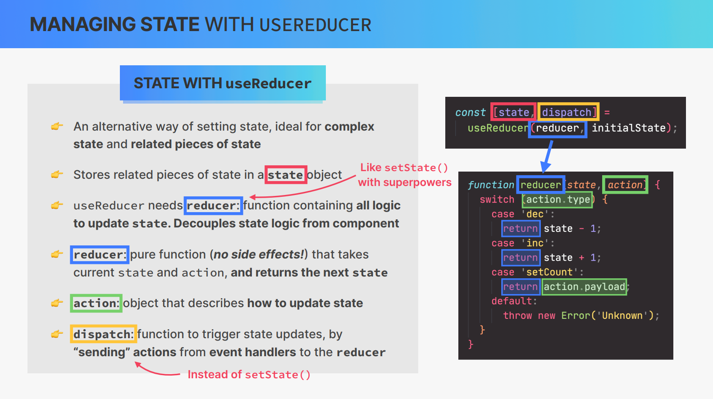 

#### 189.2.3 **How** reducers update state

**Subsection Summary**
- **What it shows**: A flow diagram comparing `useReducer` and `useState` state update mechanisms.
- **`useReducer` flow** (top):
    1. A component calls `dispatch(action)`.
    2. The `dispatch` sends the action (e.g., `{ type: 'updateDay', payload: 23 }`) to the `reducer`.
    3. The `reducer` receives the **current state** and the **action**, then **returns** the **next state**.
    4. The next state triggers a **re-render**.
- **`useState` flow** (bottom): Simpler — `setState(updatedState)` → next (updated) state → re-render. There is no intermediate "reducer" step.
- **Key insight**: The action is described as "an object that contains information on how the reducer should update state." Just like `Array.reduce()`, reducers accumulate ("reduce") actions over time.
- **Image**: Two horizontal flow diagrams stacked vertically — the top one for `useReducer` (with dispatch → reducer → next state → re-render), and the bottom one for `useState` (setState → next state → re-render). Color-coded blocks and arrows show the data flow.

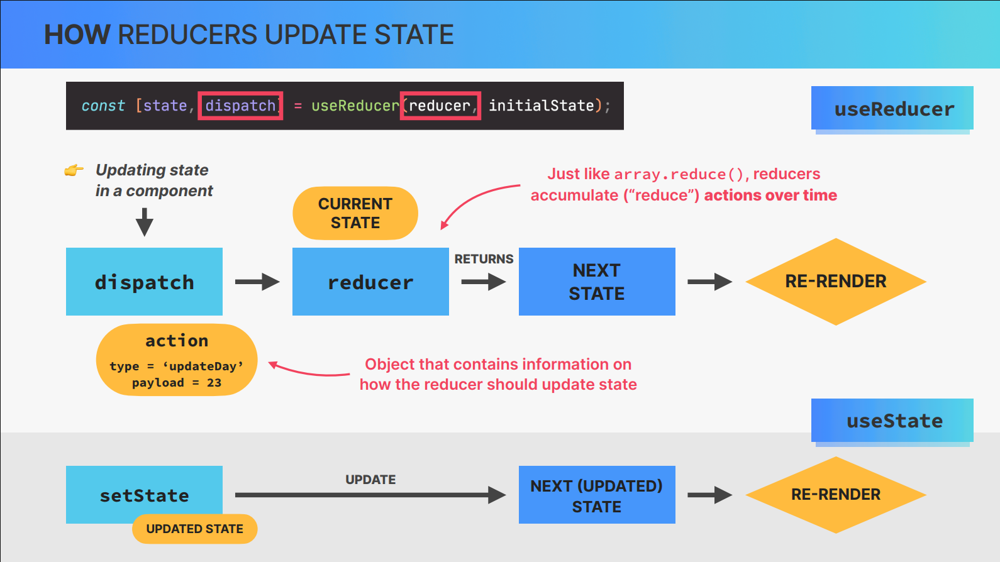  

#### 189.2.4 A **mental model** for Reducers:

**Subsection Summary**
- **What it shows**: A two-part real-world analogy using a **bank withdrawal** scenario to explain the reducer pattern.
- **Part 1 (image 004)** — What you do **NOT** do:
    - Real-world task: withdrawing $5,000 from your bank account.
    - You do **NOT** go to your bank and take money straight from the bank's vault. (This is crossed out with a big red X.)
    - This represents `useState` — directly mutating/setting state without a mediator.
- **Part 2 (image 005)** — What you **actually** do:
    - **Dispatcher** (you, the customer): Requests the update — "I would like to withdraw $5,000 from account 923577."
    - **Action**: The request itself — `{ type: 'withdraw', payload: { amount: 5000, account: 923577 } }`. Describes **how** to make the update.
    - **Reducer** (the bank teller): Processes the request — **who makes the update**.
    - **State** (the vault/safe): What needs to be updated — the account balance.
    - The teller (reducer) mediates between the customer (dispatcher) and the vault (state), ensuring proper processing.
- **Image 004**: Shows a person, a bank, and a vault with crossed-out arrows between the person and the vault.
- **Image 005**: Shows the person (dispatcher) communicating through a teller (reducer) who accesses the vault (state), with labeled arrows and an action code snippet.

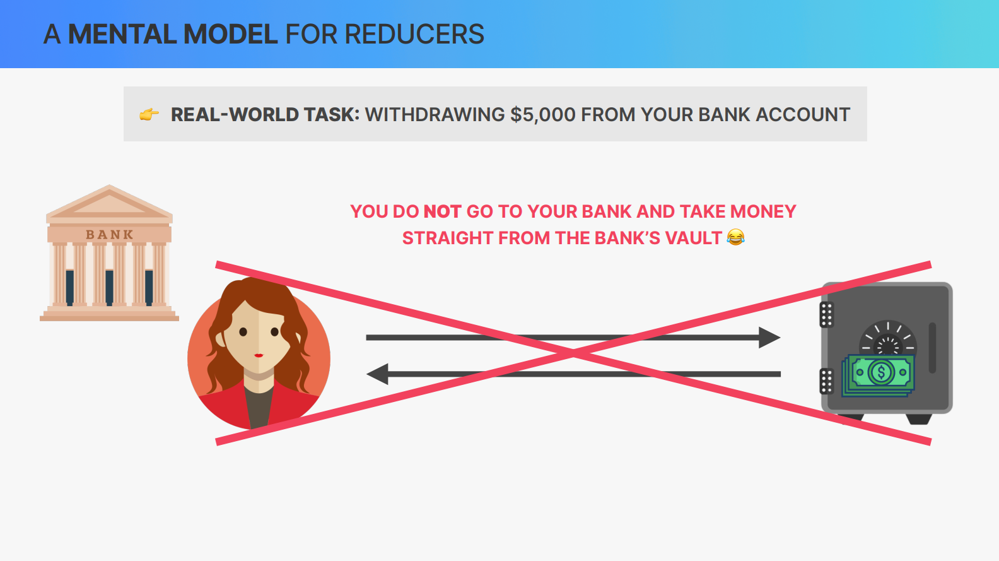 
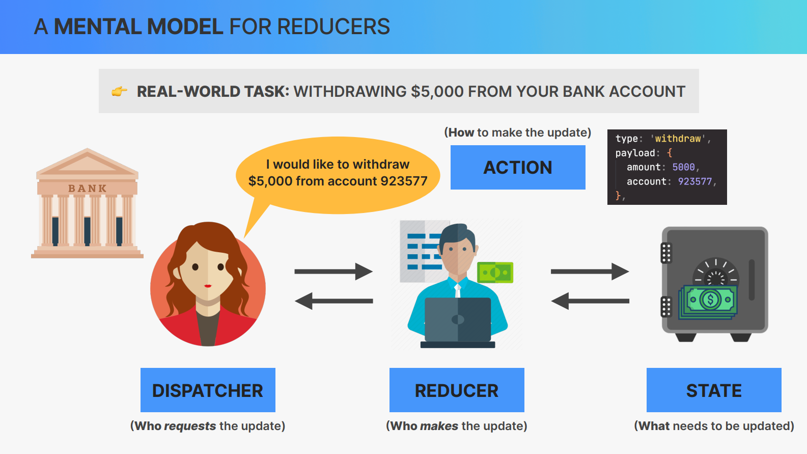 

### 🐞 189.3 Issues:

- This is a purely theoretical lesson with no code changes, so there are no code-level bugs or runtime issues.
- The content effectively builds upon Lessons 187–188 but does not introduce any new code that could contain defects.
- Minor observation: the slide in 189.2.2 shows `throw new Error('Unknown')` without specifying the action type in the error message, whereas the actual implementation in Lesson 188 includes `action.type` in the message (though with the typo `"Unknow"`).

| Issue | Status | Log/Error |
|---|---|---|
| No code changes in this lesson | ℹ️ Informational | This is a theory-only lecture — no source files were modified. |
| Slide reducer `default` case shows `'Unknown'` without `action.type` | ℹ️ Informational | The slide in 189.2.2 shows `throw new Error('Unknown')` but the real implementation includes the action type in the message for easier debugging. |

### 🧱 189.4 Pending Fixes (TODO)

- [ ] No code-level fixes required — this lesson is theoretical.
- [ ] Review the `DateCounter` reducer's `default` case to ensure the error message includes `action.type` for debuggability, matching best practices shown conceptually in this lesson (`src/components/DateCounter.jsx`).
- [ ] Consider creating a standalone markdown cheat-sheet summarizing the `useReducer` API, flow diagram, and bank analogy for quick reference.

[↑ top - 189. Lesson 189 — *Managing State With useReducer*](#-189-lesson-189---managing-state-with-usereducer)


---

<br>
<br>
<br>

🔥 🔥 🔥 

<br>

## 🔧 XXX. Lesson XXX — *{{TITLE_NAME}}*

### 🧠 XXX.1 Context:

### ⚙️ XXX.2 Updating code/theory according the context:

#### XXX.2.1
```jsx
/*  */

```

#### XXX.2.2
```jsx
/*  */

```

#### XXX.2.3
```jsx
/*  */

```

#### XXX.2.4
```jsx
/*  */

```

### 🐞 XXX.3 Issues:
- **first issue**: something..

| Issue | Status | Log/Error |
|---|---|---|

### 🧱 XXX.4 Pending Fixes (TODO)

- [ ]