# 👨🏾💻 Project: 16-react-quiz

## 📋 Project Overview

### What This Project Does
- **React Quiz App**: Interactive quiz application where users answer multiple-choice questions about React and JavaScript.
- **DateCounter Demo**: Educational component demonstrating `useReducer` vs `useState` for state management.
- **Fake API Integration**: Loads questions from `json-server` (REST API) with loading, error, and ready states.
- **Timer**: Countdown timer during quiz with `useEffect` for interval management.
- **Progress Tracking**: Displays current question, score, highscore, and completion status.

### Technology Stack
- **React 19** with JSX
- **Vite** for build tooling and dev server
- **json-server** for fake REST API (questions data)
- **ESLint** for code quality
- **concurrently** for running Vite and json-server together

### Key Components
- **App.jsx**: Main orchestrator using `useReducer` for global quiz state (questions, status, index, answer, points, timer).
- **Main.jsx**: Renders StartScreen, Question, or FinishScreen based on status.
- **Question, Options, NextButton, Progress, Timer, FinishScreen, StartScreen**: Quiz UI components.
- **Loader, Error**: Loading and error states.
- **DateCounter.jsx**: Standalone demo for `useReducer` lessons.

---

## 📑 Table of Contents

- [👨🏾💻 Project: 16-react-quiz](#-project-16-react-quiz)
- [📋 Project Overview](#-project-overview)
- [📑 Table of Contents](#-table-of-contents)
- [📁 Visual Project Tree](#-visual-project-tree)
- [🧳 Section 16: The Advanced useReducer Hook](#-section-16-the-advanced-usereducer-hook)
  <details>
  <summary>Section 16 - Lessons</summary>

  * [📚 Lesson 187: Yet Another Hook: useReducer](#-187-lesson-187--yet-another-hook-usereducer)
  * [📚 Lesson 188: Managing Related Pieces of State](#-188-lesson-188--managing-related-pieces-of-state)
  * [📚 Lesson 189: Managing State With useReducer](#-189-lesson-189--managing-state-with-usereducer)
  * [📚 Lesson 190: The "React Quiz" App](#-190-lesson-190--the-react-quiz-app)
  * [📚 Lesson 191: Loading Questions from a Fake API](#-191-lesson-191--loading-questions-from-a-fake-api)
  * [📚 Lesson 192: Handling Loading, Error, and Ready Status](#-192-lesson-192--handling-loading-error-and-ready-status)
  * [📚 Lesson 193: Starting a New Quiz](#-193-lesson-193--starting-a-new-quiz)
  * [📚 Lesson 194: Displaying Questions](#-194-lesson-194--displaying-questions)
  * [📚 Lesson 195: Handling New Answers](#-195-lesson-195--handling-new-answers)
  * [📚 Lesson 196: Moving to the Next Question](#-196-lesson-196--moving-to-the-next-question)
  * [📚 Lesson 197: Displaying Progress](#-197-lesson-197--displaying-progress)
  * [📚 Lesson 198: Finishing a Quiz](#-198-lesson-198--finishing-a-quiz)
  * [📚 Lesson 199: Restarting a Quiz](#-199-lesson-199--restarting-a-quiz)
  * [📚 Lesson 200: Setting Up a Timer With useEffect](#-200-lesson-200--setting-up-a-timer-with-useeffect)
  * [📚 Lesson 201: Section Summary: useState vs. useReducer](#-201-lesson-201--section-summary-usestate-vs-usereducer)
  </details>

---

## 📁 Visual Project Tree

```
📁 16-react-quiz
├── 📁 public
│   ├── 📄 logo192.png
│   └── 📄 logo512.png
├── 📁 src
│   ├── 📁 components
│   │   ├── 📄 DateCounter.jsx      # useReducer demo (lessons 187–189)
│   │   ├── 📄 Error.jsx            # Error state UI
│   │   ├── 📄 FinishScreen.jsx     # Quiz completion screen
│   │   ├── 📄 Footer.jsx           # App footer
│   │   ├── 📄 Header.jsx           # Quiz header
│   │   ├── 📄 Loader.jsx           # Loading spinner
│   │   ├── 📄 Main.jsx             # Renders Start/Question/Finish based on status
│   │   ├── 📄 NextButton.jsx       # Next question button
│   │   ├── 📄 Options.jsx          # Answer options list
│   │   ├── 📄 Progress.jsx         # Progress bar and score
│   │   ├── 📄 Question.jsx         # Question display
│   │   ├── 📄 StartScreen.jsx      # Quiz start screen
│   │   └── 📄 Timer.jsx            # Countdown timer
│   ├── 📄 App.jsx                  # Main app — useReducer, state, effects
│   ├── 📄 main.jsx                 # Entry point
│   └── 📄 index.css                # Global styles
├── 📁 data
│   └── 📄 questions.json           # Quiz questions (json-server source)
├── 📁 docs
│   └── 📄 LECTURE_STEPS.md         # This document
├── 📁 img                           # Lecture screenshots
├── 📄 index.html
├── 📄 package.json
├── 📄 vite.config.js
└── 📄 eslint.config.js
```

<br>

## 🧳 Section 16: *The Advanced useReducer Hook*

### 📑 Table of Contents
- [📚 Lesson 187: Yet Another Hook: useReducer](#-187-lesson-187--yet-another-hook-usereducer)
- [📚 Lesson 188: Managing Related Pieces of State](#-188-lesson-188--managing-related-pieces-of-state)
- [📚 Lesson 189: Managing State With useReducer](#-189-lesson-189--managing-state-with-usereducer)
- [📚 Lesson 190: The "React Quiz" App](#-190-lesson-190--the-react-quiz-app)
- [📚 Lesson 191: Loading Questions from a Fake API](#-191-lesson-191--loading-questions-from-a-fake-api)
- [📚 Lesson 192: Handling Loading, Error, and Ready Status](#-192-lesson-192--handling-loading-error-and-ready-status)
- [📚 Lesson 193: Starting a New Quiz](#-193-lesson-193--starting-a-new-quiz)
- [📚 Lesson 194: Displaying Questions](#-194-lesson-194--displaying-questions)
- [📚 Lesson 195: Handling New Answers](#-195-lesson-195--handling-new-answers)
- [📚 Lesson 196: Moving to the Next Question](#-196-lesson-196--moving-to-the-next-question)
- [📚 Lesson 197: Displaying Progress](#-197-lesson-197--displaying-progress)
- [📚 Lesson 198: Finishing a Quiz](#-198-lesson-198--finishing-a-quiz)
- [📚 Lesson 199: Restarting a Quiz](#-199-lesson-199--restarting-a-quiz)
- [📚 Lesson 200: Setting Up a Timer With useEffect](#-200-lesson-200--setting-up-a-timer-with-useeffect)
- [📚 Lesson 201: Section Summary: useState vs. useReducer](#-201-lesson-201--section-summary-usestate-vs-usereducer)

---

## 🔧 187. Lesson 187 — *Yet Another Hook: useReducer*

- [187. Lesson 187 — *Yet Another Hook: useReducer*](#187-lesson-187-yet-another-hook-usereducer)
- [187.1 Context](#1871-context)
- [187.2 Updating code according the context](#1872-updating-codetheory-according-the-context)
  - [187.2.1 Start from scratch the `App.jsx` component then import `DateCounter` component](#18721-start-from-scratch-the-appjsx-component-then-import-datecounter-component)
  - [187.2.2 Initial `DateCounter` component](#18722-initial-datecounter-component)
  - [187.2.3 Adding `useReducer` hook in `DateCounter` component](#18723-adding-usereducer-hook-in-datecounter-component)
  - [187.2.4 Adding `dispatch(1)` in `inc` & `dispatch(-1)` in `dec` functions](#18724-adding-dispatch1-in-inc-dispatch-1-in-dec-functions)
  - [187.2.5 Working with setting a value or `defineCount` function](#18725-working-with-setting-a-value-or-definecount-function)
  - [187.2.6 Thinking about passing an object in each dispatch and named actions](#18726-thinking-about-passing-an-object-in-each-dispatch-and-named-actions)
  - [187.2.7 Simplifying `useReducer` in `reducer` function](#18727-simplifying-usereducer-in-reducer-function)
- [187.3 Issues](#1873-issues)
- [187.4 Pending Fixes (TODO)](#1874-pending-fixes-todo)

### 🧠 187.1 Context:

The `useReducer` hook is a more powerful alternative to `useState` for state management in React. It is particularly useful when:

1.  **State logic is complex**: When multiple pieces of state rely on each other or when the next state depends on the previous one in complex ways.
2.  **Multiple sub-values**: When you have an object with many properties that update independently or together.
3.  **Externalizing logic**: It allows you to move state update logic outside of the component (into a reducer function), making the component cleaner and the logic easier to test.

**How it works:**
It follows the "Redux" pattern (though simpler).
- **Reducer**: A pure function `(state, action) => newState`. It takes the current state and an "action" (instruction) and returns the new state.
- **Dispatch**: A function called to trigger an update. You `dispatch(action)`.
- **Action**: An object (conventionally `{ type: 'ACTION_NAME', payload: data }`) describing *what* happened.

**Analogy:**
- `useState`: You (the component) directly change the data. "Set count to 5".
- `useReducer`: You (the component) request a change. "Dispatch: INCREMENT". The reducer (a manager) receives the request and decides how to update the state based on current rules.

In this lesson, we refactor a simple `DateCounter` component from using multiple `useState` calls to a single `useReducer` to manage `count` and `step` (eventually) and handle complex updates more predictably.

### ⚙️ 187.2 Updating code/theory according the context:

#### **Summary**
- **Purpose**: To demonstrate the transition from `useState` to `useReducer` for managing numeric state.
- **Problem**: The initial code uses `useState` which works but can become unwieldy with complex state logic. We want to centralize the update logic.
- **Connection**: The subsections progressively evolve the component:
    1.  Setup.
    2.  Analysis of `useState` approach.
    3.  Introduction of `useReducer` syntax.
    4.  Refining usage with simple actions.
    5.  Encountering pitfalls (logic errors).
    6.  Standardizing actions with objects.
    7.  Finalizing the reducer logic.

#### 187.2.1 Start from scratch the `App.jsx` component then import `DateCounter` component:
**Subsection Summary**
- **Purpose**: Sets up the main `App` component to render the `DateCounter`.
- **Content**: A simple functional component rendering `<DateCounter />`.

```jsx
/* src/App.jsx */
import DateCounter from './DateCounter'

function App() {
  return (
    <>
      <DateCounter />
    </>
  )
}
export default App
```


#### 187.2.2 Initial `DateCounter` component:
**Subsection Summary**
- **Purpose**: Shows the starting point using `useState`.
- **Review**: The component manages `count` and `step`. It manually mutates a `Date` object (which is a side effect often better handled differently, but here serves the example).
- **Key Concept**: Standard `useState` usage where updates are scattered across event handlers (`inc`, `dec`, `defineCount`).

```jsx
/* src/DateCounter.jsx */
import { useState } from "react";

const DateCounter = () => {
  const [count, setCount] = useState(0);
  const [step, setStep] = useState(1);

  // This mutates the date object.
  const date = new Date("june 21 2027");
  date.setDate(date.getDate() + count);

  const dec = function () {
    // setCount((count) => count - 1);
    setCount((count) => count - step);
  };

  const inc = function () {
    // setCount((count) => count + 1);
    setCount((count) => count + step);
  };

  const defineCount = function (e) {
    setCount(Number(e.target.value));
  };

  const defineStep = function (e) {
    setStep(Number(e.target.value));
  };

  const reset = function () {
    setCount(0);
    setStep(1);
  };

  return (
    <div className="counter">
      <div>
        <input
          type="range"
          min="0"
          max="10"
          value={step}
          onChange={defineStep}
        />
        <span>{step}</span>
      </div>

      <div>
        <button onClick={dec}>-</button>
        <input value={count} onChange={defineCount} />
        <button onClick={inc}>+</button>
      </div>

      <p>{date.toDateString()}</p>

      <div>
        <button onClick={reset}>Reset</button>
      </div>
    </div>
  );
}
export default DateCounter;
```

#### 187.2.3 Adding `useReducer` hook in `DateCounter` component:
**Subsection Summary**
- **Purpose**: Introduces the `useReducer` hook syntax.
- **Change**: Replaces `const [count, setCount] = useState(0);` with `const [count, dispatch] = useReducer(reducer, 0);`.
- **Concept**: A dummy `reducer` function is defined that currently just logs args. `dispatch` is now available to trigger updates.

```jsx
/* src/DateCounter.jsx */
import { useReducer, useState } from "react";       // 👈🏽 ✅ (2)

const reducer = (state, action) => {        // 👈🏽 ✅ (3)
  console.log(state, action);
};

const DateCounter = () => {
  //const [count, setCount] = useState(0);      // 👈🏽 ✅ (1)
  const [count, dispatch] = useReducer(reducer, 0);     // 👈🏽 ✅ (2)
  const [step, setStep] = useState(1);

  // This mutates the date object.
  const date = new Date("june 21 2027");
  date.setDate(date.getDate() + count);

  const dec = function () {
    // setCount((count) => count - 1);      // 👈🏽 ✅ (1)
    //setCount((count) => count - step);
  };

  const inc = function () {
    dispatch(1);        // 👈🏽 ✅ (4) applying the dispatch
    // setCount((count) => count + 1);      // 👈🏽 ✅ (1)
    //setCount((count) => count + step);
  };

  const defineCount = function (e) {
    //setCount(Number(e.target.value));      // 👈🏽 ✅ (1)
  };

  const defineStep = function (e) {
    setStep(Number(e.target.value));
  };

  const reset = function () {
    //setCount(0);      // 👈🏽 ✅ (1)
    setStep(1);
  };

  return (
    <div className="counter">
      <div>
        <input
          type="range"
          min="0"
          max="10"
          value={step}
          onChange={defineStep}
        />
        <span>{step}</span>
      </div>

      <div>
        <button onClick={dec}>-</button>
        <input value={count} onChange={defineCount} />
        <button onClick={inc}>+</button>
      </div>

      <p>{date.toDateString()}</p>

      <div>
        <button onClick={reset}>Reset</button>
      </div>
    </div>
  );
}
export default DateCounter;
```


#### 187.2.4 Adding `dispatch(1)` in `inc` & `dispatch(-1)` in `dec` functions:
**Subsection Summary**
- **Purpose**: Implements basic increment/decrement logic in the reducer.
- **Logic**: The reducer receives `state` (current count) and `action` (1 or -1). It returns `state + action`.
- **Result**: `inc` dispatches `1`, `dec` dispatches `-1`.

```jsx
/* src/DateCounter.jsx */
import { useReducer, useState } from "react";

const reducer = (state, action) => {
  console.log(state, action);
  return state + action;    // 👈🏽 ✅ (1)
};

const DateCounter = () => {
  //const [count, setCount] = useState(0);
  const [count, dispatch] = useReducer(reducer, 0);
  const [step, setStep] = useState(1);

  // This mutates the date object.
  const date = new Date("june 21 2027");
  date.setDate(date.getDate() + count);

  const dec = function () {
    dispatch(-1);// 👈🏽 ✅ (2)
    // setCount((count) => count - 1);
    //setCount((count) => count - step);
  };

  const inc = function () {
    dispatch(1);// 👈🏽 ✅ (2)
    // setCount((count) => count + 1);
    //setCount((count) => count + step);
  };

  const defineCount = function (e) {
    //setCount(Number(e.target.value));
  };

  const defineStep = function (e) {
    setStep(Number(e.target.value));
  };

  const reset = function () {
    //setCount(0);
    setStep(1);
  };

  return (
    <div className="counter">
      <div>
        <input
          type="range"
          min="0"
          max="10"
          value={step}
          onChange={defineStep}
        />
        <span>{step}</span>
      </div>

      <div>
        <button onClick={dec}>-</button>
        <input value={count} onChange={defineCount} />
        <button onClick={inc}>+</button>
      </div>

      <p>{date.toDateString()}</p>

      <div>
        <button onClick={reset}>Reset</button>
      </div>
    </div>
  );
}
export default DateCounter;
```


#### 187.2.5 Working with setting a value or `defineCount` function: 
**Subsection Summary**
- **Purpose**: Attempts to handle the input field change (`defineCount`) using the same reducer logic.
- **Bug/Issue**: The current reducer (`state + action`) adds the input value to the current state, treating it as a delta rather than a set value.
- **Observation**: This highlights why simple generic reducers don't work for different types of actions (increment vs set).

```jsx
/* src/DateCounter.jsx */
import { useReducer, useState } from "react";

const reducer = (state, action) => {
  console.log(state, action);
  return state + action;
};

const DateCounter = () => {
  //const [count, setCount] = useState(0);
  const [count, dispatch] = useReducer(reducer, 0);
  const [step, setStep] = useState(1);

  // This mutates the date object.
  const date = new Date("june 21 2027");
  date.setDate(date.getDate() + count);

  const dec = function () {
    dispatch(-1);
    // setCount((count) => count - 1);
    //setCount((count) => count - step);
  };

  const inc = function () {
    dispatch(1);
    // setCount((count) => count + 1);
    //setCount((count) => count + step);
  };

  const defineCount = function (e) {
    dispatch(Number(e.target.value));       // 👈🏽 ✅ 
    //setCount(Number(e.target.value));
  };

  const defineStep = function (e) {
    setStep(Number(e.target.value));
  };

  const reset = function () {
    //setCount(0);
    setStep(1);
  };

  return (
    <div className="counter">
      <div>
        <input
          type="range"
          min="0"
          max="10"
          value={step}
          onChange={defineStep}
        />
        <span>{step}</span>
      </div>

      <div>
        <button onClick={dec}>-</button>
        <input value={count} onChange={defineCount} />
        <button onClick={inc}>+</button>
      </div>

      <p>{date.toDateString()}</p>

      <div>
        <button onClick={reset}>Reset</button>
      </div>
    </div>
  );
}
export default DateCounter;
```

* It's not going to work properly
---
Steps:
- click on `input`
- add `0`  next to the number `1` in order to get `10`.

Expected Result:
- input displays `11` due to `state + action`: `10 + 1``

---
Steps:
- click on `input` again
- add `2` next the existant number in order to get `112`
Expected Result:
- input displays 123 due to `112 + 11`


#### 187.2.6 Thinking about passing an object in each dispatch and named actions:
**Subsection Summary**
- **Purpose**: Solves the previous issue by distinguishing between action types using an object `{ type, payload }`.
- **Implementation**:
    - `dec`: `{ type: 'dec', payload: -1 }`
    - `inc`: `{ type: 'inc', payload: 1 }`
    - `setCount`: `{ type: 'setCount', payload: value }`
- **Reducer Update**: Checks `action.type` to decide whether to add `payload` (inc/dec) or return `payload` directly (setCount).

```jsx
/* src/DateCounter.jsx */
import { useReducer, useState } from "react";

const reducer = (state, action) => {
  console.log(state, action);
  if(action.type === 'dec') return state + action.payload;       // 👈🏽 ✅ (2)
  if(action.type === 'inc') return state + action.payload;       // 👈🏽 ✅ (2)
  if(action.type === 'setCount') return action.payload;       // 👈🏽 ✅ (2)
};

const DateCounter = () => {
  //const [count, setCount] = useState(0);
  const [count, dispatch] = useReducer(reducer, 0);
  const [step, setStep] = useState(1);

  // This mutates the date object.
  const date = new Date("june 21 2027");
  date.setDate(date.getDate() + count);

  const dec = function () {
    dispatch({type: 'dec', payload: -1});       // 👈🏽 ✅ (1) obj: {type: 'dec', payload: -1}
    //dispatch(-1);
    // setCount((count) => count - 1);
    //setCount((count) => count - step);
  };

  const inc = function () {
    dispatch({type: 'inc', payload: 1});       // 👈🏽 ✅ (1) obj: {type: 'inc', payload: 1}
    //dispatch(1);
    // setCount((count) => count + 1);
    //setCount((count) => count + step);
  };

  const defineCount = function (e) {
    dispatch({type: 'setCount', payload: Number(e.target.value)});       // 👈🏽 ✅ (1) obj: {type: 'setCount', payload: Number(e.target.value)}
    //dispatch(Number(e.target.value));
    //setCount(Number(e.target.value));
  };

  const defineStep = function (e) {
    setStep(Number(e.target.value));
  };

  const reset = function () {
    //setCount(0);
    setStep(1);
  };

  return (
    <div className="counter">
      <div>
        <input
          type="range"
          min="0"
          max="10"
          value={step}
          onChange={defineStep}
        />
        <span>{step}</span>
      </div>

      <div>
        <button onClick={dec}>-</button>
        <input value={count} onChange={defineCount} />
        <button onClick={inc}>+</button>
      </div>

      <p>{date.toDateString()}</p>

      <div>
        <button onClick={reset}>Reset</button>
      </div>
    </div>
  );
}
export default DateCounter;
```


#### 187.2.7 Simplifying `useReducer` in `reducer` function:
**Subsection Summary**
- **Purpose**: Cleans up the calling code (components) by moving more logic into the reducer.
- **Refactor**: Instead of passing `payload: 1` or `-1` for increment/decrement, the reducer knows that `dec` means `-1` and `inc` means `+1`. The components just send `{ type: 'dec' }` or `{ type: 'inc' }`.
- **Result**: Separation of concerns. The component says "what happened" (`inc`), the reducer decides "how logic changes" (`state + 1`).

```jsx
/* src/DateCounter.jsx */
import { useReducer, useState } from "react";

const reducer = (state, action) => {
  console.log(state, action);
  if(action.type === 'dec') return state - 1;       // 👈🏽 ✅ (1)
  if(action.type === 'inc') return state + 1;       // 👈🏽 ✅ (1)
  if(action.type === 'setCount') return action.payload;
};

const DateCounter = () => {
  //const [count, setCount] = useState(0);
  const [count, dispatch] = useReducer(reducer, 0);
  const [step, setStep] = useState(1);

  // This mutates the date object.
  const date = new Date("june 21 2027");
  date.setDate(date.getDate() + count);

  const dec = function () {
    dispatch({type: 'dec'});       // 👈🏽 ✅ (2)
    // setCount((count) => count - 1);
    //setCount((count) => count - step);
  };

  const inc = function () {
    dispatch({type: 'inc'});       // 👈🏽 ✅ (2)
    // setCount((count) => count + 1);
    //setCount((count) => count + step);
  };

  const defineCount = function (e) {
    dispatch({type: 'setCount', payload: Number(e.target.value)});
    //setCount(Number(e.target.value));
  };

  const defineStep = function (e) {
    setStep(Number(e.target.value));
  };

  const reset = function () {
    //setCount(0);
    setStep(1);
  };

  return (
    <div className="counter">
      <div>
        <input
          type="range"
          min="0"
          max="10"
          value={step}
          onChange={defineStep}
        />
        <span>{step}</span>
      </div>

      <div>
        <button onClick={dec}>-</button>
        <input value={count} onChange={defineCount} />
        <button onClick={inc}>+</button>
      </div>

      <p>{date.toDateString()}</p>

      <div>
        <button onClick={reset}>Reset</button>
      </div>
    </div>
  );
}
export default DateCounter;
```

### 🐞 187.3 Issues:

- In **187.2.5**, using a simple `state + action` reducer caused incorrect behavior for setting values (`setCount`), as it added the input value to the current state instead of replacing it. This demonstrated the need for action types.
- The `step` state is still managed by `useState`. The next logical step (likely next lesson) would be to include `step` in the reducer state as well to handle everything together.

| Issue | Status | Log/Error |
|---|---|---|
| Input value adding instead of setting | ✅ Fixed (in 187.2.6) | `defineCount` resulted in additive behavior (e.g., 10 -> 11) instead of setting 10. |

### 🧱 187.4 Pending Fixes (TODO)

- [ ] Remove commented out `useState` code (lines 11, 22-23, 29-30, 36) to clean up `DateCounter.jsx`.
- [ ] Move `step` state into the `useReducer` to fully centralize state management.
- [ ] Implement `reset` functionality using the reducer.

[↑ top - 187. Lesson 187 — *Yet Another Hook: useReducer*](#187-lesson-187-yet-another-hook-usereducer)


<br>

## 🔧 188. Lesson 188 — *Managing Related Pieces of State*

[🧳 Section 16: *The Advanced useReducer Hook*](#section-16-the-advanced-usereducer-hook)

### 📑 Table of Contents:
- [188. Lesson 188 — *Managing Related Pieces of State*](#188-lesson-188-managing-related-pieces-of-state)
- [188.1 Context](#1881-context)
- [188.2 Updating code according the context](#1882-updating-codetheory-according-the-context)
  - [188.2.1 Incorporate the `step` into the built `Reducer` function](#18821-incorporate-the-step-into-the-built-reducer-function)
  - [188.2.2 Working on `Reducer` function return value](#18822-working-on-reducer-function-return-value)
  - [188.2.3 Complete the `Reducer` function](#18823-complete-the-reducer-function)
- [188.3 Issues](#1883-issues)
- [188.4 Pending Fixes (TODO)](#1884-pending-fixes-todo)

### 🧠 188.1 Context:

In Lesson 187 we introduced `useReducer` to manage a single numeric `count` state, while `step` remained in its own `useState`. This lesson takes the next logical step: **combining related pieces of state into a single reducer-managed object**. When two or more state values are closely related — they update together, depend on each other, or share a reset action — they belong inside the same state object managed by one reducer.

**Key Concepts:**

1. **Object state**: Instead of `useReducer(reducer, 0)` (single value), the initial state becomes an object: `{ count: 0, step: 1 }`. The reducer must now return a new object for every action.
2. **Spread operator for immutability**: When updating one property, we spread the rest of the state (`...state`) and override only the changed key: `{ ...state, count: state.count + state.step }`.
3. **Switch statement**: Replaces chained `if` statements for better readability and a clear `default` error case.
4. **Extracting `initialState`**: Moving the initial state object outside the component allows it to be referenced by the `reset` action, avoiding duplication.
5. **Centralized reset**: Because all related state lives in one object, a single `reset` action can restore everything at once — impossible when state is split across multiple `useState` calls.

**Advantages:**
- All related state transitions are visible in one place (the reducer).
- Adding a new action (e.g., `reset`) that touches multiple state values is trivial.
- State can never go out of sync — `count` and `step` are always updated atomically.
- Easier to test: the reducer is a pure function outside the component.

**Disadvantages / Gotchas:**
- Every action must return a **complete new state object**; forgetting to spread will wipe out other properties.
- Slightly more boilerplate compared to individual `useState` calls for truly independent state values.
- The `default` case should throw an error to catch misspelled action types during development.

**When to Consider Alternatives:**
- If state values are completely independent and never interact, separate `useState` hooks are simpler.
- For very large or deeply nested state, consider libraries like Zustand or Immer alongside `useReducer`.
- If the component only reads external state (e.g., from Context or a server), a reducer may be unnecessary.

This lesson applies all of the above to the `DateCounter` component from Lesson 187, progressively migrating `step` into the reducer state and completing all action handlers.

### ⚙️ 188.2 Updating code/theory according the context:

#### **Summary**
- **Purpose**: Migrate the remaining `useState`-managed `step` value into the `useReducer` state object and complete all reducer action handlers.
- **Problem**: In Lesson 187 the `step` was still managed by `useState`, meaning state was split across two mechanisms. The `reset` and `defineStep` handlers could not go through the reducer.
- **Connection**: The subsections progressively evolve the reducer:
    1. Convert state from a single number to an object `{ count, step }` and stub out the reducer (188.2.1).
    2. Implement proper `switch`/`case` logic with the spread operator for immutable updates (188.2.2).
    3. Add the missing `setStep` and `reset` cases, use `state.step` in `inc`/`dec`, and extract `initialState` outside the component (188.2.3).

#### 188.2.1 Incorporate the `step` into the built `Reducer` function:

**Subsection Summary**
- **Purpose**: Transforms the reducer state from a single number (`0`) into an object (`{ count: 0, step: 1 }`), combining both pieces of state.
- **Key Changes**: (1) Define `initialState` as an object with `count` and `step`. (2) Pass it to `useReducer`. (3) Destructure `state` into `{ count, step }`. (4) Comment out old `useState` and `if`-based reducer logic. (5) Temporarily return a hardcoded object so the app renders without errors.
- **Observation**: At this stage the reducer always returns the same hardcoded object, so `inc`/`dec`/`setCount` do nothing meaningful yet. `defineStep` and `reset` are also disabled.
- **Screenshot**: Shows the app rendering correctly with initial values (count: 0, step: 1, date: Mon Jun 21 2027) even though state transitions are not wired up yet.

- use `Reducer` when have some more complex state to manage.
- when state is an object and not a single value.

```jsx
/* src/components/DateCounter.jsx */
import { useReducer, useState } from "react";

const reducer = (state, action) => {
  console.log(state, action);
  //if(action.type === 'dec') return state - 1;    // 👈🏽 ✅ (4)
  //if(action.type === 'inc') return state + 1;    // 👈🏽 ✅ (4)
  //if(action.type === 'setCount') return action.payload;    // 👈🏽 ✅ (4)
  return { count: 0, step: 1}    // 👈🏽 ✅ (5)
};

const DateCounter = () => {
  //const [count, setCount] = useState(0);
  //const [step, setStep] = useState(1);

  const initialState = { count: 0, step: 1 };   // 👈🏽 ✅ (1) two previous states in this initialState.
  const [state, dispatch] = useReducer(reducer, initialState);  // 👈🏽 ✅ (2)

  // destructuring "state":
  const { count, step } = state;  // 👈🏽 ✅ (3)

  // This mutates the date object.
  const date = new Date("june 21 2027");
  date.setDate(date.getDate() + count);

  const dec = function () {
    dispatch({type: 'dec'});
  };

  const inc = function () {
    dispatch({type: 'inc'});
  };

  const defineCount = function (e) {
    dispatch({type: 'setCount', payload: Number(e.target.value)});
  };

  const defineStep = function (e) {
    //setStep(Number(e.target.value));    // 👈🏽 ✅ (4)
  };

  const reset = function () {
    //setStep(1);    // 👈🏽 ✅ (4)
  };

  return (
    <div className="counter">
      <div>
        <input
          type="range"
          min="0"
          max="10"
          value={step}
          onChange={defineStep}
        />
        <span>{step}</span>
      </div>

      <div>
        <button onClick={dec}>-</button>
        <input value={count} onChange={defineCount} />
        <button onClick={inc}>+</button>
      </div>

      <p>{date.toDateString()}</p>

      <div>
        <button onClick={reset}>Reset</button>
      </div>
    </div>
  );
}
export default DateCounter;
```


#### 188.2.2 Working on `Reducer` function return value:

**Subsection Summary**
- **Purpose**: Implements the actual state transition logic inside the reducer using a `switch` statement, replacing the hardcoded return.
- **Key Changes**: Each `case` returns a new object via the spread operator (`...state`) and only overrides the relevant property. A `default` case throws an error for unknown action types.
- **Pattern**: `return { ...state, count: state.count - 1 }` — spread preserves `step` while only `count` changes. This is the standard immutable update pattern for object-based reducer state.
- **Limitation**: `inc`/`dec` still use hardcoded `- 1` / `+ 1` instead of `state.step`, and `setStep`/`reset` are not handled yet.
- **Screenshot**: Console logs show the state object `{count: X, step: 1}` alongside dispatched actions (`{type: 'inc'}`, `{type: 'setCount', payload: 20}`), confirming the `switch` logic works for `inc`, `dec`, and `setCount`.

```jsx
/* src/components/DateCounter.jsx */
import { useReducer } from "react";

const reducer = (state, action) => {
  console.log(state, action);
  switch(action.type){    // 👈🏽 ✅
    case 'dec':
      //return {count: state.count - 1, step: state.step};    // "step" does not changethat's why ...state
      return {...state, count: state.count - 1};
    case 'inc':
      return {...state, count: state.count + 1};
    case 'setCount':
      return {...state, count: action.payload};
    default:
      throw new Error("Unknow action type: " + action.type);
  }
  // if(action.type === 'dec') return state - 1;
  // if(action.type === 'inc') return state + 1;
  // if(action.type === 'setCount') return action.payload;
  //return { count: 0, step: 1} 
};

const DateCounter = () => {
  const initialState = { count: 0, step: 1 };
  const [state, dispatch] = useReducer(reducer, initialState);

  const { count, step } = state;

  // This mutates the date object.
  const date = new Date("june 21 2027");
  date.setDate(date.getDate() + count);

  const dec = function () {
    dispatch({type: 'dec'});
  };

  const inc = function () {
    dispatch({type: 'inc'});
  };

  const defineCount = function (e) {
    dispatch({type: 'setCount', payload: Number(e.target.value)});
  };

  const defineStep = function (e) {
    //setStep(Number(e.target.value));
  };

  const reset = function () {
    //setStep(1);
  };

  return (
    <div className="counter">
      <div>
        <input
          type="range"
          min="0"
          max="10"
          value={step}
          onChange={defineStep}
        />
        <span>{step}</span>
      </div>

      <div>
        <button onClick={dec}>-</button>
        <input value={count} onChange={defineCount} />
        <button onClick={inc}>+</button>
      </div>

      <p>{date.toDateString()}</p>

      <div>
        <button onClick={reset}>Reset</button>
      </div>
    </div>
  );
}
export default DateCounter;
```


#### 188.2.3 Complete the `Reducer` function:

**Subsection Summary**
- **Purpose**: Finalizes the reducer by adding the remaining action types (`setStep`, `reset`) and making `inc`/`dec` respect the dynamic `step` value.
- **Key Changes**: (1) Add `setStep` case to update `step` via `action.payload`. (2) Update `dec`/`inc` to use `state.step` instead of hardcoded `1`. (3) Add `reset` case. (4) Extract `initialState` outside the component so both `useReducer` and the `reset` case can reference it without duplication.
- **Result**: All state — `count` and `step` — is now fully managed by a single `useReducer`. All event handlers (`dec`, `inc`, `defineCount`, `defineStep`, `reset`) dispatch actions. No `useState` remains.
- **Screenshot**: Console shows the complete flow — `setStep` changes step to 2, `inc` increments by 2, and `reset` restores `{count: 0, step: 1}`. Full functionality confirmed.

```jsx
/* src/components/DateCounter.jsx */
import { useReducer } from "react";

const initialState = { count: 0, step: 1 };   // 👈🏽 ✅ (4)

const reducer = (state, action) => {
  console.log(state, action);

  switch(action.type){
    case 'dec':
      return {...state, count: state.count - state.step};    // 👈🏽 ✅ (2)
    case 'inc':
      return {...state, count: state.count + state.step};    // 👈🏽 ✅ (2)
    case 'setCount':
      return {...state, count: action.payload};
    case 'setStep':
      return {...state, step: action.payload};   // 👈🏽 ✅ (1)
    case 'reset':
      //return { count: 0, step: 1}    // 👈🏽 ✅ (3)
      return initialState;   // 👈🏽 ✅ (4)
    default:
      throw new Error("Unknow action type: " + action.type);
  }
};

const DateCounter = () => {
  //const initialState = { count: 0, step: 1 };   // 👈🏽 ✅ (4)
  const [state, dispatch] = useReducer(reducer, initialState);

  // destructuring "state":
  const { count, step } = state;

  // This mutates the date object.
  const date = new Date("june 21 2027");
  date.setDate(date.getDate() + count);

  const dec = function () {
    dispatch({type: 'dec'});
  };

  const inc = function () {
    dispatch({type: 'inc'});
  };

  const defineCount = function (e) {
    dispatch({type: 'setCount', payload: Number(e.target.value)});
  };

  const defineStep = function (e) {
    dispatch({type: 'setStep', payload: Number(e.target.value)});   // 👈🏽 ✅ (1)
  };

  const reset = function () {
    dispatch({ type: 'reset' })   // 👈🏽 ✅ (3)
  };

  return (
    <div className="counter">
      <div>
        <input
          type="range"
          min="0"
          max="10"
          value={step}
          onChange={defineStep}
        />
        <span>{step}</span>
      </div>

      <div>
        <button onClick={dec}>-</button>
        <input value={count} onChange={defineCount} />
        <button onClick={inc}>+</button>
      </div>

      <p>{date.toDateString()}</p>

      <div>
        <button onClick={reset}>Reset</button>
      </div>
    </div>
  );
}
export default DateCounter;
```


### 🐞 188.3 Issues:

- In **188.2.1**, the reducer temporarily returns a hardcoded `{ count: 0, step: 1 }` for every action, meaning `inc`, `dec`, and `setCount` do nothing. This is intentional scaffolding but could confuse someone reading the code in isolation.
- In **188.2.2**, the `inc`/`dec` cases use hardcoded `+ 1` / `- 1` instead of `state.step`, so changing the step slider has no effect on increment/decrement until 188.2.3.
- In **188.2.2**, `defineStep` and `reset` handlers are still commented out / no-ops, meaning the range slider and reset button are non-functional.
- The `useState` import is still present in 188.2.1 despite not being used (removed in 188.2.2).
- There is a typo in the `default` case: `"Unknow"` should be `"Unknown"` (`src/components/DateCounter.jsx:21`).
- The `console.log(state, action)` call inside the reducer is useful for development but should be removed in production.

| Issue | Status | Log/Error |
|---|---|---|
| Hardcoded return in reducer (188.2.1) | ✅ Fixed (in 188.2.2) | Reducer returned `{ count: 0, step: 1 }` for every action — all dispatches were no-ops. |
| `inc`/`dec` ignore `step` value (188.2.2) | ✅ Fixed (in 188.2.3) | Used `state.count + 1` instead of `state.count + state.step`. Step slider had no effect on increment. |
| `defineStep` and `reset` not wired up (188.2.2) | ✅ Fixed (in 188.2.3) | Both handlers were commented out / empty; range slider and reset button did nothing. |
| Unused `useState` import in 188.2.1 | ✅ Fixed (in 188.2.2) | `import { useReducer, useState }` — `useState` no longer used after migration. |
| Typo `"Unknow"` in default case | ⚠️ Identified | `src/components/DateCounter.jsx:21` — `"Unknow action type"` should be `"Unknown action type"`. |
| `console.log` left in reducer | ℹ️ Low Priority | `src/components/DateCounter.jsx:6` — Debug logging should be removed before production. |

### 🧱 188.4 Pending Fixes (TODO)

- [ ] Fix typo `"Unknow"` → `"Unknown"` in the reducer `default` case (`src/components/DateCounter.jsx:21`).
- [ ] Remove `console.log(state, action)` from the reducer function (`src/components/DateCounter.jsx:6`).
- [ ] Remove all commented-out code (old `useState` lines, old `if`-based reducer logic) to clean up the final file.
- [ ] Add accessibility attributes to the `<button>` elements: `aria-label` for `dec` (`"Decrease count"`), `inc` (`"Increase count"`), and `reset` (`"Reset counter"`).
- [ ] Consider adding an `aria-label` and `aria-valuemin`/`aria-valuemax`/`aria-valuenow` to the count `<input>` for improved accessibility.
- [ ] Rename event handler functions to follow the `handle` prefix convention: `dec` → `handleDecrement`, `inc` → `handleIncrement`, `defineCount` → `handleCountChange`, `defineStep` → `handleStepChange`, `reset` → `handleReset`.

[↑ top - 188. Lesson 188 — *Managing Related Pieces of State*](#188-lesson-188-managing-related-pieces-of-state)

<br>

## 🔧 189. Lesson 189 — *Managing State With useReducer*

[🧳 Section 16: *The Advanced useReducer Hook*](#section-16-the-advanced-usereducer-hook)

### 📑 Table of Contents:
- [189. Lesson 189 — *Managing State With useReducer*](#189-lesson-189-managing-state-with-usereducer)
- [189.1 Context](#1891-context)
- [189.2 Updating code according the context](#1892-updating-codetheory-according-the-context)
  - [189.2.1 **Why** useReducer?](#18921-why-usereducer)
  - [189.2.2 **Managing state** with `useReducer`](#18922-managing-state-with-usereducer)
  - [189.2.3 **How** reducers update state](#18923-how-reducers-update-state)
  - [189.2.4 A **mental model** for Reducers](#18924-a-mental-model-for-reducers)
- [189.3 Issues](#1893-issues)
- [189.4 Pending Fixes (TODO)](#1894-pending-fixes-todo)

### 🧠 189.1 Context:

This lesson is a **theoretical deep-dive** into the `useReducer` hook. After the hands-on practice in Lessons 187 and 188 (refactoring `DateCounter` from `useState` to `useReducer`), this lesson steps back to formalize the concepts through visual diagrams and analogies. No code is written — instead, the focus is on building a solid mental model.

**Key Concepts:**

1. **When `useState` falls short**: `useState` becomes insufficient when (a) a component has many state variables and updates scattered across handlers, (b) multiple state updates need to happen simultaneously in response to one event, or (c) one state update depends on the value of another piece of state.
2. **The `useReducer` API**: `const [state, dispatch] = useReducer(reducer, initialState)` — it returns the current `state` and a `dispatch` function (analogous to `setState` but with "superpowers").
3. **Reducer function**: A **pure function** `(state, action) => newState`. It receives the current state and an action object, and must return the next state. It must have **no side effects**.
4. **Action object**: Describes **how** to update state. Conventionally: `{ type: 'actionName', payload: data }`. The `type` tells the reducer *what happened*, and the optional `payload` carries extra data.
5. **Dispatch function**: Triggers state updates by "sending" actions from event handlers to the reducer. It replaces direct `setState()` calls.
6. **Flow**: `dispatch(action)` → reducer receives `(currentState, action)` → reducer returns `nextState` → React re-renders with `nextState`.
7. **Name origin**: Just like `Array.prototype.reduce()`, reducers accumulate ("reduce") actions over time into a single state value.

**Advantages:**
- Centralizes all state transition logic in one pure function — easier to read, debug, and test.
- Handles complex state (objects with multiple properties) more predictably than multiple `useState` calls.
- Makes atomic multi-property updates straightforward (e.g., a single `reset` action restoring all properties).
- Decouples *what happened* (the action dispatched in the component) from *how state changes* (the logic in the reducer).
- The reducer is defined outside the component, so it can be shared, tested, and reasoned about independently.

**Disadvantages / Gotchas:**
- More boilerplate than `useState` for simple, independent state values.
- Requires understanding the action / dispatch / reducer pattern, which has a learning curve.
- Every case in the reducer must return a **complete new state object** — forgetting to spread existing properties wipes them out.
- Misspelled action types fail silently unless the `default` case throws an error.

**When to Consider Alternatives:**
- If state values are independent and simple (e.g., a single boolean toggle), `useState` is simpler and more appropriate.
- For truly global / app-wide state, consider Context API + `useReducer` together, or external libraries (Zustand, Redux Toolkit, Jotai).
- For server-derived state, dedicated data-fetching libraries (React Query, SWR) may be more suitable than local reducers.

**Mental Model — The Bank Analogy:**
- **You** (the component) are the **dispatcher**. You *request* a change: "I want to withdraw $5,000 from account 923577."
- The **bank teller** is the **reducer**. They receive your request (the *action*) and process it against the current account balance (the *state*).
- The **vault** is the **state store**. You never access it directly — the teller does. The teller returns the updated balance (next state).
- With `useState`, it's like walking into the vault yourself and grabbing the money — simple and direct, but chaotic when multiple people do it at once.

This analogy maps exactly to the `useReducer` flow:
- `dispatch({ type: 'withdraw', payload: { amount: 5000, account: 923577 } })` → the reducer processes the action → returns new state.

### ⚙️ 189.2 Updating code/theory according the context:

#### **Summary**
- **Purpose**: This section is entirely theoretical — it presents four visual diagrams that formalize the `useReducer` concepts practiced in Lessons 187–188.
- **Problem it solves**: After learning `useReducer` through code, students need a conceptual framework to understand *when*, *why*, and *how* the hook works at a higher level.
- **Connection between subsections**:
    1. **189.2.1** establishes *when* `useReducer` is needed (the limitations of `useState`).
    2. **189.2.2** explains *what* the hook provides (state, dispatch, reducer, action).
    3. **189.2.3** shows *how* the data flows (dispatch → reducer → next state → re-render), contrasting it with `useState`.
    4. **189.2.4** provides a real-world analogy (bank withdrawal) to solidify the mental model.

#### 189.2.1 **Why** useReducer?

**Subsection Summary**
- **What it shows**: A slide listing three situations where `useState` is not enough.
- **Key points**:
    1. When a component has **a lot of state variables and updates** spread across many event handlers all over the component.
    2. When **multiple state updates** need to happen **at the same time** (as a reaction to the same event, like "starting a game").
    3. When updating one piece of state **depends on one or multiple other pieces of state**.
- **Conclusion**: In all these situations, `useReducer` can be of great help.
- **Image**: Presents the three numbered reasons in a clean visual layout with a highlighted takeaway at the bottom.

 

#### 189.2.2 **Managing state** with `useReducer`

**Subsection Summary**
- **What it shows**: A two-panel slide — left side explains the concepts in bullet points, right side shows the corresponding code.
- **Key points**:
    - `useReducer` is an alternative way of setting state, ideal for **complex state** and **related pieces of state**.
    - It stores related pieces of state in a **`state` object** (described as "like `setState()` with superpowers").
    - It needs a **`reducer`** function containing **all logic** to update state, which **decouples state logic from the component**.
    - The **reducer** is a **pure function** (*no side effects!*) that takes the current `state` and `action`, and **returns the next state**.
    - The **`action`** is an object that describes **how to update state**.
    - The **`dispatch`** function triggers state updates by "sending" actions from **event handlers** to the **reducer** (instead of `setState()`).
- **Code shown**: `const [state, dispatch] = useReducer(reducer, initialState);` and a `function reducer(state, action)` with a `switch` on `action.type` handling `dec`, `inc`, `setCount`, and a `default` error throw.
- **Image**: Left panel has annotated bullet points; right panel shows the `useReducer` call and reducer function with color-coded highlights for `state`, `dispatch`, `reducer`, `action`, `action.type`, `return`, and `action.payload`.

 

#### 189.2.3 **How** reducers update state

**Subsection Summary**
- **What it shows**: A flow diagram comparing `useReducer` and `useState` state update mechanisms.
- **`useReducer` flow** (top):
    1. A component calls `dispatch(action)`.
    2. The `dispatch` sends the action (e.g., `{ type: 'updateDay', payload: 23 }`) to the `reducer`.
    3. The `reducer` receives the **current state** and the **action**, then **returns** the **next state**.
    4. The next state triggers a **re-render**.
- **`useState` flow** (bottom): Simpler — `setState(updatedState)` → next (updated) state → re-render. There is no intermediate "reducer" step.
- **Key insight**: The action is described as "an object that contains information on how the reducer should update state." Just like `Array.reduce()`, reducers accumulate ("reduce") actions over time.
- **Image**: Two horizontal flow diagrams stacked vertically — the top one for `useReducer` (with dispatch → reducer → next state → re-render), and the bottom one for `useState` (setState → next state → re-render). Color-coded blocks and arrows show the data flow.

  

#### 189.2.4 A **mental model** for Reducers:

**Subsection Summary**
- **What it shows**: A two-part real-world analogy using a **bank withdrawal** scenario to explain the reducer pattern.
- **Part 1 (image 004)** — What you do **NOT** do:
    - Real-world task: withdrawing $5,000 from your bank account.
    - You do **NOT** go to your bank and take money straight from the bank's vault. (This is crossed out with a big red X.)
    - This represents `useState` — directly mutating/setting state without a mediator.
- **Part 2 (image 005)** — What you **actually** do:
    - **Dispatcher** (you, the customer): Requests the update — "I would like to withdraw $5,000 from account 923577."
    - **Action**: The request itself — `{ type: 'withdraw', payload: { amount: 5000, account: 923577 } }`. Describes **how** to make the update.
    - **Reducer** (the bank teller): Processes the request — **who makes the update**.
    - **State** (the vault/safe): What needs to be updated — the account balance.
    - The teller (reducer) mediates between the customer (dispatcher) and the vault (state), ensuring proper processing.
- **Image 004**: Shows a person, a bank, and a vault with crossed-out arrows between the person and the vault.
- **Image 005**: Shows the person (dispatcher) communicating through a teller (reducer) who accesses the vault (state), with labeled arrows and an action code snippet.

 
 

### 🐞 189.3 Issues:

- This is a purely theoretical lesson with no code changes, so there are no code-level bugs or runtime issues.
- The content effectively builds upon Lessons 187–188 but does not introduce any new code that could contain defects.
- Minor observation: the slide in 189.2.2 shows `throw new Error('Unknown')` without specifying the action type in the error message, whereas the actual implementation in Lesson 188 includes `action.type` in the message (though with the typo `"Unknow"`).

| Issue | Status | Log/Error |
|---|---|---|
| No code changes in this lesson | ℹ️ Informational | This is a theory-only lecture — no source files were modified. |
| Slide reducer `default` case shows `'Unknown'` without `action.type` | ℹ️ Informational | The slide in 189.2.2 shows `throw new Error('Unknown')` but the real implementation includes the action type in the message for easier debugging. |

### 🧱 189.4 Pending Fixes (TODO)

- [ ] No code-level fixes required — this lesson is theoretical.
- [ ] Review the `DateCounter` reducer's `default` case to ensure the error message includes `action.type` for debuggability, matching best practices shown conceptually in this lesson (`src/components/DateCounter.jsx`).
- [ ] Consider creating a standalone markdown cheat-sheet summarizing the `useReducer` API, flow diagram, and bank analogy for quick reference.

[↑ top - 189. Lesson 189 — *Managing State With useReducer*](#189-lesson-189-managing-state-with-usereducer)


<br>

## 🔧 190. Lesson 190 — *The "React Quiz" App*

[🧳 Section 16: *The Advanced useReducer Hook*](#section-16-the-advanced-usereducer-hook)

### 📑 Table of Contents:
- [190. Lesson 190 — *The "React Quiz" App*](#190-lesson-190-the-react-quiz-app)
- [190.1 Context](#1901-context)
- [190.2 Updating code according the context](#1902-updating-codetheory-according-the-context)
  - [190.2.1 Import the `Header` component in `App`](#19021-import-the-header-component-in-app)
  - [190.2.2 Create `Main` component](#19022-create-main-component)
  - [190.2.3 Import `Main` component to `App`](#19023-import-main-component-to-app)
- [190.3 Issues](#1903-issues)
- [190.4 Pending Fixes (TODO)](#1904-pending-fixes-todo)

### 🧠 190.1 Context:

This lesson marks the beginning of a new project: **"The React Quiz"**. After learning the fundamentals of `useReducer` with a simple `DateCounter` component (Lessons 187–189), the course now applies that knowledge to a real-world quiz application.

**Key Concepts:**

1. **Project scaffolding**: The lesson transitions from the practice `DateCounter` component to a fresh quiz app UI. The old component is commented out but kept for reference.
2. **Component composition with `children`**: The `Main` component is created as a **layout wrapper** that renders any content passed between its opening and closing tags via the `children` prop. This is a foundational React pattern for building reusable layout containers.
3. **Semantic HTML structure**: The app uses a `<header>` element (via the `Header` component) and a `<main>`-styled `<div>` (via the `Main` component), establishing a clear visual and structural hierarchy.
4. **Pre-built CSS**: The lesson leverages a provided `index.css` stylesheet that already contains classes for the full quiz app (`.app`, `.app-header`, `.main`, `.btn`, `.options`, `.result`, `.loader-container`, `.timer`, etc.). This means the focus of this lesson is on component architecture, not styling.

**Advantages:**
- Separating layout (`Main`) from content makes the `App` component clean and readable.
- Using the `children` prop makes `Main` fully reusable — it can wrap any content without modification.
- Starting with a clear component hierarchy (`App` → `Header` + `Main`) provides a solid foundation for adding quiz-specific components in later lessons.
- Pre-existing utility components (`Loader`, `Error`) are already in the `src/components/` directory, ready for future use.

**Disadvantages / Gotchas:**
- The `Main` component uses a `<div>` with `className="main"` instead of a semantic `<main>` HTML element. While this works, a `<main>` tag would be more accessible and semantically correct.
- Placeholder content (`<p>1/15</p>` and `<p>Question</p>`) is hardcoded inside `<Main>` in `App.jsx`. This is intentional for scaffolding but will need to be replaced with dynamic quiz components.
- The `Header` component references `logo512.png` from the `public` folder. This path relies on Vite's public asset serving convention.

**When to Consider Alternatives:**
- For larger applications, a dedicated layout system (e.g., React Router's nested layouts) may be preferable over manual `children`-based wrappers.
- If the `Main` wrapper only adds a CSS class, an alternative is applying the class directly in the parent — though the separate component approach is cleaner and more composable.

### ⚙️ 190.2 Updating code/theory according the context:

#### **Summary**
- **Purpose**: Scaffold the initial UI for "The React Quiz" application by replacing the practice `DateCounter` component with a proper app layout.
- **Problem**: The project currently renders the `DateCounter` from previous lessons. A new app structure is needed with a header and a main content area for quiz functionality.
- **Connection**: The subsections progressively build the layout:
    1. Replace `DateCounter` with the `Header` component and add inline `<main>` content in `App.jsx` (190.2.1).
    2. Extract the main content area into a reusable `Main` component using the `children` prop (190.2.2).
    3. Import and use the `Main` component in `App.jsx`, passing placeholder content as children (190.2.3).

#### 190.2.1 Import the `Header` component in `App`:

**Subsection Summary**
- **Purpose**: Replaces the `DateCounter` import with the `Header` component and adds a basic main content area directly in `App.jsx`.
- **Key Changes**: (1) Comment out the `DateCounter` import and its JSX usage. (2) Import the pre-existing `Header` component. (3) Add a `<main className="main">` element with placeholder text (`1/15` and `Question`) inside the `.app` container.
- **Result**: The app now displays the React logo, the "The React Quiz" title in the header, and placeholder text below it.
- **Screenshot**: Shows the app with the header (React logo + "THE REACT QUIZ" title) and two lines of placeholder text ("1/15" and "Question") rendered below.

```jsx
/* src/App.jsx */
//import DateCounter from './components/DateCounter'    // 👈🏽 ✅ (1)
import Header from './components/Header'    // 👈🏽 ✅ (2)
function App() {
  return (
    <div className="app">
      {/* <DateCounter /> */}     {/* 👈🏽 ✅ (1) */}
      <Header />    {/* 👈🏽 ✅ (2) */}
      <main className="main">   {/* 👈🏽 ✅ (3) */}
        <p>1/15</p>
        <p>Question</p>
      </main>
    </div>
  )
}
export default App
```

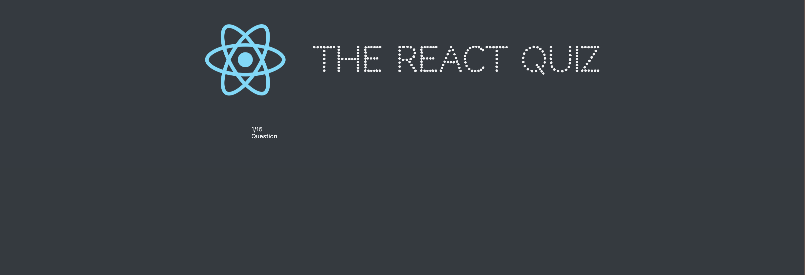

#### 190.2.2 Create `Main` component:

**Subsection Summary**
- **Purpose**: Extracts the main content area into a dedicated reusable component that accepts `children`.
- **Key Pattern**: The `Main` component uses the **`children` prop** — a core React composition pattern. Instead of hardcoding content, it renders whatever JSX is passed between its opening and closing tags.
- **Implementation**: A simple functional component that wraps `{children}` inside a `<div className="main">`.
- **File**: Created as `src/components/Main.jsx`.

```jsx
/* src/components/Main.jsx */
const Main = ({ children }) => {
  return (
    <div className="main">
      {children}    {/* 👈🏽 ✅ */}
    </div>
  )
}
export default Main
```

#### 190.2.3 Import `Main` component to `App`:

**Subsection Summary**
- **Purpose**: Integrates the newly created `Main` component into `App.jsx`, replacing the inline `<main>` element.
- **Key Changes**: (1) Import `Main` from `./components/Main`. (2) Replace the `<main className="main">` element with `<Main>`, passing the placeholder `<p>` tags as children.
- **Result**: The UI looks identical, but the markup is now properly componentized. The React DevTools screenshot confirms the component tree: `App` → `Header` + `Main`.
- **Screenshot**: Shows the same UI as before, but with the React DevTools open on the right, displaying the component hierarchy: `App` containing `Header` and `Main`.

```jsx
/* src/App.jsx */
//import DateCounter from './components/DateCounter'
import Header from './components/Header'
import Main from './components/Main'    // 👈🏽 ✅
function App() {

  return (
    <div className="app">
      {/* <DateCounter /> */}
      <Header />
      <Main>    {/* 👈🏽 ✅ */}
        <p>1/15</p>
        <p>Question</p>
      </Main>
    </div>
  )
}

export default App
```

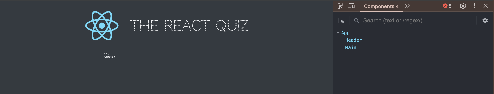

### 🐞 190.3 Issues:

- The `Main` component uses a `<div className="main">` instead of a semantic `<main>` HTML element, which reduces accessibility and semantic meaning.
- The `Header` component does not include `alt` text that describes the app context (current `alt="React logo"` is generic).
- The `Error` component (`src/components/Error.jsx:3`) contains a typo: `"fecthing"` should be `"fetching"`.
- Placeholder content (`<p>1/15</p>` and `<p>Question</p>`) is hardcoded in `App.jsx` — this is expected at this stage but will need dynamic replacement.

| Issue | Status | Log/Error |
|---|---|---|
| `Main` uses `<div>` instead of semantic `<main>` | ℹ️ Low Priority | `src/components/Main.jsx:3` — A `<main>` HTML element would improve accessibility and semantics. |
| Typo in `Error` component: `"fecthing"` | ⚠️ Identified | `src/components/Error.jsx:3` — `"There was an error fecthing questions."` should be `"fetching"`. |
| Placeholder content hardcoded in `App.jsx` | ℹ️ Informational | `src/App.jsx:11-12` — `<p>1/15</p>` and `<p>Question</p>` are temporary scaffolding; will be replaced in later lessons. |

### 🧱 190.4 Pending Fixes (TODO)

- [ ] Consider changing `<div className="main">` to `<main className="main">` in `src/components/Main.jsx:3` for semantic HTML.
- [ ] Fix typo `"fecthing"` → `"fetching"` in `src/components/Error.jsx:3`.
- [ ] Add `aria-label` attributes to the `Header` component's `<header>` element for improved accessibility (`src/components/Header.jsx:3`).
- [ ] Remove commented-out `DateCounter` import and JSX in `src/App.jsx:1,8` once no longer needed for reference.
- [ ] Replace placeholder `<p>` tags in `App.jsx` with dynamic quiz components in upcoming lessons.

[↑ top - 190. Lesson 190 — *The "React Quiz" App*](#190-lesson-190-the-react-quiz-app)


<br>

## 🔧 191. Lesson 191 — *Loading Questions from a Fake API*

[🧳 Section 16: *The Advanced useReducer Hook*](#section-16-the-advanced-usereducer-hook)

### 📑 Table of Contents:
- [191. Lesson 191 — *Loading Questions from a Fake API*](#191-lesson-191-loading-questions-from-a-fake-api)
- [191.1 Context](#1911-context)
- [191.2 Updating code according the context](#1912-updating-codetheory-according-the-context)
  - [191.2.01 Create `Data` folder then put inside the `questions.json` file](#191201-create-data-folder-then-put-inside-the-questionsjson-file)
  - [191.2.02 Create a fake-api installing `json-server`](#191202-create-a-fake-api-installing-json-server)
  - [191.2.03 Add a new npm script for running the `data/questions.json` file](#191203-add-a-new-npm-script-for-running-the-dataquestionsjson-file)
  - [191.2.04 Run from terminal](#191204-run-from-terminal)
  - [191.2.05 Merging `npm run dev` with `npm run server`](#191205-merging-npm-run-dev-with-npm-run-server)
  - [191.2.06 Another merging option without installing anything previously](#191206-another-merging-option-npm-run-dev-with-npm-run-server-without-installing-anything-previously)
  - [191.2.07 Add `useEffect` hook for reading the json-server (`fake-api`) server](#191207-add-useeffect-hook-for-reading-the-json-server-fake-api-server)
  - [191.2.08 Adding `useReducer` with `initialState` and dealing with different `status` definition](#191208-adding-usereducer-with-initialstate-and-dealing-with-different-status-definition)
  - [191.2.09 Once data has been received, it triggers `dispatch({ type: "dataReceived" })`](#191209-once-data-has-been-received-it-triggers-the-dispatch-type-datareceived-payload)
  - [191.2.10 Once data failed, it triggers `dispatch({ type: "dataFailed" })`](#191210-once-data-failed-it-triggers-the-dispatch-type-datafailed)
  - [191.2.11 State Diagram](#191211-state-diagram)
- [191.3 Issues](#1913-issues)
- [191.4 Pending Fixes (TODO)](#1914-pending-fixes-todo)

### 🧠 191.1 Context:

This lesson transitions the React Quiz app from a static UI scaffold (Lesson 190) to a **data-driven application** by introducing a **fake REST API** powered by `json-server` and loading quiz questions into component state via `useEffect` and `useReducer`. The combination of these two hooks establishes a robust pattern for managing asynchronous data fetching alongside complex, multi-status application state.

**Key Concepts:**

1. **Fake API with `json-server`**: A lightweight npm package that turns a `.json` file into a fully-functional REST API with endpoints derived from the JSON's top-level keys (e.g., `data/questions.json` → `GET /questions`). This is ideal for prototyping and front-end development without building a real backend.
2. **`useEffect` for data fetching on mount**: The `useEffect` hook with an empty dependency array (`[]`) fires once after the initial render — the standard pattern for fetching data when a component mounts.
3. **`useReducer` for multi-status state**: Instead of managing multiple boolean flags (`isLoading`, `isError`, `isReady`, etc.) with separate `useState` calls, a single `status` string (`"loading"`, `"error"`, `"ready"`, `"active"`, `"finished"`) inside the reducer state keeps the application status deterministic and mutually exclusive.
4. **Dispatch-driven data flow**: The `fetch` promise chain dispatches actions (`"dataReceived"`, `"dataFailed"`) to the reducer, which processes them through a `switch` statement and returns the next state object. The component never directly sets state — it only describes *what happened*.
5. **Parallel dev scripts with `concurrently`**: Both the Vite dev server and `json-server` need to run simultaneously. The `concurrently` package (or `npm-run-all`) allows running multiple npm scripts in parallel from a single command.

**Advantages:**
- `json-server` requires zero backend code — just a JSON file and an npm script.
- Using a single `status` field eliminates impossible state combinations (e.g., `isLoading === true` and `isReady === true` simultaneously).
- The reducer centralizes all state transitions, making the data-fetching lifecycle explicit and predictable.
- The `concurrently` setup lets developers start the entire dev environment with one command (`npm run dev`).
- The promise-based `fetch` chain cleanly separates success (`dataReceived`) from failure (`dataFailed`) paths.

**Disadvantages / Gotchas:**
- `json-server` is **not** a production solution — it is meant exclusively for development and prototyping.
- The `fetch` API does **not** throw on HTTP error status codes (e.g., 404, 500). Only network failures trigger the `.catch()`. Proper production code should check `response.ok`.
- The `error` variable in the `.catch()` handler is currently unused — it is not logged or stored in state, making debugging harder.
- The `concurrently` package is an additional dev dependency. The `npm-run-all` alternative works without installation only if already globally available.
- String-based status values (`"loading"`, `"error"`, etc.) are prone to typos. Consider using constants or an enum-like object.

**When to Consider Alternatives:**
- For production data fetching, use dedicated libraries like **React Query (TanStack Query)** or **SWR** that handle caching, retries, deduplication, and loading/error states automatically.
- If the API grows complex, replace `json-server` with a real backend (Express, Fastify) or a BaaS (Firebase, Supabase).
- For apps needing SSR or ISR, **Next.js** data-fetching methods (`getServerSideProps`, `getStaticProps`, Server Components) are more appropriate than client-side `useEffect` fetching.
- If only one piece of state exists (e.g., just `questions`), `useState` with separate `isLoading`/`isError` flags may be simpler than a full reducer.

### ⚙️ 191.2 Updating code/theory according the context:

#### **Summary**
- **Purpose**: Set up a fake REST API with `json-server`, configure parallel npm scripts, and implement data fetching in `App.jsx` using `useEffect` combined with `useReducer` to manage the application's loading lifecycle.
- **Problem**: The quiz app has a static UI with hardcoded placeholder content. It needs to load real question data from an external source and manage the loading/error/ready states.
- **Connection**: The subsections progressively build the data layer:
    1. Create the `data/questions.json` file with 15 quiz questions (191.2.01).
    2. Install `json-server` as a dependency (191.2.02).
    3. Add a `"server"` npm script to serve the JSON file on port 8000 (191.2.03).
    4. Verify the server runs and serves data at `http://localhost:8000/questions` (191.2.04).
    5. Configure `concurrently` to run both Vite and `json-server` in parallel (191.2.05).
    6. Show an alternative using `npm-run-all` (191.2.06).
    7. Add `useEffect` with `fetch` to load questions on mount (191.2.07).
    8. Introduce `useReducer` with `initialState` and a `status` field to replace multiple boolean flags (191.2.08).
    9. Wire up `dispatch({ type: "dataReceived" })` on successful fetch (191.2.09).
    10. Wire up `dispatch({ type: "dataFailed" })` on failed fetch (191.2.10).
    11. Visualize the state transitions with a Mermaid state diagram (191.2.11).

#### 191.2.01 Create `Data` folder then put inside the `questions.json` file:

**Subsection Summary**
- **Purpose**: Provides the raw data source for the quiz — 15 React-related questions, each with 4 options, a `correctOption` index, and a `points` value.
- **Key Detail**: The top-level key `"questions"` becomes the REST endpoint name when served by `json-server` (i.e., `GET /questions`).
- **Data structure**: Each question object contains `question` (string), `options` (array of 4 strings), `correctOption` (0-based index), and `points` (10, 20, or 30 depending on difficulty).

```jsx
/* data/questions.json */
{
  "questions": [
    {
      "question": "Which is the most popular JavaScript framework?",
      "options": ["Angular", "React", "Svelte", "Vue"],
      "correctOption": 1,
      "points": 10
    },
    {
      "question": "Which company invented React?",
      "options": ["Google", "Apple", "Netflix", "Facebook"],
      "correctOption": 3,
      "points": 10
    },
    {
      "question": "What's the fundamental building block of React apps?",
      "options": ["Components", "Blocks", "Elements", "Effects"],
      "correctOption": 0,
      "points": 10
    },
    {
      "question": "What's the name of the syntax we use to describe the UI in React components?",
      "options": ["FBJ", "Babel", "JSX", "ES2015"],
      "correctOption": 2,
      "points": 10
    },
    {
      "question": "How does data flow naturally in React apps?",
      "options": [
        "From parents to children",
        "From children to parents",
        "Both ways",
        "The developers decides"
      ],
      "correctOption": 0,
      "points": 10
    },
    {
      "question": "How to pass data into a child component?",
      "options": ["State", "Props", "PropTypes", "Parameters"],
      "correctOption": 1,
      "points": 10
    },
    {
      "question": "When to use derived state?",
      "options": [
        "Whenever the state should not trigger a re-render",
        "Whenever the state can be synchronized with an effect",
        "Whenever the state should be accessible to all components",
        "Whenever the state can be computed from another state variable"
      ],
      "correctOption": 3,
      "points": 30
    },
    {
      "question": "What triggers a UI re-render in React?",
      "options": [
        "Running an effect",
        "Passing props",
        "Updating state",
        "Adding event listeners to DOM elements"
      ],
      "correctOption": 2,
      "points": 20
    },
    {
      "question": "When do we directly \"touch\" the DOM in React?",
      "options": [
        "When we need to listen to an event",
        "When we need to change the UI",
        "When we need to add styles",
        "Almost never"
      ],
      "correctOption": 3,
      "points": 20
    },
    {
      "question": "In what situation do we use a callback to update state?",
      "options": [
        "When updating the state will be slow",
        "When the updated state is very data-intensive",
        "When the state update should happen faster",
        "When the new state depends on the previous state"
      ],
      "correctOption": 3,
      "points": 30
    },
    {
      "question": "If we pass a function to useState, when will that function be called?",
      "options": [
        "On each re-render",
        "Each time we update the state",
        "Only on the initial render",
        "The first time we update the state"
      ],
      "correctOption": 2,
      "points": 30
    },
    {
      "question": "Which hook to use for an API request on the component's initial render?",
      "options": ["useState", "useEffect", "useRef", "useReducer"],
      "correctOption": 1,
      "points": 10
    },
    {
      "question": "Which variables should go into the useEffect dependency array?",
      "options": [
        "Usually none",
        "All our state variables",
        "All state and props referenced in the effect",
        "All variables needed for clean up"
      ],
      "correctOption": 2,
      "points": 30
    },
    {
      "question": "An effect will always run on the initial render.",
      "options": [
        "True",
        "It depends on the dependency array",
        "False",
        "In depends on the code in the effect"
      ],
      "correctOption": 0,
      "points": 30
    },
    {
      "question": "When will an effect run if it doesn't have a dependency array?",
      "options": [
        "Only when the component mounts",
        "Only when the component unmounts",
        "The first time the component re-renders",
        "Each time the component is re-rendered"
      ],
      "correctOption": 3,
      "points": 20
    }
  ]
}
```

#### 191.2.02 Create a fake-api installing `json-server`:

**Subsection Summary**
- **Purpose**: Installs `json-server` as a project dependency so the JSON file can be served as a REST API during development.
- **Key Detail**: `json-server` watches a JSON file and exposes its top-level keys as RESTful endpoints with full CRUD support (GET, POST, PUT, PATCH, DELETE).

```bash
npm i json-server
```

#### 191.2.03 Add a new npm script for running the `data/questions.json` file:

**Subsection Summary**
- **Purpose**: Adds a `"server"` script to `package.json` that starts `json-server` watching the questions file on port 8000.
- **Key Detail**: The `--watch` flag enables live-reloading when the JSON file changes. The `--port 8000` flag avoids conflicting with Vite's default port (5173).
- **Result**: Running `npm run server` starts the API at `http://localhost:8000/questions`.

```jsx
/* package.json */
{
  "name": "16-react-quiz",
  "private": true,
  "version": "0.0.0",
  "type": "module",
  "scripts": {
    "dev": "vite",
    "build": "vite build",
    "lint": "eslint .",
    "preview": "vite preview",
    "server": "json-server --watch data/questions.json --port 8000"   // 👈🏽 ✅
  },
  "dependencies": {
    "json-server": "^1.0.0-beta.5",
    "react": "^19.2.0",
    "react-dom": "^19.2.0"
  },
  "devDependencies": {
    "@eslint/js": "^9.39.1",
    "@types/react": "^19.2.7",
    "@types/react-dom": "^19.2.3",
    "@vitejs/plugin-react": "^5.1.1",
    "eslint": "^9.39.1",
    "eslint-plugin-react-hooks": "^7.0.1",
    "eslint-plugin-react-refresh": "^0.4.24",
    "globals": "^16.5.0",
    "vite": "^7.3.1"
  }
}
```

#### 191.2.04 Run from terminal:

**Subsection Summary**
- **Purpose**: Demonstrates how to start the fake API server and verify it works by visiting the endpoint in a browser.
- **Key Detail**: The endpoint is derived from the JSON top-level key — `"questions"` maps to `/questions`. Navigating to a non-existent endpoint (e.g., `/questionsss`) returns an empty response, highlighting the importance of matching the exact key name.
- **Screenshot**: Shows the endpoint mismatch warning when using an incorrect URL.

```bash
npm run server
```

* Verifying this server is running:

  [👉🏽 click here](http://localhost:8000/questions)

* Watch out this endpoint part:

  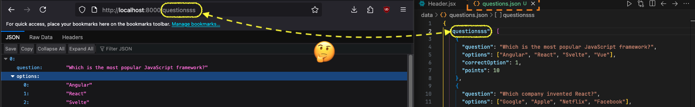

  [endpoint modified](http://localhost:8000/questionsss)

#### 191.2.05 Merging `npm run dev` with `npm run server`:

**Subsection Summary**
- **Purpose**: Configures a single `npm run dev` command to start **both** the Vite dev server and `json-server` simultaneously using the `concurrently` package.
- **Key Changes**: (1) Install `concurrently` as a dev dependency. (2) Rename the original `"dev"` script to `"dev:vite"`. (3) Create a new `"dev"` script that uses `concurrently` to run both `"dev:vite"` and `"server"` in parallel.
- **Result**: One terminal command starts the entire development environment.
- **Screenshot**: Shows terminal output with both Vite and `json-server` running concurrently, each prefixed with its process identifier.

1. Install `concurrenctly`
```bash
npm install --save-dev concurrently
```

2. Open `package.json` and modify:
```json
{
  "name": "16-react-quiz",
  "private": true,
  "version": "0.0.0",
  "type": "module",
  "scripts": {
    "dev": "concurrently \"npm run dev:vite\" \"npm run server\"",    // 👈🏽 ✅
    "dev:vite": "vite",   // 👈🏽 ✅
    "build": "vite build",
    "lint": "eslint .",
    "preview": "vite preview",
    "server": "json-server --watch data/questions.json --port 8000"   // 👈🏽
  },
  "dependencies": {
    "json-server": "^1.0.0-beta.5",
    "react": "^19.2.0",
    "react-dom": "^19.2.0"
  },
  "devDependencies": {
    "@eslint/js": "^9.39.1",
    "@types/react": "^19.2.7",
    "@types/react-dom": "^19.2.3",
    "@vitejs/plugin-react": "^5.1.1",
    "concurrently": "^9.2.1",
    "eslint": "^9.39.1",
    "eslint-plugin-react-hooks": "^7.0.1",
    "eslint-plugin-react-refresh": "^0.4.24",
    "globals": "^16.5.0",
    "vite": "^7.3.1"
  }
}
```

3. Execute:
```bash
npm run dev
```

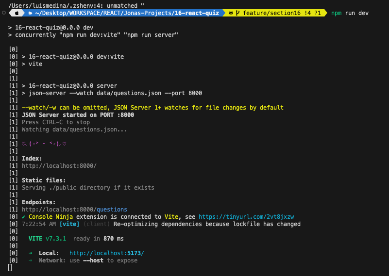


#### 191.2.06 Another merging option `npm run dev` with `npm run server` without installing anything previously:

**Subsection Summary**
- **Purpose**: Presents an alternative to `concurrently` using `npm-run-all --parallel`, which may already be available globally or as a transitive dependency.
- **Key Detail**: The `--parallel` flag in `npm-run-all` achieves the same result — running `dev:vite` and `server` simultaneously. This avoids adding an extra dev dependency.
- **Trade-off**: If `npm-run-all` is not installed globally or as a dependency, this approach will fail silently.

```json
"scripts": {
  "dev": "npm-run-all --parallel dev:vite server",                    // 👈🏽 ✅
  "dev:vite": "vite",                                                 // 👈🏽 ✅
  "build": "vite build",
  "lint": "eslint .",
  "preview": "vite preview",
  "server": "json-server --watch data/questions.json --port 8000"     // 👈🏽 ✅
}
```

1. Execute from terminal:

```bash
npm run dev
```

#### 191.2.07 Add `useEffect` hook for reading the json-server (`fake-api`) server:

**Subsection Summary**
- **Purpose**: Implements the initial data-fetching logic in `App.jsx` using `useEffect` with `fetch`.
- **Key Changes**: (1) Import `useEffect` from React. (2) Add a `useEffect` with an empty dependency array (`[]`) to fetch from `http://localhost:8000/questions` on mount. (3) Chain `.then()` to parse JSON and log the data, and `.catch()` to log errors.
- **Alternative shown**: An `async`/`await` version with a `try`/`catch` block is also presented, which includes `response.ok` validation — a more robust approach for production.
- **Screenshot**: Shows the browser console with the fetched questions array alongside the running app.

```jsx
/* src/App.jsx */
import Header from './components/Header'
import Main from './components/Main'
import { useEffect } from 'react'

function App() {

  useEffect( () => {
    fetch('http://localhost:8000/questions')
      .then((resp) => resp.json())
      .then((data) => console.log(data))
      .catch((error) => console.error("Error", error))
  }, [])
  return (
    <div className="app">
      <Header />
      <Main>
        <p>1/15</p>
        <p>Question</p>
      </Main>
    </div>
  )
}
export default App
```

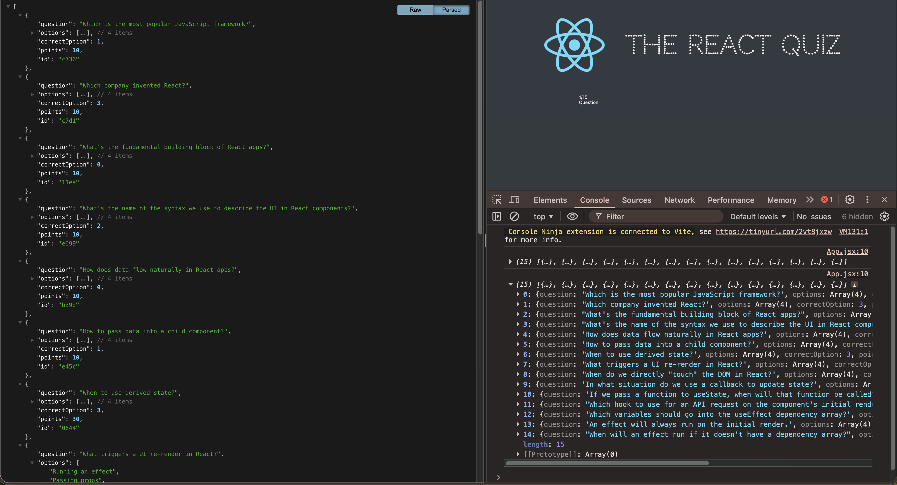

Another option using `async-await` with `try-catch` block:
```jsx
useEffect(() => {
  const fetchQuestions = async () => {
    try {
      const response = await fetch('http://localhost:8000/questions');
      
      if (!response) {
        throw new Error("No server reesponse");
      }

      if (!response.ok) {
        throw new Error(`HTTP ${response.status} - ${response.statusText}`);
      }

      const data = await response.json();
      console.log(data);
    } catch (error) {
      console.error("Error al cargar las preguntas:", error);
    }
  };
  fetchQuestions();
}, []);
```

#### 191.2.08 Adding `useReducer` with `initialState` and dealing with different `status` definition:

**Subsection Summary**
- **Purpose**: Introduces `useReducer` into `App.jsx` to manage the application's lifecycle state, replacing the need for multiple boolean `useState` flags.
- **Key Changes**: (1) Import `useReducer` alongside `useEffect`. (2) Define an `initialState` object with `questions: []` and `status: "loading"`. (3) Create an empty `reducer` function (placeholder). (4) Call `useReducer(reducer, initialState)` to get `[state, dispatch]`.
- **Key Concept**: The `status` field is a **finite state machine** — the app can only be in one of five states at any time: `"loading"`, `"error"`, `"ready"`, `"active"`, or `"finished"`. This eliminates impossible combinations that arise from multiple independent booleans.

```jsx
/* src/App.jsx */
import Header from './components/Header'
import Main from './components/Main'
import { useEffect, useReducer } from 'react'                           // 👈🏽 ✅ (1)
const initialState = {                                                  // 👈🏽 ✅ (2)
  questions: [],
  status: "loading", // 'loading' 'error', 'ready', 'active', 'finished'
};
const reducer = (state, action) => {}                                   // 👈🏽 ✅ (2)
function App() {
  const [state, dispatch] = useReducer(reducer, initialState);          // 👈🏽 ✅ (1)
  useEffect( () => {
    fetch('http://localhost:8000/questions')
      .then((resp) => resp.json())
      .then((data) => console.log(data))
      .catch((error) => console.error("Error", error))
  }, [])
  return (
    <div className="app">
      <Header />
      <Main>
        <p>1/15</p>
        <p>Question</p>
      </Main>
    </div>
  )
}
export default App;
```

> Status: 

current application status 

instead of working with `isLoading`, `isError`, `isReady`, `isActive` and `isFinished` using `useState`.

* `loading`: at the beginning of the application and `questions` array is empty.
* `error`: when any error appears.
* `ready`: once data has arrived and be ready to start the quiz.
* `active`: when quiz is actually running.
* `finished`: once quiz is finished.

#### 191.2.09 Once data has been received, it triggers the `dispatch({ type: "dataReceived", payload: ???})`:

**Subsection Summary**
- **Purpose**: Implements the `"dataReceived"` action in the reducer and wires the `fetch` success path to dispatch it with the fetched data as the payload.
- **Key Changes**: (1) Add a `switch(action.type)` in the reducer. (2) Add a `"dataReceived"` case that updates `questions` to `action.payload` and `status` to `"ready"`. (3) Replace `console.log(data)` in the `.then()` chain with `dispatch({ type: "dataReceived", payload: data })`. (4) Add a `default` case that throws an error for unknown actions.
- **Result**: On successful fetch, state transitions from `{ questions: [], status: "loading" }` to `{ questions: [...15 items], status: "ready" }`.
- **Screenshot**: Shows React DevTools with the state containing 15 questions and `status: "ready"`.

Focus on different process:
* different status: `loading`, `error`, `ready`, `active` and `finished`
* related to data: `dataReceived` so far.
* questions array which changes right after the `dataReceived`.

```jsx
/* src/App.jsx */
import Header from './components/Header'
import Main from './components/Main'
import { useEffect, useReducer } from 'react'

const initialState = {
  questions: [],
  status: "loading", // 'loading' 'error', 'ready', 'active', 'finished'
};

const reducer = (state, action) => {
  switch(action.type) {                                                           // 👈🏽 ✅ (1)
    case "dataReceived":                                                          // 👈🏽 ✅ (2)
      return {
        ...state,
        questions: action.payload,                                                // 👈🏽 ✅ (3)
        status: "ready",                                                          // 👈🏽 ✅ (3)
      }
    default:
      throw new Error("Action Unknown!")                                          // 👈🏽 ✅ (4)
  }
}

function App() {
  const [state, dispatch] = useReducer(reducer, initialState);
  useEffect( () => {
    fetch('http://localhost:8000/questions')
      .then((resp) => resp.json())
      .then((data) => dispatch({ type: "dataReceived", payload: data }))          {/* 👈🏽 ✅ (2) */}
      .catch((error) => console.error("Error", error))
  }, [])
  return (
    <div className="app">
      <Header />
      <Main>
        <p>1/15</p>
        <p>Question</p>
      </Main>
    </div>
  )
}

export default App;
```

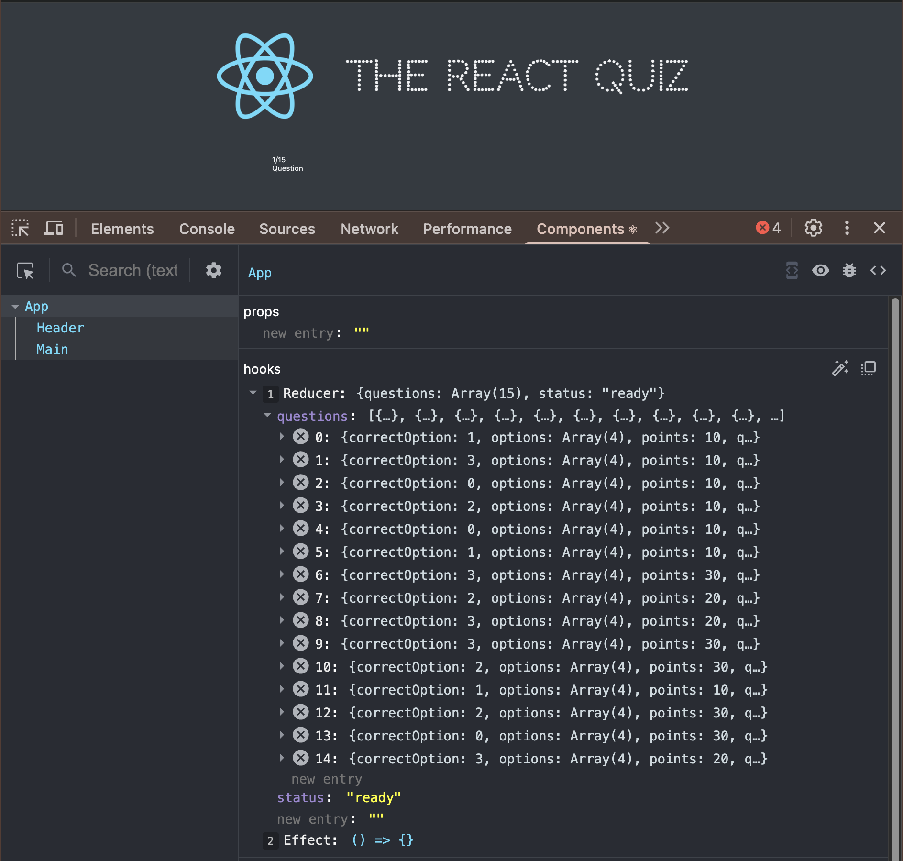

#### 191.2.10 Once data failed, it triggers the `dispatch({ type: "dataFailed" })`:

**Subsection Summary**
- **Purpose**: Implements the `"dataFailed"` action in the reducer and replaces the `console.error` in the `.catch()` with a dispatch call.
- **Key Changes**: (1) Add a `"dataFailed"` case in the reducer that sets `status` to `"error"` while preserving the rest of the state. (2) Replace `console.error("Error", error)` in the `.catch()` with `dispatch({ type: "dataFailed" })`.
- **Testing**: To simulate the error, stop the `json-server` process and run only `npm run dev:vite`. The `fetch` fails because the API is unreachable, triggering the `.catch()`.
- **Result**: State transitions to `{ questions: [], status: "error" }`.
- **Screenshot**: Shows React DevTools with `questions: []` and `status: "error"` when the server is down.

In order to simulate this situation, quit the process from terminal.
* run from terminal: `npm run dev:vite`
* go to the application: `http://localhost:5173/`
* open devtools then go to `Components*`

```jsx
/* src/App.jsx */
import Header from './components/Header'
import Main from './components/Main'
import { useEffect, useReducer } from 'react'

const initialState = {
  questions: [],
  status: "loading", // 'loading' 'error', 'ready', 'active', 'finished'
};

const reducer = (state, action) => {
  switch(action.type) {
    case "dataReceived":
      return {
        ...state,
        questions: action.payload,
        status: "ready",
      }

    case "dataFailed":                                                    // 👈🏽 ✅ (1)
      return {
        ...state,
        status: "error",                                                  // 👈🏽 ✅ (2)
      }  
    default:
      throw new Error("Action Unknown!")
  }
}

function App() {
  const [state, dispatch] = useReducer(reducer, initialState);
  useEffect( () => {
    fetch('http://localhost:8000/questions')
      .then((resp) => resp.json())
      .then((data) => dispatch({ type: "dataReceived", payload: data }))
      .catch((error) => dispatch({ type: "dataFailed" }))                   {/* 👈🏽 ✅ (1) */}
  }, [])
  return (
    <div className="app">
      <Header />
      <Main>
        <p>1/15</p>
        <p>Question</p>
      </Main>
    </div>
  )
}

export default App;
```

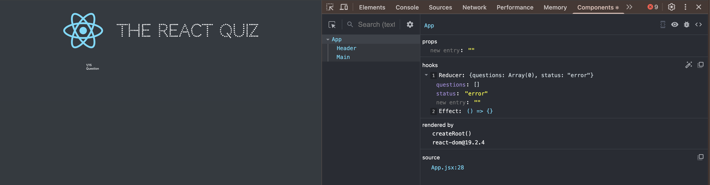

#### 191.2.11 State Diagram:

**Subsection Summary**
- **Purpose**: Provides a visual representation of the application's state machine as implemented so far.
- **Key Detail**: The diagram shows three states (`Loading`, `Ready`, `Error`) and two transitions (`dataReceived`, `dataFailed`). A `retry` transition from `Error` back to `Loading` is shown as a future possibility but is not yet implemented in code.
- **Pattern**: This is effectively a **finite state machine** — the app is always in exactly one state, and transitions are triggered exclusively by dispatched actions.

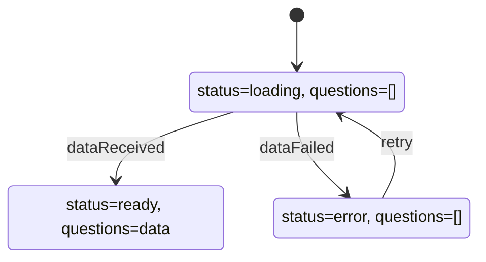
```mermaid
stateDiagram-v2
    [*] --> Loading
    Loading: status=loading, questions=[]
    Loading --> Ready: dataReceived
    Ready: status=ready, questions=data
    Loading --> Error: dataFailed
    Error: status=error, questions=[]
    Error --> Loading: retry
```

### 🐞 191.3 Issues:
| Issue | Status | Log/Error |
|---|---|---|
| `fetch` does not reject on HTTP errors (4xx/5xx) | ⚠️ Identified | `src/App.jsx:32-35` — A 404 response from `json-server` would pass through `.then()` without triggering `.catch()`. Should check `response.ok` before parsing JSON. |
| Error object discarded in `.catch()` | ⚠️ Identified | `src/App.jsx:35` — `dispatch({ type: "dataFailed" })` ignores the `error` parameter. No error details stored in state for debugging or user display. |
| `state` not consumed in JSX | ℹ️ Informational | `src/App.jsx:37-44` — `state.questions` and `state.status` are managed by the reducer but the UI still renders hardcoded placeholder text. Expected to be addressed in the next lesson. |
| Typo `"reesponse"` in async/await example | ℹ️ Low Priority | 191.2.07 alternative code block — `"No server reesponse"` should be `"No server response"`. |
| `Loader`/`Error` components not rendered conditionally | ℹ️ Informational | `src/components/Loader.jsx`, `src/components/Error.jsx` — These components exist but are not yet imported or used in `App.jsx`. Expected in a future lesson. |
| Typo `"fecthing"` in `Error` component | ⚠️ Identified (from Lesson 190) | `src/components/Error.jsx:4` — `"There was an error fecthing questions."` should be `"fetching"`. |
| Typo `"concurrenctly"` in docs | ℹ️ Low Priority | 191.2.05 instruction text — `"Install concurrenctly"` should be `"Install concurrently"`. |

### 🧱 191.4 Pending Fixes (TODO)

- [ ] Add `response.ok` validation in the `fetch` chain before calling `resp.json()` to properly handle HTTP error status codes (`src/App.jsx:32-33`).
- [ ] Pass the `error` object as a payload in the `"dataFailed"` dispatch: `dispatch({ type: "dataFailed", payload: error.message })` and store it in state for user-facing error messages (`src/App.jsx:35`).
- [ ] Destructure `state` into `{ questions, status }` in `App.jsx` and conditionally render the `Loader` component (when `status === "loading"`) and the `Error` component (when `status === "error"`) inside `<Main>` (`src/App.jsx:30,37-44`).
- [ ] Fix typo `"fecthing"` → `"fetching"` in `src/components/Error.jsx:4`.
- [ ] Fix typo `"reesponse"` → `"response"` in the async/await alternative code example (191.2.07 documentation).
- [ ] Fix typo `"concurrenctly"` → `"concurrently"` in the 191.2.05 instruction text (documentation).
- [ ] Consider defining status constants (e.g., `const STATUS = { LOADING: "loading", ERROR: "error", READY: "ready", ACTIVE: "active", FINISHED: "finished" }`) to avoid typo-prone string literals in the reducer and conditional rendering (`src/App.jsx`).
- [ ] Consider adding an `AbortController` to the `useEffect` fetch to properly cancel the request if the component unmounts before the response arrives (`src/App.jsx:31-36`).

[↑ top - 191. Lesson 191 — *Loading Questions from a Fake API*](#191-lesson-191-loading-questions-from-a-fake-api)

<br>

## 🔧 192. Lesson 192 — *Handling Loading, Error, and Ready Status*

[🧳 Section 16: *The Advanced useReducer Hook*](#section-16-the-advanced-usereducer-hook)

### 📑 Table of Contents:
- [192. Lesson 192 — *Handling Loading, Error, and Ready Status*](#192-lesson-192-handling-loading-error-and-ready-status)
- [192.1 Context](#1921-context)
- [192.2 Updating code according the context](#1922-updating-codetheory-according-the-context)
  - [192.2.1 Destructure `state` inline and conditionally render `<Loader />` for `loading` status](#19221-destructure-state-inline-and-conditionally-render-loader-for-loading-status)
  - [192.2.2 Import and conditionally render `<Error />` for `error` status](#19222-import-and-conditionally-render-error-for-error-status)
  - [192.2.3 Create the `StartScreen` component](#19223-create-the-startscreen-component)
  - [192.2.4 Import and conditionally render `<StartScreen />` for `ready` status](#19224-import-and-conditionally-render-startscreen-for-ready-status)
  - [192.2.5 Pass `numQuestions` prop to `StartScreen` and display the question count](#19225-pass-numquestions-prop-to-startscreen-and-display-the-question-count)
- [192.3 Issues](#1923-issues)
- [192.4 Pending Fixes (TODO)](#1924-pending-fixes-todo)

### 🧠 192.1 Context:

This lesson builds directly on Lesson 191, where `useReducer` was introduced into `App.jsx` with an `initialState` containing `questions` and `status`, and two reducer cases (`"dataReceived"` and `"dataFailed"`) were wired to the `fetch` promise chain. At the end of that lesson, the state was being correctly managed behind the scenes, but the UI still rendered hardcoded placeholder text regardless of the application status. This lesson bridges the gap between **state management** and **conditional UI rendering**.

**Key Concepts:**

1. **Inline state destructuring**: Instead of `const [state, dispatch] = useReducer(...)` followed by a separate `const { questions, status } = state`, both are combined in one line: `const [{ questions, status }, dispatch] = useReducer(...)`. This is a common pattern that reduces boilerplate when you know which properties you need.
2. **Status-based conditional rendering**: The `status` field from the reducer acts as a **finite state machine**. Each possible status value (`"loading"`, `"error"`, `"ready"`) maps to a specific UI component (`<Loader />`, `<Error />`, `<StartScreen />`). The pattern `{status === "x" && <Component />}` ensures exactly one component renders at a time — the statuses are mutually exclusive.
3. **Component composition with props**: The `StartScreen` component receives `numQuestions` (derived from `questions.length`) as a prop, connecting the reducer-managed data to the UI. This is the standard one-way data flow: parent owns the state, child receives what it needs via props.
4. **Derived state**: `numQuestions` is computed from `questions.length` inside `App` — it is not stored in the reducer. This follows the principle that values computable from existing state should not be duplicated in state.
5. **Progressive UI assembly**: The lesson incrementally adds components to the JSX tree — first `<Loader />`, then `<Error />`, then `<StartScreen />` — demonstrating a step-by-step approach to building conditional UIs.

**Advantages:**
- A single `status` string eliminates impossible state combinations (e.g., loading and error at the same time).
- Each status maps to exactly one UI branch, making the component predictable and easy to debug.
- The `<Main>` wrapper component cleanly contains all conditional content via `children`, keeping `App` structured.
- Derived values like `numQuestions` avoid redundant state and stay automatically in sync with the source data.

**Disadvantages / Gotchas:**
- The `&&` short-circuit pattern silently renders nothing when the condition is `false`, which can be confusing for beginners. An alternative is a `switch` statement or a lookup object.
- If additional statuses are added later (`"active"`, `"finished"`), the JSX block grows with more `&&` lines. A helper function or component map could improve scalability.
- The `error` parameter in `.catch()` is still discarded — no error message is shown to the user or stored in state.
- String-based status comparisons are typo-prone. A constants object or TypeScript enum would add safety.

**When to Consider Alternatives:**
- For complex multi-status UIs with nested conditions, consider a **render map** pattern: `const SCREENS = { loading: <Loader />, error: <Error />, ready: <StartScreen /> }` → `{SCREENS[status]}`.
- If the number of screens grows significantly, a **routing-based** approach (React Router) may be cleaner than inline conditional rendering.
- For server-rendered apps, loading states are often handled at the framework level (e.g., Next.js `loading.tsx` or Suspense boundaries).

### ⚙️ 192.2 Updating code/theory according the context:

#### **Summary**
- **Purpose**: Connect the `useReducer` state (`status`, `questions`) to the UI by conditionally rendering the `Loader`, `Error`, and `StartScreen` components based on the current application status.
- **Problem**: In Lesson 191, the reducer was managing state transitions correctly (`"loading"` → `"ready"` or `"error"`), but the UI ignored these transitions and rendered hardcoded placeholder text.
- **Connection**: The subsections progressively build the conditional UI:
    1. Destructure state inline and render `<Loader />` when `status === "loading"` (192.2.1).
    2. Import and render `<Error />` when `status === "error"` (192.2.2).
    3. Create the `StartScreen` component with a placeholder question count (192.2.3).
    4. Import and render `<StartScreen />` when `status === "ready"`, restructuring `<Header />` inside `<Main>` (192.2.4).
    5. Derive `numQuestions` from `questions.length` and pass it as a prop to `StartScreen`, which displays the dynamic count (192.2.5).

#### 192.2.1 Destructure `state` inline and conditionally render `<Loader />` for `loading` status:

**Subsection Summary**
- **Purpose**: Replaces the separate `state` variable with inline destructuring and renders the `<Loader />` component when the application is in the `"loading"` status.
- **Key Changes**: (1) Import `Loader` from `./components/Loader`. (2) Replace `const [state, dispatch]` with `const [{ questions, status }, dispatch]` — inline destructuring. (3) Use `{status === "loading" && <Loader />}` inside `<Main>` to conditionally render the loading spinner.
- **Result**: When the app starts, the `status` is `"loading"` (from `initialState`), so the `<Loader />` component renders immediately. Once `"dataReceived"` fires, `status` changes to `"ready"` and the loader disappears.
- **Screenshot**: Shows the app with the header and the CSS-animated loading dots rendered below it.

```jsx
/* src/App.jsx */
import Header from "./components/Header";
import Main from "./components/Main";
import { useEffect, useReducer } from "react";
import Loader from "./components/Loader";   // 👈🏽 ✅ (1)
const initialState = {
  questions: [],
  status: "loading", // 'loading' 'error', 'ready', 'active', 'finished'
};
const reducer = (state, action) => {
  switch (action.type) {
    case "dataReceived":
      return {
        ...state,
        questions: action.payload,
        status: "ready",
      };

    case "dataFailed":
      return {
        ...state,
        status: "error",
      };
    default:
      throw new Error("Action Unknown!");
  }
};

function App() {
  //const [state, dispatch] = useReducer(reducer, initialState);
  const [{ questions, status }, dispatch] = useReducer(reducer, initialState);    // 👈🏽 ✅ (1)
  useEffect(() => {
    fetch("http://localhost:8000/questions")
      .then((resp) => resp.json())
      .then((data) => dispatch({ type: "dataReceived", payload: data }))
      .catch((error) => dispatch({ type: "dataFailed" }));
  }, []);
  return (
    <div className="app">
      <Header />
      <Main>{status === "loading" && <Loader />}</Main>   {/* 👈🏽 ✅ (2) */}
    </div>
  );
}
export default App;
```


#### 192.2.2 Import and conditionally render `<Error />` for `error` status:

**Subsection Summary**
- **Purpose**: Adds the `<Error />` component to the conditional rendering chain for the `"error"` status.
- **Key Changes**: (1) Import `Error` from `./components/Error`. (2) Add a second `<Main>` block with `{status === "error" && <Error />}`.
- **Observation**: At this intermediate step, there are **two separate `<Main>` elements** — one for loading and one for error. This creates two `<main>` DOM nodes, which is not semantically ideal. This layout issue is corrected in 192.2.4 when all conditions are merged into a single `<Main>`.
- **Note**: The `<Header />` component is also missing from the JSX at this step — it was likely removed temporarily during refactoring and is restored in 192.2.4.
- **Screenshot**: Shows the error message ("There was an error fecthing questions.") rendered when `json-server` is stopped and the fetch fails.

```jsx
/* src/App.jsx */
import Header from "./components/Header";
import { useEffect, useReducer } from "react";
import Main from "./components/Main";
import Loader from "./components/Loader";
import Error from "./components/Error";   // 👈🏽 ✅ (1)
const initialState = {
  questions: [],
  status: "loading", // 'loading' 'error', 'ready', 'active', 'finished'
};
const reducer = (state, action) => {
  switch (action.type) {
    case "dataReceived":
      return {
        ...state,
        questions: action.payload,
        status: "ready",
      };

    case "dataFailed":
      return {
        ...state,
        status: "error",
      };
    default:
      throw new Error("Action Unknown!");
  }
};
function App() {
  const [{ questions, status }, dispatch] = useReducer(reducer, initialState);
  useEffect(() => {
    fetch("http://localhost:8000/questions")
      .then((resp) => resp.json())
      .then((data) => dispatch({ type: "dataReceived", payload: data }))
      .catch((error) => dispatch({ type: "dataFailed" }));
  }, []);
  return (
    <div className="app">
      <Main>
        {status === "loading" && <Loader />}
        {status === "error" && <Error />}    {/* 👈🏽 ✅ (2) */}
      </Main>
    </div>
  );
}
export default App;
```

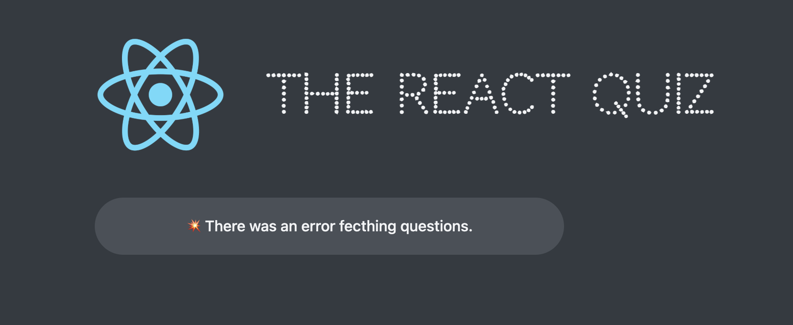

#### 192.2.3 Create the `StartScreen` component:

**Subsection Summary**
- **Purpose**: Creates a new `StartScreen` component that will serve as the welcome/landing screen shown when questions are loaded and the quiz is ready to begin.
- **Key Detail**: The component uses a hardcoded `"X"` as a placeholder for the question count. The `className` attributes are missing at this stage (no `"start"`, no `"btn btn-ui"`), making it a raw scaffold without proper styling.
- **File**: Created as `src/components/StartScreen.jsx`.
- **Pattern**: Simple presentational component — no props, no state, no side effects. Just static JSX.

```jsx
/* src/components/StartScreen.jsx */
function StartScreen() {
  return (
    <div>
      <h2>Welcome to The React Quiz!</h2>
      <h3>X question to test your React ,mastery</h3>
      <button>Let's start</button>
    </div>
  );
}
export default StartScreen;
```

#### 192.2.4 Import and conditionally render `<StartScreen />` for `ready` status:

**Subsection Summary**
- **Purpose**: Integrates the `StartScreen` component into the conditional rendering chain and restructures the JSX layout by consolidating all conditional components inside a **single `<Main>`** wrapper.
- **Key Changes**: (1) Import `StartScreen` from `./components/StartScreen`. (2) Move `<Header />` **inside** `<Main>` as the first child — this changes the DOM hierarchy so the header is now visually part of the main content area. (3) Merge all conditional renders (`<Loader />`, `<Error />`, `<StartScreen />`) into one `<Main>` block, fixing the duplicate `<Main>` issue from 192.2.2. (4) Add `console.log(questions)` for debugging (temporary).
- **Result**: When `status === "ready"`, the `StartScreen` component renders with the welcome message and a hardcoded "X" question count.
- **Screenshot**: Shows the app rendering the `StartScreen` with "Welcome to The React Quiz!", "X question to test your React ,mastery", and the "Let's start" button.

```jsx
/* src/App.jsx */
import Header from "./components/Header";
import { useEffect, useReducer } from "react";
import Main from "./components/Main";
import Loader from "./components/Loader";
import Error from "./components/Error";
import StartScreen from "./components/StartScreen";     // 👈🏽 ✅ (1)
const initialState = {
  questions: [],
  status: "loading", // 'loading' 'error', 'ready', 'active', 'finished'
};
const reducer = (state, action) => {
  switch (action.type) {
    case "dataReceived":
      return {
        ...state,
        questions: action.payload,
        status: "ready",
      };

    case "dataFailed":
      return {
        ...state,
        status: "error",
      };
    default:
      throw new Error("Action Unknown!");
  }
};

function App() {
  const [{ questions, status }, dispatch] = useReducer(reducer, initialState);
  console.log(questions);
  useEffect(() => {
    fetch("http://localhost:8000/questions")
      .then((resp) => resp.json())
      .then((data) => dispatch({ type: "dataReceived", payload: data }))
      .catch((error) => dispatch({ type: "dataFailed" }));
  }, []);
  return (
    <div className="app">
      <Main>
        <Header />
        {status === "loading" && <Loader />}
        {status === "error" && <Error />}
        {status === "ready" && <StartScreen />}   {/* 👈🏽 ✅ (2) */}
      </Main>
    </div>
  );
}
export default App;
```

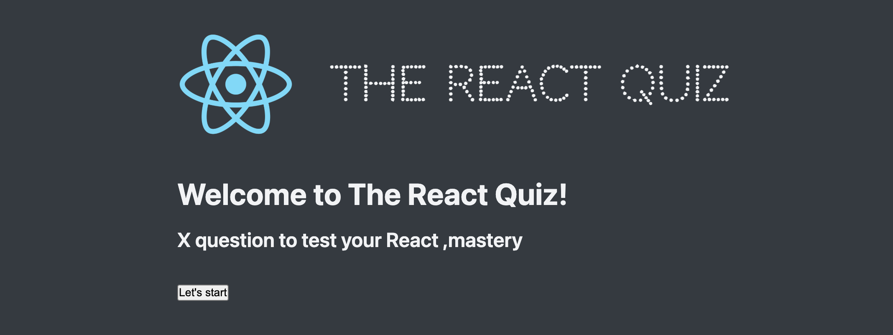

#### 192.2.5 Pass `numQuestions` prop to `StartScreen` and display the question count:

**Subsection Summary**
- **Purpose**: Replaces the hardcoded `"X"` in `StartScreen` with the actual number of questions by deriving `numQuestions` from `questions.length` in `App` and passing it as a prop.
- **Key Changes in `App.jsx`**: (1) Compute `const numQuestions = questions.length` — a derived value from the reducer state. (2) Pass `numQuestions` as a prop: `<StartScreen numQuestions={numQuestions} />`. (3) Remove the debug `console.log(questions)` from 192.2.4.
- **Key Changes in `StartScreen.jsx`**: (1) Accept `{ numQuestions }` as a destructured prop. (2) Replace `"X"` with `{numQuestions}` in the `<h3>` element. (3) Add proper `className` attributes: `"start"` on the wrapper `<div>` and `"btn btn-ui"` on the `<button>`.
- **Result**: The start screen now dynamically displays "15 questions to test your React mastery" (or whatever count is returned from the API).
- **Screenshot**: Shows the app with the dynamic question count displayed correctly.

```jsx
/* src/App.jsx */
import Header from "./components/Header";
import { useEffect, useReducer } from "react";
import Main from "./components/Main";
import Loader from "./components/Loader";
import Error from "./components/Error";
import StartScreen from "./components/StartScreen";

const initialState = {
  questions: [],
  status: "loading", // 'loading' 'error', 'ready', 'active', 'finished'
};

const reducer = (state, action) => {
  switch (action.type) {
    case "dataReceived":
      return {
        ...state,
        questions: action.payload,
        status: "ready",
      };

    case "dataFailed":
      return {
        ...state,
        status: "error",
      };
    default:
      throw new Error("Action Unknown!");
  }
};

function App() {
  const [{ questions, status }, dispatch] = useReducer(reducer, initialState);
  const numQuestions = questions.length;      // 👈🏽 ✅ (1)

  useEffect(() => {
    fetch("http://localhost:8000/questions")
      .then((resp) => resp.json())
      .then((data) => dispatch({ type: "dataReceived", payload: data }))
      .catch((error) => dispatch({ type: "dataFailed" }));
  }, []);
  return (
    <div className="app">
      <Main>
        <Header />
        {status === "loading" && <Loader />}
        {status === "error" && <Error />}
        {status === "ready" && <StartScreen numQuestions={numQuestions} />}   {/* 👈🏽 ✅ (2) */}
      </Main>
    </div>
  );
}
export default App;
```

Meanwhile:

* `StartScreen` receives `numQuestions` as prop.

```jsx
/* src/components/StartScreen.jsx */
function StartScreen({ numQuestions }) {                                // 👈🏽 ✅ (1)
  return (
    <div className="start">
      <h2>Welcome to The React Quiz!</h2>
      <h3>{numQuestions} questions to test your React ,mastery</h3>     {/* 👈🏽 ✅ (2) */}
      <button className="btn btn-ui">Let's start</button>
    </div>
  );
}

export default StartScreen;
```

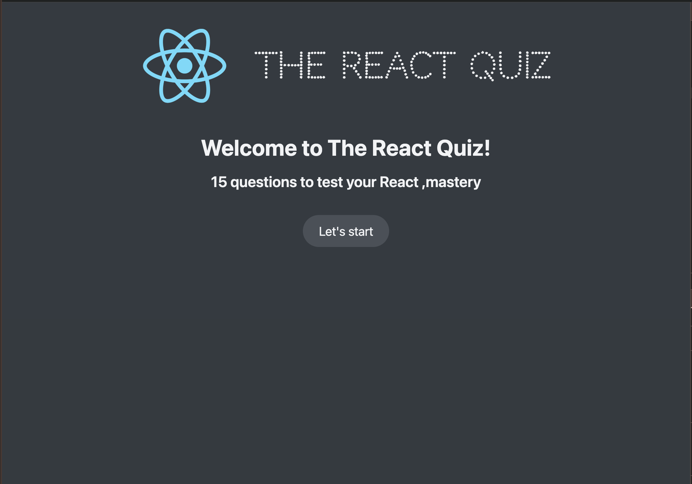

### 🐞 192.3 Issues:

| Issue | Status | Log/Error |
|---|---|---|
| Duplicate `<Main>` elements in 192.2.2 | ✅ Fixed (in 192.2.4) | Two `<main>` DOM nodes rendered simultaneously — semantically invalid. Merged into a single `<Main>` in 192.2.4. |
| `<Header />` missing from JSX in 192.2.2 | ✅ Fixed (in 192.2.4) | Header component not rendered during the error-handling intermediate step. Restored inside `<Main>` in 192.2.4. |
| Debug `console.log(questions)` left in code (192.2.4) | ✅ Fixed (in 192.2.5) | `src/App.jsx:33` — Debug log fires on every render. Removed in the final version. |
| Typo `",mastery"` in `StartScreen` | ⚠️ Identified | `src/components/StartScreen.jsx:5` — `"to test your React ,mastery"` has a stray comma. Should be `"to test your React mastery"`. |
| Typo `"fecthing"` in `Error` component | ⚠️ Identified (from Lesson 190) | `src/components/Error.jsx:4` — `"There was an error fecthing questions."` should be `"fetching"`. |
| `error` parameter discarded in `.catch()` | ⚠️ Identified | `src/App.jsx:40` — `dispatch({ type: "dataFailed" })` ignores the `error` object. No error details available for debugging or user display. |
| `"Let's start"` button has no `onClick` handler | ℹ️ Informational | `src/components/StartScreen.jsx:6` — Button rendered but non-functional. Expected to be wired up in a future lesson. |

### 🧱 192.4 Pending Fixes (TODO)

- [ ] Fix typo `",mastery"` → `"mastery"` (remove stray comma) in `src/components/StartScreen.jsx:5`.
- [ ] Fix typo `"fecthing"` → `"fetching"` in `src/components/Error.jsx:4`.
- [ ] Pass the `error` object as a payload in the `"dataFailed"` dispatch: `dispatch({ type: "dataFailed", payload: error.message })` and store it in reducer state for user-facing error messages (`src/App.jsx:40`).
- [ ] Add accessibility attributes to the `"Let's start"` button: `aria-label="Start the quiz"` and `tabIndex={0}` (`src/components/StartScreen.jsx:6`).
- [ ] Add `role="status"` and `aria-live="polite"` to the `<Loader />` wrapper for screen reader support (`src/components/Loader.jsx:3`).
- [ ] Consider extracting the conditional rendering into a helper function or render map (e.g., `const SCREENS = { loading: <Loader />, error: <Error />, ready: <StartScreen /> }`) to improve scalability as more statuses are added (`src/App.jsx:46-48`).
- [ ] Wire up the `"Let's start"` button `onClick` handler to dispatch a `"start"` action that transitions `status` from `"ready"` to `"active"` (expected in a future lesson).

[↑ top - 192. Lesson 192 — *Handling Loading, Error, and Ready Status*](#192-lesson-192-handling-loading-error-and-ready-status)


<br>

## 🔧 193. Lesson 193 — *Starting a New Quiz*

[🧳 Section 16: *The Advanced useReducer Hook*](#section-16-the-advanced-usereducer-hook)

### 📑 Table of Contents:
- [193. Lesson 193 — *Starting a New Quiz*](#193-lesson-193-starting-a-new-quiz)
- [193.1 Context](#1931-context)
- [193.2 Updating code according the context](#1932-updating-codetheory-according-the-context)
  - [193.2.1 Create a placeholder `Question` component](#19321-create-a-placeholder-question-component)
  - [193.2.2 Import `Question` and conditionally render it for `active` status](#19322-import-question-and-conditionally-render-it-for-active-status)
  - [193.2.3 Add `"start"` case to reducer and pass `dispatch` to `StartScreen`](#19323-add-start-case-to-reducer-and-pass-dispatch-to-startscreen)
  - [193.2.4 Wire the `StartScreen` button to dispatch `{ type: 'start' }`](#19324-wire-the-startscreen-button-to-dispatch-type-start)
- [193.3 Issues](#1933-issues)
- [193.4 Pending Fixes (TODO)](#1934-pending-fixes-todo)

### 🧠 193.1 Context:

This lesson continues from Lesson 192, where the conditional rendering for `"loading"`, `"error"`, and `"ready"` statuses was fully wired up and the `StartScreen` component displayed a "Let's start" button — but the button had **no `onClick` handler**. The quiz could not transition from the start screen to the first question. This lesson closes that gap by (1) creating a `Question` placeholder component, (2) adding a new `"active"` status rendering path, (3) implementing a `"start"` action in the reducer, and (4) wiring the button in `StartScreen` to dispatch that action.

**Key Concepts:**

1. **Reducer action expansion**: The existing reducer already handles `"dataReceived"` and `"dataFailed"`. This lesson adds a third case, `"start"`, which transitions `status` from `"ready"` to `"active"`. Each new user interaction maps to a new action type — this keeps the state machine explicit and predictable.
2. **Lifting dispatch down via props**: Instead of creating a separate callback function in `App` and passing it to `StartScreen`, the entire `dispatch` function is passed as a prop. The child component then calls `dispatch({ type: 'start' })` directly. This is a common pattern with `useReducer` — it avoids creating wrapper functions and makes the action intent visible at the call site.
3. **Status-driven screen transitions**: The `status` field acts as a finite state machine with well-defined transitions: `"loading"` → `"ready"` (on data) or `"error"` (on failure), then `"ready"` → `"active"` (on user click). Each status maps to exactly one component, ensuring mutually exclusive rendering.
4. **Placeholder components**: The `Question` component is created as a minimal scaffold. Its only purpose at this stage is to confirm the screen transition works. Actual question logic is deferred to future lessons.

**Advantages:**
- Passing `dispatch` directly avoids the need for intermediate handler functions in `App`, reducing boilerplate.
- The `"start"` action is a simple, self-documenting string that makes the state transition easy to trace in the reducer.
- The `Question` placeholder allows end-to-end testing of the screen flow without building the full question UI.
- All transitions remain in a single reducer `switch` block, providing a centralized overview of every possible state change.

**Disadvantages / Gotchas:**
- Passing `dispatch` directly to children couples them to the reducer's action shape. If the action type `"start"` is renamed later, `StartScreen` must also be updated. An intermediate handler (`handleStart`) in `App` would isolate this.
- The `Question` component renders a bare `<div>` with no semantic structure or accessibility attributes — acceptable for a placeholder, but must be addressed before production.
- The `"start"` case only changes `status` — it does not initialize any quiz-specific state (e.g., `index`, `points`). This means subsequent lessons must modify the same case, which can introduce regressions if not careful.
- String-based action types remain typo-prone. A constants file or TypeScript literal union would provide compile-time safety.

**When to Consider Alternatives:**
- If the number of actions grows large, consider an **action creator** pattern: `const start = () => ({ type: 'start' })` — this centralizes action shapes and is easier to refactor.
- For deeply nested component trees, passing `dispatch` through multiple levels becomes prop-drilling. In that case, a **context provider** wrapping `dispatch` (via `useContext`) is preferable.
- If screen transitions become complex (conditional guards, async transitions), a dedicated state machine library like **XState** can formalize the transitions with guards and side effects.

### ⚙️ 193.2 Updating code/theory according the context:

#### **Summary**
- **Purpose**: Enable the user to start the quiz by clicking "Let's start", transitioning the app from the `"ready"` status to `"active"` and rendering the `Question` component.
- **Problem**: In Lesson 192, the `StartScreen` button existed but had no functionality — clicking it did nothing because there was no `onClick` handler and no `"start"` action in the reducer.
- **Connection**: The subsections build the feature incrementally:
    1. Create a placeholder `Question` component (193.2.1).
    2. Import `Question` in `App.jsx` and conditionally render it when `status === "active"` (193.2.2).
    3. Add the `"start"` case to the reducer and pass `dispatch` to `StartScreen` (193.2.3).
    4. Accept `dispatch` in `StartScreen` and wire the button's `onClick` to dispatch `{ type: 'start' }` (193.2.4).

#### 193.2.1 Create a placeholder `Question` component:

**Subsection Summary**
- **Purpose**: Scaffolds a minimal `Question` component that will eventually display quiz questions. At this stage it renders only a static heading as a placeholder.
- **File**: Created as `src/components/Question.jsx`.
- **Pattern**: Simple presentational component — no props, no state, no side effects. Uses an arrow function (`const`) export pattern.
- **Role**: Provides a visual confirmation that the screen transition to `"active"` status works correctly before the full question UI is implemented.

```jsx
/* src/components/Question.jsx */
const Question = () => {
  return (
    <div>
      <h1>Question</h1>
    </div>
  )
}
export default Question
```

#### 193.2.2 Import `Question` and conditionally render it for `active` status:

**Subsection Summary**
- **Purpose**: Adds the `Question` component to the conditional rendering chain in `App.jsx`, making it render when `status === "active"`.
- **Key Changes**: (1) Import `Question` from `./components/Question`. (2) Add `{status === "active" && <Question />}` inside `<Main>`, following the same `&&` short-circuit pattern used for all other statuses.
- **Open Questions**: At this point the button still has no handler — the questions "How do we set this status to `active`?" and "How do we start the game?" are posed to motivate the next steps.
- **Note**: The reducer has no `"start"` case yet, so clicking the button does nothing. The rendering path exists but is unreachable.

```jsx
/* src/App.jsx */
import Header from "./components/Header";
import { useEffect, useReducer } from "react";
import Main from "./components/Main";
import Loader from "./components/Loader";
import Error from "./components/Error";
import StartScreen from "./components/StartScreen";
import Question from "./components/Question";   // 👈🏽 ✅ (1)
const initialState = {
  questions: [],
  status: "loading", // 'loading' 'error', 'ready', 'active', 'finished'
};
const reducer = (state, action) => {
  switch (action.type) {
    case "dataReceived":
      return {
        ...state,
        questions: action.payload,
        status: "ready",
      };
    case "dataFailed":
      return {
        ...state,
        status: "error",
      };
    default:
      throw new Error("Action Unknown!");
  }
};
function App() {
  const [{ questions, status }, dispatch] = useReducer(reducer, initialState);
  const numQuestions = questions.length;
  useEffect(() => {
    fetch("http://localhost:8000/questions")
      .then((resp) => resp.json())
      .then((data) => dispatch({ type: "dataReceived", payload: data }))
      .catch((error) => dispatch({ type: "dataFailed" }));
  }, []);
  return (
    <div className="app">
      <Main>
        <Header />
        {status === "loading" && <Loader />}
        {status === "error" && <Error />}
        {status === "ready" && <StartScreen numQuestions={numQuestions} />}
        {status === "active" && <Question />}   {/* 👈🏽 ✅ (1) */}
      </Main>
    </div>
  );
}
export default App;
```

* How do we set this status to `active`?
* How do we start the game?

#### 193.2.3 Add `"start"` case to reducer and pass `dispatch` to `StartScreen`:

**Subsection Summary**
- **Purpose**: Implements the state transition that makes the quiz startable — adds a `"start"` case to the reducer that sets `status` to `"active"`, and passes the `dispatch` function as a prop to `StartScreen` so the child can trigger the transition.
- **Key Changes in the reducer**: (1) Add `case 'start'` that returns `{ ...state, status: 'active' }`. This is the mechanism that answers the question from 193.2.2: dispatching `{ type: 'start' }` transitions the app from the start screen to the question screen.
- **Key Changes in JSX**: (2) The `<StartScreen>` rendering block is reformatted to a multi-line JSX expression to accommodate the new `dispatch` prop: `<StartScreen numQuestions={numQuestions} dispatch={dispatch} />`.
- **Pattern**: Passing `dispatch` directly (rather than a wrapper function like `handleStart`) is a common `useReducer` convention — it keeps `App` lean and lets the child decide which action to dispatch.

```jsx
/* src/App.jsx */
import Header from "./components/Header";
import { useEffect, useReducer } from "react";
import Main from "./components/Main";
import Loader from "./components/Loader";
import Error from "./components/Error";
import StartScreen from "./components/StartScreen";
import Question from "./components/Question";
const initialState = {
  questions: [],
  status: "loading", // 'loading' 'error', 'ready', 'active', 'finished'
};
const reducer = (state, action) => {
  switch (action.type) {
    case "dataReceived":
      return {
        ...state,
        questions: action.payload,
        status: "ready",
      };

    case "dataFailed":
      return {
        ...state,
        status: "error",
      };
    case 'start':                                           // 👈🏽 ✅ (1)
      return {
        ...state,
        status: 'active'
      }
    default:
      throw new Error("Action Unknown!");
  }
};
function App() {
  const [{ questions, status }, dispatch] = useReducer(reducer, initialState);
  const numQuestions = questions.length;
  useEffect(() => {
    fetch("http://localhost:8000/questions")
      .then((resp) => resp.json())
      .then((data) => dispatch({ type: "dataReceived", payload: data }))
      .catch((error) => dispatch({ type: "dataFailed" }));
  }, []);
  return (
    <div className="app">
      <Main>
        <Header />
        {status === "loading" && <Loader />}
        {status === "error" && <Error />}
        {status === "ready" && 
          <StartScreen
            numQuestions={numQuestions}
            dispatch={dispatch}                                 // 👈🏽 ✅ (2)
          />
        }
        {status === "active" && <Question />}
      </Main>
    </div>
  );
}
export default App;
```

#### 193.2.4 Wire the `StartScreen` button to dispatch `{ type: 'start' }`:

**Subsection Summary**
- **Purpose**: Completes the feature by accepting the `dispatch` prop in `StartScreen` and attaching an `onClick` handler to the "Let's start" button that dispatches the `"start"` action.
- **Key Changes**: (1) Destructure `dispatch` from props alongside `numQuestions`. (2) Add `onClick={() => dispatch({ type: 'start' })}` to the `<button>` element.
- **Result**: Clicking "Let's start" dispatches `{ type: 'start' }` → the reducer sets `status` to `"active"` → the `StartScreen` unmounts and the `Question` placeholder renders in its place. The full start-to-question screen transition is now functional.
- **Observation**: The inline arrow function `() => dispatch({ type: 'start' })` is acceptable here because it's a simple one-liner. For more complex handlers, extracting a named `handleStart` function would improve readability.

```jsx
/* src/components/StartScreen.jsx */
function StartScreen({ numQuestions, dispatch }) {          // 👈🏽 ✅ (1)
  return (
    <div className="start">
      <h2>Welcome to The React Quiz!</h2>
      <h3>{numQuestions} questions to test your React ,mastery</h3>
      <button
        className="btn btn-ui"
        onClick={() => dispatch({ type: 'start' })}>        {/* 👈🏽 ✅ (2) */}
        Let's start
      </button>
    </div>
  );
}
export default StartScreen;
```

After clicking on `Let's Start` button

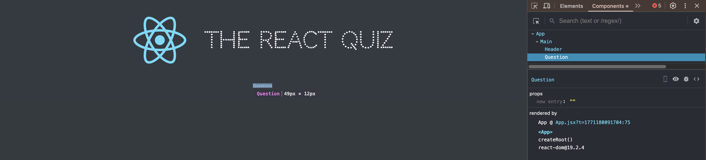

### 🐞 193.3 Issues:

| Issue | Status | Log/Error |
|---|---|---|
| `dispatch` passed directly to `StartScreen` | ℹ️ Informational | `src/App.jsx:57` — Passing `dispatch` as a prop couples the child to the reducer's action type strings. A wrapper handler like `handleStart` in `App` would decouple them. |
| `Question` placeholder has no `className` or accessibility | ⚠️ Identified | `src/components/Question.jsx:3-5` — The `<div>` and `<h1>` lack `className` for styling and `role`/`aria-*` attributes for accessibility. |
| Typo `",mastery"` still present | ⚠️ Identified (from Lesson 192) | `src/components/StartScreen.jsx:5` — `"to test your React ,mastery"` has a stray comma before "mastery". Should be `"to test your React mastery"`. |
| `"start"` case does not initialize quiz state | ℹ️ Informational | `src/App.jsx:28-32` — The `"start"` case only sets `status: 'active'` but does not initialize `index`, `points`, or `answer`. Expected to be addressed in future lessons when question navigation is implemented. |
| Mixed quote style in reducer cases | ℹ️ Low Priority | `src/App.jsx:16-31` — `"dataReceived"` and `"dataFailed"` use double quotes, but `'start'` uses single quotes. Inconsistent string delimiters reduce readability. |

### 🧱 193.4 Pending Fixes (TODO)

- [ ] Fix typo `",mastery"` → `"mastery"` (remove stray comma) in `src/components/StartScreen.jsx:5`.
- [ ] Add `className="question"` to the `Question` component's wrapper `<div>` for consistent styling (`src/components/Question.jsx:3`).
- [ ] Add accessibility attributes to the "Let's start" button: `aria-label="Start the quiz"` and `tabIndex={0}` (`src/components/StartScreen.jsx:6-8`).
- [ ] Normalize quote style in reducer action type strings — use double quotes consistently for `'start'` → `"start"` (`src/App.jsx:28`).
- [ ] Consider extracting a `handleStart` callback in `App` instead of passing `dispatch` directly, to decouple `StartScreen` from the reducer's action shape (`src/App.jsx:55-58`).
- [ ] Extend the `"start"` case to initialize quiz-specific state (e.g., `index: 0`, `points: 0`, `answer: null`) when question navigation is implemented in future lessons (`src/App.jsx:28-32`).

[↑ top - 193. Lesson 193 — *Starting a New Quiz*](#193-lesson-193-starting-a-new-quiz)

<br>

## 🔧 194. Lesson 194 — *Displaying Questions*

[🧳 Section 16: *The Advanced useReducer Hook*](#section-16-the-advanced-usereducer-hook)

### 📑 Table of Contents:
- [194. Lesson 194 — *Displaying Questions*](#194-lesson-194-displaying-questions)
- [194.1 Context](#1941-context)
- [194.2 Updating code according the context](#1942-updating-codetheory-according-the-context)
  - [194.2.1 Add `index` to `initialState` and pass `questions[index]` to `Question`](#19421-add-index-to-initialstate-and-pass-questionsindex-to-question)
  - [194.2.2 Build the `Question` component with inline options rendering](#19422-build-the-question-component-with-inline-options-rendering)
  - [194.2.3 Scaffold the `Options` component (prop placeholder)](#19423-scaffold-the-options-component-prop-placeholder)
  - [194.2.4 Refactor `Question` to delegate options rendering to `Options`](#19424-refactor-question-to-delegate-options-rendering-to-options)
  - [194.2.5 Accept `question` prop in `Options` component](#19425-accept-question-prop-in-options-component)
- [194.3 Issues](#1943-issues)
- [194.4 Pending Fixes (TODO)](#1944-pending-fixes-todo)

### 🧠 194.1 Context:

This lesson picks up from Lesson 193, where the quiz could transition from the `"ready"` start screen to an `"active"` status that rendered a bare `Question` placeholder. The placeholder confirmed the screen transition but displayed no real data. This lesson closes that gap by (1) adding an `index` property to the reducer state to track the current question, (2) passing `questions[index]` as a prop to `Question`, (3) building the question UI with its answer option buttons, and (4) extracting the options list into a dedicated `Options` child component for better separation of concerns.

**Key Concepts:**

1. **State-driven data access via `index`**: Instead of passing the entire `questions` array to `Question`, a single `index` integer in the reducer state determines which question object to pass. This keeps the child component unaware of the array and focused solely on rendering one question — a clean separation of data selection (parent) and data presentation (child).
2. **Prop drilling for data**: The `question` object flows `App → Question → Options`. Each component receives only the data it needs. `Question` renders the question text; `Options` renders the answer buttons. This follows the React convention of unidirectional data flow.
3. **Component extraction / decomposition**: The options list starts as inline JSX inside `Question` and is then extracted into a standalone `Options` component. This is a core React pattern — start with everything in one component, identify a logical unit, extract it, and pass data via props.
4. **Array `.map()` for dynamic lists**: `question.options.map(option => ...)` renders a `<button>` for each answer option. The `key` prop is set to the option string itself, which works as long as options are unique within each question.
5. **Incremental refactoring workflow**: The lesson demonstrates the typical development cycle: build it inline first (194.2.2), then extract into a separate component (194.2.3–194.2.5). This lets you verify correctness before restructuring.

**Advantages:**
- Tracking the current question via `index` in the reducer centralizes navigation logic and makes it trivial to advance to the next question later (just increment `index`).
- Extracting `Options` creates a reusable, testable unit that can evolve independently (e.g., adding answer highlighting, disabling after selection).
- Passing a single `question` object rather than the full array minimizes the data surface each child component depends on.
- The `.map()` pattern produces a clean, declarative list of buttons that mirrors the data shape.

**Disadvantages / Gotchas:**
- Using the option string as the `key` prop assumes all options within a question are unique. Duplicate option text would cause React key collisions and rendering bugs.
- `console.log(question)` is left in `Question` for debugging but should be removed before production.
- The `Options` component currently receives the entire `question` object but only uses `question.options`. Passing just the `options` array would make the component's API narrower and clearer.
- There is no guard for an out-of-bounds `index` — if `index >= questions.length`, `questions[index]` is `undefined` and the app would crash when accessing `question.question`.

**When to Consider Alternatives:**
- If the option list grows complex (images, explanations, multi-select), consider rendering each option via a dedicated `Option` (singular) component rather than inline buttons inside `Options`.
- For large question sets, consider lazy-loading questions or paginating them instead of holding all in memory.
- If prop drilling becomes deeper (e.g., `App → Question → Options → Option`), a React Context or state management library would reduce boilerplate.

### ⚙️ 194.2 Updating code/theory according the context:

#### **Summary**
- **Purpose**: Display the current quiz question with its answer option buttons, transitioning from the bare placeholder `Question` component created in Lesson 193 to a fully data-driven question UI.
- **Problem**: After Lesson 193, clicking "Let's start" rendered a static `<h1>Question</h1>` placeholder. No actual question data was displayed because `Question` received no props and the reducer had no `index` to select a question.
- **Connection**: The subsections build the feature incrementally:
    1. Add `index: 0` to `initialState` and pass `questions[index]` to `Question` (194.2.1).
    2. Build the `Question` component with inline options rendering to verify the data flows correctly (194.2.2).
    3. Scaffold a new `Options` component, initially with an unclear prop signature (194.2.3).
    4. Refactor `Question` to import and delegate options rendering to `Options`, commenting out the inline version (194.2.4).
    5. Accept the `question` prop in `Options` to complete the extraction (194.2.5).

#### 194.2.1 Add `index` to `initialState` and pass `questions[index]` to `Question`:

**Subsection Summary**
- **Purpose**: Introduces an `index` property in the reducer's `initialState` to track which question is currently displayed, and updates `App` to pass the selected question object to `Question`.
- **Key Changes**: (1) `index: 0` added to `initialState`. (2) `index` destructured alongside `questions` and `status` from `useReducer`. (3) `<Question question={questions[index]}/>` replaces the prop-less `<Question />`.
- **Pattern**: State-driven data selection — the parent selects the data via `index` and the child receives a single item, keeping rendering logic simple.
- **Role**: This is the foundational wiring that makes all subsequent subsections possible — without `index`, there is no way to select a question from the array.

```jsx
/* src/App.jsx */
import Header from "./components/Header";
import { useEffect, useReducer } from "react";
import Main from "./components/Main";
import Loader from "./components/Loader";
import Error from "./components/Error";
import StartScreen from "./components/StartScreen";
import Question from "./components/Question";
const initialState = {
  questions: [],
  status: "loading", // 'loading' 'error', 'ready', 'active', 'finished'
  index: 0,           // 👈🏽 ✅ (1)
};
const reducer = (state, action) => {
  switch (action.type) {
    case "dataReceived":
      return {
        ...state,
        questions: action.payload,
        status: "ready",
      };
    case "dataFailed":
      return {
        ...state,
        status: "error",
      };
    case 'start':
      return {
        ...state,
        status: 'active'
      }
    default:
      throw new Error("Action Unknown!");
  }
};
function App() {
  const [{ questions, status, index }, dispatch] = useReducer(reducer, initialState);         // 👈🏽 ✅ (2)
  const numQuestions = questions.length;
  useEffect(() => {
    fetch("http://localhost:8000/questions")
      .then((resp) => resp.json())
      .then((data) => dispatch({ type: "dataReceived", payload: data }))
      .catch((error) => dispatch({ type: "dataFailed" }));
  }, []);
  return (
    <div className="app">
      <Main>
        <Header />
        {status === "loading" && <Loader />}
        {status === "error" && <Error />}
        {status === "ready" && 
          <StartScreen
            numQuestions={numQuestions}
            dispatch={dispatch} 
          />
        }
        {status === "active" && <Question question={questions[index]}/>}                      {/* 👈🏽 ✅ (3) */}
      </Main>
    </div>
  );
}
export default App;
```

#### 194.2.2 Build the `Question` component with inline options rendering:

**Subsection Summary**
- **Purpose**: Transforms the `Question` placeholder into a data-driven component that displays the question text and renders answer option buttons directly (inline) using `.map()`.
- **Key Changes**: (1) Destructures `question` from props. (2) Renders `question.question` inside an `<h4>`. (3) Maps over `question.options` to produce `<button>` elements with `className="btn btn-option"`. (4) Each button displays the option text.
- **Pattern**: Inline list rendering via `.map()` — the most common React pattern for rendering dynamic lists from array data.
- **Role**: This is the "make it work first" step. Everything is in one component to confirm correctness before extraction.

```jsx
/* src/components/Question.jsx */
const Question = ({ question }) => {                                // 👈🏽 ✅ (1)
  console.log(question);
  return (
    <div>
      <h4>{question.question}</h4>                                  {/* 👈🏽 ✅ (2) */}
      <div className="options">
        {question.options.map( option => (                          {/* 👈🏽 ✅ (3) */}
          <button className="btn btn-option" key={option}>
            {option}                                                {/* 👈🏽 ✅ (4) */}
          </button>
        ))}
      </div>
    </div>
  )
}
export default Question
```

#### 194.2.3 Scaffold the `Options` component (prop placeholder):

**Subsection Summary**
- **Purpose**: Creates a new `Options` component file with the options-rendering JSX extracted from `Question`, but the prop destructuring is left intentionally incomplete (`{ /* 🤔 🤔 🤔 */ }`) to prompt the learner to think about what data the component needs.
- **Key Pattern**: Component extraction — moving a logical chunk of JSX into its own file. The placeholder prop signature is a pedagogical device to emphasize that extracted components need explicit data passed via props.
- **Issue**: As written, `question` is referenced inside the component body but is not destructured from props, so this version would throw a `ReferenceError` at runtime. This is intentional — the next steps fix it.

```jsx
/* src/components/Options.jsx */
const Options = ({ /* 🤔 🤔 🤔 */ }) => {
  return (
    <div className="options">
      {question.options.map((option) => (
        <button className="btn btn-option" key={option}>
          {option}
        </button>
      ))}
    </div>
  );
};
export default Options;
```

#### 194.2.4 Refactor `Question` to delegate options rendering to `Options`:

**Subsection Summary**
- **Purpose**: Updates `Question` to import the new `Options` component and replace the inline options markup with a component call, passing the `question` prop through.
- **Key Changes**: (1) `import Options from "./Options"` added at the top. The inline `<div className="options">` block is commented out to preserve it as a reference. Two rendering attempts are shown: `{<Options />}` (without prop — would fail) and `<Options question={question} />` (with prop — correct).
- **Pattern**: Progressive refactoring — the commented-out code serves as documentation of what was replaced, and the two JSX lines illustrate the difference between forgetting and remembering to pass props.
- **Role**: This is the critical integration step that wires `Question` to `Options`.

```jsx
/* src/components/Question.jsx */
import Options from "./Options"                                   // 👈🏽 ✅ (1)
const Question = ({ question }) => {
  console.log(question);
  return (
    <div>
      <h4>{question.question}</h4>
      {/* 
        <div className="options">
          {question.options.map( option => (
            <button className="btn btn-option" key={option}>
              {option}
            </button>
          ))}
        </div> 
      */}

      {<Options />}                                               {/* 👈🏽 ✅ (1) */}
      <Options question={question} />                             {/* 👈🏽 ✅ (2) */}
    </div>
  )
}
export default Question
```

#### 194.2.5 Accept `question` prop in `Options` component:

**Subsection Summary**
- **Purpose**: Completes the `Options` component by properly destructuring the `question` prop, making the component fully functional.
- **Key Change**: (1) `{ question }` is now destructured from props, replacing the earlier `{ /* 🤔 🤔 🤔 */ }` placeholder. The component can now access `question.options` without a `ReferenceError`.
- **Result**: The full data flow is now complete: `App` selects `questions[index]` → passes it to `Question` → `Question` renders the question text and passes the object to `Options` → `Options` maps over `question.options` and renders a button for each answer.
- **Pattern**: Standard prop-based data flow with component decomposition. Each component has a single responsibility: `Question` owns the question layout, `Options` owns the answer list.

```js
/* src/components/Options.jsx */
const Options = ({ question }) => {                               // 👈🏽 ✅ (1)
  return (
    <div className="options">
      {question.options.map((option) => (
        <button className="btn btn-option" key={option}>
          {option}
        </button>
      ))}
    </div>
  );
};

export default Options;
```

### 🐞 194.3 Issues:

- **`console.log` left in `Question`**: A debugging `console.log(question)` statement is present in the production component.
- **Option string used as `key`**: Using the option text directly as the React `key` can cause collisions if two options have identical text.
- **No bounds check on `index`**: If `index` exceeds `questions.length - 1`, `questions[index]` returns `undefined` and the app crashes.
- **`Options` receives entire `question` object but only uses `options`**: The prop interface is wider than necessary, coupling `Options` to the full question shape.
- **`{<Options />}` without prop still in JSX (194.2.4)**: The intermediate step leaves a prop-less `<Options />` call in the code alongside the correct one — only one should remain in the final version.
- **No `onClick` handler on option buttons**: The buttons render but have no interactivity — clicking an answer does nothing yet.

| Issue | Status | Log/Error |
|---|---|---|
| `console.log(question)` left in component | ⚠️ Identified | `src/components/Question.jsx:4` — Debugging statement should be removed before production. Logs the entire question object to the console on every render. |
| Option string used as React `key` | ℹ️ Informational | `src/components/Options.jsx:5` — `key={option}` relies on option text uniqueness. Duplicate option strings within the same question would cause key collisions and unpredictable rendering. |
| No bounds check on `index` | ⚠️ Identified | `src/App.jsx:61` — `questions[index]` has no guard against `index >= questions.length`. If `index` goes out of bounds, the app crashes with `Cannot read properties of undefined (reading 'question')`. |
| `Options` receives full `question` object unnecessarily | ℹ️ Low Priority | `src/components/Options.jsx:1` — The component only uses `question.options`. Passing `options` directly would narrow the prop surface and improve clarity. |
| Prop-less `{<Options />}` left in JSX | ⚠️ Identified | `src/components/Question.jsx:18` (194.2.4 step) — `{<Options />}` without the `question` prop would cause a runtime error if not removed. Should be cleaned up in the final version. |
| Option buttons have no `onClick` handler | ℹ️ Informational | `src/components/Options.jsx:4-7` — Buttons are rendered but not wired to any dispatch or callback. Expected to be addressed in a future lesson when answer selection is implemented. |

### 🧱 194.4 Pending Fixes (TODO)

- [ ] Remove `console.log(question)` from `src/components/Question.jsx:4`.
- [ ] Remove the prop-less `{<Options />}` line from `src/components/Question.jsx:18` — only the `<Options question={question} />` call should remain.
- [ ] Add a bounds check before accessing `questions[index]` in `src/App.jsx:61`, e.g. `{status === "active" && index < questions.length && <Question question={questions[index]} />}`.
- [ ] Consider narrowing `Options` prop from `question` to `options` for a cleaner API: `<Options options={question.options} />` in `src/components/Question.jsx` and `const Options = ({ options }) => ...` in `src/components/Options.jsx`.
- [ ] Add `aria-label` attributes to each option button for accessibility, e.g. `aria-label={`Select answer: ${option}`}` in `src/components/Options.jsx:5`.
- [ ] Add `onClick` handler to option buttons when answer selection logic is implemented in a future lesson (`src/components/Options.jsx:4-7`).
- [ ] Use numeric indices or unique IDs as `key` instead of option text strings to avoid potential key collisions (`src/components/Options.jsx:5`).

[↑ top - 194. Lesson 194 — *Displaying Questions*](#194-lesson-194-displaying-questions)


<br>

## 🔧 195. Lesson 195 — *Handling New Answers*

[🧳 Section 16: *The Advanced useReducer Hook*](#section-16-the-advanced-usereducer-hook)

### 📑 Table of Contents:
- [195. Lesson 195 — *Handling New Answers*](#-195-lesson-195--handling-new-answers)
- [195.1 Context](#1951-context)
- [195.2 Updating code according the context](#1952-updating-codetheory-according-the-context)
  - [195.2.1 Add `answer` state to `initialState` and wire `newAnswer` action in the reducer](#19521-add-answer-state-to-initialstate-and-wire-newanswer-action-in-the-reducer)
  - [195.2.2 Pass `answer` and `dispatch` through `Question` to `Options`](#19522-pass-answer-and-dispatch-through-question-to-options)
  - [195.2.3 Wire `onClick` handler in `Options` to dispatch `newAnswer`](#19523-wire-onclick-handler-in-options-to-dispatch-newanswer)
  - [195.2.4 Apply conditional CSS classes for `answer`, `correct`, and `wrong` (initial attempt)](#19524-apply-conditional-css-classes-for-answer-correct-and-wrong-initial-attempt)
  - [195.2.5 Fix premature styling with `hasAnswered` guard and `disabled` attribute](#19525-fix-premature-styling-with-hasanswered-guard-and-disabled-attribute)
  - [195.2.6 Add `points` state and award points in the `newAnswer` reducer case](#19526-add-points-state-and-award-points-in-the-newanswer-reducer-case)
  - [195.2.7 Visual verification — points awarded on correct vs wrong answer](#19527-visual-verification--points-awarded-on-correct-vs-wrong-answer)
- [195.3 Issues](#1953-issues)
- [195.4 Pending Fixes (TODO)](#1954-pending-fixes-todo)

### 🧠 195.1 Context:

This lesson builds on Lesson 194, where the quiz displayed questions with clickable option buttons but had no interactivity — clicking an answer did nothing. This lesson closes that gap by (1) adding an `answer` property to the reducer state, (2) creating a `'newAnswer'` action that stores the user's selected option index, (3) passing `answer` and `dispatch` down the component tree so `Options` can dispatch the action and visually highlight correct/wrong answers, and (4) adding a `points` property to the state so the reducer can award points when the correct answer is selected.

**Key Concepts:**

1. **Reducer action for answer selection (`'newAnswer'`)**: A new case in the reducer stores the clicked option's index in `state.answer`. This is the standard `useReducer` pattern — user interaction dispatches an action, the reducer returns new state, and React re-renders.
2. **Derived boolean from state (`hasAnswered`)**: Instead of tracking a separate "has the user answered" flag in the reducer, the component derives `hasAnswered = answer !== null`. Derived state avoids redundant data in the reducer and keeps the source of truth minimal.
3. **Conditional CSS classes**: The `className` string is built dynamically based on `answer`, `index`, and `question.correctOption`. After answering, each button receives `'correct'` or `'wrong'`, and the selected button additionally receives `'answer'` — all driven by the single `answer` value in state.
4. **Disabling buttons after answering**: `disabled={hasAnswered}` prevents the user from changing their answer once submitted. This is a UX best practice for quiz-style interfaces and leverages the native HTML `disabled` attribute.
5. **Computing derived values inside the reducer**: The `'newAnswer'` case retrieves the current question via `state.questions.at(state.index)` and conditionally adds `question.points` to `state.points`. Performing this calculation inside the reducer keeps the logic centralized and the components purely presentational.

**Advantages:**
- Storing only the `answer` index (not a boolean or the full option) makes the state minimal while still enabling all derived UI decisions (highlighting, disabling, scoring).
- The `hasAnswered` derived boolean avoids state duplication — a single `null` check replaces what could have been a separate `isAnswered` flag.
- Calculating points inside the reducer ensures the scoring logic is co-located with all other state transitions, making it easy to test and reason about.
- Using `disabled` on buttons provides native accessibility — screen readers announce the button as disabled, and keyboard users cannot activate it.

**Disadvantages / Gotchas:**
- The conditional `className` template literal is deeply nested and hard to read. A utility like `classnames`/`clsx` would improve clarity.
- `answer` is stored as an index (`0`, `1`, `2`, `3`) with `null` meaning "not yet answered". This works but relies on the convention that `null` specifically means "unanswered" — `0` (the first option) is a valid answer, so falsy checks like `!answer` would be a bug.
- The `'newAnswer'` reducer case declares `const question` inside a `switch` block. While this works, some linters flag `case`-level `const`/`let` declarations without braces as potentially confusing.
- `state.questions.at(state.index)` uses `Array.prototype.at()`, which is an ES2022 feature. In older environments this would require a polyfill.

**When to Consider Alternatives:**
- If the quiz needs to support changing an answer before submitting, the `disabled` approach must be replaced with a "confirm answer" step.
- For more complex scoring (partial credit, time-based bonuses), consider moving the scoring logic to a dedicated utility function rather than inlining it in the reducer.
- If the className logic grows further (e.g., animations, themes), extract it into a helper function or use a CSS-in-JS solution.

### ⚙️ 195.2 Updating code/theory according the context:

#### **Summary**
- **Purpose**: Implement answer selection interactivity — when a user clicks an option, the app records the answer, highlights correct/wrong options with CSS classes, disables further clicks, and awards points for correct answers.
- **Problem**: After Lesson 194, option buttons rendered correctly but had no `onClick` handler, no visual feedback on answer selection, and no scoring mechanism.
- **Connection**: The subsections build the feature incrementally:
    1. Add `answer: null` to `initialState` and a `'newAnswer'` reducer case (195.2.1).
    2. Thread `answer` and `dispatch` through `Question` to `Options` (195.2.2–195.2.3).
    3. Apply conditional CSS classes for visual feedback — first a naive version (195.2.4), then a corrected version with `hasAnswered` guard (195.2.5).
    4. Add `points: 0` to state and award question-specific points on correct answers (195.2.6).
    5. Visual verification of the scoring logic via React DevTools (195.2.7).

#### 195.2.1 Add `answer` state to `initialState` and wire `newAnswer` action in the reducer:

**Subsection Summary**
- **Purpose**: Introduces `answer: null` in the reducer's `initialState` to track the user's selected option index, and adds a `'newAnswer'` case to the reducer that stores the dispatched payload as the new `answer` value.
- **Key Changes**: (1) `answer: null` added to `initialState`. (2) `'newAnswer'` case added to the `switch` block returning `{ ...state, answer: action.payload }`. (3) `answer` destructured from `useReducer` alongside existing state properties. (4) `answer` and `dispatch` passed as props to `<Question />`.
- **Pattern**: Standard `useReducer` state extension — add a new property, add a case, destructure it, pass it down.
- **Role**: This is the foundational wiring that enables all subsequent subsections — without `answer` in state and the `'newAnswer'` action, no interactivity is possible.

```jsx
/* src/App.jsx */
import Header from "./components/Header";
import { useEffect, useReducer } from "react";
import Main from "./components/Main";
import Loader from "./components/Loader";
import Error from "./components/Error";
import StartScreen from "./components/StartScreen";
import Question from "./components/Question";
const initialState = {
  questions: [],
  status: "loading", // 'loading' 'error', 'ready', 'active', 'finished'
  index: 0,
  answer: null,                                                         // 👈🏽 ✅ (1)
};
const reducer = (state, action) => {
  switch (action.type) {
    case "dataReceived":
      return {
        ...state,
        questions: action.payload,
        status: "ready",
      };

    case "dataFailed":
      return {
        ...state,
        status: "error",
      };
    case 'start':
      return {
        ...state,
        status: 'active'
      }
    case 'newAnswer':                                                     // 👈🏽 ✅ (2)
      return {
        ...state,
        answer: action.payload,
      }
    default:
      throw new Error("Action Unknown!");
  }
};
function App() {
  const [
    { questions, status, index, answer },                                 // 👈🏽 ✅ (3)
    dispatch] = useReducer(reducer, initialState);
  const numQuestions = questions.length;

  useEffect(() => {
    fetch("http://localhost:8000/questions")
      .then((resp) => resp.json())
      .then((data) => dispatch({ type: "dataReceived", payload: data }))
      .catch((error) => dispatch({ type: "dataFailed" }));
  }, []);
  return (
    <div className="app">
      <Main>
        <Header />
        {status === "loading" && <Loader />}
        {status === "error" && <Error />}
        {status === "ready" && 
          <StartScreen
            numQuestions={numQuestions}
            dispatch={dispatch} 
          />
        }
        {status === "active" &&
          <Question 
            question={questions[index]}
            answer={answer}                                                 {/* 👈🏽 ✅ (4) */}
            dispatch={dispatch}                                             {/* 👈🏽 ✅ (4) */}
          />}
      </Main>
    </div>
  );
}
export default App;
```

#### 195.2.2 Pass `answer` and `dispatch` through `Question` to `Options`:

**Subsection Summary**
- **Purpose**: Updates the `Question` component to accept `answer` and `dispatch` as props and forward them to the `Options` child component.
- **Key Changes**: (1) `Question` destructures `{ question, answer, dispatch }` from props. (2) `<Options>` receives `answer` and `dispatch` in addition to `question`.
- **Pattern**: Prop drilling — `App → Question → Options`. Each level receives and forwards the data it does not consume directly. `Question` acts as a pass-through for `answer` and `dispatch`.
- **Role**: This wiring step connects the state (`answer`) and the state-setter (`dispatch`) from `App` all the way down to `Options`, where user interaction occurs.

```jsx
/* src/components/Question.jsx */
import Options from "./Options"
const Question = ({ question, answer, dispatch }) => {                        // 👈🏽 ✅ (1)
  console.log(question);
  return (
    <div>
      <h4>{question.question}</h4>
      <Options
        question={question}
        answer={answer}                                                       {/* 👈🏽 ✅ (2) */}
        dispatch={dispatch}                                                   {/* 👈🏽 ✅ (2) */}
      />
    </div>
  )
}
export default Question;
```

#### 195.2.3 Wire `onClick` handler in `Options` to dispatch `newAnswer`:

**Subsection Summary**
- **Purpose**: Adds the `onClick` handler to each option button so that clicking an answer dispatches the `'newAnswer'` action with the button's index as the payload.
- **Key Changes**: (1) `Options` destructures `{ question, answer, dispatch }`. (2) Each `<button>` receives `onClick={() => dispatch({ type: 'newAnswer', payload: index })}`, where `index` comes from the `.map()` callback.
- **Pattern**: Event delegation via dispatch — user clicks trigger a state transition in the reducer. The component itself does not manage any local state; it simply dispatches.
- **Role**: This is the interactivity step — after this change, clicking a button updates `answer` in the reducer, which triggers a re-render.

```jsx
/* src/components/Options.jsx */
const Options = ({ question, answer, dispatch }) => {                           // 👈🏽 ✅ (1)
  return (
    <div className="options">
      {question.options.map((option, index) => (
        <button
          className="btn btn-option"
          key={option}
          onClick={() => dispatch({ type: 'newAnswer', payload: index })}       {/* 👈🏽 ✅ (2) */}
        >
          {option}
        </button>
      ))}
    </div>
  );
};
export default Options;
```

#### 195.2.4 Apply conditional CSS classes for `answer`, `correct`, and `wrong` (initial attempt):

**Subsection Summary**
- **Purpose**: Adds dynamic CSS classes to each option button to visually distinguish the selected answer, the correct option, and wrong options using template literals.
- **Key Changes**: (1) `${index === answer ? 'answer' : ''}` adds the `'answer'` class to the button the user clicked. (2) `${index === question.correctOption ? 'correct' : "wrong"}` adds `'correct'` to the right answer and `'wrong'` to all others.
- **Issue**: This naive implementation applies `'correct'` and `'wrong'` classes **immediately**, even before the user has answered. Since `answer` starts as `null`, `index === null` is always `false`, so no button gets the `'answer'` class initially — but the `correct`/`wrong` classes are always applied regardless of whether the user has answered. This bug is visible in the screenshot and is fixed in the next subsection.
- **Screenshot**: The image shows the quiz after answering — "React" (index 1) is highlighted as the selected `'answer'` and `'correct'`, while the other options show `'wrong'` styling. React DevTools confirm `answer: 2` and `correctOption: 1`.

```jsx
/* src/components/Options.jsx */
const Options = ({ question, answer, dispatch }) => {
  return (
    <div className="options">
      {question.options.map((option, index) => (
        <button
          className={
            `btn btn-option 
            ${index === answer ? 'answer' : ''}                                   // 👈🏽 ✅ (1)
            ${index === question.correctOption ? 'correct' : "wrong" }`           // 👈🏽 ✅ (2)
          }
          key={option}
          onClick={() => dispatch({ type: 'newAnswer', payload: index })}
        >
          {option}
        </button>
      ))}
    </div>
  );
};
export default Options;
```

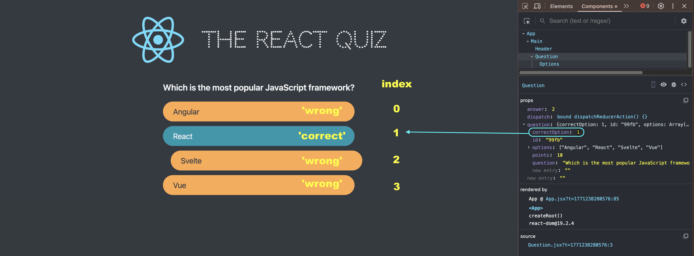


#### 195.2.5 Fix premature styling with `hasAnswered` guard and `disabled` attribute:

**Subsection Summary**
- **Purpose**: Fixes the bug from 195.2.4 where `correct`/`wrong` CSS classes were applied before the user answered. Introduces a `hasAnswered` derived boolean and uses it to conditionally apply styling and disable buttons after answering.
- **Key Changes**: (1) `const hasAnswered = answer !== null` — derives whether the user has already answered from the existing `answer` state. (2) The `correct`/`wrong` class is now wrapped inside a `hasAnswered ? ... : ''` ternary, so these classes only apply after answering. (3) `disabled={hasAnswered}` prevents further clicks once answered.
- **Screenshot (002)**: Shows the bug — before answering, "React" option appears highlighted differently because the `correct`/`wrong` classes leak through. This is the visual motivation for adding the `hasAnswered` guard.
- **Pattern**: Derived state for conditional rendering — instead of adding an `isAnswered` flag to the reducer, the component computes it from the existing `answer` value. This keeps the reducer minimal.

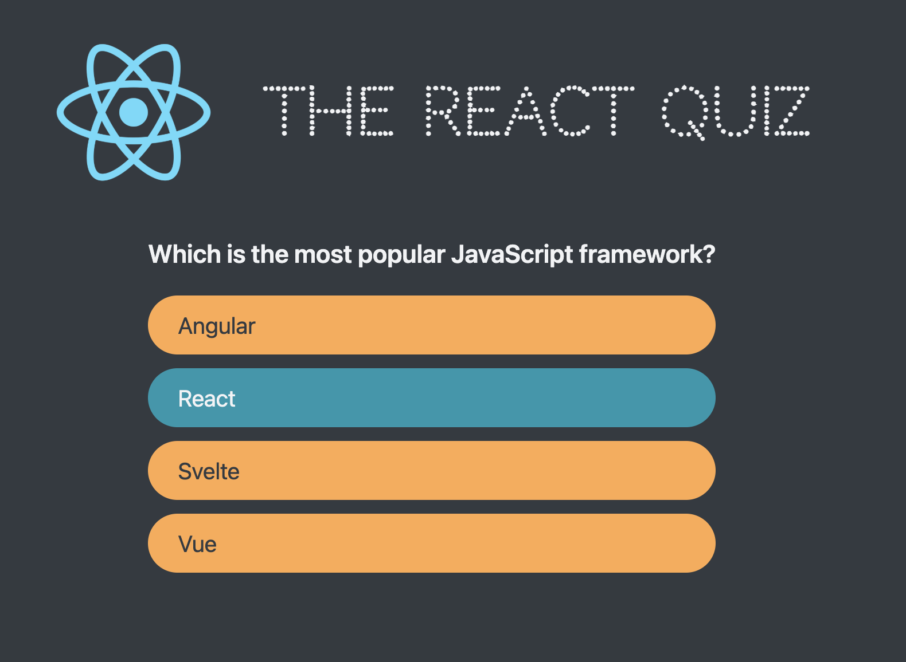
```jsx
/* src/components/Options.jsx */
const Options = ({ question, answer, dispatch }) => {
  const hasAnswered = answer !== null;                                            // 👈🏽 ✅ (1)
  return (
    <div className="options">
      {question.options.map((option, index) => (
        <button
          className={`btn btn-option 
            ${index === answer ? 'answer' : ''} 
            ${hasAnswered ?                                                      // 👈🏽 ✅ (2)
              index === question.correctOption ? 
                'correct' 
              : 
                "wrong" 
            : 
              ''
            }`
          }
          key={option}
          onClick={() => dispatch({ type: 'newAnswer', payload: index })}
          disabled={hasAnswered}                                                 // 👈🏽 ✅ (3)
        >
          {option}
        </button>
      ))}
    </div>
  );
};
export default Options;
```

#### 195.2.6 Add `points` state and award points in the `newAnswer` reducer case:

**Subsection Summary**
- **Purpose**: Extends the reducer to track the user's score. Adds `points: 0` to `initialState` and modifies the `'newAnswer'` case to conditionally award the current question's point value when the correct option is selected.
- **Key Changes**: (1) `points: 0` added to `initialState`. (2) Inside the `'newAnswer'` case, `const question = state.questions.at(state.index)` retrieves the current question object. (3) The points calculation uses `action.payload === question.correctOption ? state.points + question.points : state.points` — if the user selected the correct option, the question's individual point value is added; otherwise, points remain unchanged.
- **Screenshot (003)**: Shows the console with the expanded `questions` array. Each question object has a `points` property (10, 20, 30) — the screenshot highlights these values to show that questions have variable point weights.
- **Pattern**: Derived computation inside the reducer — the reducer accesses its own state (`state.questions`, `state.index`) to look up the correct answer and point value, then computes the new `points` total. This keeps all scoring logic centralized.

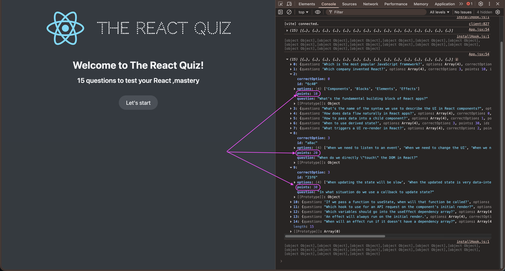

```jsx
/* src/App.jsx */
import Header from "./components/Header";
import { useEffect, useReducer } from "react";
import Main from "./components/Main";
import Loader from "./components/Loader";
import Error from "./components/Error";
import StartScreen from "./components/StartScreen";
import Question from "./components/Question";
const initialState = {
  questions: [],
  status: "loading", // 'loading' 'error', 'ready', 'active', 'finished'
  index: 0,
  answer: null,
  points: 0,                                                                  // 👈🏽 ✅ (1)
};
const reducer = (state, action) => {
  switch (action.type) {
    case "dataReceived":
      return {
        ...state,
        questions: action.payload,
        status: "ready",
      };
    case "dataFailed":
      return {
        ...state,
        status: "error",
      };
    case 'start':
      return {
        ...state,
        status: 'active'
      }
    case 'newAnswer':
      const question = state.questions.at(state.index);                         // 👈🏽 ✅ (2)
      return {
        ...state,
        answer: action.payload,
        points: action.payload === question.correctOption                       // 👈🏽 ✅ (3)
          //? state.points + 1 
          ? state.points + question.points                                      // 👈🏽 ✅ (3)
          : state.points,                                                       // 👈🏽 ✅ (3)
      }
    default:
      throw new Error("Action Unknown!");
  }
};
function App() {
  const [
    { questions, status, index, answer }, 
    dispatch] = useReducer(reducer, initialState);
  const numQuestions = questions.length;
  console.log(questions)

  useEffect(() => {
    fetch("http://localhost:8000/questions")
      .then((resp) => resp.json())
      .then((data) => dispatch({ type: "dataReceived", payload: data }))
      .catch((error) => dispatch({ type: "dataFailed" }));
  }, []);
  return (
    <div className="app">
      <Main>
        <Header />
        {status === "loading" && <Loader />}
        {status === "error" && <Error />}
        {status === "ready" && 
          <StartScreen
            numQuestions={numQuestions}
            dispatch={dispatch} 
          />
        }
        {status === "active" &&
          <Question 
            question={questions[index]}
            answer={answer}
            dispatch={dispatch}
          />}
      </Main>
    </div>
  );
}
export default App;
```

#### 195.2.7 Visual verification — points awarded on correct vs wrong answer:

**Subsection Summary**
- **Purpose**: Provides visual confirmation via React DevTools that the scoring logic works correctly.
- **Screenshot (004)**: A side-by-side comparison of two scenarios. **Left panel**: The user selected "React" (index 1), which matches `correctOption: 1` — React DevTools show `answer: 1`, `points: 10` (the question's point value was awarded). **Right panel**: The user selected "Angular" (index 0), which does not match `correctOption: 1` — React DevTools show `answer: 0`, `points: 0` (no points awarded). This confirms the conditional scoring logic in the `'newAnswer'` reducer case is working as expected.

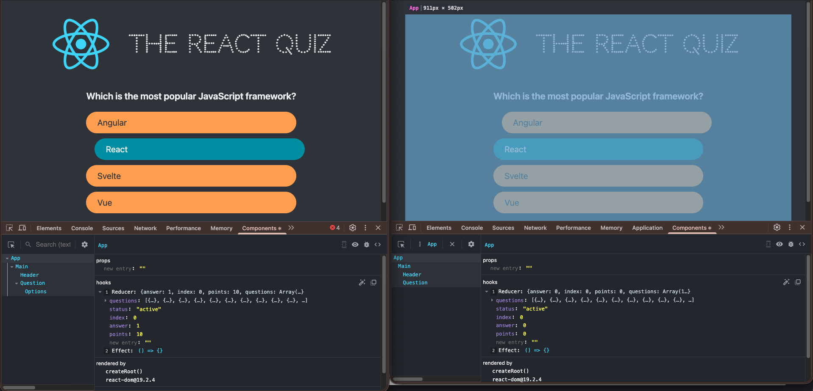

### 🐞 195.3 Issues:

- **`console.log(question)` still present in `Question`**: The debugging statement from Lesson 194 was never removed and continues to log the full question object on every render.
- **`console.log(questions)` added in `App`**: A new debugging `console.log(questions)` was added in `App` and logs the entire questions array on every render.
- **`const` declaration inside `switch` case without block scope**: `const question = state.questions.at(state.index)` is declared directly inside the `case 'newAnswer':` block without wrapping braces, which some linters flag as a potential scope issue.
- **`points` not destructured from `useReducer`**: `points` was added to `initialState` but is not destructured in `App`'s `useReducer` call (`{ questions, status, index, answer }`), so it is not accessible in the component for display purposes.
- **Conditional `className` template literal is deeply nested and hard to read**: The multi-line ternary inside the template literal in `Options` makes the JSX difficult to parse at a glance.
- **No `aria-label` on option buttons**: The buttons lack accessibility attributes, making it hard for screen readers to convey the answer's correctness state.
- **Option string still used as `key`**: Carried over from Lesson 194 — duplicate option text within a question would cause React key collisions.

| Issue | Status | Log/Error |
|---|---|---|
| `console.log(question)` left in `Question` | ⚠️ Identified | `src/components/Question.jsx:4` — Debugging statement logs the entire question object on every render. Should be removed before production. |
| `console.log(questions)` left in `App` | ⚠️ Identified | `src/App.jsx:56` — Debugging statement logs the full questions array on every render. Should be removed before production. |
| `const` inside `switch` case without block scope | ℹ️ Low Priority | `src/App.jsx:37` — `const question = state.questions.at(state.index)` declared inside `case 'newAnswer':` without wrapping `{}`. Some linters (e.g., `no-case-declarations`) flag this. |
| `points` not destructured from `useReducer` | ⚠️ Identified | `src/App.jsx:53` — `points` exists in state but is not destructured: `{ questions, status, index, answer }`. It will be needed once a score display component is added. |
| Nested ternary in `className` is hard to read | ℹ️ Low Priority | `src/components/Options.jsx:7-16` — Multi-level ternary inside a template literal. Consider using a `classnames`/`clsx` utility or extracting to a helper function. |
| No `aria-label` on option buttons | ℹ️ Informational | `src/components/Options.jsx:6-21` — Buttons lack accessibility attributes for screen readers to convey correctness state. |
| Option string used as React `key` | ℹ️ Informational | `src/components/Options.jsx:18` — `key={option}` relies on option text uniqueness. Duplicate options within a question would cause key collisions. |

### 🧱 195.4 Pending Fixes (TODO)

- [ ] Remove `console.log(question)` from `src/components/Question.jsx:4`.
- [ ] Remove `console.log(questions)` from `src/App.jsx:56`.
- [ ] Destructure `points` from `useReducer` in `src/App.jsx:53`: `{ questions, status, index, answer, points }` — will be needed for a score display component.
- [ ] Wrap the `case 'newAnswer':` body in braces to satisfy `no-case-declarations` linter rule in `src/App.jsx:36-45`:
```jsx
case 'newAnswer': {
  const question = state.questions.at(state.index);
  return { ...state, answer: action.payload, points: action.payload === question.correctOption ? state.points + question.points : state.points };
}
```
- [ ] Simplify the `className` logic in `src/components/Options.jsx:7-16` using a helper function or `clsx`:
```jsx
import clsx from 'clsx';
// ...
className={clsx('btn', 'btn-option', {
  answer: index === answer,
  correct: hasAnswered && index === question.correctOption,
  wrong: hasAnswered && index !== question.correctOption,
})}
```
- [ ] Add `aria-label` to option buttons in `src/components/Options.jsx:6`, e.g. `aria-label={`Select answer: ${option}`}`.
- [ ] Use numeric indices or unique IDs as `key` instead of option text strings to avoid potential key collisions in `src/components/Options.jsx:18`.
- [ ] Add bounds check before accessing `questions[index]` in `src/App.jsx:78` to prevent crashes if `index` exceeds array length.

[↑ top - 195. Lesson 195 — *Handling New Answers*](#-195-lesson-195--handling-new-answers)


<br>

## 🔧 196. Lesson 196 — *Moving to the Next Question*

[🧳 Section 16: *The Advanced useReducer Hook*](#section-16-the-advanced-usereducer-hook)

### 📑 Table of Contents:
- [196. Lesson 196 — *Moving to the Next Question*](#-196-lesson-196--moving-to-the-next-question)
- [196.1 Context](#-1961-context)
- [196.2 Updating code according the context](#️-1962-updating-codetheory-according-the-context)
  - [196.2.1 Creating the `NextButton` component scaffold](#19621-creating-the-nextbutton-component-scaffold)
  - [196.2.2 Importing `NextButton`, adding `'nextQuestion'` case, and rendering the button in `App`](#19622-importing-nextbutton-adding-nextquestion-case-and-rendering-the-button-in-app)
  - [196.2.3 Implementing the `NextButton` conditional rendering and dispatch logic](#19623-implementing-the-nextbutton-conditional-rendering-and-dispatch-logic)
  - [196.2.4 Fixing the bug — resetting `answer` to `null` on `'nextQuestion'`](#19624-fixing-the-bug--resetting-answer-to-null-on-nextquestion)
- [196.3 Issues](#-1963-issues)
- [196.4 Pending Fixes (TODO)](#-1964-pending-fixes-todo)

### 🧠 196.1 Context:

This lesson focuses on implementing the ability to **move to the next question** in the React Quiz application after a user has selected an answer. The core mechanism relies on the `useReducer` pattern already established in previous lessons: a new action type (`'nextQuestion'`) increments the `index` state property, and a new `NextButton` component dispatches that action.

**Key Concepts**

1. **Conditional rendering based on state** — The `NextButton` only appears after the user has answered a question (`answer !== null`). This is accomplished via an early return (`if (answer === null) return null`), which is a clean and idiomatic React pattern.
2. **Index-based question navigation** — The quiz uses an `index` property in state to determine which question from the `questions` array is currently displayed. Dispatching `'nextQuestion'` simply increments `index` by 1.
3. **State reset between questions** — When moving to the next question, the `answer` state must be reset to `null` so the new question renders without a pre-selected option and the `NextButton` hides again until the user answers.
4. **Reducer-driven UI flow** — All navigation logic lives in the reducer function rather than in component event handlers. Components remain thin, only responsible for dispatching actions and rendering based on current state.
5. **No payload required** — Unlike `'newAnswer'` which carries a payload (the selected option index), the `'nextQuestion'` action needs no payload; the reducer simply increments `index` and resets `answer`.

**Advantages**
- Keeps navigation logic centralized in the reducer, making it predictable and easy to test.
- Early return pattern in `NextButton` avoids unnecessary wrapper elements and keeps the component tree clean.
- Resetting `answer` inside the reducer guarantees the UI is always in a consistent state when a new question appears.
- Separating `NextButton` into its own component follows the single-responsibility principle.

**Disadvantages / Gotchas**
- No bounds checking is performed on `index` — clicking "Next" on the last question will attempt to access `questions[questions.length]`, which is `undefined`, and will cause a runtime crash.
- The `console.log(questions)` debugging statement is still present in `App`, and `console.log(question)` is still in `Question`.
- The `points` value is not destructured from state in `App`, so it cannot yet be displayed to the user.

**When to Consider Alternatives**
- For larger quiz applications, consider using a state machine library (e.g., XState) to model valid transitions (e.g., prevent navigating past the last question).
- If questions could be loaded dynamically or in pages, an index-based approach may need to be replaced with cursor/ID-based navigation.
- For complex multi-step forms or wizards, a dedicated step/wizard library may provide built-in bounds checking and transition guards.

### ⚙️ 196.2 Updating code/theory according the context:

#### **Summary**
- This section walks through the full implementation of the "Next Question" feature, from creating the component scaffold to wiring it into the reducer and fixing the `answer` reset bug.
- The problem being solved is: after the user answers a question, they need a way to advance to the next one.
- **196.2.1** creates the initial empty `NextButton` component. **196.2.2** integrates it into `App` — importing it, adding the `'nextQuestion'` reducer case, and rendering it with the necessary props. **196.2.3** implements the actual `NextButton` logic with conditional rendering and the dispatch call. **196.2.4** fixes the bug where the `answer` was not reset to `null` when advancing, causing the previous answer's styling to persist on the new question.

#### 196.2.1 Creating the `NextButton` component scaffold

**Subsection Summary**
- **What it does**: Creates the initial boilerplate for a new `NextButton` component in `src/components/NextButton.jsx`.
- **Responsibility**: Establishes the file and component structure before any logic is added.
- **Key pattern**: Follows the project convention of one component per file, default export, and `const` arrow function syntax.

- As soon as the user clicks on one of the first question's options, a "Next" button needs to appear so the user can move to the next question.
- This means increasing the `index` state value.

```jsx
/* src/components/NextButton.jsx */
const NextButton = () => {
  return (
    <div>
      
    </div>
  )
}
export default NextButton;
```

#### 196.2.2 Importing `NextButton`, adding `'nextQuestion'` case, and rendering the button in `App`

**Subsection Summary**
- **What it does**: Wires the new `NextButton` into the application by (1) importing it, (2) adding a `'nextQuestion'` case to the reducer that increments `index`, and (3) rendering `<NextButton>` inside the `status === "active"` block with `dispatch` and `answer` as props.
- **Responsibility**: Connects the navigation action to the global state and places the button in the correct position in the component tree (below the `<Question>` component).
- **Key patterns**: `useReducer` action dispatching, conditional rendering via short-circuit (`&&`), Fragment (`<>...</>`) wrapper to render sibling elements.
- **Note**: At this stage `'nextQuestion'` only increments `index` but does **not** reset `answer` — this is addressed in 196.2.4.

```jsx
/* src/App.jsx */
import Header from "./components/Header";
import { useEffect, useReducer } from "react";
import Main from "./components/Main";
import Loader from "./components/Loader";
import Error from "./components/Error";
import StartScreen from "./components/StartScreen";
import Question from "./components/Question";
import NextButton from "./components/NextButton";                             // 👈🏽 ✅ (1)

const initialState = {
  questions: [],
  status: "loading", // 'loading' 'error', 'ready', 'active', 'finished'
  index: 0,
  answer: null,
  points: 0,
};

const reducer = (state, action) => {
  switch (action.type) {
    case "dataReceived":
      return {
        ...state,
        questions: action.payload,
        status: "ready",
      };
    case "dataFailed":
      return {
        ...state,
        status: "error",
      };
    case 'start':
      return {
        ...state,
        status: 'active'
      }
    case 'newAnswer': {
      const question = state.questions.at(state.index);
      return {
        ...state,
        answer: action.payload,
        points: action.payload === question.correctOption 
          //? state.points + 1 
          ? state.points + question.points
          : state.points,
      }
    }
    case 'nextQuestion':                                                          // 👈🏽 ✅ (2)
      return {
        ...state,
        index: state.index + 1,                                                   // 👈🏽 ✅ (2)
      }
    default:
      throw new Error("Action Unknown!");
  }
};

function App() {
  const [
    { questions, status, index, answer }, 
    dispatch] = useReducer(reducer, initialState);
  const numQuestions = questions.length;
  console.log(questions)

  useEffect(() => {
    fetch("http://localhost:8000/questions")
      .then((resp) => resp.json())
      .then((data) => dispatch({ type: "dataReceived", payload: data }))
      .catch((error) => dispatch({ type: "dataFailed" }));
  }, []);
  return (
    <div className="app">
      <Main>
        <Header />
        {status === "loading" && <Loader />}
        {status === "error" && <Error />}
        {status === "ready" && 
          <StartScreen
            numQuestions={numQuestions}
            dispatch={dispatch} 
          />
        }
        {status === "active" &&
          <>
            <Question 
              question={questions[index]}
              answer={answer}
              dispatch={dispatch}
            />
            <NextButton dispatch={dispatch} answer={answer}/>                       {/* 👈🏽 ✅ (3) */}
          </>
        }
      </Main>
    </div>
  );
}
export default App;
```

#### 196.2.3 Implementing the `NextButton` conditional rendering and dispatch logic

**Subsection Summary**
- **What it does**: Implements the final `NextButton` component — receives `dispatch` and `answer` as props, conditionally renders only when an answer has been selected, and dispatches `'nextQuestion'` on click.
- **Responsibility**: Provides the UI control for advancing through the quiz. The early return (`if (answer === null) return null`) ensures the button is invisible until the user selects an answer.
- **Key patterns**: Early return for conditional rendering, `dispatch` callback with no payload, `btn btn-ui` CSS classes from the project's existing design system.
- **Important note**: No `payload` is necessary for the `'nextQuestion'` action — the reducer only needs to know which action to perform, not any additional data.

```jsx
/* src/components/NextButton.jsx */
const NextButton = ({ dispatch, answer }) => {
  if(answer === null) return null; 
  return (
    <button
      className="btn btn-ui"
      onClick={() => dispatch({ type: 'nextQuestion' })}
    >
      Next
    </button>
  )
}
export default NextButton;
```

- No payload is necessary.

Issue:

* ⚠️ Answer has not been reset. When moving to the next question, the previous answer's visual state (correct/wrong highlighting) persists because `answer` remains set to the previously selected index instead of being reset to `null`.

#### 196.2.4 Fixing the bug — resetting `answer` to `null` on `'nextQuestion'`

**Subsection Summary**
- **What it does**: Fixes the critical bug from 196.2.3 by adding `answer: null` to the `'nextQuestion'` reducer case's return object.
- **Responsibility**: Ensures that when the user advances to the next question, the UI state is clean — no pre-selected option styling, and the `NextButton` hides again until a new answer is selected.
- **Key pattern**: Demonstrates the importance of resetting dependent state when transitioning between "steps" in a reducer-driven flow. Forgetting to reset `answer` caused the previous answer's correct/wrong CSS classes to appear on the new question's options.
- **Additional issue noted**: The instructor mentions that displaying the current points before each question would be a nice addition, foreshadowing future lessons.

```jsx
/* src/App.jsx */
import Header from "./components/Header";
import { useEffect, useReducer } from "react";
import Main from "./components/Main";
import Loader from "./components/Loader";
import Error from "./components/Error";
import StartScreen from "./components/StartScreen";
import Question from "./components/Question";
import NextButton from "./components/NextButton";
const initialState = {
  questions: [],
  status: "loading", // 'loading' 'error', 'ready', 'active', 'finished'
  index: 0,
  answer: null,
  points: 0,
};
const reducer = (state, action) => {
  switch (action.type) {
    case "dataReceived":
      return {
        ...state,
        questions: action.payload,
        status: "ready",
      };
    case "dataFailed":
      return {
        ...state,
        status: "error",
      };
    case 'start':
      return {
        ...state,
        status: 'active'
      }
    case 'newAnswer': {
      const question = state.questions.at(state.index);
      return {
        ...state,
        answer: action.payload,
        points: action.payload === question.correctOption 
          //? state.points + 1 
          ? state.points + question.points
          : state.points,
      }
    }
    case 'nextQuestion': 
      return {
        ...state,
        index: state.index + 1,
        answer: null,                                                       // 👈🏽 ✅ (1)
      }
    default:
      throw new Error("Action Unknown!");
  }
};

function App() {
  const [
    { questions, status, index, answer }, 
    dispatch] = useReducer(reducer, initialState);
  const numQuestions = questions.length;
  console.log(questions)

  useEffect(() => {
    fetch("http://localhost:8000/questions")
      .then((resp) => resp.json())
      .then((data) => dispatch({ type: "dataReceived", payload: data }))
      .catch((error) => dispatch({ type: "dataFailed" }));
  }, []);
  return (
    <div className="app">
      <Main>
        <Header />
        {status === "loading" && <Loader />}
        {status === "error" && <Error />}
        {status === "ready" && 
          <StartScreen
            numQuestions={numQuestions}
            dispatch={dispatch} 
          />
        }
        {status === "active" &&
          <>
            <Question 
              question={questions[index]}
              answer={answer}
              dispatch={dispatch}
            />
            <NextButton dispatch={dispatch} answer={answer}/>
          </>
        }
      </Main>
    </div>
  );
}
export default App;
```

Issue:
* Displaying the current points before each question — `points` is tracked in state but not yet destructured or rendered anywhere in the UI.

### 🐞 196.3 Issues:

- **No bounds checking on `index` increment**: The `'nextQuestion'` reducer case increments `index` unconditionally. When the user reaches the last question and clicks "Next", `index` will exceed `questions.length - 1`, causing `questions[index]` to be `undefined` and crashing the app.
- **`answer` not reset (fixed in 196.2.4)**: The initial implementation of `'nextQuestion'` in 196.2.2 did not reset `answer` to `null`, causing the previous question's correct/wrong styling to persist on the new question's options. This was fixed in 196.2.4 by adding `answer: null` to the returned state.
- **`console.log(questions)` still present in `App`**: Carried over from Lesson 195 — logs the full questions array on every render.
- **`console.log(question)` still present in `Question`**: Carried over from Lesson 194 — logs the current question object on every render.
- **`points` not destructured from `useReducer` in `App`**: `points` exists in state but is not included in the destructured values (`{ questions, status, index, answer }`), so it cannot be displayed to the user.
- **No accessibility attributes on `NextButton`**: The "Next" button lacks `aria-label` and keyboard-specific handling beyond the default button behavior.
- **No `'finished'` status transition**: There is no mechanism to transition to a `'finished'` status when the user has answered all questions. The app will crash instead of showing a results screen.

| Issue | Status | Log/Error |
|---|---|---|
| No bounds checking on `index` increment | ⚠️ Identified | `src/App.jsx:47-52` — `case 'nextQuestion'` increments `index` without checking if it exceeds `questions.length - 1`. Accessing `questions[index]` with an out-of-bounds index returns `undefined`, crashing `Question` and `Options` components. |
| `answer` not reset on `'nextQuestion'` | ✅ Fixed | `src/App.jsx:51` — Initially missing `answer: null` in the `'nextQuestion'` return. Fixed in 196.2.4 by adding `answer: null` to the returned state object. |
| `console.log(questions)` in `App` | ⚠️ Identified | `src/App.jsx:63` — Debugging statement logs the entire questions array on every render. Should be removed before production. |
| `console.log(question)` in `Question` | ⚠️ Identified | `src/components/Question.jsx:4` — Debugging statement logs the current question object on every render. Carried over from Lesson 194. |
| `points` not destructured from state | ⚠️ Identified | `src/App.jsx:59-61` — `points` is in state but not in the destructured values: `{ questions, status, index, answer }`. It is needed to display the user's score. |
| No `aria-label` on `NextButton` | ℹ️ Low Priority | `src/components/NextButton.jsx:5-10` — The "Next" button lacks an `aria-label` attribute for screen readers. |
| No `'finished'` status transition | ⚠️ Identified | `src/App.jsx:47-52` — No guard or transition to prevent navigating past the last question. Expected to be addressed in a future lesson. |

### 🧱 196.4 Pending Fixes (TODO)

- [ ] Add bounds checking in the `'nextQuestion'` reducer case in `src/App.jsx:47-52` to prevent `index` from exceeding `questions.length - 1`. Either guard the increment or transition to `status: 'finished'`:
```jsx
case 'nextQuestion':
  return {
    ...state,
    index: state.index + 1,
    answer: null,
    status: state.index + 1 >= state.questions.length ? 'finished' : state.status,
  };
```
- [ ] Remove `console.log(questions)` from `src/App.jsx:63`.
- [ ] Remove `console.log(question)` from `src/components/Question.jsx:4`.
- [ ] Destructure `points` from `useReducer` in `src/App.jsx:59-61`: `{ questions, status, index, answer, points }` — needed to display score in the UI.
- [ ] Add `aria-label="Next question"` to the `<button>` in `src/components/NextButton.jsx:5`:
```jsx
<button
  className="btn btn-ui"
  aria-label="Next question"
  onClick={() => dispatch({ type: 'nextQuestion' })}
>
  Next
</button>
```
- [ ] Implement a `'finished'` status screen/component to display final results when all questions have been answered (foreshadowed by the `'finished'` value in the `status` comment at `src/App.jsx:12`).
- [ ] Add a guard in `App` JSX at `src/App.jsx:85` to verify `questions[index]` exists before rendering `<Question>` to prevent potential crashes from an out-of-bounds `index`.

[↑ top - 196. Lesson 196 — *Moving to the Next Question*](#-196-lesson-196--moving-to-the-next-question)

<br>

## 🔧 197. Lesson 197 — *Displaying Progress*

[🧳 Section 16: *The Advanced useReducer Hook*](#-section-16-the-advanced-usereducer-hook)

### 📑 Table of Contents:
- [197. Lesson 197 — *Displaying Progress*](#-197-lesson-197--displaying-progress)
- [197.1 Context](#1971-context)
- [197.2 Updating code/theory according the context](#1972-updating-codetheory-according-the-context)
  - [197.2.1 Basic Progress component with question index and total](#19721-basic-progress-component-with-question-index-and-total)
  - [197.2.2 Integrating Progress into App when status is active](#19722-integrating-progress-into-app-when-status-is-active)
  - [197.2.3 Adding points display to Progress component](#19723-adding-points-display-to-progress-component)
  - [197.2.4 Computing maxPossiblePoints and passing points to Progress](#19724-computing-maxpossiblepoints-and-passing-points-to-progress)
  - [197.2.5 Complete Progress component with question and points display](#19725-complete-progress-component-with-question-and-points-display)
  - [197.2.6 Adding HTML progress bar element](#19726-adding-html-progress-bar-element)
  - [197.2.7 Updating progress bar value when user selects an answer](#19727-updating-progress-bar-value-when-user-selects-an-answer)
- [197.3 Issues](#1973-issues)
- [197.4 Pending Fixes (TODO)](#1974-pending-fixes-todo)

### 🧠 197.1 Context:

This lesson focuses on **displaying quiz progress** during the active phase: showing which question the user is on, how many questions remain, and how many points they have earned. A visual progress bar provides immediate feedback and improves UX.

**Key Concepts:**
1. **Progress UI**: A header displaying `Question X / Y` and `points / maxPoints` keeps the user oriented.
2. **HTML `<progress>` element**: Native HTML5 element with `max` and `value` attributes for a visual bar. Styled via CSS (`::-webkit-progress-bar`, `::-webkit-progress-value`).
3. **Derived state**: `maxPossiblePoints` is computed from `questions.reduce()`—no extra reducer action needed.
4. **Answer-aware progress**: The progress bar advances when the user selects an option *before* moving to the next question. Formula: `value={index + Number(answer !== null)}`—adds 1 when an answer exists to reflect the “answered” state of the current question.

**Advantages:**
- Clear, native semantics with the `<progress>` element.
- Minimal state: `points` and `index` come from existing reducer state; `maxPossiblePoints` is derived.
- Users see progress both as numbers and as a bar, reducing cognitive load.
- Immediate visual feedback when selecting an answer (bar moves before “Next”).

**Disadvantages / Gotchas:**
- `<progress>` styling differs across browsers; use vendor prefixes (`-webkit-`) for consistent appearance.
- `maxPossiblePoints` is recalculated on every render; for large question sets this is negligible but could be memoized if needed.
- The `value` formula assumes `answer !== null` is boolean; `Number(answer !== null)` converts to 0 or 1 for correct progress math.

**When to Consider Alternatives:**
- If you need step-based or multi-phase progress (e.g. sections), a custom progress component with explicit steps may be better.
- For complex animations or non-linear progress, consider libraries like Framer Motion or a custom SVG-based progress indicator.

In this quiz app, the `Progress` component is rendered when `status === 'active'` and receives `index`, `numQuestions`, `points`, `maxPossiblePoints`, and `answer` from the parent `App` component.

### ⚙️ 197.2 Updating code/theory according the context:

#### **Summary**
- **Purpose**: Add a `Progress` component that shows question position, total questions, earned points, and max possible points during the quiz, plus a visual progress bar.
- **Problem solved**: Users had no visibility into how far they were through the quiz or their current score.
- **How subsections connect**: Subsections 197.2.1–197.2.2 introduce the basic `Progress` component and wire it into `App`. Subsections 197.2.3–197.2.5 add points display and `maxPossiblePoints`. Subsections 197.2.6–197.2.7 add the HTML progress bar and make it answer-aware so it updates when the user selects an option.

#### 197.2.1 Basic Progress component with question index and total
**Subsection Summary**
- **Purpose**: Create an initial `Progress` component that displays the current question number and total.
- **Content**: A simple functional component receiving `index` and `numQuestions` as props, rendering `Question X / Y` in a header.
- **Key pattern**: Zero-based `index` shown as `index + 1` for user-facing display.
- **Image**: `../img/section16-lecture197-001.png` illustrates the question counter in the UI.
```jsx
/* src/components/Progress.jsx */
const Progress = ({ index, numQuestions }) => {
  return (
    <header className="progress">
      <p>Question <strong>{index + 1}</strong> / {numQuestions}</p>
    </header>
  )
}
export default Progress
```


#### 197.2.2 Integrating Progress into App when status is active
**Subsection Summary**
- **Purpose**: Render the `Progress` component in `App` only when the quiz is active.
- **Content**: Import `Progress`, pass `index` and `numQuestions`, and render it inside the `status === "active"` block alongside `Question` and `NextButton`.
- **Key pattern**: Progress is shown only during the quiz phase; `numQuestions` comes from `questions.length`.
```jsx
/* src/App.jsx */
import Header from "./components/Header";
import { useEffect, useReducer } from "react";
import Main from "./components/Main";
import Loader from "./components/Loader";
import Error from "./components/Error";
import StartScreen from "./components/StartScreen";
import Question from "./components/Question";
import NextButton from "./components/NextButton";
import Progress from "./components/Progress";                               // 👈🏽 ✅ (1)
const initialState = {
  questions: [],
  status: "loading", // 'loading' 'error', 'ready', 'active', 'finished'
  index: 0,
  answer: null,
  points: 0,
};
const reducer = (state, action) => {
  switch (action.type) {
    case "dataReceived":
      return {
        ...state,
        questions: action.payload,
        status: "ready",
      };
    case "dataFailed":
      return {
        ...state,
        status: "error",
      };
    case 'start':
      return {
        ...state,
        status: 'active'
      }
    case 'newAnswer': {
      const question = state.questions.at(state.index);
      return {
        ...state,
        answer: action.payload,
        points: action.payload === question.correctOption 
          //? state.points + 1 
          ? state.points + question.points
          : state.points,
      }
    }
    case 'nextQuestion': 
      return {
        ...state,
        index: state.index + 1,
        answer: null,
      }
    default:
      throw new Error("Action Unknown!");
  }
};
function App() {
  const [
    { questions, status, index, answer }, 
    dispatch] = useReducer(reducer, initialState);
  const numQuestions = questions.length;
  console.log(questions)

  useEffect(() => {
    fetch("http://localhost:8000/questions")
      .then((resp) => resp.json())
      .then((data) => dispatch({ type: "dataReceived", payload: data }))
      .catch((error) => dispatch({ type: "dataFailed" }));
  }, []);
  return (
    <div className="app">
      <Main>
        <Header />
        {status === "loading" && <Loader />}
        {status === "error" && <Error />}
        {status === "ready" && 
          <StartScreen
            numQuestions={numQuestions}
            dispatch={dispatch} 
          />
        }
        {status === "active" &&
          <>
            <Progress                                                       {/* 👈🏽 ✅ (2) */}
              index={index}
              numQuestions={numQuestions}
            />
            <Question 
              question={questions[index]}
              answer={answer}
              dispatch={dispatch}
            />
            <NextButton dispatch={dispatch} answer={answer}/>
          </>
        }
      </Main>
    </div>
  );
}
export default App;
```

#### 197.2.3
```jsx
/* src/components/Progress.jsx */
const Progress = ({ index, numQuestions, points }) => {                         // 👈🏽 ✅ (1)
  return (
    <header className="progress">
      <p>Question <strong>{index + 1}</strong> / {numQuestions}</p>
      <p>{points} / X</p>                                                       {/* 👈🏽 ✅ (2) */}
    </header>
  )
}
export default Progress;
```

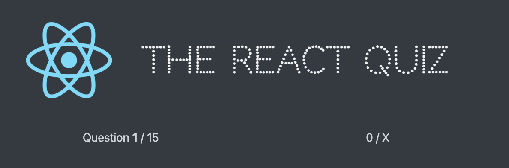

#### 197.2.3 Adding points display to Progress component
**Subsection Summary**
- **Purpose**: Extend `Progress` to show earned points and a placeholder for maximum points.
- **Content**: Add a `points` prop and a second `<p>` displaying `{points} / X` (X is a placeholder until `maxPossiblePoints` is passed).
- **Key pattern**: `points` is already available in reducer state and must be destructured from `useReducer` in `App.jsx` before passing down.
- **Image**: `../img/section16-lecture197-002.png` shows the points display in the header.

#### 197.2.4 Computing maxPossiblePoints and passing points to Progress
**Subsection Summary**
- **Purpose**: Compute total possible points from all questions and pass `points` and `maxPossiblePoints` to `Progress`.
- **Content**: Use `questions.reduce((prev, curr) => prev + curr.points, 0)` to derive `maxPossiblePoints`; destructure `points` from reducer state and pass both to `Progress`.
- **Key pattern**: Derived state—no new reducer logic; computed on each render from existing `questions` data.

```jsx
/* src/App.jsx */
import Header from "./components/Header";
import { useEffect, useReducer } from "react";
import Main from "./components/Main";
import Loader from "./components/Loader";
import Error from "./components/Error";
import StartScreen from "./components/StartScreen";
import Question from "./components/Question";
import NextButton from "./components/NextButton";
import Progress from "./components/Progress";
const initialState = {
  questions: [],
  status: "loading", // 'loading' 'error', 'ready', 'active', 'finished'
  index: 0,
  answer: null,
  points: 0,
};
const reducer = (state, action) => {
  switch (action.type) {
    case "dataReceived":
      return {
        ...state,
        questions: action.payload,
        status: "ready",
      };
    case "dataFailed":
      return {
        ...state,
        status: "error",
      };
    case 'start':
      return {
        ...state,
        status: 'active'
      }
    case 'newAnswer': {
      const question = state.questions.at(state.index);
      return {
        ...state,
        answer: action.payload,
        points: action.payload === question.correctOption 
          //? state.points + 1 
          ? state.points + question.points
          : state.points,
      }
    }
    case 'nextQuestion': 
      return {
        ...state,
        index: state.index + 1,
        answer: null,
      }
    default:
      throw new Error("Action Unknown!");
  }
};
function App() {
  const [
    { questions, status, index, answer, points }, 
    dispatch] = useReducer(reducer, initialState);
  const numQuestions = questions.length;
  const maxPossiblePoints = questions.reduce((prev, curr) => prev + curr.points, 0)           // 👈🏽 ✅ (1)
  console.log(questions)
  console.log(maxPossiblePoints)
  useEffect(() => {
    fetch("http://localhost:8000/questions")
      .then((resp) => resp.json())
      .then((data) => dispatch({ type: "dataReceived", payload: data }))
      .catch((error) => dispatch({ type: "dataFailed" }));
  }, []);
  return (
    <div className="app">
      <Main>
        <Header />
        {status === "loading" && <Loader />}
        {status === "error" && <Error />}
        {status === "ready" && 
          <StartScreen
            numQuestions={numQuestions}
            dispatch={dispatch} 
          />
        }
        {status === "active" &&
          <>
            <Progress 
              index={index}
              numQuestions={numQuestions}
              points={points}
              maxPossiblePoints={maxPossiblePoints}                                             {/* 👈🏽 ✅ (2) */}
            />
            <Question 
              question={questions[index]}
              answer={answer}
              dispatch={dispatch}
            />
            <NextButton dispatch={dispatch} answer={answer}/>
          </>
        }
      </Main>
    </div>
  );
}
export default App;
```

#### 197.2.5 Complete Progress component with question and points display
**Subsection Summary**
- **Purpose**: Finalize the text-based progress display with both question counter and points.
- **Content**: Replace the placeholder `X` with `{maxPossiblePoints}` so the header shows `points / maxPossiblePoints`.
- **Key pattern**: All required props (`index`, `numQuestions`, `points`, `maxPossiblePoints`) are now passed from `App` to `Progress`.
- **Image**: `../img/section16-lecture197-003.png` shows the complete text progress (question number and score).

```jsx
/* src/components/Progress.jsx */
const Progress = ({ index, numQuestions, points, maxPossiblePoints }) => {
  return (
    <header className="progress">
      <p>Question <strong>{index + 1}</strong> / {numQuestions}</p>
      <p>{points} / {maxPossiblePoints}</p>
    </header>
  )
}
export default Progress;
```

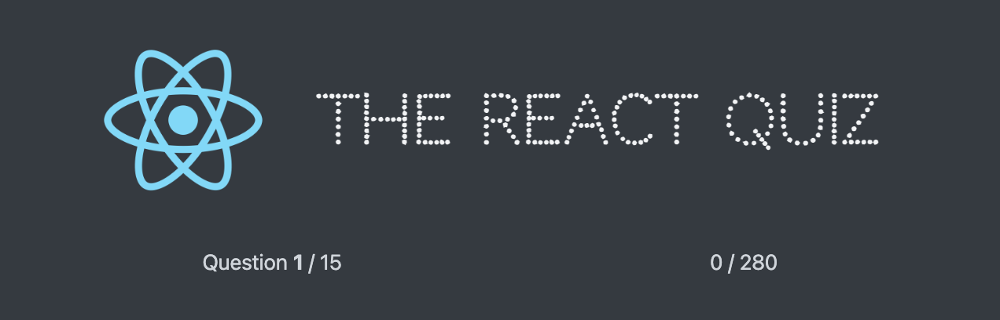

#### 197.2.6 Adding HTML progress bar element
**Subsection Summary**
- **Purpose**: Add a visual progress bar using the native HTML `<progress>` element.
- **Content**: Add `<progress max={numQuestions} value={index}/>` above the header; bar advances as `index` increases.
- **Key pattern**: `max` is total questions; `value` is current index (bar does not yet reflect answer selection—see 197.2.7).
- **Image**: `../img/section16-lecture197-004.png` shows the progress bar; the lesson notes that after clicking an option the bar should change (implemented next).

```jsx
/* src/components/Progress.jsx */
const Progress = ({ index, numQuestions, points, maxPossiblePoints }) => {
  return (
    <>
      <progress max={numQuestions} value={index}/>
      <header className="progress">
        <p>Question <strong>{index + 1}</strong> / {numQuestions}</p>
        <p>{points} / {maxPossiblePoints}</p>
      </header>
    </>
  )
}
export default Progress;
```

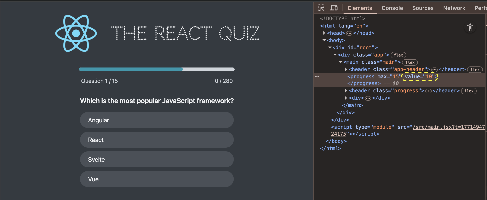

New Functionality:
* After clicking on any option, the progress bar must change its value.

#### 197.2.7 Updating progress bar value when user selects an answer
**Subsection Summary**
- **Purpose**: Make the progress bar reflect that the current question has been answered before the user clicks "Next".
- **Content**: Add `answer` prop; use `value={index + Number(answer !== null)}` so the bar advances by 1 when an option is selected.
- **Key pattern**: `Number(answer !== null)` yields 0 or 1—adds the current question to the "answered" count once the user picks an option.
- **Image**: `../img/section16-lecture197-005.png` illustrates the progress bar state after the user selects an option.

```jsx
/* src/components/Progress.jsx */
const Progress = ({ index, numQuestions, points, maxPossiblePoints, answer }) => {      // 👈🏽 ✅ (1)
  return (
    <>
      <progress max={numQuestions} value={index + Number(answer !== null)}/>            {/* 👈🏽 ✅ (2) */}
      <header className="progress">
        <p>Question <strong>{index + 1}</strong> / {numQuestions}</p>
        <p>{points} / {maxPossiblePoints}</p>
      </header>
    </>
  )
}
export default Progress;
```

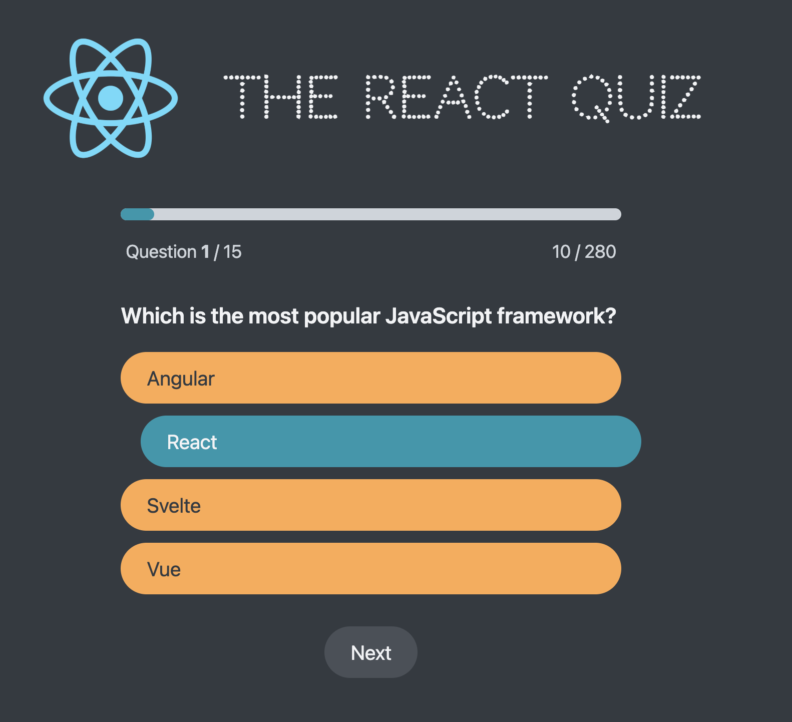


### 🐞 197.3 Issues:

- Debug `console.log` statements in `App.jsx` (shown in 197.2.4) should be removed before production.
- The native `<progress>` element lacks accessibility attributes (`aria-valuemin`, `aria-valuemax`, `aria-valuenow`, `aria-label`) for screen readers.
- Bounds checking for `questions[index]` in `App.jsx` (carried over from Lesson 196) — potential runtime error if `index` goes out of bounds.
- The `.progress` CSS class sets `width: 160%`, which may cause horizontal overflow on smaller viewports.

| Issue | Status | Log/Error |
|---|---|---|
| Debug console.log statements in App | ℹ️ Low Priority | `src/App.jsx:63-64` — `console.log(questions)` and `console.log(maxPossiblePoints)` |
| Progress bar missing accessibility attributes | ⚠️ Identified | `src/components/Progress.jsx:4` — `<progress>` lacks `aria-valuemin`, `aria-valuemax`, `aria-valuenow`, `aria-label` |
| Out-of-bounds index for questions array | ⚠️ Identified | `src/App.jsx:95` — `questions[index]` may be undefined when `index >= questions.length` |
| Progress header width causes overflow | ℹ️ Informational | `src/index.css:99-107` — `.progress { width: 160% }` |

### 🧱 197.4 Pending Fixes (TODO)

- [ ] Remove `console.log(questions)` and `console.log(maxPossiblePoints)` from `src/App.jsx` if still present.
- [ ] Add accessibility attributes to the `<progress>` element in `src/components/Progress.jsx`:
```jsx
<progress
  max={numQuestions}
  value={index + Number(answer !== null)}
  aria-valuemin={0}
  aria-valuemax={numQuestions}
  aria-valuenow={index + Number(answer !== null)}
  aria-label="Quiz progress"
/>
```
- [ ] Add a guard in `App.jsx` to verify `questions[index]` exists before rendering `<Question>` (e.g. `questions[index] && <Question ... />`).
- [ ] Consider reducing `.progress` width in `src/index.css` or using `max-width` for better responsiveness on smaller screens.

[↑ top - 197. Lesson 197 — *Displaying Progress*](#-197-lesson-197--displaying-progress)

<br>

## 🔧 198. Lesson 198 — *Finishing a Quiz*

[🧳 Section 16: *The Advanced useReducer Hook*](#section-16-the-advanced-usereducer-hook)

### 📑 Table of Contents:
- [198. Lesson 198 — *Finishing a Quiz*](#-198-lesson-198--finishing-a-quiz)
- [198.1 Context](#1981-context)
- [198.2 Updating code/theory according the context](#1982-updating-codetheory-according-the-context)
  - [198.2.1 FinishScreen component and status 'finished'](#19821-finishscreen-component-and-status-finished)
  - [198.2.2 Out-of-bounds index at last question](#19822-out-of-bounds-index-at-last-question)
  - [198.2.3 Fixing NextButton with numQuestions check](#19823-fixing-nextbutton-with-numquestions-check)
  - [198.2.4 Finish button on last question](#19824-finish-button-on-last-question)
  - [198.2.5 Adding 'finish' reducer case](#19825-adding-finish-reducer-case)
  - [198.2.6 Highscore state and reducer update](#19826-highscore-state-and-reducer-update)
  - [198.2.7 FinishScreen with emoji feedback and highscore display](#19827-finishscreen-with-emoji-feedback-and-highscore-display)
- [198.3 Issues](#1983-issues)
- [198.4 Pending Fixes (TODO)](#1984-pending-fixes-todo)

### 🧠 198.1 Context:

This lesson completes the quiz flow by handling the transition from the last question to a **Finish Screen**, displaying the final score, and optionally tracking a **highscore**.

**Key Concepts**

1. **Finish Screen**: A dedicated component (`FinishScreen`) renders when `status === 'finished'`. It receives `points` and `maxPossiblePoints` to compute and display the percentage score.

2. **Conditional Next/Finish Button**: The `NextButton` must change behavior on the last question—showing "Next" for indices `0` to `numQuestions - 2`, and "Finish" when `index === numQuestions - 1`. Clicking "Finish" dispatches a `finish` action to move the quiz into the finished state.

3. **Reducer `finish` Case**: The reducer handles `action.type === 'finish'` by setting `status: "finished"` and optionally updating `highscore` if the current `points` exceed the previous highscore.

4. **Highscore Tracking**: Highscore is stored in Reducer state, updated when finishing the quiz. It provides simple in-session persistence (survives until the page is refreshed).

5. **User Feedback**: The `FinishScreen` uses percentage-based emoji feedback (🥇, 🎉, 😃, 🤔, 🤦🏽) to make the result more engaging.

**Advantages**

- Clear separation between quiz state (`active`) and result state (`finished`).
- Single source of truth for highscore in Reducer state.
- Percentage and emoji feedback improve UX without extra libraries.

**Disadvantages / Gotchas**

- Highscore is lost on page refresh (no `localStorage` persistence in this lesson).
- Emoji logic using multiple `if` statements can overwrite values when ranges overlap (e.g. `percentage === 0`).
- Division by zero if `maxPossiblePoints === 0` (edge case when no questions are loaded).
- `NextButton` returns `undefined` when neither condition matches (edge case when `index` is out of bounds).

**When to Consider Alternatives**

- Use `localStorage` or a backend to persist highscore across sessions.
- Use `else if` or a lookup structure for emoji selection to avoid overwrites.
- Add guards for empty `questions` array or zero `maxPossiblePoints`.

### ⚙️ 198.2 Updating code/theory according the context:

#### **Summary**
- **Purpose**: Implement the end-of-quiz flow—from the last question to a finish screen with score and highscore.
- **Problem**: Without a "Finish" state, the app had no way to complete the quiz, and an out-of-bounds index at the last question caused errors.
- **Connection**: The subsections progressively add:
  1. `FinishScreen` and manual DevTools test for `status === 'finished'`.
  2. Identification of the index-out-of-bounds bug.
  3. Fix via `numQuestions` check in `NextButton`.
  4. "Finish" button and `finish` reducer case.
  5. Highscore in state and reducer.
  6. Enhanced `FinishScreen` with emoji and highscore display.

#### 198.2.1 FinishScreen component and status 'finished'
**Subsection Summary**
- **Purpose**: Introduce the `FinishScreen` component that displays the final score (points, maxPossiblePoints, percentage).
- **Content**: A simple functional component receiving `points` and `maxPossiblePoints`, computing percentage and rendering a result message.
- **Steps**: Use React DevTools to manually set `status` to `"finished"` in the Reducer to verify that `FinishScreen` renders.
- **Image**: `../img/section16-lecture198-001.png` illustrates the Finish Screen visible when status is `finished`.

```jsx
/* src/components/FinishScreen.jsx */
const FinishScreen = ({ points, maxPossiblePoints }) => {
  const percentage = (points / maxPossiblePoints) * 100;
  return (
    <p className="result">
      You scored <strong>{points}</strong> out of {maxPossiblePoints} ({Math.ceil(percentage)}%)
    </p>
  )
}

export default FinishScreen;
```

Steps:

* Open `DevTools`
* Select `Components`
* Click on `App` then open `Reducer`
* In `status`, click and change to `finished`
* Expected: `FinishScreen` component is visible.

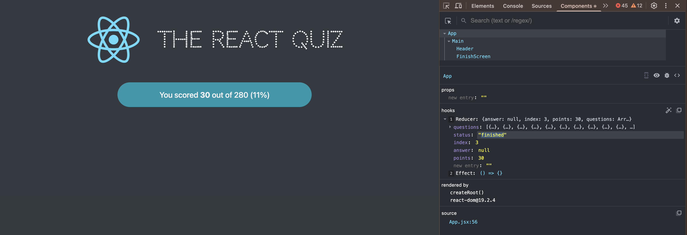

#### 198.2.2 Out-of-bounds index at last question
**Subsection Summary**
- **Purpose**: Expose the bug where advancing past the last question causes `index` to exceed the `questions` array bounds.
- **Content**: When clicking "Next" on the last question, `index` becomes equal to `numQuestions`, so `questions[index]` is `undefined` and the app can crash or render incorrectly.
- **Image**: `../img/section16-lecture198-002.png` shows the error (e.g., index = 15 when array length is 15, valid indices 0–14).

* Going to the last question.

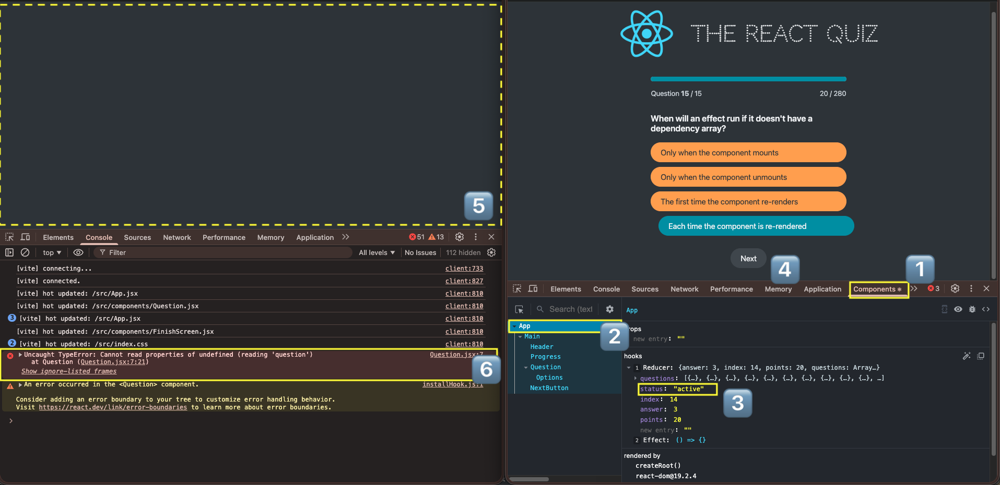

#### 198.2.3 Fixing NextButton with numQuestions check
**Subsection Summary**
- **Purpose**: Fix the out-of-bounds bug by rendering "Next" only when `index < numQuestions - 1`.
- **Content**: `NextButton` now receives `index` and `numQuestions`; it shows the Next button only for non-last questions. On the last question, nothing is rendered yet (Finish button added in 198.2.4).
- **Key pattern**: Conditional rendering based on `index` and `numQuestions` to control navigation flow.

```jsx
/* src/components/NextButton.jsx */
const NextButton = ({ dispatch, answer, index, numQuestions }) => {   // 👈🏽 ✅
  if(answer === null) return null;
  
  if(index < numQuestions - 1) return (                               // 👈🏽 ✅
    <button
      className="btn btn-ui"
      onClick={() => dispatch({ type: 'nextQuestion' })}
    >
      Next
    </button>
  )
}
export default NextButton;
```

in the meantime:

```jsx
/* src/App.jsx */
import Header from "./components/Header";
import { useEffect, useReducer } from "react";
import Main from "./components/Main";
import Loader from "./components/Loader";
import Error from "./components/Error";
import StartScreen from "./components/StartScreen";
import Question from "./components/Question";
import NextButton from "./components/NextButton";
import Progress from "./components/Progress";
import FinishScreen from "./components/FinishScreen";

const initialState = {
  questions: [],
  status: "loading", // 'loading' 'error', 'ready', 'active', 'finished'
  index: 0,
  answer: null,
  points: 0,
};

const reducer = (state, action) => {
  switch (action.type) {
    case "dataReceived":
      return {
        ...state,
        questions: action.payload,
        status: "ready",
      };
    case "dataFailed":
      return {
        ...state,
        status: "error",
      };
    case 'start':
      return {
        ...state,
        status: 'active'
      }
    case 'newAnswer': {
      const question = state.questions.at(state.index);
      return {
        ...state,
        answer: action.payload,
        points: action.payload === question.correctOption 
          //? state.points + 1 
          ? state.points + question.points
          : state.points,
      }
    }
    case 'nextQuestion': 
      return {
        ...state,
        index: state.index + 1,
        answer: null,
      }
    default:
      throw new Error("Action Unknown!");
  }
};

function App() {
  const [
    { questions, status, index, answer, points }, 
    dispatch] = useReducer(reducer, initialState);
  const numQuestions = questions.length;
  const maxPossiblePoints = questions.reduce((prev, curr) => prev + curr.points, 0)
  useEffect(() => {
    fetch("http://localhost:8000/questions")
      .then((resp) => resp.json())
      .then((data) => dispatch({ type: "dataReceived", payload: data }))
      .catch((error) => dispatch({ type: "dataFailed" }));
  }, []);
  return (
    <div className="app">
      <Main>
        <Header />
        {status === "loading" && <Loader />}
        {status === "error" && <Error />}
        {status === "ready" && 
          <StartScreen
            numQuestions={numQuestions}
            dispatch={dispatch} 
          />
        }
        {status === "active" &&
          <>
            <Progress 
              index={index}
              numQuestions={numQuestions}
              points={points}
              maxPossiblePoints={maxPossiblePoints}
              answer={answer}
            />
            <Question 
              question={questions[index]}
              answer={answer}
              dispatch={dispatch}
            />
            <NextButton
              dispatch={dispatch}
              answer={answer}
              index={index}                                                       {/* 👈🏽 ✅ */}
              numQuestions={numQuestions}                                         {/* 👈🏽 ✅ */}
            />
          </>
        }
        {status === "finished" && 
          <FinishScreen 
            points={points} 
            maxPossiblePoints={maxPossiblePoints}
          />}
      </Main>
    </div>
  );
}
export default App;
```

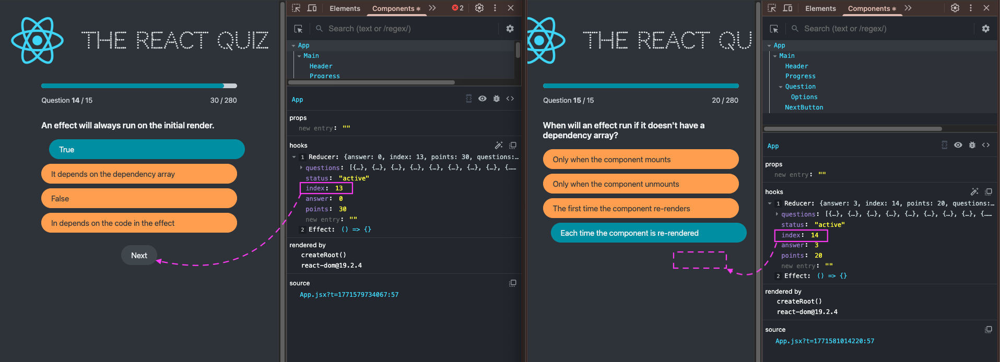

#### 198.2.4 Finish button on last question
**Subsection Summary**
- **Purpose**: Add a "Finish" button that appears on the last question instead of "Next".
- **Content**: When `index === numQuestions - 1`, render a button that dispatches `{ type: 'finish' }` instead of `{ type: 'nextQuestion' }`. This prevents incrementing `index` beyond bounds and transitions the quiz to the finished state.
- **Key pattern**: Two mutually exclusive conditions—Next for middle questions, Finish for the last one.

```jsx
/* src/components/NextButton.jsx */
const NextButton = ({ dispatch, answer, index, numQuestions }) => {
  if(answer === null) return null;
  if(index < numQuestions - 1) return (
    <button
      className="btn btn-ui"
      onClick={() => dispatch({ type: 'nextQuestion' })}
    >
      Next
    </button>
  )
  
  if(index === numQuestions - 1)                                                    // 👈🏽 ✅
    return ( 
    <button
      className="btn btn-ui"
      onClick={() => dispatch({ type: 'finish' })}
    >
      Finish
    </button>
  )
}

export default NextButton;
```

#### 198.2.5 Adding 'finish' reducer case
**Subsection Summary**
- **Purpose**: Handle the `finish` action in the reducer to set `status: "finished"`.
- **Content**: Add `case "finish"` returning `{ ...state, status: "finished" }`. When dispatched from the Finish button, the app switches to the `status === "finished"` branch and renders `FinishScreen`.
- **Key pattern**: Reducer case for state transition without changing `index` or `points`.

```jsx
/* src/App.jsx */
import Header from "./components/Header";
import { useEffect, useReducer } from "react";
import Main from "./components/Main";
import Loader from "./components/Loader";
import Error from "./components/Error";
import StartScreen from "./components/StartScreen";
import Question from "./components/Question";
import NextButton from "./components/NextButton";
import Progress from "./components/Progress";
import FinishScreen from "./components/FinishScreen";

const initialState = {
  questions: [],
  status: "loading", // 'loading' 'error', 'ready', 'active', 'finished'
  index: 0,
  answer: null,
  points: 0,
};

const reducer = (state, action) => {
  switch (action.type) {
    case "dataReceived":
      return {
        ...state,
        questions: action.payload,
        status: "ready",
      };
    case "dataFailed":
      return {
        ...state,
        status: "error",
      };
    case 'start':
      return {
        ...state,
        status: 'active'
      }
    case 'newAnswer': {
      const question = state.questions.at(state.index);
      return {
        ...state,
        answer: action.payload,
        points: action.payload === question.correctOption 
          //? state.points + 1 
          ? state.points + question.points
          : state.points,
      }
    }
    case 'nextQuestion': 
      return {
        ...state,
        index: state.index + 1,
        answer: null,
      }
    case "finish":                                                // 👈🏽 ✅
      return {
        ...state,
        status: "finished",
      }
    default:
      throw new Error("Action Unknown!");
  }
};

function App() {
  const [
    { questions, status, index, answer, points }, 
    dispatch] = useReducer(reducer, initialState);
  const numQuestions = questions.length;
  const maxPossiblePoints = questions.reduce((prev, curr) => prev + curr.points, 0)
  // console.log(questions)
  // console.log(maxPossiblePoints)

  useEffect(() => {
    fetch("http://localhost:8000/questions")
      .then((resp) => resp.json())
      .then((data) => dispatch({ type: "dataReceived", payload: data }))
      .catch((error) => dispatch({ type: "dataFailed" }));
  }, []);
  return (
    <div className="app">
      <Main>
        <Header />
        {status === "loading" && <Loader />}
        {status === "error" && <Error />}
        {status === "ready" && 
          <StartScreen
            numQuestions={numQuestions}
            dispatch={dispatch} 
          />
        }
        {status === "active" &&
          <>
            <Progress 
              index={index}
              numQuestions={numQuestions}
              points={points}
              maxPossiblePoints={maxPossiblePoints}
              answer={answer}
            />
            <Question 
              question={questions[index]}
              answer={answer}
              dispatch={dispatch}
            />
            <NextButton
              dispatch={dispatch}
              answer={answer}
              index={index}
              numQuestions={numQuestions}
            />
          </>
        }
        {status === "finished" && <FinishScreen points={points} maxPossiblePoints={maxPossiblePoints}/>}
      </Main>
    </div>
  );
}
export default App;
```

#### 198.2.6 Highscore state and reducer update
**Subsection Summary**
- **Purpose**: Add highscore tracking to state and update it when finishing the quiz.
- **Content**: Add `highscore: 0` to `initialState`; in the `finish` case, set `highscore` to `Math.max(state.points, state.highscore)`. Destructure `highscore` from state and pass it to `FinishScreen`.
- **Key pattern**: Derived/in-session persistence of best score within the current Reducer state.

```jsx
/* src/App.jsx */
import Header from "./components/Header";
import { useEffect, useReducer } from "react";
import Main from "./components/Main";
import Loader from "./components/Loader";
import Error from "./components/Error";
import StartScreen from "./components/StartScreen";
import Question from "./components/Question";
import NextButton from "./components/NextButton";
import Progress from "./components/Progress";
import FinishScreen from "./components/FinishScreen";
const initialState = {
  questions: [],
  status: "loading", // 'loading' 'error', 'ready', 'active', 'finished'
  index: 0,
  answer: null,
  points: 0,
  highscore: 0,                                               // 👈🏽 ✅ (1)
};
const reducer = (state, action) => {
  switch (action.type) {
    case "dataReceived":
      return {
        ...state,
        questions: action.payload,
        status: "ready",
      };
    case "dataFailed":
      return {
        ...state,
        status: "error",
      };
    case 'start':
      return {
        ...state,
        status: 'active'
      }
    case 'newAnswer': {
      const question = state.questions.at(state.index);
      return {
        ...state,
        answer: action.payload,
        points: action.payload === question.correctOption 
          //? state.points + 1 
          ? state.points + question.points
          : state.points,
      }
    }
    case 'nextQuestion': 
      return {
        ...state,
        index: state.index + 1,
        answer: null,
      }
    case "finish":
      return {
        ...state,
        status: "finished",
        highscore:                                                        // 👈🏽 ✅ (2)
          state.points > state.highscore ? 
            state.points : 
            state.highscore,
      }
    default:
      throw new Error("Action Unknown!");
  }
};
function App() {
  const [
    { questions, status, index, answer, points, highscore }, 
    dispatch] = useReducer(reducer, initialState);
  const numQuestions = questions.length;
  const maxPossiblePoints = questions.reduce((prev, curr) => prev + curr.points, 0)
  useEffect(() => {
    fetch("http://localhost:8000/questions")
      .then((resp) => resp.json())
      .then((data) => dispatch({ type: "dataReceived", payload: data }))
      .catch((error) => dispatch({ type: "dataFailed" }));
  }, []);
  return (
    <div className="app">
      <Main>
        <Header />
        {status === "loading" && <Loader />}
        {status === "error" && <Error />}
        {status === "ready" && 
          <StartScreen
            numQuestions={numQuestions}
            dispatch={dispatch} 
          />
        }
        {status === "active" &&
          <>
            <Progress 
              index={index}
              numQuestions={numQuestions}
              points={points}
              maxPossiblePoints={maxPossiblePoints}
              answer={answer}
            />
            <Question 
              question={questions[index]}
              answer={answer}
              dispatch={dispatch}
            />
            <NextButton
              dispatch={dispatch}
              answer={answer}
              index={index}
              numQuestions={numQuestions}
            />
          </>
        }
        {status === "finished" && 
          <FinishScreen
            points={points}
            maxPossiblePoints={maxPossiblePoints}
            highscore={highscore}                                                     {/* 👈🏽 ✅ (3) */}
          />}
      </Main>
    </div>
  );
}
export default App;
```

#### 198.2.7 FinishScreen with emoji feedback and highscore display
**Subsection Summary**
- **Purpose**: Enhance `FinishScreen` with percentage-based emoji feedback and highscore display.
- **Content**: Accept `highscore` prop; compute percentage; assign emoji based on percentage ranges (🥇 100%, 🎉 80–99%, 😃 50–79%, 🤔 1–49%, 🤦🏽 0%); render highscore below the result.
- **Key pattern**: Simple conditional logic for user feedback; highscore displayed as `(Highscore: X points)`.
- **Image**: `../img/section16-lecture198-004.png` shows the finish screen with highscore and emoji on the last question / finish state.

```jsx
/* src/components/FinishScreen.jsx */
const FinishScreen = ({ points, maxPossiblePoints, highscore }) => {                  // 👈🏽 ✅ (1)
  const percentage = (points / maxPossiblePoints) * 100;
  let emoji;
  if(percentage === 100) emoji = '🥇';
  if(percentage >=80 && percentage < 100) emoji = '🎉'
  if(percentage >=50 && percentage < 80) emoji = '😃'
  if(percentage >=0 && percentage < 50) emoji = '🤔'
  if(percentage === 0) emoji = '🤦🏽';
  return (
    <>
      <p className="result">
        <span>{emoji}</span> You scored <strong>{points}</strong> out of {maxPossiblePoints} ({Math.ceil(percentage)}%)
      </p>
      <p className="highscore">(Highscore: {highscore} points)</p>                      {/* 👈🏽 ✅ (2) */}
    </>
  )
}
export default FinishScreen;
```

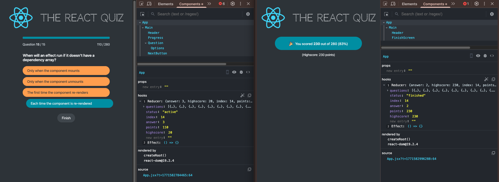

### 🐞 198.3 Issues:

- FinishScreen emoji logic uses sequential `if` statements without `else if`, causing the last matching condition to overwrite earlier ones when ranges overlap (e.g., `percentage === 0` overwrites the 0–50% range).
- Division by zero when `maxPossiblePoints === 0` (e.g., empty questions array) in FinishScreen percentage calculation.
- `NextButton` returns `undefined` when neither `index < numQuestions - 1` nor `index === numQuestions - 1` (edge case when index is out of bounds).
- Highscore is stored only in Reducer state and is lost on page refresh; no `localStorage` or backend persistence.

| Issue | Status | Log/Error |
|---|---|---|
| FinishScreen emoji logic overlapping conditions | ⚠️ Identified | `src/components/FinishScreen.jsx:6-10` — sequential `if` statements; `percentage === 0` overwrites `percentage >= 0 && percentage < 50` |
| Division by zero when maxPossiblePoints is 0 | ⚠️ Identified | `src/components/FinishScreen.jsx:2` — `(points / maxPossiblePoints) * 100` when `maxPossiblePoints === 0` |
| NextButton returns undefined in edge case | ℹ️ Low Priority | `src/components/NextButton.jsx:1-22` — no explicit `return null` when index out of bounds |
| Highscore lost on page refresh | ℹ️ Informational | `src/App.jsx:18,59-63` — highscore in Reducer state only; no persistence |

### 🧱 198.4 Pending Fixes (TODO)

- [ ] Use `else if` in FinishScreen emoji logic to avoid overlapping conditions (e.g., `if (percentage === 100) emoji = '🥇'; else if (percentage >= 80) emoji = '🎉'; ... else if (percentage === 0) emoji = '🤦🏽'; else emoji = '🤔';`).
- [ ] Add guard for `maxPossiblePoints === 0` in `src/components/FinishScreen.jsx` (e.g., `const percentage = maxPossiblePoints > 0 ? (points / maxPossiblePoints) * 100 : 0;`).
- [ ] Add explicit `return null` at end of `NextButton` for edge case when `index` is out of bounds.
- [ ] Consider persisting highscore to `localStorage` in the `finish` reducer case (or via `useEffect` when `status === 'finished'`).

[↑ top - 198. Lesson 198 — *Finishing a Quiz*](#-198-lesson-198--finishing-a-quiz)


<br>

## 🔧 199. Lesson 199 — *Restarting a Quiz*

[🧳 Section 16: *The Advanced useReducer Hook*](#section-16-the-advanced-usereducer-hook)

### 📑 Table of Contents:
- [199. Lesson 199 — *Restarting a Quiz*](#-199-lesson-199--restarting-a-quiz)
- [199.1 Context](#1991-context)
- [199.2 Updating code/theory according the context](#1992-updating-codetheory-according-the-context)
  - [199.2.1 Restart button in FinishScreen](#19921-restart-button-in-finishscreen)
  - [199.2.2 Adding restart reducer case in App](#19922-adding-restart-reducer-case-in-app)
  - [199.2.3 Restart flow verification - questions still available](#19923-restart-flow-verification---questions-still-available)
- [199.3 Issues](#1993-issues)
- [199.4 Pending Fixes (TODO)](#1994-pending-fixes-todo)

### 🧠 199.1 Context:

This lesson implements the **restart** flow: allowing users to play the quiz again after finishing, without refreshing the page. The restart action resets quiz progress (index, answer, points) while preserving the loaded questions and the highscore.

**Key Concepts**

1. **Restart Action**: A `restart` action type is dispatched when the user clicks the "Restart" button on the `FinishScreen`. The reducer handles it by returning a new state that brings the user back to the Start Screen.

2. **State Reset with Preservation**: The `restart` reducer case must reset `status`, `index`, `answer`, and `points` to their initial values, but **preserve** `questions` (to avoid refetching) and `highscore` (user achievement across attempts).

3. **Spread of `initialState`**: Using `{ ...initialState, status: "ready", questions: state.questions, highscore: state.highscore }` is preferred over manually assigning each field—it ensures future state properties are included and avoids duplication.

4. **Passing `dispatch` to FinishScreen**: `FinishScreen` receives `dispatch` as a prop so it can trigger `dispatch({ type: "restart" })` when the Restart button is clicked.

**Advantages**

- Single dispatch call resets the entire quiz flow; logic is centralized in the reducer.
- No network refetch—questions stay in memory for instant restart.
- Highscore persists across restarts within the same session.
- Using `initialState` spread keeps the restart logic maintainable as state grows.

**Disadvantages / Gotchas**

- If `initialState` is defined inside the component, it would be recreated on each render; defining it outside (as in the project) avoids this.
- Restart does not clear error state if the quiz previously failed to load; the flow assumes `status: "ready"` and an already-loaded `questions` array.

**When to Consider Alternatives**

- If questions change frequently, consider refetching on restart.
- For full app reset (including highscore), add a separate "Reset Highscore" or "New Game" action.
- If using `localStorage` for highscore, ensure restart does not overwrite persisted highscore incorrectly.

### ⚙️ 199.2 Updating code/theory according the context:

#### **Summary**
- **Purpose**: Implement the restart functionality so users can play the quiz again from the Start Screen after finishing.
- **Problem**: Without a restart action, users would need to refresh the page to play again, losing in-memory state and requiring a new data fetch.
- **Connection**: The subsections build the restart flow step by step:
  1. Add a Restart button in `FinishScreen` that dispatches `{ type: "restart" }`.
  2. Handle the `restart` case in the reducer by resetting quiz state while preserving `questions` and `highscore`.
  3. Verify that after restart, the user returns to Start Screen and questions remain available without refetching.

#### 199.2.1 Restart button in FinishScreen
**Subsection Summary**
- **Purpose**: Add a "Restart" button to `FinishScreen` that triggers the restart flow.
- **Content**: The button calls `onClick={() => dispatch({ type: "restart" })}`; `FinishScreen` must receive `dispatch` as a prop from `App`.
- **Key Pattern**: Event handlers in child components use `dispatch` to send actions to the parent reducer.

```jsx
/* src/components/FinishScreen.jsx */
const FinishScreen = ({ points, maxPossiblePoints, highscore, dispatch }) => {
  const percentage = (points / maxPossiblePoints) * 100;

  let emoji;

  if (percentage === 100) emoji = "🥇";
  if (percentage >= 80 && percentage < 100) emoji = "🎉";
  if (percentage >= 50 && percentage < 80) emoji = "😃";
  if (percentage > 0 && percentage < 50) emoji = "🤔";
  if (percentage === 0) emoji = "🤦🏽";
  return (
    <>
      <p className="result">
        <span>{emoji}</span> You scored <strong>{points}</strong> out of {maxPossiblePoints} ({Math.ceil(percentage)}%)
      </p>
      <p className="highscore">(Highscore: {highscore} points)</p>
      <button className="btn btn-ui" onClick={() => dispatch({ type: "restart" })}>
        Restart
      </button>
    </>
  );
};

export default FinishScreen;
```

#### 199.2.2 Adding 'restart' reducer case in App
**Subsection Summary**
- **Purpose**: Implement the `restart` case in the reducer to reset quiz state to the Start Screen.
- **Content**: The reducer returns `{ ...initialState, status: "ready", questions: state.questions, highscore: state.highscore }` so that index, answer, points, and status are reset, while questions and highscore are preserved.
- **Key Pattern**: Spreading `initialState` ensures all fields are reset; explicit overrides for `questions` and `highscore` preserve data that should persist across restarts.

```jsx
/* src/App.jsx */
import Header from "./components/Header";
import { useEffect, useReducer } from "react";
import Main from "./components/Main";
import Loader from "./components/Loader";
import Error from "./components/Error";
import StartScreen from "./components/StartScreen";
import Question from "./components/Question";
import NextButton from "./components/NextButton";
import Progress from "./components/Progress";
import FinishScreen from "./components/FinishScreen";

const initialState = {
  questions: [],
  status: "loading", // 'loading' 'error', 'ready', 'active', 'finished'
  index: 0,
  answer: null,
  points: 0,
  highscore: 0,
};

const reducer = (state, action) => {
  switch (action.type) {
    case "dataReceived":
      return {
        ...state,
        questions: action.payload,
        status: "ready",
      };
    case "dataFailed":
      return {
        ...state,
        status: "error",
      };
    case 'start':
      return {
        ...state,
        status: 'active'
      }
    case 'newAnswer': {
      const question = state.questions.at(state.index);
      return {
        ...state,
        answer: action.payload,
        points: action.payload === question.correctOption 
          //? state.points + 1 
          ? state.points + question.points
          : state.points,
      }
    }
    case 'nextQuestion': 
      return {
        ...state,
        index: state.index + 1,
        answer: null,
      }
    case "finish":
      return {
        ...state,
        status: "finished",
        highscore: 
          state.points > state.highscore ? 
            state.points : 
            state.highscore,
      }
    case "restart":
      return {
        ...initialState,
        status: "ready",
        questions: state.questions,
        highscore: state.highscore,
      };
    default:
      throw new Error("Action Unknown!");
  }
};

function App() {
  const [
    { questions, status, index, answer, points, highscore }, 
    dispatch] = useReducer(reducer, initialState);
  const numQuestions = questions.length;
  const maxPossiblePoints = questions.reduce((prev, curr) => prev + curr.points, 0)
  // console.log(questions)
  // console.log(maxPossiblePoints)

  useEffect(() => {
    fetch("http://localhost:8000/questions")
      .then((resp) => resp.json())
      .then((data) => dispatch({ type: "dataReceived", payload: data }))
      .catch((error) => dispatch({ type: "dataFailed" }));
  }, []);
  return (
    <div className="app">
      <Main>
        <Header />
        {status === "loading" && <Loader />}
        {status === "error" && <Error />}
        {status === "ready" && 
          <StartScreen
            numQuestions={numQuestions}
            dispatch={dispatch} 
          />
        }
        {status === "active" &&
          <>
            <Progress 
              index={index}
              numQuestions={numQuestions}
              points={points}
              maxPossiblePoints={maxPossiblePoints}
              answer={answer}
            />
            <Question 
              question={questions[index]}
              answer={answer}
              dispatch={dispatch}
            />
            <NextButton
              dispatch={dispatch}
              answer={answer}
              index={index}
              numQuestions={numQuestions}
            />
          </>
        }
        {status === "finished" && 
          <FinishScreen
            points={points}
            maxPossiblePoints={maxPossiblePoints}
            highscore={highscore}
            dispatch={dispatch}
          />}
      </Main>
    </div>
  );
}
export default App;
```

#### 199.2.3 Restart flow verification - questions still available
**Subsection Summary**
- **Purpose**: Verify that after clicking Restart, the user returns to the Start Screen and questions remain in memory without refetching.
- **Content**: The screenshot confirms the restart flow works: the app shows the Start Screen with question count, and no loading state occurs because `questions` were preserved in the reducer's `restart` case.
- **Image**: `../img/section16-lecture199-001.png` illustrates the Start Screen after restart, with questions still available.

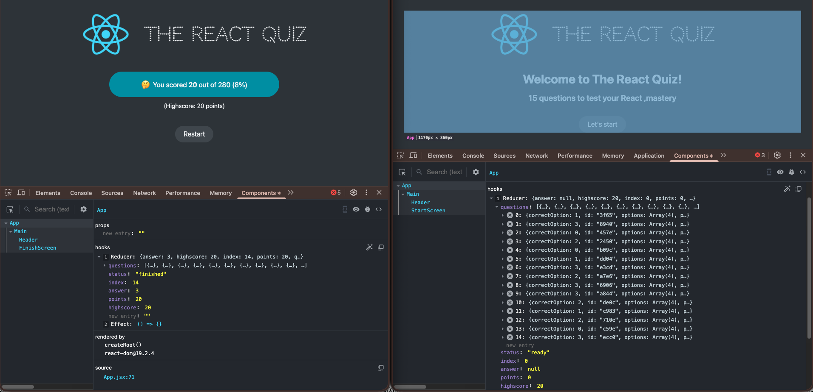

### 🐞 199.3 Issues:

- `FinishScreen` inherits emoji logic issues from Lesson 198 (sequential `if` statements, overlapping conditions).
- Division by zero when `maxPossiblePoints === 0` in `FinishScreen` percentage calculation (same as Lesson 198).
- Restart does not reset `status: "error"`—if the quiz had failed to load, clicking Restart would still show the error state (restart assumes `questions` is already loaded).
- Restart button lacks explicit `aria-label` for accessibility.

| Issue | Status | Log/Error |
|---|---|---|
| FinishScreen emoji logic overlapping conditions | ⚠️ Identified | `src/components/FinishScreen.jsx:6-10` — same as Lesson 198 |
| Division by zero when maxPossiblePoints is 0 | ⚠️ Identified | `src/components/FinishScreen.jsx:2` — `(points / maxPossiblePoints) * 100` when `maxPossiblePoints === 0` |
| Restart does not handle error state | ℹ️ Low Priority | `src/App.jsx:64-77` — restart case sets `status: "ready"` but keeps questions; if status was "error", questions may be empty |
| Restart button lacks aria-label | ℹ️ Low Priority | `src/components/FinishScreen.jsx:16` — `<button>` missing `aria-label="Restart quiz"` |

### 🧱 199.4 Pending Fixes (TODO)

- [ ] Use `else if` in FinishScreen emoji logic to avoid overlapping conditions (`src/components/FinishScreen.jsx:6-10`).
- [ ] Add guard for `maxPossiblePoints === 0` in `src/components/FinishScreen.jsx` (e.g., `const percentage = maxPossiblePoints > 0 ? (points / maxPossiblePoints) * 100 : 0`).
- [ ] Consider resetting to `status: "loading"` and refetching when restart is triggered from error state, or add an explicit "Try Again" flow for error recovery.
- [ ] Add `aria-label="Restart quiz"` to the Restart button in `src/components/FinishScreen.jsx:16` for screen-reader accessibility.

[↑ top - 199. Lesson 199 — *Restarting a Quiz*](#-199-lesson-199--restarting-a-quiz)


<br>

## 🔧 200. Lesson 200 — *Setting Up a Timer With useEffect*

[🧳 Section 16: *The Advanced useReducer Hook*](#section-16-the-advanced-usereducer-hook)

### 📑 Table of Contents:
- [200. Lesson 200 — *Setting Up a Timer With useEffect*](#-200-lesson-200--setting-up-a-timer-with-useeffect)
- [200.1 Context](#2001-context)
- [200.2 Updating code/theory according the context](#2002-updating-codetheory-according-the-context)
  - [200.2.1 Creating the Footer component](#20021-creating-the-footer-component)
  - [200.2.2 Initial Timer component placeholder](#20022-initial-timer-component-placeholder)
  - [200.2.3 Integrating Footer and Timer into App](#20023-integrating-footer-and-timer-into-app)
  - [200.2.4 Using setInterval inside useEffect](#20024-using-setinterval-inside-useeffect)
  - [200.2.5 Adding secondsRemaining state and tick action](#20025-adding-secondsremaining-state-and-tick-action)
  - [200.2.6 Dispatching tick from Timer (interval leak)](#20026-dispatching-tick-from-timer-interval-leak)
  - [200.2.7 Auto-finishing when timer reaches zero](#20027-auto-finishing-when-timer-reaches-zero)
  - [200.2.8 Cleaning up interval with clearInterval](#20028-cleaning-up-interval-with-clearinterval)
  - [200.2.9 Dynamic timer initialization on quiz start](#20029-dynamic-timer-initialization-on-quiz-start)
  - [200.2.10 Formatting time display as MM:SS](#200210-formatting-time-display-as-mmss)
  - [200.2.11 Quiz state diagram with timer flow](#200211-quiz-state-diagram-with-timer-flow)
- [200.3 Issues](#2003-issues)
- [200.4 Pending Fixes (TODO)](#2004-pending-fixes-todo)

### 🧠 200.1 Context:

This lesson implements a **countdown timer** for the quiz using React's `useEffect` hook. The timer displays remaining time in `MM:SS` format and automatically finishes the quiz when it reaches zero.

**Key Concepts**

1. **Side effects with `useEffect`**: Timers (`setInterval`) are side effects—they run outside React's render cycle. `useEffect` is the correct place to start intervals when a component mounts or when specific dependencies change.

2. **Cleanup function**: `setInterval` returns an ID. If the component unmounts or the effect re-runs, the old interval keeps firing unless cleared. The **cleanup function** (returned from `useEffect`) must call `clearInterval(id)` to avoid memory leaks and duplicate intervals.

3. **State via `useReducer`**: The timer value (`secondsRemaining`) lives in the reducer state. `Timer` receives `dispatch` and `secondsRemaining` as props. Each second, the effect dispatches `{ type: "tick" }` to decrement the value.

4. **Initialization on quiz start**: `secondsRemaining` starts as `null` and is set when the quiz starts: `state.questions.length * SECS_PER_QUESTIONS`. This makes the timer depend on the number of questions.

5. **Auto-finish**: The `tick` reducer case transitions to `status: "finished"` when `secondsRemaining === 0`.

**Advantages**

- Timer logic is centralized in the reducer; `Timer` only reads state and dispatches.
- Cleanup prevents interval accumulation on re-renders.
- Formatting (`00:00`) improves readability.

**Disadvantages / Gotchas**

- **Without cleanup**: Missing `clearInterval` causes multiple intervals to run, making the timer jump (e.g., every 2 seconds) or decrement multiple times per second.
- **Restart must reset timer**: The `restart` action must reset `secondsRemaining` (via `initialState` or explicitly). If it is not reset, the next game starts with leftover seconds from the previous run.
- **`secondsRemaining` when `null`**: `Timer` only renders during `status === "active"`, so `secondsRemaining` is always a number when `Timer` is shown.

**When to Consider Alternatives**

- For more complex timing (pause, resume, different phases), consider a dedicated timing library or `useRef` to store interval ID.
- For server-sync or real-time clocks, `Date`-based logic or Web Workers might be more appropriate.

### ⚙️ 200.2 Updating code/theory according the context:

#### **Summary**
- **Purpose**: Set up a countdown timer for the quiz using `useEffect` and `setInterval`, integrated with the reducer state.
- **Problem**: Timers require side effects and proper cleanup to avoid leaks and duplicate intervals.
- **Flow**: Subsections build the timer step by step: Footer/Timer structure, `setInterval` in `useEffect`, state and `tick` action, cleanup, initialization on start, and time formatting.

#### 200.2.01 Creating the Footer component
**Subsection Summary**
- **Purpose**: Introduces a reusable `Footer` component to wrap layout elements in the active quiz view.
- **Content**: A simple functional component that renders its `children` inside a `div`.
- **Usage**: Used later to group `Timer` and `NextButton` in the footer area.

```jsx
/* src/components/Footer.jsx */
const Footer = ({ children }) => {
  return <div>{children}</div>;
};

export default Footer;
```

#### 200.2.02 Initial Timer component placeholder
**Subsection Summary**
- **Purpose**: Placeholder for the `Timer` component before adding timer logic.
- **Content**: A minimal component that returns a `div` with the text "Timer".
- **Next step**: This will be extended with `useEffect` and `setInterval` in later subsections.

```jsx
/* src/components/Timer.jsx */
const Timer = () => {
  return <div>Timer</div>;
};

export default Timer;
```

#### 200.2.03 Integrating Footer and Timer into App
**Subsection Summary**
- **Purpose**: Wires `Footer` and `Timer` into the active quiz layout in `App.jsx`.
- **Content**: Imports `Timer` and `Footer`, renders them inside the `status === "active"` block. `Footer` wraps `Timer` and `NextButton`.
- **Image**: `section16_lecture200-001.png` illustrates the quiz UI with the footer area containing the timer and Next button.

```jsx
/* src/App.jsx */
import Header from "./components/Header";
import { useEffect, useReducer } from "react";
import Main from "./components/Main";
import Loader from "./components/Loader";
import Error from "./components/Error";
import StartScreen from "./components/StartScreen";
import Question from "./components/Question";
import NextButton from "./components/NextButton";
import Progress from "./components/Progress";
import FinishScreen from "./components/FinishScreen";
import Timer from "./components/Timer";                 // 👈🏽 ✅ (1)
import Footer from "./components/Footer";               // 👈🏽 ✅ (1)

const initialState = {
  questions: [],
  status: "loading", // 'loading' 'error', 'ready', 'active', 'finished'
  index: 0,
  answer: null,
  points: 0,
  highscore: 0,
};

const reducer = (state, action) => {
  switch (action.type) {
    case "dataReceived":
      return {
        ...state,
        questions: action.payload,
        status: "ready",
      };
    case "dataFailed":
      return {
        ...state,
        status: "error",
      };
    case "start":
      return {
        ...state,
        status: "active",
      };
    case "newAnswer": {
      const question = state.questions.at(state.index);
      return {
        ...state,
        answer: action.payload,
        points:
          action.payload === question.correctOption
            ? //? state.points + 1
              state.points + question.points
            : state.points,
      };
    }
    case "nextQuestion":
      return {
        ...state,
        index: state.index + 1,
        answer: null,
      };
    case "finish":
      return {
        ...state,
        status: "finished",
        highscore: state.points > state.highscore ? state.points : state.highscore,
      };
    case "restart":
      // return {
      //   ...state,
      //   status: "ready",
      //   index: 0,
      //   answer: null,
      //   points: 0,
      // }
      return {
        ...initialState,
        status: "ready",
        questions: state.questions,
        highscore: state.highscore,
      };
    default:
      throw new Error("Action Unknown!");
  }
};

function App() {
  const [{ questions, status, index, answer, points, highscore }, dispatch] = useReducer(reducer, initialState);
  const numQuestions = questions.length;
  const maxPossiblePoints = questions.reduce((prev, curr) => prev + curr.points, 0);
  // console.log(questions)
  // console.log(maxPossiblePoints)

  useEffect(() => {
    fetch("http://localhost:8000/questions")
      .then((resp) => resp.json())
      .then((data) => dispatch({ type: "dataReceived", payload: data }))
      .catch((error) => dispatch({ type: "dataFailed" }));
  }, []);
  return (
    <div className="app">
      <Main>
        <Header />
        {status === "loading" && <Loader />}
        {status === "error" && <Error />}
        {status === "ready" && <StartScreen numQuestions={numQuestions} dispatch={dispatch} />}
        {status === "active" && (
          <>
            <Progress
              index={index}
              numQuestions={numQuestions}
              points={points}
              maxPossiblePoints={maxPossiblePoints}
              answer={answer}
            />
            <Question question={questions[index]} answer={answer} dispatch={dispatch} />
            <Footer>                              {/* 👈🏽 ✅ (2) */}
              <Timer />                           {/* 👈🏽 ✅ (3) */}
              <NextButton
                dispatch={dispatch}
                answer={answer}
                index={index}
                numQuestions={numQuestions} 
              />                                  {/* 👈🏽 ✅ (3) */}
            </Footer>
          </>
        )}
        {status === "finished" && (
          <FinishScreen points={points} maxPossiblePoints={maxPossiblePoints} highscore={highscore} dispatch={dispatch} />
        )}
      </Main>
    </div>
  );
}

export default App;
```

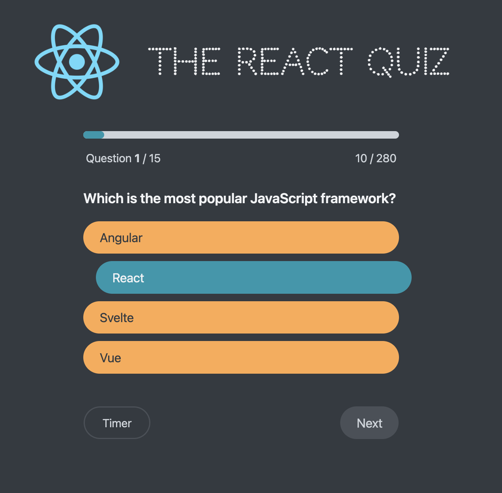

#### 200.2.04 Using setInterval inside useEffect
**Subsection Summary**
- **Purpose**: Demonstrates running `setInterval` inside `useEffect` to execute code every second.
- **Content**: `useEffect` with empty dependency array `[]` runs once on mount. `setInterval` logs "tick" every 1000ms. Timer displays hardcoded "05:00".
- **Gotcha**: No cleanup—`clearInterval` is missing. The interval would keep running after unmount; with dependencies this would also cause interval accumulation on re-renders.

```jsx
/* src/components/Timer.jsx */
import { useEffect } from "react";

const Timer = () => {
  useEffect(() => {
    setInterval(() => {                           // 👈🏽 ✅ (1)
      console.log("tick");
    }, 1000);
  }, []);

  return <div className="timer">05:00</div>;
};

export default Timer;
```

#### 200.2.05 Adding secondsRemaining state and tick action
**Subsection Summary**
- **Purpose**: Adds `secondsRemaining` to reducer state and a `tick` action to decrement it.
- **Content**: `initialState` includes `secondsRemaining: 10` (test value). The `tick` case decreases `secondsRemaining` by 1. `Timer` receives `dispatch` and `secondsRemaining` but still displays raw seconds (or placeholder).
- **Note**: In this intermediate step, `secondsRemaining` is hardcoded in `initialState`; the final version sets it dynamically when the quiz starts.

```jsx
/* src/App.jsx */
import Header from "./components/Header";
import { useEffect, useReducer } from "react";
import Main from "./components/Main";
import Loader from "./components/Loader";
import Error from "./components/Error";
import StartScreen from "./components/StartScreen";
import Question from "./components/Question";
import NextButton from "./components/NextButton";
import Progress from "./components/Progress";
import FinishScreen from "./components/FinishScreen";
import Timer from "./components/Timer";
import Footer from "./components/Footer";
const initialState = {
  questions: [],
  status: "loading", // 'loading' 'error', 'ready', 'active', 'finished'
  index: 0,
  answer: null,
  points: 0,
  highscore: 0,
  secondsRemaining: 10,                           // 👈🏽 ✅ (1)
};
const reducer = (state, action) => {
  switch (action.type) {
    case "dataReceived":
      return {
        ...state,
        questions: action.payload,
        status: "ready",
      };
    case "dataFailed":
      return {
        ...state,
        status: "error",
      };
    case "start":
      return {
        ...state,
        status: "active",
      };
    case "newAnswer": {
      const question = state.questions.at(state.index);
      return {
        ...state,
        answer: action.payload,
        points:
          action.payload === question.correctOption
            ? //? state.points + 1
              state.points + question.points
            : state.points,
      };
    }
    case "nextQuestion":
      return {
        ...state,
        index: state.index + 1,
        answer: null,
      };
    case "finish":
      return {
        ...state,
        status: "finished",
        highscore: state.points > state.highscore ? state.points : state.highscore,
      };
    case "restart":
      // return {
      //   ...state,
      //   status: "ready",
      //   index: 0,
      //   answer: null,
      //   points: 0,
      // }
      return {
        ...initialState,
        status: "ready",
        questions: state.questions,
        highscore: state.highscore,
      };
    case "tick":                              // 👈🏽 ✅ (2)
      return {
        ...state,
        secondsRemaining: state.secondsRemaining - 1,     // 👈🏽 ✅ (3)
      };
    default:
      throw new Error("Action Unknown!");
  }
};

function App() {
  const [{ questions, status, index, answer, points, highscore, secondsRemaining }, dispatch] = useReducer(
    reducer,
    initialState,
  );
  const numQuestions = questions.length;
  const maxPossiblePoints = questions.reduce((prev, curr) => prev + curr.points, 0);

  useEffect(() => {
    fetch("http://localhost:8000/questions")
      .then((resp) => resp.json())
      .then((data) => dispatch({ type: "dataReceived", payload: data }))
      .catch((error) => dispatch({ type: "dataFailed" }));
  }, []);
  return (
    <div className="app">
      <Main>
        <Header />
        {status === "loading" && <Loader />}
        {status === "error" && <Error />}
        {status === "ready" && <StartScreen numQuestions={numQuestions} dispatch={dispatch} />}
        {status === "active" && (
          <>
            <Progress
              index={index}
              numQuestions={numQuestions}
              points={points}
              maxPossiblePoints={maxPossiblePoints}
              answer={answer}
            />
            <Question question={questions[index]} answer={answer} dispatch={dispatch} />
            <Footer>
              <Timer
                dispatch={dispatch}
                secondsRemaining={secondsRemaining}                   {/* 👈🏽 ✅ (4) */}
              />
              <NextButton dispatch={dispatch} answer={answer} index={index} numQuestions={numQuestions} />
            </Footer>
          </>
        )}
        {status === "finished" && (
          <FinishScreen points={points} maxPossiblePoints={maxPossiblePoints} highscore={highscore} dispatch={dispatch} />
        )}
      </Main>
    </div>
  );
}
export default App;
```

#### 200.2.06 Dispatching tick from Timer (interval leak)
**Subsection Summary**
- **Purpose**: Timer dispatches `{ type: "tick" }` every second to update state.
- **Content**: `useEffect` runs `setInterval` that dispatches `tick`. Timer displays `secondsRemaining` as raw number.
- **Issues**: No `clearInterval` in the cleanup—intervals accumulate on re-renders. Timer jumps every 2 seconds (multiple intervals) and never stops at zero. Image `section16_lecture200-002.png` shows the problematic behavior.

```jsx
/* src/components/Timer.jsx */
import { useEffect } from "react";
const Timer = ({ dispatch, secondsRemaining }) => {
  useEffect(() => {
    setInterval(() => {
      //console.log("tick");
      dispatch({ type: "tick" });
    }, 1000);
  }, [dispatch]);
  return <div className="timer">{secondsRemaining}</div>;
};
export default Timer;
```

Issue:

* `<Timer />` jumps every each 2 seconds.
* `<Timer />` goes forever in decreasing.

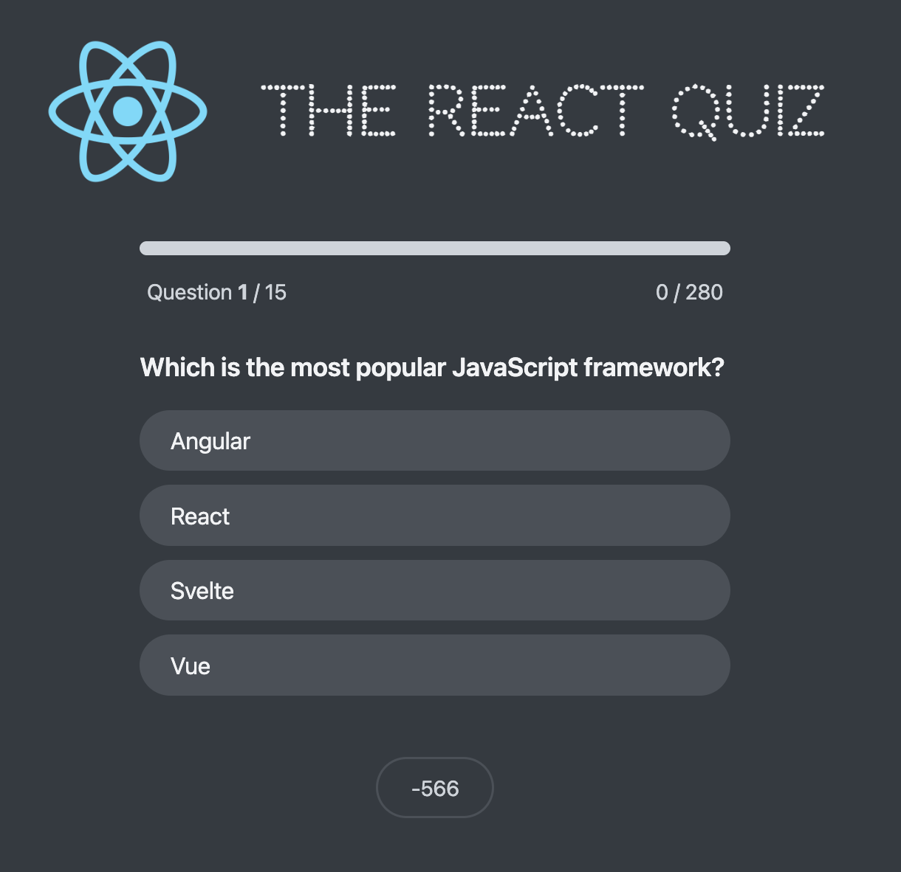

#### 200.2.07 Auto-finishing when timer reaches zero
**Subsection Summary**
- **Purpose**: When `secondsRemaining` reaches 0, the quiz should automatically finish.
- **Content**: The `tick` case adds `status: state.secondsRemaining === 0 ? "finished" : state.status` so the transition to the finish screen happens when the timer hits zero.
- **Issue**: Restart bug—if `secondsRemaining` is not properly reset in the `restart` case, each restart uses a smaller remaining time. After several restarts, the quiz may finish immediately.

```jsx
/*  */
case "tick":
  return {
    ...state,
    secondsRemaining: state.secondsRemaining - 1,
    status: 
      state.secondsRemaining === 0 ? 
      "finished" : 
      state.status,       // 👈🏽 ✅
  };
```

Issue:

* Restart the Quiz at least 3 times.
* Each time, total time or remaining time is smaller than the previous one.
* Forth time, click on `Restart Quiz` button, it goes to finish screen inmediately.

#### 200.2.08 Cleaning up interval with clearInterval
**Subsection Summary**
- **Purpose**: Fixes the interval leak by cleaning up when the effect re-runs or the component unmounts.
- **Content**: Store `setInterval` return value in `id`, and return `() => clearInterval(id)` from `useEffect`. This cleanup runs before the next effect execution or on unmount.
- **Result**: Only one interval runs at a time; the timer decrements smoothly every second.

```jsx
/* src/components/Timer.jsx */
import { useEffect } from "react";

const Timer = ({ dispatch, secondsRemaining }) => {
  useEffect(() => {
    const id = setInterval(() => {            // 👈🏽 ✅ (1)
      dispatch({ type: "tick" });
    }, 1000);
    return () => clearInterval(id);           // 👈🏽 ✅ (2)
  }, [dispatch]);

  return <div className="timer">{secondsRemaining}</div>;
};

export default Timer;
```

#### 200.2.09 Dynamic timer initialization on quiz start
**Subsection Summary**
- **Purpose**: Initialize the timer based on the number of questions when the quiz starts.
- **Content**: `secondsRemaining` starts as `null` in `initialState`. The `start` case sets `secondsRemaining: state.questions.length * SECS_PER_QUESTIONS` (e.g. 30 seconds per question). The `restart` case spreads `initialState`, which resets `secondsRemaining` to `null`; the next `start` will set it again correctly.
- **Image**: `section16_lecture200-003.png` shows the timer displaying the computed total seconds based on questions.

```jsx
/* src/App.jsx */
import Header from "./components/Header";
import { useEffect, useReducer } from "react";
import Main from "./components/Main";
import Loader from "./components/Loader";
import Error from "./components/Error";
import StartScreen from "./components/StartScreen";
import Question from "./components/Question";
import NextButton from "./components/NextButton";
import Progress from "./components/Progress";
import FinishScreen from "./components/FinishScreen";
import Timer from "./components/Timer";
import Footer from "./components/Footer";
const SECS_PER_QUESTIONS = 30;
const initialState = {
  questions: [],
  status: "loading", // 'loading' 'error', 'ready', 'active', 'finished'
  index: 0,
  answer: null,
  points: 0,
  highscore: 0,
  secondsRemaining: null,                       // 👈🏽 ✅ (1)
};
const reducer = (state, action) => {
  switch (action.type) {
    case "dataReceived":
      return {
        ...state,
        questions: action.payload,
        status: "ready",
      };
    case "dataFailed":
      return {
        ...state,
        status: "error",
      };
    case "start":
      return {
        ...state,
        status: "active",
        secondsRemaining: state.questions.length * SECS_PER_QUESTIONS,      // 👈🏽 ✅ (2)
      };
    case "newAnswer": {
      const question = state.questions.at(state.index);
      return {
        ...state,
        answer: action.payload,
        points:
          action.payload === question.correctOption
            ? //? state.points + 1
              state.points + question.points
            : state.points,
      };
    }
    case "nextQuestion":
      return {
        ...state,
        index: state.index + 1,
        answer: null,
      };
    case "finish":
      return {
        ...state,
        status: "finished",
        highscore: state.points > state.highscore ? state.points : state.highscore,
      };
    case "restart":
      // return {
      //   ...state,
      //   status: "ready",
      //   index: 0,
      //   answer: null,
      //   points: 0,
      // }
      return {
        ...initialState,
        status: "ready",
        questions: state.questions,
        highscore: state.highscore,
      };
    case "tick":
      return {
        ...state,
        secondsRemaining: state.secondsRemaining - 1,
        status: state.secondsRemaining === 0 ? "finished" : state.status,
      };
    default:
      throw new Error("Action Unknown!");
  }
};
function App() {
  const [{ questions, status, index, answer, points, highscore, secondsRemaining }, dispatch] = useReducer(
    reducer,
    initialState,
  );
  const numQuestions = questions.length;
  const maxPossiblePoints = questions.reduce((prev, curr) => prev + curr.points, 0);
  useEffect(() => {
    fetch("http://localhost:8000/questions")
      .then((resp) => resp.json())
      .then((data) => dispatch({ type: "dataReceived", payload: data }))
      .catch((error) => dispatch({ type: "dataFailed" }));
  }, []);
  return (
    <div className="app">
      <Main>
        <Header />
        {status === "loading" && <Loader />}
        {status === "error" && <Error />}
        {status === "ready" && <StartScreen numQuestions={numQuestions} dispatch={dispatch} />}
        {status === "active" && (
          <>
            <Progress
              index={index}
              numQuestions={numQuestions}
              points={points}
              maxPossiblePoints={maxPossiblePoints}
              answer={answer}
            />
            <Question question={questions[index]} answer={answer} dispatch={dispatch} />
            <Footer>
              <Timer dispatch={dispatch} secondsRemaining={secondsRemaining} />
              <NextButton dispatch={dispatch} answer={answer} index={index} numQuestions={numQuestions} />
            </Footer>
          </>
        )}
        {status === "finished" && (
          <FinishScreen points={points} maxPossiblePoints={maxPossiblePoints} highscore={highscore} dispatch={dispatch} />
        )}
      </Main>
    </div>
  );
}
export default App;
```

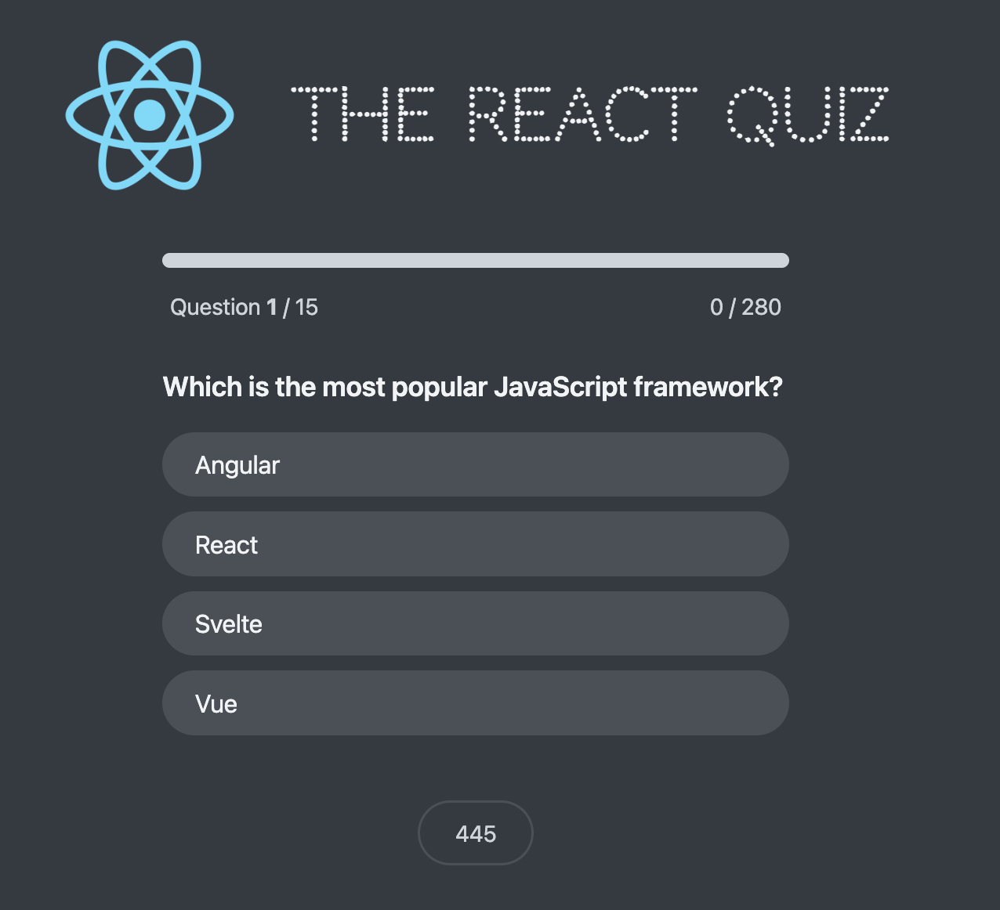

#### 200.2.10 Formatting time display as MM:SS
**Subsection Summary**
- **Purpose**: Format `secondsRemaining` as `MM:SS` with leading zeros for a readable display.
- **Content**: Compute `mins = Math.floor(secondsRemaining / 60)` and `seconds = secondsRemaining % 60`. Pad with leading zero when `< 10`. Render as `` `${minsString}:${secondsString}` ``.
- **Image**: `section16_lecture200-004.png` shows the timer displaying the formatted `00:00` style time.

```jsx
/* src/components/Timer.jsx */
import { useEffect } from "react";

const Timer = ({ dispatch, secondsRemaining }) => {
  const mins = Math.floor(secondsRemaining / 60);                             // 👈🏽 ✅ (1) 
  const seconds = secondsRemaining % 60;                                      // 👈🏽 ✅ (2)

  // format the time to be 00:00
  const minsString = mins < 10 ? `0${mins}` : mins;                           // 👈🏽 ✅ (3)
  const secondsString = seconds < 10 ? `0${seconds}` : seconds;               // 👈🏽 ✅ (4)

  useEffect(() => {
    const id = setInterval(() => {
      dispatch({ type: "tick" });
    }, 1000);
    return () => clearInterval(id);
  }, [dispatch]);

  return <div className="timer">{`${minsString}:${secondsString}`}</div>;     {/* 👈🏽 ✅ (5) */}
};

export default Timer;
```

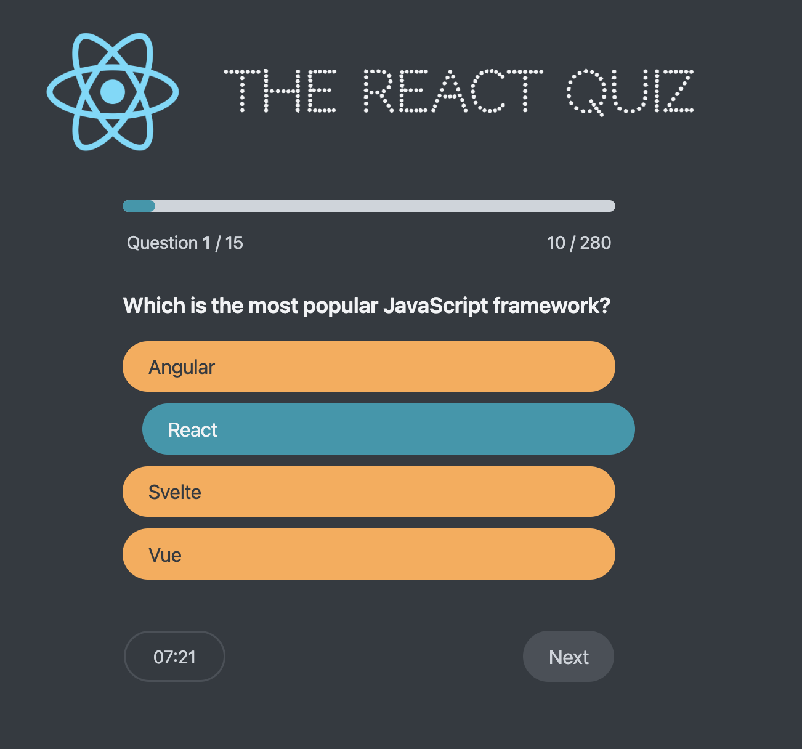

#### 200.2.11 Quiz state diagram with timer flow
**Subsection Summary**
- **Purpose**: Provides a visual overview of the complete quiz state machine, including the timer-driven transition to the finished state.
- **Content**: A Mermaid `stateDiagram-v2` showing `Loading`, `Ready`, `Active` (with Question/Answered substates), `Finished`, and `Error`. Transitions include `tick(secondsRemaining=0)` from Active to Finished, alongside the manual `finish` action.
- **Key detail**: The diagram documents that the quiz can reach `Finished` either by the user answering all questions (`finish`) or by the timer reaching zero (`tick`).

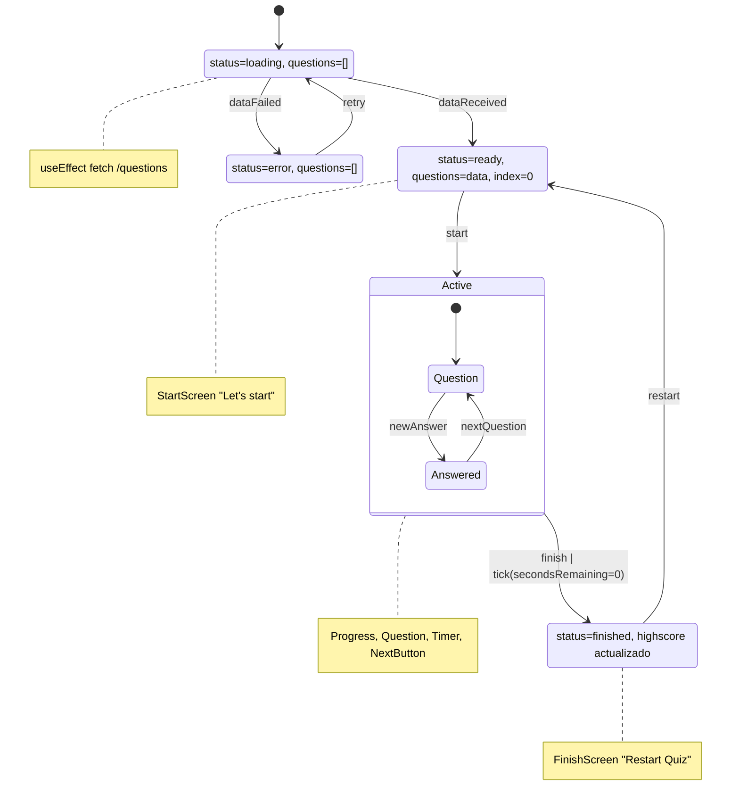
```mermaid
stateDiagram-v2
    [*] --> Loading

    Loading: status=loading, questions=[]
    Loading --> Ready: dataReceived
    Loading --> Error: dataFailed

    Ready: status=ready, questions=data, index=0
    Ready --> Active: start

    Error: status=error, questions=[]
    Error --> Loading: retry

    state Active {
        [*] --> Question
        Question --> Answered: newAnswer
        Answered --> Question: nextQuestion
    }
    Active --> Finished: finish | tick(secondsRemaining=0)

    Finished: status=finished, highscore actualizado
    Finished --> Ready: restart

    note right of Loading: useEffect fetch /questions
    note right of Ready: StartScreen "Let's start"
    note right of Active: Progress, Question, Timer, NextButton
    note right of Finished: FinishScreen "Restart Quiz"
```

### 🐞 200.3 Issues:
| Issue | Status | Log/Error |
|---|---|---|
| Interval leak without clearInterval | ✅ Fixed in 200.2.8 | `src/components/Timer.jsx` — missing `return () => clearInterval(id)` causes duplicate intervals |
| Restart not resetting secondsRemaining | ✅ Fixed in 200.2.9 | `src/App.jsx` — restart must use `initialState` with `secondsRemaining: null` and set on `start` |
| Timer shows raw seconds before formatting | ✅ Fixed in 200.2.10 | `src/components/Timer.jsx` — format as `MM:SS` with leading zeros |
| Footer uses generic div instead of semantic footer | ℹ️ Low Priority | `src/components/Footer.jsx:2` — consider `<footer>` for accessibility |

### 🧱 200.4 Pending Fixes (TODO)

- [ ] Consider using `<footer>` in `src/components/Footer.jsx` for semantic HTML and better screen-reader support.
- [ ] Add `aria-live="polite"` to the timer display in `src/components/Timer.jsx` so screen readers announce time updates.

[↑ top - 200. Lesson 200 — *Setting Up a Timer With useEffect*](#-200-lesson-200--setting-up-a-timer-with-useeffect)


<br>

## 🔧 201. Lesson 201 — *Section Summary: useState vs. useReducer*

[🧳 Section 16: *The Advanced useReducer Hook*](#-section-16-the-advanced-usereducer-hook)

### 📑 Table of Contents:
- [201. Lesson 201 — *Section Summary: useState vs. useReducer*](#-201-lesson-201--section-summary-usestate-vs-usereducer)
- [201.1 Context](#2011-context)
- [201.2 Updating code/theory according the context](#2012-updating-codetheory-according-the-context)
  - [201.2.1 useState vs useReducer comparison chart](#20121-usestate-vs-usereducer-comparison-chart)
  - [201.2.2 Decision flow: When to use useReducer](#20122-decision-flow-when-to-use-usereducer)
- [201.3 Issues](#2013-issues)
- [201.4 Pending Fixes (TODO)](#2014-pending-fixes-todo)

### 🧠 201.1 Context:

This lesson synthesizes the entire Section 16 by providing a clear comparison between `useState` and `useReducer`, and a decision guide for choosing between them. After building the React Quiz app with `useReducer` (lessons 190–200), this summary helps cement when each hook is appropriate.

**Key Concepts:**
1. **useState** is ideal for single, independent pieces of state (numbers, strings, simple arrays). Updates happen imperatively via `setState` in event handlers or effects, spread across components.
2. **useReducer** is designed for multiple related pieces of state and complex state (objects with many properties, nested structures). Logic lives in one central place—the reducer—and updates are declarative via dispatched actions.
3. **Default choice**: `useState` should remain the default for managing state; switch to `useReducer` only when state complexity justifies the extra boilerplate.

**Advantages:**
- `useState`: Easy to understand and use; minimal boilerplate; straightforward for simple cases.
- `useReducer`: Centralized update logic; easier to test reducers in isolation; predictable state transitions; atomic multi-property updates; scales better for complex flows.

**Disadvantages / Gotchas:**
- `useState`: Update logic scattered across handlers; harder to reason about when many pieces update together; imperative style can lead to bugs when state dependencies grow.
- `useReducer`: More boilerplate (reducer, actions, dispatch); steeper learning curve; can be overkill for trivial state.

**When to Consider Alternatives:**
- If state values are completely independent and never interact, keep separate `useState` hooks.
- For very large or deeply nested state, consider libraries like Zustand, Redux Toolkit, or Immer alongside reducers.
- For server-derived state, prefer React Query, SWR, or similar data-fetching libraries.

**Project implementation:** `src/App.jsx` uses `useReducer` because the quiz has many related pieces of state (`questions`, `status`, `index`, `answer`, `points`, `highscore`, `secondsRemaining`) that update together in response to actions like `newAnswer`, `nextQuestion`, `finish`, `restart`, and `tick`. A single `initialState` object and a centralized `reducer` keep all transitions predictable and maintainable.

### ⚙️ 201.2 Updating code/theory according the context:

#### **Summary**
- **Purpose**: Consolidate the differences between `useState` and `useReducer` and provide a decision flow for choosing the right hook.
- **Problem solved**: Developers often struggle to decide when to migrate from `useState` to `useReducer`; this section gives a clear comparison and flowchart.
- **Connection**: 201.2.1 presents a side-by-side comparison chart; 201.2.2 provides a step-by-step decision flowchart that leads to either `useState` or `useReducer` based on state characteristics and willingness to handle complexity.
- **Relation to Section 16**: Summarizes the rationale behind using `useReducer` in the React Quiz app (lessons 190–200) and reinforces best practices.

#### 201.2.1 useState vs useReducer comparison chart
**Subsection Summary**
- **Purpose**: Side-by-side comparison of the two hooks for quick reference.
- **Content**: A two-column chart contrasting ideal use cases, where update logic lives, how updates are triggered, and the nature of updates (imperative vs declarative).
- **Key takeaway**: `useState` fits single, independent state with logic in event handlers; `useReducer` fits related, complex state with logic in a central reducer.
- **Code examples in image**: `setScore(0); setPlaying(true); setTimerSec(0);` vs `dispatch({ type: 'startGame' });`.
- **Usability note**: `useState` is easier to understand; `useReducer` is more difficult but scales better for complex state.

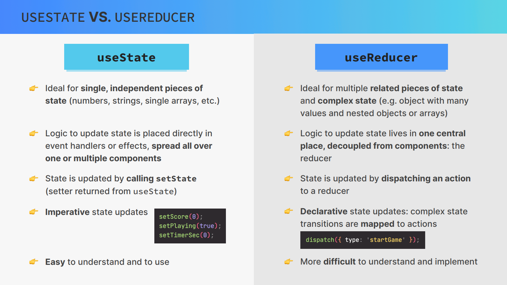

#### 201.2.2 Decision flow: When to use useReducer
**Subsection Summary**
- **Purpose**: A flowchart to help decide between `useState` and `useReducer` based on state characteristics.
- **Content**: A series of decision boxes: (1) Just one piece of state? → YES → `useState`; (2) Do states frequently update together? → YES → willingness check → `useReducer` or `useState`; (3) Over 3–4 pieces of related state including objects? → YES → willingness check; (4) Too many event handlers make components large? → YES → `useReducer`, NO → `useState`.
- **Recommendation in image**: "useState should remain your default choice for managing state"—reinforcing that `useReducer` is an upgrade path, not a default.
- **Example context**: The image references multiple `setState` calls (`setScore(0); setPlaying(true); setTimerSec(0);`) as a signal that related state might benefit from `useReducer`.

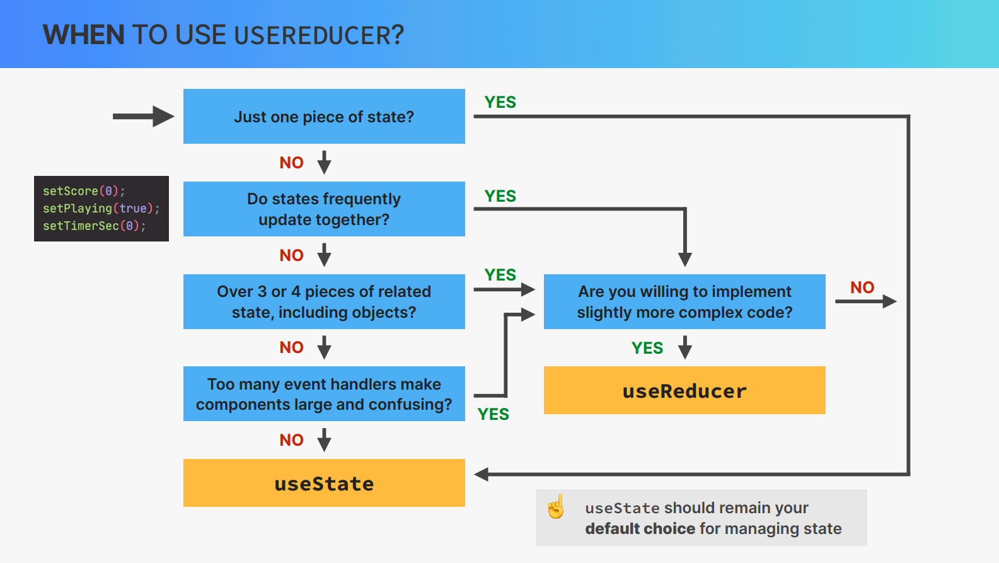

### 🐞 201.3 Issues:

- This is a summary/theory lesson with no new code changes; the images and diagrams are reference material only.
- No functional issues identified for Lesson 201 itself—it builds on completed quiz logic from lessons 190–200.

| Issue | Status | Log/Error |
|---|---|---|
| N/A (theory lesson) | ℹ️ Informational | Lesson 201 contains only comparison charts and decision flow; no code modifications. |

### 🧱 201.4 Pending Fixes (TODO)

- [ ] Use the "When to use useReducer?" flowchart (201.2.2) as a reference when starting new React components with multiple related state values.

[↑ top - 201. Lesson 201 — *Section Summary: useState vs. useReducer*](#-201-lesson-201--section-summary-usestate-vs-usereducer)


---

<br>
<br>
<br>

🔥 🔥 🔥 

<br>

## 🔧 XXX. Lesson XXX — *{{TITLE_NAME}}*

### 🧠 XXX.1 Context:

### ⚙️ XXX.2 Updating code/theory according the context:

#### XXX.2.1
```jsx
/*  */

```

#### XXX.2.2
```jsx
/*  */

```

#### XXX.2.3
```jsx
/*  */

```

#### XXX.2.4
```jsx
/*  */

```

### 🐞 XXX.3 Issues:
- **first issue**: something..

| Issue | Status | Log/Error |
|---|---|---|

### 🧱 XXX.4 Pending Fixes (TODO)

- [ ]