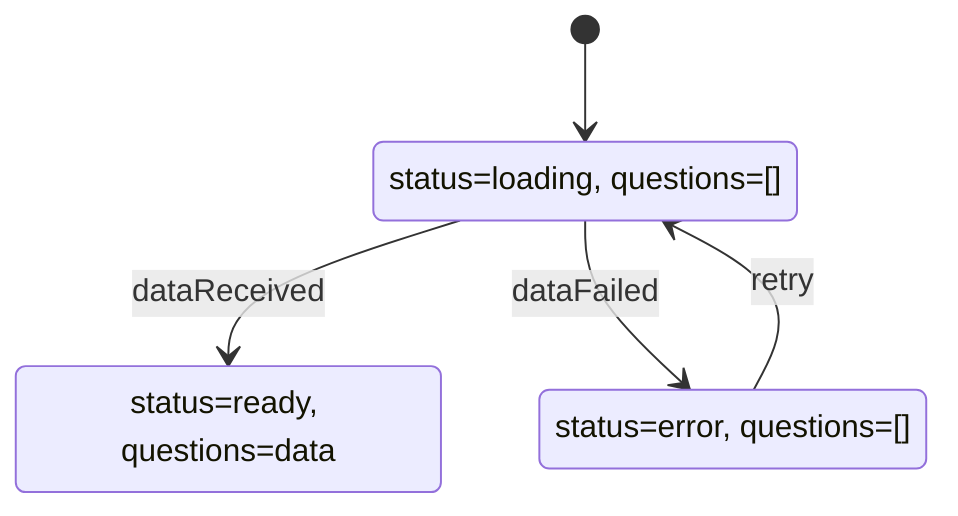

<br>

## 🧳 Section 16: *The Advanced useReducer Hook*


## 🔧 187. Lesson 187 — *Yet Another Hook: useReducer*

- [187. Lesson 187 — *Yet Another Hook: useReducer*](#-187-lesson-187---yet-another-hook-usereducer)
- [187.1 Context](#1871-context)
- [187.2 Updating code according the context](#1872-updating-code-according-the-context)
  - [187.2.1 Start from scratch the `App.jsx` component then import `DateCounter` component](#18721-start-from-scratch-the-appjsx-component-then-import-datecounter-component)
  - [187.2.2 Initial `DateCounter` component](#18722-initial-datecounter-component)
  - [187.2.3 Adding `useReducer` hook in `DateCounter` component](#18723-adding-usereducer-hook-in-datecounter-component)
  - [187.2.4 Adding `dispatch(1)` in `inc` & `dispatch(-1)` in `dec` functions](#18724-adding-dispatch1-in-inc--dispatch-1-in-dec-functions)
  - [187.2.5 Working with setting a value or `defineCount` function](#18725-working-with-setting-a-value-or-definecount-function)
  - [187.2.6 Thinking about passing an object in each dispatch and named actions](#18726-thinking-about-passing-an-object-in-each-dispatch-and-named-actions)
  - [187.2.7 Simplifying `useReducer` in `reducer` function](#18727-simplifying-usereducer-in-reducer-function)
- [187.3 Issues](#1873-issues)
- [187.4 Pending Fixes (TODO)](#1874-pending-fixes-todo)

### 🧠 187.1 Context:

The `useReducer` hook is a more powerful alternative to `useState` for state management in React. It is particularly useful when:

1.  **State logic is complex**: When multiple pieces of state rely on each other or when the next state depends on the previous one in complex ways.
2.  **Multiple sub-values**: When you have an object with many properties that update independently or together.
3.  **Externalizing logic**: It allows you to move state update logic outside of the component (into a reducer function), making the component cleaner and the logic easier to test.

**How it works:**
It follows the "Redux" pattern (though simpler).
- **Reducer**: A pure function `(state, action) => newState`. It takes the current state and an "action" (instruction) and returns the new state.
- **Dispatch**: A function called to trigger an update. You `dispatch(action)`.
- **Action**: An object (conventionally `{ type: 'ACTION_NAME', payload: data }`) describing *what* happened.

**Analogy:**
- `useState`: You (the component) directly change the data. "Set count to 5".
- `useReducer`: You (the component) request a change. "Dispatch: INCREMENT". The reducer (a manager) receives the request and decides how to update the state based on current rules.

In this lesson, we refactor a simple `DateCounter` component from using multiple `useState` calls to a single `useReducer` to manage `count` and `step` (eventually) and handle complex updates more predictably.

### ⚙️ 187.2 Updating code/theory according the context:

#### **Summary**
- **Purpose**: To demonstrate the transition from `useState` to `useReducer` for managing numeric state.
- **Problem**: The initial code uses `useState` which works but can become unwieldy with complex state logic. We want to centralize the update logic.
- **Connection**: The subsections progressively evolve the component:
    1.  Setup.
    2.  Analysis of `useState` approach.
    3.  Introduction of `useReducer` syntax.
    4.  Refining usage with simple actions.
    5.  Encountering pitfalls (logic errors).
    6.  Standardizing actions with objects.
    7.  Finalizing the reducer logic.

#### 187.2.1 Start from scratch the `App.jsx` component then import `DateCounter` component:
**Subsection Summary**
- **Purpose**: Sets up the main `App` component to render the `DateCounter`.
- **Content**: A simple functional component rendering `<DateCounter />`.

```jsx
/* src/App.jsx */
import DateCounter from './DateCounter'

function App() {
  return (
    <>
      <DateCounter />
    </>
  )
}
export default App
```


#### 187.2.2 Initial `DateCounter` component:
**Subsection Summary**
- **Purpose**: Shows the starting point using `useState`.
- **Review**: The component manages `count` and `step`. It manually mutates a `Date` object (which is a side effect often better handled differently, but here serves the example).
- **Key Concept**: Standard `useState` usage where updates are scattered across event handlers (`inc`, `dec`, `defineCount`).

```jsx
/* src/DateCounter.jsx */
import { useState } from "react";

const DateCounter = () => {
  const [count, setCount] = useState(0);
  const [step, setStep] = useState(1);

  // This mutates the date object.
  const date = new Date("june 21 2027");
  date.setDate(date.getDate() + count);

  const dec = function () {
    // setCount((count) => count - 1);
    setCount((count) => count - step);
  };

  const inc = function () {
    // setCount((count) => count + 1);
    setCount((count) => count + step);
  };

  const defineCount = function (e) {
    setCount(Number(e.target.value));
  };

  const defineStep = function (e) {
    setStep(Number(e.target.value));
  };

  const reset = function () {
    setCount(0);
    setStep(1);
  };

  return (
    <div className="counter">
      <div>
        <input
          type="range"
          min="0"
          max="10"
          value={step}
          onChange={defineStep}
        />
        <span>{step}</span>
      </div>

      <div>
        <button onClick={dec}>-</button>
        <input value={count} onChange={defineCount} />
        <button onClick={inc}>+</button>
      </div>

      <p>{date.toDateString()}</p>

      <div>
        <button onClick={reset}>Reset</button>
      </div>
    </div>
  );
}
export default DateCounter;
```

#### 187.2.3 Adding `useReducer` hook in `DateCounter` component:
**Subsection Summary**
- **Purpose**: Introduces the `useReducer` hook syntax.
- **Change**: Replaces `const [count, setCount] = useState(0);` with `const [count, dispatch] = useReducer(reducer, 0);`.
- **Concept**: A dummy `reducer` function is defined that currently just logs args. `dispatch` is now available to trigger updates.

```jsx
/* src/DateCounter.jsx */
import { useReducer, useState } from "react";       // 👈🏽 ✅ (2)

const reducer = (state, action) => {        // 👈🏽 ✅ (3)
  console.log(state, action);
};

const DateCounter = () => {
  //const [count, setCount] = useState(0);      // 👈🏽 ✅ (1)
  const [count, dispatch] = useReducer(reducer, 0);     // 👈🏽 ✅ (2)
  const [step, setStep] = useState(1);

  // This mutates the date object.
  const date = new Date("june 21 2027");
  date.setDate(date.getDate() + count);

  const dec = function () {
    // setCount((count) => count - 1);      // 👈🏽 ✅ (1)
    //setCount((count) => count - step);
  };

  const inc = function () {
    dispatch(1);        // 👈🏽 ✅ (4) applying the dispatch
    // setCount((count) => count + 1);      // 👈🏽 ✅ (1)
    //setCount((count) => count + step);
  };

  const defineCount = function (e) {
    //setCount(Number(e.target.value));      // 👈🏽 ✅ (1)
  };

  const defineStep = function (e) {
    setStep(Number(e.target.value));
  };

  const reset = function () {
    //setCount(0);      // 👈🏽 ✅ (1)
    setStep(1);
  };

  return (
    <div className="counter">
      <div>
        <input
          type="range"
          min="0"
          max="10"
          value={step}
          onChange={defineStep}
        />
        <span>{step}</span>
      </div>

      <div>
        <button onClick={dec}>-</button>
        <input value={count} onChange={defineCount} />
        <button onClick={inc}>+</button>
      </div>

      <p>{date.toDateString()}</p>

      <div>
        <button onClick={reset}>Reset</button>
      </div>
    </div>
  );
}
export default DateCounter;
```


#### 187.2.4 Adding `dispatch(1)` in `inc` & `dispatch(-1)` in `dec` functions:
**Subsection Summary**
- **Purpose**: Implements basic increment/decrement logic in the reducer.
- **Logic**: The reducer receives `state` (current count) and `action` (1 or -1). It returns `state + action`.
- **Result**: `inc` dispatches `1`, `dec` dispatches `-1`.

```jsx
/* src/DateCounter.jsx */
import { useReducer, useState } from "react";

const reducer = (state, action) => {
  console.log(state, action);
  return state + action;    // 👈🏽 ✅ (1)
};

const DateCounter = () => {
  //const [count, setCount] = useState(0);
  const [count, dispatch] = useReducer(reducer, 0);
  const [step, setStep] = useState(1);

  // This mutates the date object.
  const date = new Date("june 21 2027");
  date.setDate(date.getDate() + count);

  const dec = function () {
    dispatch(-1);// 👈🏽 ✅ (2)
    // setCount((count) => count - 1);
    //setCount((count) => count - step);
  };

  const inc = function () {
    dispatch(1);// 👈🏽 ✅ (2)
    // setCount((count) => count + 1);
    //setCount((count) => count + step);
  };

  const defineCount = function (e) {
    //setCount(Number(e.target.value));
  };

  const defineStep = function (e) {
    setStep(Number(e.target.value));
  };

  const reset = function () {
    //setCount(0);
    setStep(1);
  };

  return (
    <div className="counter">
      <div>
        <input
          type="range"
          min="0"
          max="10"
          value={step}
          onChange={defineStep}
        />
        <span>{step}</span>
      </div>

      <div>
        <button onClick={dec}>-</button>
        <input value={count} onChange={defineCount} />
        <button onClick={inc}>+</button>
      </div>

      <p>{date.toDateString()}</p>

      <div>
        <button onClick={reset}>Reset</button>
      </div>
    </div>
  );
}
export default DateCounter;
```


#### 187.2.5 Working with setting a value or `defineCount` function: 
**Subsection Summary**
- **Purpose**: Attempts to handle the input field change (`defineCount`) using the same reducer logic.
- **Bug/Issue**: The current reducer (`state + action`) adds the input value to the current state, treating it as a delta rather than a set value.
- **Observation**: This highlights why simple generic reducers don't work for different types of actions (increment vs set).

```jsx
/* src/DateCounter.jsx */
import { useReducer, useState } from "react";

const reducer = (state, action) => {
  console.log(state, action);
  return state + action;
};

const DateCounter = () => {
  //const [count, setCount] = useState(0);
  const [count, dispatch] = useReducer(reducer, 0);
  const [step, setStep] = useState(1);

  // This mutates the date object.
  const date = new Date("june 21 2027");
  date.setDate(date.getDate() + count);

  const dec = function () {
    dispatch(-1);
    // setCount((count) => count - 1);
    //setCount((count) => count - step);
  };

  const inc = function () {
    dispatch(1);
    // setCount((count) => count + 1);
    //setCount((count) => count + step);
  };

  const defineCount = function (e) {
    dispatch(Number(e.target.value));       // 👈🏽 ✅ 
    //setCount(Number(e.target.value));
  };

  const defineStep = function (e) {
    setStep(Number(e.target.value));
  };

  const reset = function () {
    //setCount(0);
    setStep(1);
  };

  return (
    <div className="counter">
      <div>
        <input
          type="range"
          min="0"
          max="10"
          value={step}
          onChange={defineStep}
        />
        <span>{step}</span>
      </div>

      <div>
        <button onClick={dec}>-</button>
        <input value={count} onChange={defineCount} />
        <button onClick={inc}>+</button>
      </div>

      <p>{date.toDateString()}</p>

      <div>
        <button onClick={reset}>Reset</button>
      </div>
    </div>
  );
}
export default DateCounter;
```

* It's not going to work properly
---
Steps:
- click on `input`
- add `0`  next to the number `1` in order to get `10`.

Expected Result:
- input displays `11` due to `state + action`: `10 + 1``

---
Steps:
- click on `input` again
- add `2` next the existant number in order to get `112`
Expected Result:
- input displays 123 due to `112 + 11`


#### 187.2.6 Thinking about passing an object in each dispatch and named actions:
**Subsection Summary**
- **Purpose**: Solves the previous issue by distinguishing between action types using an object `{ type, payload }`.
- **Implementation**:
    - `dec`: `{ type: 'dec', payload: -1 }`
    - `inc`: `{ type: 'inc', payload: 1 }`
    - `setCount`: `{ type: 'setCount', payload: value }`
- **Reducer Update**: Checks `action.type` to decide whether to add `payload` (inc/dec) or return `payload` directly (setCount).

```jsx
/* src/DateCounter.jsx */
import { useReducer, useState } from "react";

const reducer = (state, action) => {
  console.log(state, action);
  if(action.type === 'dec') return state + action.payload;       // 👈🏽 ✅ (2)
  if(action.type === 'inc') return state + action.payload;       // 👈🏽 ✅ (2)
  if(action.type === 'setCount') return action.payload;       // 👈🏽 ✅ (2)
};

const DateCounter = () => {
  //const [count, setCount] = useState(0);
  const [count, dispatch] = useReducer(reducer, 0);
  const [step, setStep] = useState(1);

  // This mutates the date object.
  const date = new Date("june 21 2027");
  date.setDate(date.getDate() + count);

  const dec = function () {
    dispatch({type: 'dec', payload: -1});       // 👈🏽 ✅ (1) obj: {type: 'dec', payload: -1}
    //dispatch(-1);
    // setCount((count) => count - 1);
    //setCount((count) => count - step);
  };

  const inc = function () {
    dispatch({type: 'inc', payload: 1});       // 👈🏽 ✅ (1) obj: {type: 'inc', payload: 1}
    //dispatch(1);
    // setCount((count) => count + 1);
    //setCount((count) => count + step);
  };

  const defineCount = function (e) {
    dispatch({type: 'setCount', payload: Number(e.target.value)});       // 👈🏽 ✅ (1) obj: {type: 'setCount', payload: Number(e.target.value)}
    //dispatch(Number(e.target.value));
    //setCount(Number(e.target.value));
  };

  const defineStep = function (e) {
    setStep(Number(e.target.value));
  };

  const reset = function () {
    //setCount(0);
    setStep(1);
  };

  return (
    <div className="counter">
      <div>
        <input
          type="range"
          min="0"
          max="10"
          value={step}
          onChange={defineStep}
        />
        <span>{step}</span>
      </div>

      <div>
        <button onClick={dec}>-</button>
        <input value={count} onChange={defineCount} />
        <button onClick={inc}>+</button>
      </div>

      <p>{date.toDateString()}</p>

      <div>
        <button onClick={reset}>Reset</button>
      </div>
    </div>
  );
}
export default DateCounter;
```


#### 187.2.7 Simplifying `useReducer` in `reducer` function:
**Subsection Summary**
- **Purpose**: Cleans up the calling code (components) by moving more logic into the reducer.
- **Refactor**: Instead of passing `payload: 1` or `-1` for increment/decrement, the reducer knows that `dec` means `-1` and `inc` means `+1`. The components just send `{ type: 'dec' }` or `{ type: 'inc' }`.
- **Result**: Separation of concerns. The component says "what happened" (`inc`), the reducer decides "how logic changes" (`state + 1`).

```jsx
/* src/DateCounter.jsx */
import { useReducer, useState } from "react";

const reducer = (state, action) => {
  console.log(state, action);
  if(action.type === 'dec') return state - 1;       // 👈🏽 ✅ (1)
  if(action.type === 'inc') return state + 1;       // 👈🏽 ✅ (1)
  if(action.type === 'setCount') return action.payload;
};

const DateCounter = () => {
  //const [count, setCount] = useState(0);
  const [count, dispatch] = useReducer(reducer, 0);
  const [step, setStep] = useState(1);

  // This mutates the date object.
  const date = new Date("june 21 2027");
  date.setDate(date.getDate() + count);

  const dec = function () {
    dispatch({type: 'dec'});       // 👈🏽 ✅ (2)
    // setCount((count) => count - 1);
    //setCount((count) => count - step);
  };

  const inc = function () {
    dispatch({type: 'inc'});       // 👈🏽 ✅ (2)
    // setCount((count) => count + 1);
    //setCount((count) => count + step);
  };

  const defineCount = function (e) {
    dispatch({type: 'setCount', payload: Number(e.target.value)});
    //setCount(Number(e.target.value));
  };

  const defineStep = function (e) {
    setStep(Number(e.target.value));
  };

  const reset = function () {
    //setCount(0);
    setStep(1);
  };

  return (
    <div className="counter">
      <div>
        <input
          type="range"
          min="0"
          max="10"
          value={step}
          onChange={defineStep}
        />
        <span>{step}</span>
      </div>

      <div>
        <button onClick={dec}>-</button>
        <input value={count} onChange={defineCount} />
        <button onClick={inc}>+</button>
      </div>

      <p>{date.toDateString()}</p>

      <div>
        <button onClick={reset}>Reset</button>
      </div>
    </div>
  );
}
export default DateCounter;
```

### 🐞 187.3 Issues:

- In **187.2.5**, using a simple `state + action` reducer caused incorrect behavior for setting values (`setCount`), as it added the input value to the current state instead of replacing it. This demonstrated the need for action types.
- The `step` state is still managed by `useState`. The next logical step (likely next lesson) would be to include `step` in the reducer state as well to handle everything together.

| Issue | Status | Log/Error |
|---|---|---|
| Input value adding instead of setting | ✅ Fixed (in 187.2.6) | `defineCount` resulted in additive behavior (e.g., 10 -> 11) instead of setting 10. |

### 🧱 187.4 Pending Fixes (TODO)

- [ ] Remove commented out `useState` code (lines 11, 22-23, 29-30, 36) to clean up `DateCounter.jsx`.
- [ ] Move `step` state into the `useReducer` to fully centralize state management.
- [ ] Implement `reset` functionality using the reducer.

[↑ top - 187. Lesson 187 — *Yet Another Hook: useReducer*](#-187-lesson-187---yet-another-hook-usereducer)


<br>

## 🔧 188. Lesson 188 — *Managing Related Pieces of State*

[🧳 Section 16: *The Advanced useReducer Hook*](#-section-16-the-advanced-usereducer-hook)

### 📑 Table of Contents:
- [188. Lesson 188 — *Managing Related Pieces of State*](#-188-lesson-188---managing-related-pieces-of-state)
- [188.1 Context](#1881-context)
- [188.2 Updating code according the context](#1882-updating-code-according-the-context)
  - [188.2.1 Incorporate the `step` into the built `Reducer` function](#18821-incorporate-the-step-into-the-built-reducer-function)
  - [188.2.2 Working on `Reducer` function return value](#18822-working-on-reducer-function-return-value)
  - [188.2.3 Complete the `Reducer` function](#18823-complete-the-reducer-function)
- [188.3 Issues](#1883-issues)
- [188.4 Pending Fixes (TODO)](#1884-pending-fixes-todo)

### 🧠 188.1 Context:

In Lesson 187 we introduced `useReducer` to manage a single numeric `count` state, while `step` remained in its own `useState`. This lesson takes the next logical step: **combining related pieces of state into a single reducer-managed object**. When two or more state values are closely related — they update together, depend on each other, or share a reset action — they belong inside the same state object managed by one reducer.

**Key Concepts:**

1. **Object state**: Instead of `useReducer(reducer, 0)` (single value), the initial state becomes an object: `{ count: 0, step: 1 }`. The reducer must now return a new object for every action.
2. **Spread operator for immutability**: When updating one property, we spread the rest of the state (`...state`) and override only the changed key: `{ ...state, count: state.count + state.step }`.
3. **Switch statement**: Replaces chained `if` statements for better readability and a clear `default` error case.
4. **Extracting `initialState`**: Moving the initial state object outside the component allows it to be referenced by the `reset` action, avoiding duplication.
5. **Centralized reset**: Because all related state lives in one object, a single `reset` action can restore everything at once — impossible when state is split across multiple `useState` calls.

**Advantages:**
- All related state transitions are visible in one place (the reducer).
- Adding a new action (e.g., `reset`) that touches multiple state values is trivial.
- State can never go out of sync — `count` and `step` are always updated atomically.
- Easier to test: the reducer is a pure function outside the component.

**Disadvantages / Gotchas:**
- Every action must return a **complete new state object**; forgetting to spread will wipe out other properties.
- Slightly more boilerplate compared to individual `useState` calls for truly independent state values.
- The `default` case should throw an error to catch misspelled action types during development.

**When to Consider Alternatives:**
- If state values are completely independent and never interact, separate `useState` hooks are simpler.
- For very large or deeply nested state, consider libraries like Zustand or Immer alongside `useReducer`.
- If the component only reads external state (e.g., from Context or a server), a reducer may be unnecessary.

This lesson applies all of the above to the `DateCounter` component from Lesson 187, progressively migrating `step` into the reducer state and completing all action handlers.

### ⚙️ 188.2 Updating code/theory according the context:

#### **Summary**
- **Purpose**: Migrate the remaining `useState`-managed `step` value into the `useReducer` state object and complete all reducer action handlers.
- **Problem**: In Lesson 187 the `step` was still managed by `useState`, meaning state was split across two mechanisms. The `reset` and `defineStep` handlers could not go through the reducer.
- **Connection**: The subsections progressively evolve the reducer:
    1. Convert state from a single number to an object `{ count, step }` and stub out the reducer (188.2.1).
    2. Implement proper `switch`/`case` logic with the spread operator for immutable updates (188.2.2).
    3. Add the missing `setStep` and `reset` cases, use `state.step` in `inc`/`dec`, and extract `initialState` outside the component (188.2.3).

#### 188.2.1 Incorporate the `step` into the built `Reducer` function:

**Subsection Summary**
- **Purpose**: Transforms the reducer state from a single number (`0`) into an object (`{ count: 0, step: 1 }`), combining both pieces of state.
- **Key Changes**: (1) Define `initialState` as an object with `count` and `step`. (2) Pass it to `useReducer`. (3) Destructure `state` into `{ count, step }`. (4) Comment out old `useState` and `if`-based reducer logic. (5) Temporarily return a hardcoded object so the app renders without errors.
- **Observation**: At this stage the reducer always returns the same hardcoded object, so `inc`/`dec`/`setCount` do nothing meaningful yet. `defineStep` and `reset` are also disabled.
- **Screenshot**: Shows the app rendering correctly with initial values (count: 0, step: 1, date: Mon Jun 21 2027) even though state transitions are not wired up yet.

- use `Reducer` when have some more complex state to manage.
- when state is an object and not a single value.

```jsx
/* src/components/DateCounter.jsx */
import { useReducer, useState } from "react";

const reducer = (state, action) => {
  console.log(state, action);
  //if(action.type === 'dec') return state - 1;    // 👈🏽 ✅ (4)
  //if(action.type === 'inc') return state + 1;    // 👈🏽 ✅ (4)
  //if(action.type === 'setCount') return action.payload;    // 👈🏽 ✅ (4)
  return { count: 0, step: 1}    // 👈🏽 ✅ (5)
};

const DateCounter = () => {
  //const [count, setCount] = useState(0);
  //const [step, setStep] = useState(1);

  const initialState = { count: 0, step: 1 };   // 👈🏽 ✅ (1) two previous states in this initialState.
  const [state, dispatch] = useReducer(reducer, initialState);  // 👈🏽 ✅ (2)

  // destructuring "state":
  const { count, step } = state;  // 👈🏽 ✅ (3)

  // This mutates the date object.
  const date = new Date("june 21 2027");
  date.setDate(date.getDate() + count);

  const dec = function () {
    dispatch({type: 'dec'});
  };

  const inc = function () {
    dispatch({type: 'inc'});
  };

  const defineCount = function (e) {
    dispatch({type: 'setCount', payload: Number(e.target.value)});
  };

  const defineStep = function (e) {
    //setStep(Number(e.target.value));    // 👈🏽 ✅ (4)
  };

  const reset = function () {
    //setStep(1);    // 👈🏽 ✅ (4)
  };

  return (
    <div className="counter">
      <div>
        <input
          type="range"
          min="0"
          max="10"
          value={step}
          onChange={defineStep}
        />
        <span>{step}</span>
      </div>

      <div>
        <button onClick={dec}>-</button>
        <input value={count} onChange={defineCount} />
        <button onClick={inc}>+</button>
      </div>

      <p>{date.toDateString()}</p>

      <div>
        <button onClick={reset}>Reset</button>
      </div>
    </div>
  );
}
export default DateCounter;
```


#### 188.2.2 Working on `Reducer` function return value:

**Subsection Summary**
- **Purpose**: Implements the actual state transition logic inside the reducer using a `switch` statement, replacing the hardcoded return.
- **Key Changes**: Each `case` returns a new object via the spread operator (`...state`) and only overrides the relevant property. A `default` case throws an error for unknown action types.
- **Pattern**: `return { ...state, count: state.count - 1 }` — spread preserves `step` while only `count` changes. This is the standard immutable update pattern for object-based reducer state.
- **Limitation**: `inc`/`dec` still use hardcoded `- 1` / `+ 1` instead of `state.step`, and `setStep`/`reset` are not handled yet.
- **Screenshot**: Console logs show the state object `{count: X, step: 1}` alongside dispatched actions (`{type: 'inc'}`, `{type: 'setCount', payload: 20}`), confirming the `switch` logic works for `inc`, `dec`, and `setCount`.

```jsx
/* src/components/DateCounter.jsx */
import { useReducer } from "react";

const reducer = (state, action) => {
  console.log(state, action);
  switch(action.type){    // 👈🏽 ✅
    case 'dec':
      //return {count: state.count - 1, step: state.step};    // "step" does not changethat's why ...state
      return {...state, count: state.count - 1};
    case 'inc':
      return {...state, count: state.count + 1};
    case 'setCount':
      return {...state, count: action.payload};
    default:
      throw new Error("Unknow action type: " + action.type);
  }
  // if(action.type === 'dec') return state - 1;
  // if(action.type === 'inc') return state + 1;
  // if(action.type === 'setCount') return action.payload;
  //return { count: 0, step: 1} 
};

const DateCounter = () => {
  const initialState = { count: 0, step: 1 };
  const [state, dispatch] = useReducer(reducer, initialState);

  const { count, step } = state;

  // This mutates the date object.
  const date = new Date("june 21 2027");
  date.setDate(date.getDate() + count);

  const dec = function () {
    dispatch({type: 'dec'});
  };

  const inc = function () {
    dispatch({type: 'inc'});
  };

  const defineCount = function (e) {
    dispatch({type: 'setCount', payload: Number(e.target.value)});
  };

  const defineStep = function (e) {
    //setStep(Number(e.target.value));
  };

  const reset = function () {
    //setStep(1);
  };

  return (
    <div className="counter">
      <div>
        <input
          type="range"
          min="0"
          max="10"
          value={step}
          onChange={defineStep}
        />
        <span>{step}</span>
      </div>

      <div>
        <button onClick={dec}>-</button>
        <input value={count} onChange={defineCount} />
        <button onClick={inc}>+</button>
      </div>

      <p>{date.toDateString()}</p>

      <div>
        <button onClick={reset}>Reset</button>
      </div>
    </div>
  );
}
export default DateCounter;
```


#### 188.2.3 Complete the `Reducer` function:

**Subsection Summary**
- **Purpose**: Finalizes the reducer by adding the remaining action types (`setStep`, `reset`) and making `inc`/`dec` respect the dynamic `step` value.
- **Key Changes**: (1) Add `setStep` case to update `step` via `action.payload`. (2) Update `dec`/`inc` to use `state.step` instead of hardcoded `1`. (3) Add `reset` case. (4) Extract `initialState` outside the component so both `useReducer` and the `reset` case can reference it without duplication.
- **Result**: All state — `count` and `step` — is now fully managed by a single `useReducer`. All event handlers (`dec`, `inc`, `defineCount`, `defineStep`, `reset`) dispatch actions. No `useState` remains.
- **Screenshot**: Console shows the complete flow — `setStep` changes step to 2, `inc` increments by 2, and `reset` restores `{count: 0, step: 1}`. Full functionality confirmed.

```jsx
/* src/components/DateCounter.jsx */
import { useReducer } from "react";

const initialState = { count: 0, step: 1 };   // 👈🏽 ✅ (4)

const reducer = (state, action) => {
  console.log(state, action);

  switch(action.type){
    case 'dec':
      return {...state, count: state.count - state.step};    // 👈🏽 ✅ (2)
    case 'inc':
      return {...state, count: state.count + state.step};    // 👈🏽 ✅ (2)
    case 'setCount':
      return {...state, count: action.payload};
    case 'setStep':
      return {...state, step: action.payload};   // 👈🏽 ✅ (1)
    case 'reset':
      //return { count: 0, step: 1}    // 👈🏽 ✅ (3)
      return initialState;   // 👈🏽 ✅ (4)
    default:
      throw new Error("Unknow action type: " + action.type);
  }
};

const DateCounter = () => {
  //const initialState = { count: 0, step: 1 };   // 👈🏽 ✅ (4)
  const [state, dispatch] = useReducer(reducer, initialState);

  // destructuring "state":
  const { count, step } = state;

  // This mutates the date object.
  const date = new Date("june 21 2027");
  date.setDate(date.getDate() + count);

  const dec = function () {
    dispatch({type: 'dec'});
  };

  const inc = function () {
    dispatch({type: 'inc'});
  };

  const defineCount = function (e) {
    dispatch({type: 'setCount', payload: Number(e.target.value)});
  };

  const defineStep = function (e) {
    dispatch({type: 'setStep', payload: Number(e.target.value)});   // 👈🏽 ✅ (1)
  };

  const reset = function () {
    dispatch({ type: 'reset' })   // 👈🏽 ✅ (3)
  };

  return (
    <div className="counter">
      <div>
        <input
          type="range"
          min="0"
          max="10"
          value={step}
          onChange={defineStep}
        />
        <span>{step}</span>
      </div>

      <div>
        <button onClick={dec}>-</button>
        <input value={count} onChange={defineCount} />
        <button onClick={inc}>+</button>
      </div>

      <p>{date.toDateString()}</p>

      <div>
        <button onClick={reset}>Reset</button>
      </div>
    </div>
  );
}
export default DateCounter;
```


### 🐞 188.3 Issues:

- In **188.2.1**, the reducer temporarily returns a hardcoded `{ count: 0, step: 1 }` for every action, meaning `inc`, `dec`, and `setCount` do nothing. This is intentional scaffolding but could confuse someone reading the code in isolation.
- In **188.2.2**, the `inc`/`dec` cases use hardcoded `+ 1` / `- 1` instead of `state.step`, so changing the step slider has no effect on increment/decrement until 188.2.3.
- In **188.2.2**, `defineStep` and `reset` handlers are still commented out / no-ops, meaning the range slider and reset button are non-functional.
- The `useState` import is still present in 188.2.1 despite not being used (removed in 188.2.2).
- There is a typo in the `default` case: `"Unknow"` should be `"Unknown"` (`src/components/DateCounter.jsx:21`).
- The `console.log(state, action)` call inside the reducer is useful for development but should be removed in production.

| Issue | Status | Log/Error |
|---|---|---|
| Hardcoded return in reducer (188.2.1) | ✅ Fixed (in 188.2.2) | Reducer returned `{ count: 0, step: 1 }` for every action — all dispatches were no-ops. |
| `inc`/`dec` ignore `step` value (188.2.2) | ✅ Fixed (in 188.2.3) | Used `state.count + 1` instead of `state.count + state.step`. Step slider had no effect on increment. |
| `defineStep` and `reset` not wired up (188.2.2) | ✅ Fixed (in 188.2.3) | Both handlers were commented out / empty; range slider and reset button did nothing. |
| Unused `useState` import in 188.2.1 | ✅ Fixed (in 188.2.2) | `import { useReducer, useState }` — `useState` no longer used after migration. |
| Typo `"Unknow"` in default case | ⚠️ Identified | `src/components/DateCounter.jsx:21` — `"Unknow action type"` should be `"Unknown action type"`. |
| `console.log` left in reducer | ℹ️ Low Priority | `src/components/DateCounter.jsx:6` — Debug logging should be removed before production. |

### 🧱 188.4 Pending Fixes (TODO)

- [ ] Fix typo `"Unknow"` → `"Unknown"` in the reducer `default` case (`src/components/DateCounter.jsx:21`).
- [ ] Remove `console.log(state, action)` from the reducer function (`src/components/DateCounter.jsx:6`).
- [ ] Remove all commented-out code (old `useState` lines, old `if`-based reducer logic) to clean up the final file.
- [ ] Add accessibility attributes to the `<button>` elements: `aria-label` for `dec` (`"Decrease count"`), `inc` (`"Increase count"`), and `reset` (`"Reset counter"`).
- [ ] Consider adding an `aria-label` and `aria-valuemin`/`aria-valuemax`/`aria-valuenow` to the count `<input>` for improved accessibility.
- [ ] Rename event handler functions to follow the `handle` prefix convention: `dec` → `handleDecrement`, `inc` → `handleIncrement`, `defineCount` → `handleCountChange`, `defineStep` → `handleStepChange`, `reset` → `handleReset`.

[↑ top - 188. Lesson 188 — *Managing Related Pieces of State*](#-188-lesson-188---managing-related-pieces-of-state)

<br>

## 🔧 189. Lesson 189 — *Managing State With useReducer*

[🧳 Section 16: *The Advanced useReducer Hook*](#-section-16-the-advanced-usereducer-hook)

### 📑 Table of Contents:
- [189. Lesson 189 — *Managing State With useReducer*](#-189-lesson-189---managing-state-with-usereducer)
- [189.1 Context](#1891-context)
- [189.2 Updating code according the context](#1892-updating-code-according-the-context)
  - [189.2.1 **Why** useReducer?](#18921-why-usereducer)
  - [189.2.2 **Managing state** with `useReducer`](#18922-managing-state-with-usereducer)
  - [189.2.3 **How** reducers update state](#18923-how-reducers-update-state)
  - [189.2.4 A **mental model** for Reducers](#18924-a-mental-model-for-reducers)
- [189.3 Issues](#1893-issues)
- [189.4 Pending Fixes (TODO)](#1894-pending-fixes-todo)

### 🧠 189.1 Context:

This lesson is a **theoretical deep-dive** into the `useReducer` hook. After the hands-on practice in Lessons 187 and 188 (refactoring `DateCounter` from `useState` to `useReducer`), this lesson steps back to formalize the concepts through visual diagrams and analogies. No code is written — instead, the focus is on building a solid mental model.

**Key Concepts:**

1. **When `useState` falls short**: `useState` becomes insufficient when (a) a component has many state variables and updates scattered across handlers, (b) multiple state updates need to happen simultaneously in response to one event, or (c) one state update depends on the value of another piece of state.
2. **The `useReducer` API**: `const [state, dispatch] = useReducer(reducer, initialState)` — it returns the current `state` and a `dispatch` function (analogous to `setState` but with "superpowers").
3. **Reducer function**: A **pure function** `(state, action) => newState`. It receives the current state and an action object, and must return the next state. It must have **no side effects**.
4. **Action object**: Describes **how** to update state. Conventionally: `{ type: 'actionName', payload: data }`. The `type` tells the reducer *what happened*, and the optional `payload` carries extra data.
5. **Dispatch function**: Triggers state updates by "sending" actions from event handlers to the reducer. It replaces direct `setState()` calls.
6. **Flow**: `dispatch(action)` → reducer receives `(currentState, action)` → reducer returns `nextState` → React re-renders with `nextState`.
7. **Name origin**: Just like `Array.prototype.reduce()`, reducers accumulate ("reduce") actions over time into a single state value.

**Advantages:**
- Centralizes all state transition logic in one pure function — easier to read, debug, and test.
- Handles complex state (objects with multiple properties) more predictably than multiple `useState` calls.
- Makes atomic multi-property updates straightforward (e.g., a single `reset` action restoring all properties).
- Decouples *what happened* (the action dispatched in the component) from *how state changes* (the logic in the reducer).
- The reducer is defined outside the component, so it can be shared, tested, and reasoned about independently.

**Disadvantages / Gotchas:**
- More boilerplate than `useState` for simple, independent state values.
- Requires understanding the action / dispatch / reducer pattern, which has a learning curve.
- Every case in the reducer must return a **complete new state object** — forgetting to spread existing properties wipes them out.
- Misspelled action types fail silently unless the `default` case throws an error.

**When to Consider Alternatives:**
- If state values are independent and simple (e.g., a single boolean toggle), `useState` is simpler and more appropriate.
- For truly global / app-wide state, consider Context API + `useReducer` together, or external libraries (Zustand, Redux Toolkit, Jotai).
- For server-derived state, dedicated data-fetching libraries (React Query, SWR) may be more suitable than local reducers.

**Mental Model — The Bank Analogy:**
- **You** (the component) are the **dispatcher**. You *request* a change: "I want to withdraw $5,000 from account 923577."
- The **bank teller** is the **reducer**. They receive your request (the *action*) and process it against the current account balance (the *state*).
- The **vault** is the **state store**. You never access it directly — the teller does. The teller returns the updated balance (next state).
- With `useState`, it's like walking into the vault yourself and grabbing the money — simple and direct, but chaotic when multiple people do it at once.

This analogy maps exactly to the `useReducer` flow:
- `dispatch({ type: 'withdraw', payload: { amount: 5000, account: 923577 } })` → the reducer processes the action → returns new state.

### ⚙️ 189.2 Updating code/theory according the context:

#### **Summary**
- **Purpose**: This section is entirely theoretical — it presents four visual diagrams that formalize the `useReducer` concepts practiced in Lessons 187–188.
- **Problem it solves**: After learning `useReducer` through code, students need a conceptual framework to understand *when*, *why*, and *how* the hook works at a higher level.
- **Connection between subsections**:
    1. **189.2.1** establishes *when* `useReducer` is needed (the limitations of `useState`).
    2. **189.2.2** explains *what* the hook provides (state, dispatch, reducer, action).
    3. **189.2.3** shows *how* the data flows (dispatch → reducer → next state → re-render), contrasting it with `useState`.
    4. **189.2.4** provides a real-world analogy (bank withdrawal) to solidify the mental model.

#### 189.2.1 **Why** useReducer?

**Subsection Summary**
- **What it shows**: A slide listing three situations where `useState` is not enough.
- **Key points**:
    1. When a component has **a lot of state variables and updates** spread across many event handlers all over the component.
    2. When **multiple state updates** need to happen **at the same time** (as a reaction to the same event, like "starting a game").
    3. When updating one piece of state **depends on one or multiple other pieces of state**.
- **Conclusion**: In all these situations, `useReducer` can be of great help.
- **Image**: Presents the three numbered reasons in a clean visual layout with a highlighted takeaway at the bottom.

 

#### 189.2.2 **Managing state** with `useReducer`

**Subsection Summary**
- **What it shows**: A two-panel slide — left side explains the concepts in bullet points, right side shows the corresponding code.
- **Key points**:
    - `useReducer` is an alternative way of setting state, ideal for **complex state** and **related pieces of state**.
    - It stores related pieces of state in a **`state` object** (described as "like `setState()` with superpowers").
    - It needs a **`reducer`** function containing **all logic** to update state, which **decouples state logic from the component**.
    - The **reducer** is a **pure function** (*no side effects!*) that takes the current `state` and `action`, and **returns the next state**.
    - The **`action`** is an object that describes **how to update state**.
    - The **`dispatch`** function triggers state updates by "sending" actions from **event handlers** to the **reducer** (instead of `setState()`).
- **Code shown**: `const [state, dispatch] = useReducer(reducer, initialState);` and a `function reducer(state, action)` with a `switch` on `action.type` handling `dec`, `inc`, `setCount`, and a `default` error throw.
- **Image**: Left panel has annotated bullet points; right panel shows the `useReducer` call and reducer function with color-coded highlights for `state`, `dispatch`, `reducer`, `action`, `action.type`, `return`, and `action.payload`.

 

#### 189.2.3 **How** reducers update state

**Subsection Summary**
- **What it shows**: A flow diagram comparing `useReducer` and `useState` state update mechanisms.
- **`useReducer` flow** (top):
    1. A component calls `dispatch(action)`.
    2. The `dispatch` sends the action (e.g., `{ type: 'updateDay', payload: 23 }`) to the `reducer`.
    3. The `reducer` receives the **current state** and the **action**, then **returns** the **next state**.
    4. The next state triggers a **re-render**.
- **`useState` flow** (bottom): Simpler — `setState(updatedState)` → next (updated) state → re-render. There is no intermediate "reducer" step.
- **Key insight**: The action is described as "an object that contains information on how the reducer should update state." Just like `Array.reduce()`, reducers accumulate ("reduce") actions over time.
- **Image**: Two horizontal flow diagrams stacked vertically — the top one for `useReducer` (with dispatch → reducer → next state → re-render), and the bottom one for `useState` (setState → next state → re-render). Color-coded blocks and arrows show the data flow.

  

#### 189.2.4 A **mental model** for Reducers:

**Subsection Summary**
- **What it shows**: A two-part real-world analogy using a **bank withdrawal** scenario to explain the reducer pattern.
- **Part 1 (image 004)** — What you do **NOT** do:
    - Real-world task: withdrawing $5,000 from your bank account.
    - You do **NOT** go to your bank and take money straight from the bank's vault. (This is crossed out with a big red X.)
    - This represents `useState` — directly mutating/setting state without a mediator.
- **Part 2 (image 005)** — What you **actually** do:
    - **Dispatcher** (you, the customer): Requests the update — "I would like to withdraw $5,000 from account 923577."
    - **Action**: The request itself — `{ type: 'withdraw', payload: { amount: 5000, account: 923577 } }`. Describes **how** to make the update.
    - **Reducer** (the bank teller): Processes the request — **who makes the update**.
    - **State** (the vault/safe): What needs to be updated — the account balance.
    - The teller (reducer) mediates between the customer (dispatcher) and the vault (state), ensuring proper processing.
- **Image 004**: Shows a person, a bank, and a vault with crossed-out arrows between the person and the vault.
- **Image 005**: Shows the person (dispatcher) communicating through a teller (reducer) who accesses the vault (state), with labeled arrows and an action code snippet.

 
 

### 🐞 189.3 Issues:

- This is a purely theoretical lesson with no code changes, so there are no code-level bugs or runtime issues.
- The content effectively builds upon Lessons 187–188 but does not introduce any new code that could contain defects.
- Minor observation: the slide in 189.2.2 shows `throw new Error('Unknown')` without specifying the action type in the error message, whereas the actual implementation in Lesson 188 includes `action.type` in the message (though with the typo `"Unknow"`).

| Issue | Status | Log/Error |
|---|---|---|
| No code changes in this lesson | ℹ️ Informational | This is a theory-only lecture — no source files were modified. |
| Slide reducer `default` case shows `'Unknown'` without `action.type` | ℹ️ Informational | The slide in 189.2.2 shows `throw new Error('Unknown')` but the real implementation includes the action type in the message for easier debugging. |

### 🧱 189.4 Pending Fixes (TODO)

- [ ] No code-level fixes required — this lesson is theoretical.
- [ ] Review the `DateCounter` reducer's `default` case to ensure the error message includes `action.type` for debuggability, matching best practices shown conceptually in this lesson (`src/components/DateCounter.jsx`).
- [ ] Consider creating a standalone markdown cheat-sheet summarizing the `useReducer` API, flow diagram, and bank analogy for quick reference.

[↑ top - 189. Lesson 189 — *Managing State With useReducer*](#-189-lesson-189---managing-state-with-usereducer)


<br>

## 🔧 190. Lesson 190 — *The "React Quiz" App*

[🧳 Section 16: *The Advanced useReducer Hook*](#-section-16-the-advanced-usereducer-hook)

### 📑 Table of Contents:
- [190. Lesson 190 — *The "React Quiz" App*](#-190-lesson-190---the-react-quiz-app)
- [190.1 Context](#1901-context)
- [190.2 Updating code according the context](#1902-updating-code-according-the-context)
  - [190.2.1 Import the `Header` component in `App`](#19021-import-the-header-component-in-app)
  - [190.2.2 Create `Main` component](#19022-create-main-component)
  - [190.2.3 Import `Main` component to `App`](#19023-import-main-component-to-app)
- [190.3 Issues](#1903-issues)
- [190.4 Pending Fixes (TODO)](#1904-pending-fixes-todo)

### 🧠 190.1 Context:

This lesson marks the beginning of a new project: **"The React Quiz"**. After learning the fundamentals of `useReducer` with a simple `DateCounter` component (Lessons 187–189), the course now applies that knowledge to a real-world quiz application.

**Key Concepts:**

1. **Project scaffolding**: The lesson transitions from the practice `DateCounter` component to a fresh quiz app UI. The old component is commented out but kept for reference.
2. **Component composition with `children`**: The `Main` component is created as a **layout wrapper** that renders any content passed between its opening and closing tags via the `children` prop. This is a foundational React pattern for building reusable layout containers.
3. **Semantic HTML structure**: The app uses a `<header>` element (via the `Header` component) and a `<main>`-styled `<div>` (via the `Main` component), establishing a clear visual and structural hierarchy.
4. **Pre-built CSS**: The lesson leverages a provided `index.css` stylesheet that already contains classes for the full quiz app (`.app`, `.app-header`, `.main`, `.btn`, `.options`, `.result`, `.loader-container`, `.timer`, etc.). This means the focus of this lesson is on component architecture, not styling.

**Advantages:**
- Separating layout (`Main`) from content makes the `App` component clean and readable.
- Using the `children` prop makes `Main` fully reusable — it can wrap any content without modification.
- Starting with a clear component hierarchy (`App` → `Header` + `Main`) provides a solid foundation for adding quiz-specific components in later lessons.
- Pre-existing utility components (`Loader`, `Error`) are already in the `src/components/` directory, ready for future use.

**Disadvantages / Gotchas:**
- The `Main` component uses a `<div>` with `className="main"` instead of a semantic `<main>` HTML element. While this works, a `<main>` tag would be more accessible and semantically correct.
- Placeholder content (`<p>1/15</p>` and `<p>Question</p>`) is hardcoded inside `<Main>` in `App.jsx`. This is intentional for scaffolding but will need to be replaced with dynamic quiz components.
- The `Header` component references `logo512.png` from the `public` folder. This path relies on Vite's public asset serving convention.

**When to Consider Alternatives:**
- For larger applications, a dedicated layout system (e.g., React Router's nested layouts) may be preferable over manual `children`-based wrappers.
- If the `Main` wrapper only adds a CSS class, an alternative is applying the class directly in the parent — though the separate component approach is cleaner and more composable.

### ⚙️ 190.2 Updating code/theory according the context:

#### **Summary**
- **Purpose**: Scaffold the initial UI for "The React Quiz" application by replacing the practice `DateCounter` component with a proper app layout.
- **Problem**: The project currently renders the `DateCounter` from previous lessons. A new app structure is needed with a header and a main content area for quiz functionality.
- **Connection**: The subsections progressively build the layout:
    1. Replace `DateCounter` with the `Header` component and add inline `<main>` content in `App.jsx` (190.2.1).
    2. Extract the main content area into a reusable `Main` component using the `children` prop (190.2.2).
    3. Import and use the `Main` component in `App.jsx`, passing placeholder content as children (190.2.3).

#### 190.2.1 Import the `Header` component in `App`:

**Subsection Summary**
- **Purpose**: Replaces the `DateCounter` import with the `Header` component and adds a basic main content area directly in `App.jsx`.
- **Key Changes**: (1) Comment out the `DateCounter` import and its JSX usage. (2) Import the pre-existing `Header` component. (3) Add a `<main className="main">` element with placeholder text (`1/15` and `Question`) inside the `.app` container.
- **Result**: The app now displays the React logo, the "The React Quiz" title in the header, and placeholder text below it.
- **Screenshot**: Shows the app with the header (React logo + "THE REACT QUIZ" title) and two lines of placeholder text ("1/15" and "Question") rendered below.

```jsx
/* src/App.jsx */
//import DateCounter from './components/DateCounter'    // 👈🏽 ✅ (1)
import Header from './components/Header'    // 👈🏽 ✅ (2)
function App() {
  return (
    <div className="app">
      {/* <DateCounter /> */}     {/* 👈🏽 ✅ (1) */}
      <Header />    {/* 👈🏽 ✅ (2) */}
      <main className="main">   {/* 👈🏽 ✅ (3) */}
        <p>1/15</p>
        <p>Question</p>
      </main>
    </div>
  )
}
export default App
```


#### 190.2.2 Create `Main` component:

**Subsection Summary**
- **Purpose**: Extracts the main content area into a dedicated reusable component that accepts `children`.
- **Key Pattern**: The `Main` component uses the **`children` prop** — a core React composition pattern. Instead of hardcoding content, it renders whatever JSX is passed between its opening and closing tags.
- **Implementation**: A simple functional component that wraps `{children}` inside a `<div className="main">`.
- **File**: Created as `src/components/Main.jsx`.

```jsx
/* src/components/Main.jsx */
const Main = ({ children }) => {
  return (
    <div className="main">
      {children}    {/* 👈🏽 ✅ */}
    </div>
  )
}
export default Main
```

#### 190.2.3 Import `Main` component to `App`:

**Subsection Summary**
- **Purpose**: Integrates the newly created `Main` component into `App.jsx`, replacing the inline `<main>` element.
- **Key Changes**: (1) Import `Main` from `./components/Main`. (2) Replace the `<main className="main">` element with `<Main>`, passing the placeholder `<p>` tags as children.
- **Result**: The UI looks identical, but the markup is now properly componentized. The React DevTools screenshot confirms the component tree: `App` → `Header` + `Main`.
- **Screenshot**: Shows the same UI as before, but with the React DevTools open on the right, displaying the component hierarchy: `App` containing `Header` and `Main`.

```jsx
/* src/App.jsx */
//import DateCounter from './components/DateCounter'
import Header from './components/Header'
import Main from './components/Main'    // 👈🏽 ✅
function App() {

  return (
    <div className="app">
      {/* <DateCounter /> */}
      <Header />
      <Main>    {/* 👈🏽 ✅ */}
        <p>1/15</p>
        <p>Question</p>
      </Main>
    </div>
  )
}

export default App
```


### 🐞 190.3 Issues:

- The `Main` component uses a `<div className="main">` instead of a semantic `<main>` HTML element, which reduces accessibility and semantic meaning.
- The `Header` component does not include `alt` text that describes the app context (current `alt="React logo"` is generic).
- The `Error` component (`src/components/Error.jsx:3`) contains a typo: `"fecthing"` should be `"fetching"`.
- Placeholder content (`<p>1/15</p>` and `<p>Question</p>`) is hardcoded in `App.jsx` — this is expected at this stage but will need dynamic replacement.

| Issue | Status | Log/Error |
|---|---|---|
| `Main` uses `<div>` instead of semantic `<main>` | ℹ️ Low Priority | `src/components/Main.jsx:3` — A `<main>` HTML element would improve accessibility and semantics. |
| Typo in `Error` component: `"fecthing"` | ⚠️ Identified | `src/components/Error.jsx:3` — `"There was an error fecthing questions."` should be `"fetching"`. |
| Placeholder content hardcoded in `App.jsx` | ℹ️ Informational | `src/App.jsx:11-12` — `<p>1/15</p>` and `<p>Question</p>` are temporary scaffolding; will be replaced in later lessons. |

### 🧱 190.4 Pending Fixes (TODO)

- [ ] Consider changing `<div className="main">` to `<main className="main">` in `src/components/Main.jsx:3` for semantic HTML.
- [ ] Fix typo `"fecthing"` → `"fetching"` in `src/components/Error.jsx:3`.
- [ ] Add `aria-label` attributes to the `Header` component's `<header>` element for improved accessibility (`src/components/Header.jsx:3`).
- [ ] Remove commented-out `DateCounter` import and JSX in `src/App.jsx:1,8` once no longer needed for reference.
- [ ] Replace placeholder `<p>` tags in `App.jsx` with dynamic quiz components in upcoming lessons.

[↑ top - 190. Lesson 190 — *The "React Quiz" App*](#-190-lesson-190---the-react-quiz-app)


<br>

## 🔧 191. Lesson 191 — *Loading Questions from a Fake API*

[🧳 Section 16: *The Advanced useReducer Hook*](#-section-16-the-advanced-usereducer-hook)

### 📑 Table of Contents:
- [191. Lesson 191 — *Loading Questions from a Fake API*](#-191-lesson-191---loading-questions-from-a-fake-api)
- [191.1 Context](#1911-context)
- [191.2 Updating code according the context](#1912-updating-code-according-the-context)
  - [191.2.01 Create `Data` folder then put inside the `questions.json` file](#19121-create-data-folder-then-put-inside-the-questionsjson-file)
  - [191.2.02 Create a fake-api installing `json-server`](#19122-create-a-fake-api-installing-json-server)
  - [191.2.03 Add a new npm script for running the `data/questions.json` file](#19123-add-a-new-npm-script-for-running-the-dataquestionsjson-file)
  - [191.2.04 Run from terminal](#19124-run-from-terminal)
  - [191.2.05 Merging `npm run dev` with `npm run server`](#19125-merging-npm-run-dev-with-npm-run-server)
  - [191.2.06 Another merging option without installing anything previously](#19126-another-merging-option-without-installing-anything-previously)
  - [191.2.07 Add `useEffect` hook for reading the json-server (`fake-api`) server](#19127-add-useeffect-hook-for-reading-the-json-server-fake-api-server)
  - [191.2.08 Adding `useReducer` with `initialState` and dealing with different `status` definition](#19128-adding-usereducer-with-initialstate-and-dealing-with-different-status-definition)
  - [191.2.09 Once data has been received, it triggers `dispatch({ type: "dataReceived" })`](#19129-once-data-has-been-received-it-triggers-dispatch-type-datareceived-)
  - [191.2.10 Once data failed, it triggers `dispatch({ type: "dataFailed" })`](#191210-once-data-failed-it-triggers-dispatch-type-datafailed-)
  - [191.2.11 State Diagram](#191211-state-diagram)
- [191.3 Issues](#1913-issues)
- [191.4 Pending Fixes (TODO)](#1914-pending-fixes-todo)

### 🧠 191.1 Context:

This lesson transitions the React Quiz app from a static UI scaffold (Lesson 190) to a **data-driven application** by introducing a **fake REST API** powered by `json-server` and loading quiz questions into component state via `useEffect` and `useReducer`. The combination of these two hooks establishes a robust pattern for managing asynchronous data fetching alongside complex, multi-status application state.

**Key Concepts:**

1. **Fake API with `json-server`**: A lightweight npm package that turns a `.json` file into a fully-functional REST API with endpoints derived from the JSON's top-level keys (e.g., `data/questions.json` → `GET /questions`). This is ideal for prototyping and front-end development without building a real backend.
2. **`useEffect` for data fetching on mount**: The `useEffect` hook with an empty dependency array (`[]`) fires once after the initial render — the standard pattern for fetching data when a component mounts.
3. **`useReducer` for multi-status state**: Instead of managing multiple boolean flags (`isLoading`, `isError`, `isReady`, etc.) with separate `useState` calls, a single `status` string (`"loading"`, `"error"`, `"ready"`, `"active"`, `"finished"`) inside the reducer state keeps the application status deterministic and mutually exclusive.
4. **Dispatch-driven data flow**: The `fetch` promise chain dispatches actions (`"dataReceived"`, `"dataFailed"`) to the reducer, which processes them through a `switch` statement and returns the next state object. The component never directly sets state — it only describes *what happened*.
5. **Parallel dev scripts with `concurrently`**: Both the Vite dev server and `json-server` need to run simultaneously. The `concurrently` package (or `npm-run-all`) allows running multiple npm scripts in parallel from a single command.

**Advantages:**
- `json-server` requires zero backend code — just a JSON file and an npm script.
- Using a single `status` field eliminates impossible state combinations (e.g., `isLoading === true` and `isReady === true` simultaneously).
- The reducer centralizes all state transitions, making the data-fetching lifecycle explicit and predictable.
- The `concurrently` setup lets developers start the entire dev environment with one command (`npm run dev`).
- The promise-based `fetch` chain cleanly separates success (`dataReceived`) from failure (`dataFailed`) paths.

**Disadvantages / Gotchas:**
- `json-server` is **not** a production solution — it is meant exclusively for development and prototyping.
- The `fetch` API does **not** throw on HTTP error status codes (e.g., 404, 500). Only network failures trigger the `.catch()`. Proper production code should check `response.ok`.
- The `error` variable in the `.catch()` handler is currently unused — it is not logged or stored in state, making debugging harder.
- The `concurrently` package is an additional dev dependency. The `npm-run-all` alternative works without installation only if already globally available.
- String-based status values (`"loading"`, `"error"`, etc.) are prone to typos. Consider using constants or an enum-like object.

**When to Consider Alternatives:**
- For production data fetching, use dedicated libraries like **React Query (TanStack Query)** or **SWR** that handle caching, retries, deduplication, and loading/error states automatically.
- If the API grows complex, replace `json-server` with a real backend (Express, Fastify) or a BaaS (Firebase, Supabase).
- For apps needing SSR or ISR, **Next.js** data-fetching methods (`getServerSideProps`, `getStaticProps`, Server Components) are more appropriate than client-side `useEffect` fetching.
- If only one piece of state exists (e.g., just `questions`), `useState` with separate `isLoading`/`isError` flags may be simpler than a full reducer.

### ⚙️ 191.2 Updating code/theory according the context:

#### **Summary**
- **Purpose**: Set up a fake REST API with `json-server`, configure parallel npm scripts, and implement data fetching in `App.jsx` using `useEffect` combined with `useReducer` to manage the application's loading lifecycle.
- **Problem**: The quiz app has a static UI with hardcoded placeholder content. It needs to load real question data from an external source and manage the loading/error/ready states.
- **Connection**: The subsections progressively build the data layer:
    1. Create the `data/questions.json` file with 15 quiz questions (191.2.01).
    2. Install `json-server` as a dependency (191.2.02).
    3. Add a `"server"` npm script to serve the JSON file on port 8000 (191.2.03).
    4. Verify the server runs and serves data at `http://localhost:8000/questions` (191.2.04).
    5. Configure `concurrently` to run both Vite and `json-server` in parallel (191.2.05).
    6. Show an alternative using `npm-run-all` (191.2.06).
    7. Add `useEffect` with `fetch` to load questions on mount (191.2.07).
    8. Introduce `useReducer` with `initialState` and a `status` field to replace multiple boolean flags (191.2.08).
    9. Wire up `dispatch({ type: "dataReceived" })` on successful fetch (191.2.09).
    10. Wire up `dispatch({ type: "dataFailed" })` on failed fetch (191.2.10).
    11. Visualize the state transitions with a Mermaid state diagram (191.2.11).

#### 191.2.01 Create `Data` folder then put inside the `questions.json` file:

**Subsection Summary**
- **Purpose**: Provides the raw data source for the quiz — 15 React-related questions, each with 4 options, a `correctOption` index, and a `points` value.
- **Key Detail**: The top-level key `"questions"` becomes the REST endpoint name when served by `json-server` (i.e., `GET /questions`).
- **Data structure**: Each question object contains `question` (string), `options` (array of 4 strings), `correctOption` (0-based index), and `points` (10, 20, or 30 depending on difficulty).

```jsx
/* data/questions.json */
{
  "questions": [
    {
      "question": "Which is the most popular JavaScript framework?",
      "options": ["Angular", "React", "Svelte", "Vue"],
      "correctOption": 1,
      "points": 10
    },
    {
      "question": "Which company invented React?",
      "options": ["Google", "Apple", "Netflix", "Facebook"],
      "correctOption": 3,
      "points": 10
    },
    {
      "question": "What's the fundamental building block of React apps?",
      "options": ["Components", "Blocks", "Elements", "Effects"],
      "correctOption": 0,
      "points": 10
    },
    {
      "question": "What's the name of the syntax we use to describe the UI in React components?",
      "options": ["FBJ", "Babel", "JSX", "ES2015"],
      "correctOption": 2,
      "points": 10
    },
    {
      "question": "How does data flow naturally in React apps?",
      "options": [
        "From parents to children",
        "From children to parents",
        "Both ways",
        "The developers decides"
      ],
      "correctOption": 0,
      "points": 10
    },
    {
      "question": "How to pass data into a child component?",
      "options": ["State", "Props", "PropTypes", "Parameters"],
      "correctOption": 1,
      "points": 10
    },
    {
      "question": "When to use derived state?",
      "options": [
        "Whenever the state should not trigger a re-render",
        "Whenever the state can be synchronized with an effect",
        "Whenever the state should be accessible to all components",
        "Whenever the state can be computed from another state variable"
      ],
      "correctOption": 3,
      "points": 30
    },
    {
      "question": "What triggers a UI re-render in React?",
      "options": [
        "Running an effect",
        "Passing props",
        "Updating state",
        "Adding event listeners to DOM elements"
      ],
      "correctOption": 2,
      "points": 20
    },
    {
      "question": "When do we directly \"touch\" the DOM in React?",
      "options": [
        "When we need to listen to an event",
        "When we need to change the UI",
        "When we need to add styles",
        "Almost never"
      ],
      "correctOption": 3,
      "points": 20
    },
    {
      "question": "In what situation do we use a callback to update state?",
      "options": [
        "When updating the state will be slow",
        "When the updated state is very data-intensive",
        "When the state update should happen faster",
        "When the new state depends on the previous state"
      ],
      "correctOption": 3,
      "points": 30
    },
    {
      "question": "If we pass a function to useState, when will that function be called?",
      "options": [
        "On each re-render",
        "Each time we update the state",
        "Only on the initial render",
        "The first time we update the state"
      ],
      "correctOption": 2,
      "points": 30
    },
    {
      "question": "Which hook to use for an API request on the component's initial render?",
      "options": ["useState", "useEffect", "useRef", "useReducer"],
      "correctOption": 1,
      "points": 10
    },
    {
      "question": "Which variables should go into the useEffect dependency array?",
      "options": [
        "Usually none",
        "All our state variables",
        "All state and props referenced in the effect",
        "All variables needed for clean up"
      ],
      "correctOption": 2,
      "points": 30
    },
    {
      "question": "An effect will always run on the initial render.",
      "options": [
        "True",
        "It depends on the dependency array",
        "False",
        "In depends on the code in the effect"
      ],
      "correctOption": 0,
      "points": 30
    },
    {
      "question": "When will an effect run if it doesn't have a dependency array?",
      "options": [
        "Only when the component mounts",
        "Only when the component unmounts",
        "The first time the component re-renders",
        "Each time the component is re-rendered"
      ],
      "correctOption": 3,
      "points": 20
    }
  ]
}
```

#### 191.2.02 Create a fake-api installing `json-server`:

**Subsection Summary**
- **Purpose**: Installs `json-server` as a project dependency so the JSON file can be served as a REST API during development.
- **Key Detail**: `json-server` watches a JSON file and exposes its top-level keys as RESTful endpoints with full CRUD support (GET, POST, PUT, PATCH, DELETE).

```bash
npm i json-server
```

#### 191.2.03 Add a new npm script for running the `data/questions.json` file:

**Subsection Summary**
- **Purpose**: Adds a `"server"` script to `package.json` that starts `json-server` watching the questions file on port 8000.
- **Key Detail**: The `--watch` flag enables live-reloading when the JSON file changes. The `--port 8000` flag avoids conflicting with Vite's default port (5173).
- **Result**: Running `npm run server` starts the API at `http://localhost:8000/questions`.

```jsx
/* package.json */
{
  "name": "16-react-quiz",
  "private": true,
  "version": "0.0.0",
  "type": "module",
  "scripts": {
    "dev": "vite",
    "build": "vite build",
    "lint": "eslint .",
    "preview": "vite preview",
    "server": "json-server --watch data/questions.json --port 8000"   // 👈🏽 ✅
  },
  "dependencies": {
    "json-server": "^1.0.0-beta.5",
    "react": "^19.2.0",
    "react-dom": "^19.2.0"
  },
  "devDependencies": {
    "@eslint/js": "^9.39.1",
    "@types/react": "^19.2.7",
    "@types/react-dom": "^19.2.3",
    "@vitejs/plugin-react": "^5.1.1",
    "eslint": "^9.39.1",
    "eslint-plugin-react-hooks": "^7.0.1",
    "eslint-plugin-react-refresh": "^0.4.24",
    "globals": "^16.5.0",
    "vite": "^7.3.1"
  }
}
```

#### 191.2.04 Run from terminal:

**Subsection Summary**
- **Purpose**: Demonstrates how to start the fake API server and verify it works by visiting the endpoint in a browser.
- **Key Detail**: The endpoint is derived from the JSON top-level key — `"questions"` maps to `/questions`. Navigating to a non-existent endpoint (e.g., `/questionsss`) returns an empty response, highlighting the importance of matching the exact key name.
- **Screenshot**: Shows the endpoint mismatch warning when using an incorrect URL.

```bash
npm run server
```

* Verifying this server is running:

  [👉🏽 click here](http://localhost:8000/questions)

* Watch out this endpoint part:

  

  [endpoint modified](http://localhost:8000/questionsss)

#### 191.2.05 Merging `npm run dev` with `npm run server`:

**Subsection Summary**
- **Purpose**: Configures a single `npm run dev` command to start **both** the Vite dev server and `json-server` simultaneously using the `concurrently` package.
- **Key Changes**: (1) Install `concurrently` as a dev dependency. (2) Rename the original `"dev"` script to `"dev:vite"`. (3) Create a new `"dev"` script that uses `concurrently` to run both `"dev:vite"` and `"server"` in parallel.
- **Result**: One terminal command starts the entire development environment.
- **Screenshot**: Shows terminal output with both Vite and `json-server` running concurrently, each prefixed with its process identifier.

1. Install `concurrenctly`
```bash
npm install --save-dev concurrently
```

2. Open `package.json` and modify:
```json
{
  "name": "16-react-quiz",
  "private": true,
  "version": "0.0.0",
  "type": "module",
  "scripts": {
    "dev": "concurrently \"npm run dev:vite\" \"npm run server\"",    // 👈🏽 ✅
    "dev:vite": "vite",   // 👈🏽 ✅
    "build": "vite build",
    "lint": "eslint .",
    "preview": "vite preview",
    "server": "json-server --watch data/questions.json --port 8000"   // 👈🏽
  },
  "dependencies": {
    "json-server": "^1.0.0-beta.5",
    "react": "^19.2.0",
    "react-dom": "^19.2.0"
  },
  "devDependencies": {
    "@eslint/js": "^9.39.1",
    "@types/react": "^19.2.7",
    "@types/react-dom": "^19.2.3",
    "@vitejs/plugin-react": "^5.1.1",
    "concurrently": "^9.2.1",
    "eslint": "^9.39.1",
    "eslint-plugin-react-hooks": "^7.0.1",
    "eslint-plugin-react-refresh": "^0.4.24",
    "globals": "^16.5.0",
    "vite": "^7.3.1"
  }
}
```

3. Execute:
```bash
npm run dev
```


#### 191.2.06 Another merging option `npm run dev` with `npm run server` without installing anything previously:

**Subsection Summary**
- **Purpose**: Presents an alternative to `concurrently` using `npm-run-all --parallel`, which may already be available globally or as a transitive dependency.
- **Key Detail**: The `--parallel` flag in `npm-run-all` achieves the same result — running `dev:vite` and `server` simultaneously. This avoids adding an extra dev dependency.
- **Trade-off**: If `npm-run-all` is not installed globally or as a dependency, this approach will fail silently.

```json
"scripts": {
  "dev": "npm-run-all --parallel dev:vite server",                    // 👈🏽 ✅
  "dev:vite": "vite",                                                 // 👈🏽 ✅
  "build": "vite build",
  "lint": "eslint .",
  "preview": "vite preview",
  "server": "json-server --watch data/questions.json --port 8000"     // 👈🏽 ✅
}
```

1. Execute from terminal:

```bash
npm run dev
```

#### 191.2.07 Add `useEffect` hook for reading the json-server (`fake-api`) server:

**Subsection Summary**
- **Purpose**: Implements the initial data-fetching logic in `App.jsx` using `useEffect` with `fetch`.
- **Key Changes**: (1) Import `useEffect` from React. (2) Add a `useEffect` with an empty dependency array (`[]`) to fetch from `http://localhost:8000/questions` on mount. (3) Chain `.then()` to parse JSON and log the data, and `.catch()` to log errors.
- **Alternative shown**: An `async`/`await` version with a `try`/`catch` block is also presented, which includes `response.ok` validation — a more robust approach for production.
- **Screenshot**: Shows the browser console with the fetched questions array alongside the running app.

```jsx
/* src/App.jsx */
import Header from './components/Header'
import Main from './components/Main'
import { useEffect } from 'react'

function App() {

  useEffect( () => {
    fetch('http://localhost:8000/questions')
      .then((resp) => resp.json())
      .then((data) => console.log(data))
      .catch((error) => console.error("Error", error))
  }, [])
  return (
    <div className="app">
      <Header />
      <Main>
        <p>1/15</p>
        <p>Question</p>
      </Main>
    </div>
  )
}
export default App
```


Another option using `async-await` with `try-catch` block:
```jsx
useEffect(() => {
  const fetchQuestions = async () => {
    try {
      const response = await fetch('http://localhost:8000/questions');
      
      if (!response) {
        throw new Error("No server reesponse");
      }

      if (!response.ok) {
        throw new Error(`HTTP ${response.status} - ${response.statusText}`);
      }

      const data = await response.json();
      console.log(data);
    } catch (error) {
      console.error("Error al cargar las preguntas:", error);
    }
  };
  fetchQuestions();
}, []);
```

#### 191.2.08 Adding `useReducer` with `initialState` and dealing with different `status` definition:

**Subsection Summary**
- **Purpose**: Introduces `useReducer` into `App.jsx` to manage the application's lifecycle state, replacing the need for multiple boolean `useState` flags.
- **Key Changes**: (1) Import `useReducer` alongside `useEffect`. (2) Define an `initialState` object with `questions: []` and `status: "loading"`. (3) Create an empty `reducer` function (placeholder). (4) Call `useReducer(reducer, initialState)` to get `[state, dispatch]`.
- **Key Concept**: The `status` field is a **finite state machine** — the app can only be in one of five states at any time: `"loading"`, `"error"`, `"ready"`, `"active"`, or `"finished"`. This eliminates impossible combinations that arise from multiple independent booleans.

```jsx
/* src/App.jsx */
import Header from './components/Header'
import Main from './components/Main'
import { useEffect, useReducer } from 'react'                           // 👈🏽 ✅ (1)
const initialState = {                                                  // 👈🏽 ✅ (2)
  questions: [],
  status: "loading", // 'loading' 'error', 'ready', 'active', 'finished'
};
const reducer = (state, action) => {}                                   // 👈🏽 ✅ (2)
function App() {
  const [state, dispatch] = useReducer(reducer, initialState);          // 👈🏽 ✅ (1)
  useEffect( () => {
    fetch('http://localhost:8000/questions')
      .then((resp) => resp.json())
      .then((data) => console.log(data))
      .catch((error) => console.error("Error", error))
  }, [])
  return (
    <div className="app">
      <Header />
      <Main>
        <p>1/15</p>
        <p>Question</p>
      </Main>
    </div>
  )
}
export default App;
```

> Status: 

current application status 

instead of working with `isLoading`, `isError`, `isReady`, `isActive` and `isFinished` using `useState`.

* `loading`: at the beginning of the application and `questions` array is empty.
* `error`: when any error appears.
* `ready`: once data has arrived and be ready to start the quiz.
* `active`: when quiz is actually running.
* `finished`: once quiz is finished.

#### 191.2.09 Once data has been received, it triggers the `dispatch({ type: "dataReceived", payload: ???})`:

**Subsection Summary**
- **Purpose**: Implements the `"dataReceived"` action in the reducer and wires the `fetch` success path to dispatch it with the fetched data as the payload.
- **Key Changes**: (1) Add a `switch(action.type)` in the reducer. (2) Add a `"dataReceived"` case that updates `questions` to `action.payload` and `status` to `"ready"`. (3) Replace `console.log(data)` in the `.then()` chain with `dispatch({ type: "dataReceived", payload: data })`. (4) Add a `default` case that throws an error for unknown actions.
- **Result**: On successful fetch, state transitions from `{ questions: [], status: "loading" }` to `{ questions: [...15 items], status: "ready" }`.
- **Screenshot**: Shows React DevTools with the state containing 15 questions and `status: "ready"`.

Focus on different process:
* different status: `loading`, `error`, `ready`, `active` and `finished`
* related to data: `dataReceived` so far.
* questions array which changes right after the `dataReceived`.

```jsx
/* src/App.jsx */
import Header from './components/Header'
import Main from './components/Main'
import { useEffect, useReducer } from 'react'

const initialState = {
  questions: [],
  status: "loading", // 'loading' 'error', 'ready', 'active', 'finished'
};

const reducer = (state, action) => {
  switch(action.type) {                                                           // 👈🏽 ✅ (1)
    case "dataReceived":                                                          // 👈🏽 ✅ (2)
      return {
        ...state,
        questions: action.payload,                                                // 👈🏽 ✅ (3)
        status: "ready",                                                          // 👈🏽 ✅ (3)
      }
    default:
      throw new Error("Action Unknown!")                                          // 👈🏽 ✅ (4)
  }
}

function App() {
  const [state, dispatch] = useReducer(reducer, initialState);
  useEffect( () => {
    fetch('http://localhost:8000/questions')
      .then((resp) => resp.json())
      .then((data) => dispatch({ type: "dataReceived", payload: data }))          {/* 👈🏽 ✅ (2) */}
      .catch((error) => console.error("Error", error))
  }, [])
  return (
    <div className="app">
      <Header />
      <Main>
        <p>1/15</p>
        <p>Question</p>
      </Main>
    </div>
  )
}

export default App;
```


#### 191.2.10 Once data failed, it triggers the `dispatch({ type: "dataFailed" })`:

**Subsection Summary**
- **Purpose**: Implements the `"dataFailed"` action in the reducer and replaces the `console.error` in the `.catch()` with a dispatch call.
- **Key Changes**: (1) Add a `"dataFailed"` case in the reducer that sets `status` to `"error"` while preserving the rest of the state. (2) Replace `console.error("Error", error)` in the `.catch()` with `dispatch({ type: "dataFailed" })`.
- **Testing**: To simulate the error, stop the `json-server` process and run only `npm run dev:vite`. The `fetch` fails because the API is unreachable, triggering the `.catch()`.
- **Result**: State transitions to `{ questions: [], status: "error" }`.
- **Screenshot**: Shows React DevTools with `questions: []` and `status: "error"` when the server is down.

In order to simulate this situation, quit the process from terminal.
* run from terminal: `npm run dev:vite`
* go to the application: `http://localhost:5173/`
* open devtools then go to `Components*`

```jsx
/* src/App.jsx */
import Header from './components/Header'
import Main from './components/Main'
import { useEffect, useReducer } from 'react'

const initialState = {
  questions: [],
  status: "loading", // 'loading' 'error', 'ready', 'active', 'finished'
};

const reducer = (state, action) => {
  switch(action.type) {
    case "dataReceived":
      return {
        ...state,
        questions: action.payload,
        status: "ready",
      }

    case "dataFailed":                                                    // 👈🏽 ✅ (1)
      return {
        ...state,
        status: "error",                                                  // 👈🏽 ✅ (2)
      }  
    default:
      throw new Error("Action Unknown!")
  }
}

function App() {
  const [state, dispatch] = useReducer(reducer, initialState);
  useEffect( () => {
    fetch('http://localhost:8000/questions')
      .then((resp) => resp.json())
      .then((data) => dispatch({ type: "dataReceived", payload: data }))
      .catch((error) => dispatch({ type: "dataFailed" }))                   {/* 👈🏽 ✅ (1) */}
  }, [])
  return (
    <div className="app">
      <Header />
      <Main>
        <p>1/15</p>
        <p>Question</p>
      </Main>
    </div>
  )
}

export default App;
```


#### 191.2.11 State Diagram:

**Subsection Summary**
- **Purpose**: Provides a visual representation of the application's state machine as implemented so far.
- **Key Detail**: The diagram shows three states (`Loading`, `Ready`, `Error`) and two transitions (`dataReceived`, `dataFailed`). A `retry` transition from `Error` back to `Loading` is shown as a future possibility but is not yet implemented in code.
- **Pattern**: This is effectively a **finite state machine** — the app is always in exactly one state, and transitions are triggered exclusively by dispatched actions.



### 🐞 191.3 Issues:
| Issue | Status | Log/Error |
|---|---|---|
| `fetch` does not reject on HTTP errors (4xx/5xx) | ⚠️ Identified | `src/App.jsx:32-35` — A 404 response from `json-server` would pass through `.then()` without triggering `.catch()`. Should check `response.ok` before parsing JSON. |
| Error object discarded in `.catch()` | ⚠️ Identified | `src/App.jsx:35` — `dispatch({ type: "dataFailed" })` ignores the `error` parameter. No error details stored in state for debugging or user display. |
| `state` not consumed in JSX | ℹ️ Informational | `src/App.jsx:37-44` — `state.questions` and `state.status` are managed by the reducer but the UI still renders hardcoded placeholder text. Expected to be addressed in the next lesson. |
| Typo `"reesponse"` in async/await example | ℹ️ Low Priority | 191.2.07 alternative code block — `"No server reesponse"` should be `"No server response"`. |
| `Loader`/`Error` components not rendered conditionally | ℹ️ Informational | `src/components/Loader.jsx`, `src/components/Error.jsx` — These components exist but are not yet imported or used in `App.jsx`. Expected in a future lesson. |
| Typo `"fecthing"` in `Error` component | ⚠️ Identified (from Lesson 190) | `src/components/Error.jsx:4` — `"There was an error fecthing questions."` should be `"fetching"`. |
| Typo `"concurrenctly"` in docs | ℹ️ Low Priority | 191.2.05 instruction text — `"Install concurrenctly"` should be `"Install concurrently"`. |

### 🧱 191.4 Pending Fixes (TODO)

- [ ] Add `response.ok` validation in the `fetch` chain before calling `resp.json()` to properly handle HTTP error status codes (`src/App.jsx:32-33`).
- [ ] Pass the `error` object as a payload in the `"dataFailed"` dispatch: `dispatch({ type: "dataFailed", payload: error.message })` and store it in state for user-facing error messages (`src/App.jsx:35`).
- [ ] Destructure `state` into `{ questions, status }` in `App.jsx` and conditionally render the `Loader` component (when `status === "loading"`) and the `Error` component (when `status === "error"`) inside `<Main>` (`src/App.jsx:30,37-44`).
- [ ] Fix typo `"fecthing"` → `"fetching"` in `src/components/Error.jsx:4`.
- [ ] Fix typo `"reesponse"` → `"response"` in the async/await alternative code example (191.2.07 documentation).
- [ ] Fix typo `"concurrenctly"` → `"concurrently"` in the 191.2.05 instruction text (documentation).
- [ ] Consider defining status constants (e.g., `const STATUS = { LOADING: "loading", ERROR: "error", READY: "ready", ACTIVE: "active", FINISHED: "finished" }`) to avoid typo-prone string literals in the reducer and conditional rendering (`src/App.jsx`).
- [ ] Consider adding an `AbortController` to the `useEffect` fetch to properly cancel the request if the component unmounts before the response arrives (`src/App.jsx:31-36`).

[↑ top - 191. Lesson 191 — *Loading Questions from a Fake API*](#-191-lesson-191---loading-questions-from-a-fake-api)


---

<br>
<br>
<br>

🔥 🔥 🔥 

<br>

## 🔧 XXX. Lesson XXX — *{{TITLE_NAME}}*

### 🧠 XXX.1 Context:

### ⚙️ XXX.2 Updating code/theory according the context:

#### XXX.2.1
```jsx
/*  */

```

#### XXX.2.2
```jsx
/*  */

```

#### XXX.2.3
```jsx
/*  */

```

#### XXX.2.4
```jsx
/*  */

```

### 🐞 XXX.3 Issues:
- **first issue**: something..

| Issue | Status | Log/Error |
|---|---|---|

### 🧱 XXX.4 Pending Fixes (TODO)

- [ ]